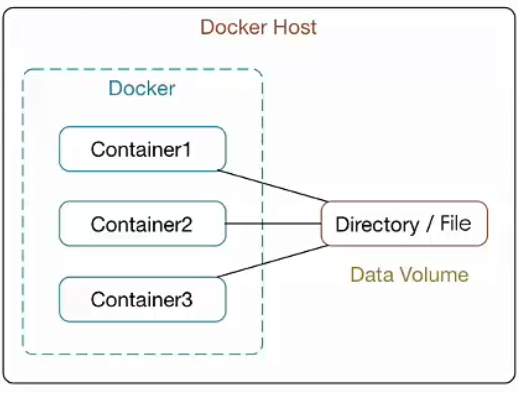

# 什么是数据卷（Data Volume）
数据卷是经过特殊设计的目录，可以绕过联合文件 UFS，为一个或者多个容器提供访问。

其设计目的在于数据的永久化，数据卷是存在于宿主机中的文件或者目录，因此它与Docker容器的生命周期是完全分离的，Docker不会在容器删除时删除其挂载的数据卷，也不会存在类似的垃圾收集机制，对容器引用的数据卷进行处理。

数据卷的特点：

- 数据卷在容器启动时初始化，如果容器使用的镜像再挂载点包含了数据，这些数据会拷贝到新初始化的数据卷中。
- 数据卷可以在容器之间共享和重用
- 可以对数据卷里的内容直接进行修改
- 数据卷的变化，不会影响镜像的更新
- 卷会一直存在，即使挂载数据卷的容器已经被删除

数据卷的架构：

# 数据卷的使用
在容器启动时，为容器添加数据卷需要用到 docker run 命令的 -v 选项：

	docker run -v <宿主机文件或目录>:<对应的容器目录>[:ro ] [image]

操作示例：

	# 查看宿主机中 /usr/local/src/dockerfiles/ 文件夹下的内容
	[root@localhost ~]# ls /usr/local/src/dockerfiles/
	dockerfile01  nginx-1.16.1.tar.gz
	 
	# 将 /usr/local/src/dockerfiles/ 作为数据卷挂载到 容器的 /usr/local/src/volume 下
	[root@localhost ~]# docker run -it -v /usr/local/src/dockerfiles/:/usr/local/src/volume --name nginx_server5 centos_nginx:1.0  /bin/bash
	 
	# 若报错：ls: cannot access /usr/local/src/volume/dockerfile01: Permission denied
	# 使用如下命令：增加 --privileged=true 选项
	[root@localhost ~]# docker run -it -v /usr/local/src/dockerfiles/:/usr/local/src/volume --privileged true --name nginx_server5 centos_nginx:1.0  /bin/bash
	 
	# 查看数据卷的内容
	[root@427a4e5b4089 /]# ls /usr/local/src/volume/
	dockerfile01  nginx-1.16.1.tar.gz

# 数据卷容器
命名的容器挂载数据卷，其它容器通过挂载这个容器实现数据共享，挂载数据卷的容器，就叫做数据卷容器。

使用Dockerfile 的 VOLUME 指令可以构建一个包含数据卷的镜像，例如：

	# 注释：包含数据卷的Centos镜像
	FROM centos:7.6.1810
	# 标明作者的名字和联系方式
	MAINTAINER pengjunlee pengjunlee@163.com
	VOLUME ["/usr/local/volume"]
	CMD /bin/bash

使用上面的 Dockerfile 构建镜像：

	[root@localhost dockerfiles]# docker build -t centos_volume:1.0 -f ./dockerfile02 .
	[root@localhost dockerfiles]# docker images
	REPOSITORY          TAG                 IMAGE ID            CREATED             SIZE
	centos_volume       1.0                 ee4ccab4731b        26 minutes ago      202 MB

启动一个数据卷容器，将其命名为 volume1：

	[root@localhost dockerfiles]# docker run -it --name volume1 centos_volume:1.0
	# 查看数据卷目录是否存在
	[root@e12534f3d46b /]# ls /usr/local/
	bin etc games include lib lib64 libexec sbin share src volume

# 使用数据卷容器
使用数据卷容器共享数据的架构：

通过 docker run 命令的 --volumes-from 选项来指定容器要挂载的数据卷容器。

	[root@localhost dockerfiles]# docker run -it --name centos1 --volumes-from volume1 centos /bin/bash
	[root@9ac6ea27725c /]# ls /usr/local/
	bin  etc  games  include  lib  lib64  libexec  sbin  share  src  volume

# 数据卷的备份和还原
数据卷的备份和还原本质上就是系统文件的备份和还原。

例如，在容器启动时对数据卷的内容做备份：

	[root@localhost dockerfiles]# docker run --volumes-from volume1 -v ~/backup:/backup --privileged=true centos tar cvf backup/volume.tar usr/local/volume
	 
	usr/local/volume/

还原数据：

	[root@localhost dockerfiles]# docker run --volumes-from volume1 -v ~/backup:/backup --privileged=true centos tar xvf backup/volume.tar usr/local/volume
	 
	usr/local/volume/
 