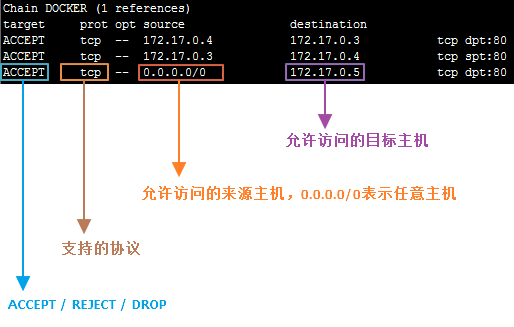

# 允许所有容器互联
默认情况下，同一宿主机下的所有Docker容器相互之间是能够进行网络访问的。

例如，分别启动两个Nginx容器，然后通过其中任意一个Nginx（IP地址：172.17.0.2）可以访问到另一个Nginx（IP地址：172.17.0.3）：

	# 启动两个 Nginx 容器 nginx_server1、nginx_server2
	[root@localhost dockerfiles]# docker run -it -d --name nginx_server1 centos_nginx:1.0  /bin/bash
	cac8a92bef84bb2c172548f79810f56d6f431151bc37480ae22f2613de31e477
	[root@localhost dockerfiles]# docker run -it -d --name nginx_server2 centos_nginx:1.0  /bin/bash
	7ea4342b91b7cc3bed2b900bf4c8b814d6f587a596ad05738f0002d5b4c9bb68

登录其中一个 Nginx 容器，可以访问到另外一个。 

	[root@cac8a92bef84 /]# ifconfig
	eth0: flags=4163<UP,BROADCAST,RUNNING,MULTICAST>  mtu 1500
	        inet 172.17.0.2  netmask 255.255.0.0  broadcast 0.0.0.0
	        inet6 fe80::42:acff:fe11:2  prefixlen 64  scopeid 0x20<link>
	        ether 02:42:ac:11:00:02  txqueuelen 0  (Ethernet)
	        RX packets 213  bytes 328347 (320.6 KiB)
	        RX errors 0  dropped 0  overruns 0  frame 0
	        TX packets 208  bytes 16152 (15.7 KiB)
	        TX errors 0  dropped 0 overruns 0  carrier 0  collisions 0
	 
	lo: flags=73<UP,LOOPBACK,RUNNING>  mtu 65536
	        inet 127.0.0.1  netmask 255.0.0.0
	        inet6 ::1  prefixlen 128  scopeid 0x10<host>
	        loop  txqueuelen 1000  (Local Loopback)
	        RX packets 0  bytes 0 (0.0 B)
	        RX errors 0  dropped 0  overruns 0  frame 0
	        TX packets 0  bytes 0 (0.0 B)
	        TX errors 0  dropped 0 overruns 0  carrier 0  collisions 0
	 
	[root@cac8a92bef84 /]# curl 172.17.0.3
	<!DOCTYPE html>
	<html>
	<head>
	<title>Welcome to nginx!</title>
	
	</head>
	<body>
	<h1>Welcome to nginx!</h1>
	
If you see this page, the nginx web server is successfully installed and
	working. Further configuration is required.

	 
	
For online documentation and support please refer to
	<a href="http://nginx.org/">nginx.org</a>. 
	Commercial support is available at
	<a href="http://nginx.com/">nginx.com</a>.

	 
	
<em>Thank you for using nginx.</em>

	</body>
	</html>

# 通过别名连接容器
在前面的例子中，nginx_server1是通过IP地址来访问的nginx_server2。但是，Docker容器的IP地址是在启动的时候自动分配的，即便是同一个容器在重启时，其IP地址也往往会发生变化。因此，通过IP地址来实现Docker容器之间的相互访问其实并不可靠。

为了解决这一问题，Docker为我们提供了另外一种容器互联方式：通过别名互联。

通过别名互联需要借助 docker run 命令的 --link 参数：

	docker run --link [container_name]:[alias] [image] [command]

接下来，我们再启动一个 Nginx 容器命名为 nginx_server3， 并让其连接到 nginx_server2，且为 nginx_server2 指定一个别名为 ng2 。这样一来，nginx_server3 就可以通过 ng2 来访问 nginx_server2 了。

	[root@localhost dockerfiles]# docker run -it -d --link nginx_server2:ng2 --name nginx_server3 centos_nginx:1.0  /bin/bash
	5942fb62e2d3be6b78722b1826a633094f39aeb208d31417344bf9aa5a577128
	[root@localhost dockerfiles]# docker attach 5942fb62e2d3be6b78722b1826a633094f39aeb208d31417344bf9aa5a577128
	[root@5942fb62e2d3 /]# curl ng2
	<!DOCTYPE html>
	<html>
	<head>
	<title>Welcome to nginx!</title>
	
	</head>
	<body>
	<h1>Welcome to nginx!</h1>
	
If you see this page, the nginx web server is successfully installed and
	working. Further configuration is required.

	 
	
For online documentation and support please refer to
	<a href="http://nginx.org/">nginx.org</a>. 
	Commercial support is available at
	<a href="http://nginx.com/">nginx.com</a>.

	 
	
<em>Thank you for using nginx.</em>

	</body>
	</html>

值得注意的是，此时 nginx_server3 依然可以正常访问宿主机上启动的其他容器。

使用了 --link 参数启动的 Docker容器 其环境变量中会被添加上一些以别名开头的配置项。

	[root@5942fb62e2d3 /]# env
	HOSTNAME=5942fb62e2d3
	TERM=xterm
	NG2_PORT_80_TCP_PORT=80
	NG2_NAME=/nginx_server3/ng2
	NG2_PORT_80_TCP=tcp://172.17.0.3:80
	NG2_PORT_80_TCP_PROTO=tcp
	PATH=/usr/local/sbin:/usr/local/bin:/usr/sbin:/usr/bin:/sbin:/bin
	PWD=/
	SHLVL=1
	HOME=/root
	NG2_PORT_80_TCP_ADDR=172.17.0.3
	NG2_PORT=tcp://172.17.0.3:80
	_=/usr/bin/env

同时，在 /etc/hosts 配置文件中也会添加上该别名的地址映射。

	127.0.0.1       localhost
	172.17.0.3      ng2 7ea4342b91b7 nginx_server2

# 禁止所有容器互联
默认情况下，Docker允许位于同一宿主机下的容器之间进行相互访问。如果要改变这一默认配置，需要修改 /etc/docker/daemon.json，添加 icc = false 项。

	{
	 
	    "icc": false,
	 
	    "registry-mirrors": ["https://registry.docker-cn.com","http://hub-mirror.c.163.com"]
	 
	}

修改完成后，保存文件并重启 docker 守护进程。

	systemctl restart docker

# 允许指定容器互联
出于安全考虑，我们将Docker的 icc 选项设置为 false ，这样可以禁止所有容器间的相互访问。这时，如果我们需要指定某些容器之间可以进行相互访问，需要做如下配置：

- 将Docker的 icc 选项设置为 false ，默认情况下，禁止所有容器互联；
- 将Docker的 iptables 选项设置为 true（默认值，可以不设置） ，启用自定义的iptable规则；
- 通过 docker run 命令的 --link 参数指定需要进行访问的容器；

在前面的示例中，当我们将Docker的 icc 选项设置为 false 后，nginx_server1 和 nginx_server2 将禁止访问任何其他容器，仅有 nginx_server3 可以访问 nginx_server2 。此时查看 iptables 规则列表，Docker规则链中仅存在一组nginx_server3 和nginx_server2 之间的规则 。

	[root@localhost dockerfiles]# iptables -L -n
	Chain FORWARD (policy DROP)
	target     prot opt source               destination         
	DOCKER-ISOLATION  all  --  0.0.0.0/0            0.0.0.0/0           
	DOCKER     all  --  0.0.0.0/0            0.0.0.0/0           
	ACCEPT     all  --  0.0.0.0/0            0.0.0.0/0            ctstate RELATED,ESTABLISHED
	ACCEPT     all  --  0.0.0.0/0            0.0.0.0/0           
	ACCEPT     all  --  0.0.0.0/0            0.0.0.0/0            ctstate RELATED,ESTABLISHED
	ACCEPT     all  --  0.0.0.0/0            0.0.0.0/0
	 
	Chain DOCKER (1 references)
	target     prot opt source               destination         
	ACCEPT     tcp  --  172.17.0.4           172.17.0.3           tcp dpt:80
	ACCEPT     tcp  --  172.17.0.3           172.17.0.4           tcp spt:80

# 外网访问容器
## ip-forward
ip-forward 是 Linux 系统自带的一个配置项，用来决定是否允许系统进行流量转发。在 Docker 中也有一个 ip-forward 选项，其默认值为 true ，这样 Docker 守护进程就会在启动时自动将系统的 ip-forward 参数设置为 1，即允许系统进行流量转发。

	# Docker 启动后查看系统 ip-forward 配置
	[root@localhost ~]# sysctl net.ipv4.conf.all.forwarding
	net.ipv4.conf.all.forwarding = 1

## 端口映射
在系统允许流量转发的情况下，想要从外网访问容器还需要设置好宿主机和容器之间的端口映射。

	[root@localhost dockerfiles]# docker run -it -d -p 8080:80 --name nginx_server4 centos_nginx:1.0 /bin/bash
	6a1bae73f56ae16e0d07d8daa2efb142728f0499418ced125122980757a48154
	[root@localhost dockerfiles]# docker attach nginx_server4
	[root@6a1bae73f56a /]# nginx
	[root@6a1bae73f56a /]# [root@localhost dockerfiles]# docker port nginx_server4
	80/tcp -> 0.0.0.0:8080

在这里，外面将Nginx容器的80端口映射到了宿主机的8080端口，这样外网就可以通过 http://宿主机IP:8080/ 来访问 nginx 容器了。

## iptables
再查看 iptables ，发现Docker规则链中多了一条规则。

	[root@localhost ~]# iptables -t filter -L -n
	Chain DOCKER (1 references)
	target     prot opt source               destination         
	ACCEPT     tcp  --  172.17.0.4           172.17.0.3           tcp dpt:80
	ACCEPT     tcp  --  172.17.0.3           172.17.0.4           tcp spt:80
	# 多的那条规则是我
	ACCEPT     tcp  --  0.0.0.0/0            172.17.0.5           tcp dpt:80

由此可知，外网访问容器是借助 iptables 规则来实现的。既然如此，我们也可以通过自己动手添加 iptables 规则来禁止指定的主机来访问容器。

	# 禁止主机 172.16.80.47 访问 容器 172.17.0.5 的 80 端口
	[root@localhost dockerfiles]# iptables -I DOCKER -s 172.16.80.47 -d 172.17.0.5 -p TCP --dport 80 -j DROP
