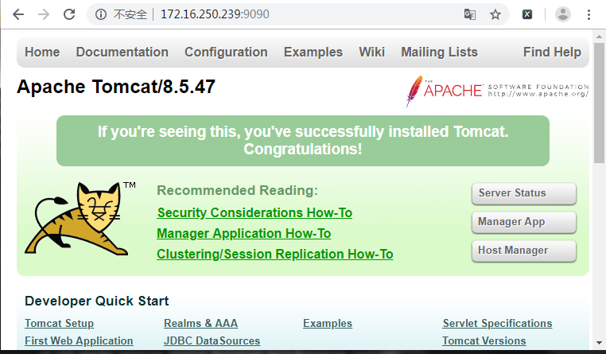
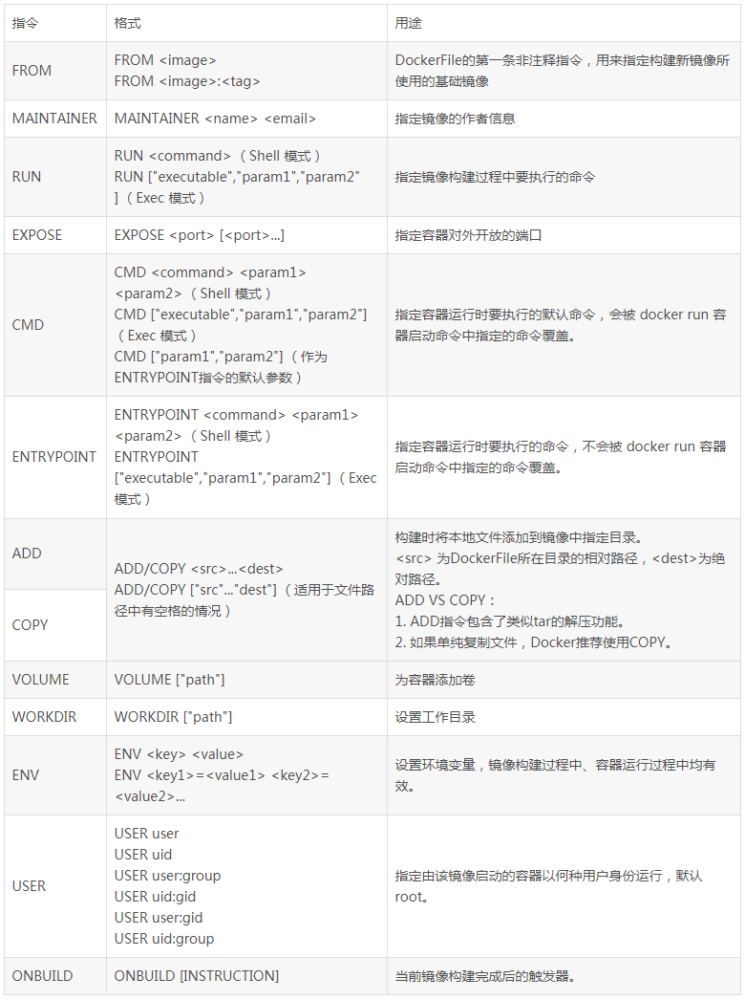
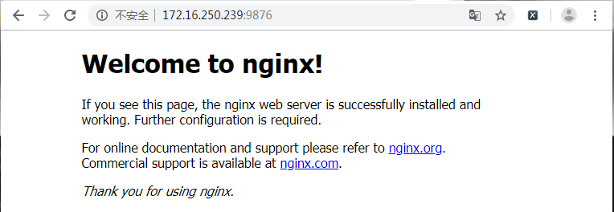

通过构建 Docker 镜像，可以帮助我们实现如下功能：

- 保存对容器的修改，方便再次使用；
- 自定义镜像的能力；
- 以软件的形式打包并分发服务及其运行环境；

构建 Docker 镜像有两种实现方式：

- 使用容器构建镜像
- 使用DockerFile构建镜像

# 使用容器构建镜像

	# 命令语法
	docker commit [ options ] container [ repository [ :tag ] ]
	 
	# 命令参数
	# --author , -a 作者
	# --message , -m 提交说明
	# --pause , -p 提交时是否暂停容器

接下来，以构建一个集成了 Tomcat 的 CentOS 系统镜像为例来演示如何使用容器构建镜像。

## 启动容器

	# 从远程仓库拉取 centos 镜像，根据个人情况选择适合的版本
	[root@localhost ~]# docker pull centos:7.6.1810
	 
	# 查看拉取到的 centos 镜像信息
	[root@localhost ~]# docker images centos:7.6.1810
	 
	# 切换工作目录
	[root@localhost ~]# cd /usr/local/src/
	 
	# 下载 Tomcat 二进制安装包
	[root@localhost src]# wget https://mirrors.tuna.tsinghua.edu.cn/apache/tomcat/tomcat-8/v8.5.47/bin/apache-tomcat-8.5.47.tar.gz
	 
	# 下载 JDK 二进制安装包，并将其拷贝到 /usr/local/src/ 目录下
	# 下载地址：http://www.oracle.com/technetwork/java/javase/downloads/index.html
	 
	# 启动centos容器
	[root@localhost src]# docker run -it -p 80 --name centos-tomcat -v /usr/local/src/:/usr/local/src/ centos:7.6.1810 /bin/bash
	 
	# 切换到文件挂载目录查看下载好的Tomcat 和 JDK 二进制安装包是否存在
	[root@7af54eb160b8 /]# cd /usr/local/src/
	[root@7af54eb160b8 src]# ls
	apache-tomcat-8.5.47.tar.gz jdk-8u211-linux-x64.tar.gz

## 安装JDK

	# 解压安装包
	[root@7af54eb160b8 src]# tar -zxvf /usr/local/src/jdk-8u211-linux-x64.tar.gz -C /usr/local/
	 
	# 解压之后，/usr/local/ 多了一个 jdk1.8.0_211文件夹
	[root@7af54eb160b8 src]# ls /usr/local/
	bin etc games include jdk1.8.0_211 lib lib64 libexec sbin share src

## 安装Tomcat

	#解压安装包
	[root@7af54eb160b8 src]# tar -zxvf /usr/local/src/apache-tomcat-8.5.47.tar.gz -C /usr/local/
	 
	# 解压之后，/usr/local/ 多了一个 apache-tomcat-8.5.47 文件夹
	[root@7af54eb160b8 src]# ls /usr/local/
	apache-tomcat-8.5.47 bin etc games include jdk1.8.0_211 lib lib64 libexec sbin share src
	 
	# 创建一个 Shell 脚本，用来启动tomcat
	[root@7af54eb160b8 src]# touch /usr/local/apache-tomcat-8.5.47/tomcat.sh
	 
	# 修改脚本内容
	[root@7af54eb160b8 src]# vi /usr/local/apache-tomcat-8.5.47/tomcat.sh

脚本内容如下：

	#!/bin/sh
	export JAVA_HOME=/usr/local/jdk1.8.0_211
	export JAVA_BIN=$JAVA_HOME/bin
	export PATH=$JAVA_BIN:$PATH
	 
	sh /usr/local/apache-tomcat-8.5.47/bin/catalina.sh run

保存文件后执行以下操作，为脚本添加可执行权限。

	[root@7af54eb160b8 src]# chmod u+x /usr/local/apache-tomcat-8.5.47/tomcat.sh

## 退出容器

	[root@7af54eb160b8 src]# exit
	exit
	[root@localhost src]# docker ps -a
	CONTAINER ID IMAGE COMMAND CREATED STATUS PORTS NAMES
	7af54eb160b8 centos:7.6.1810 "/bin/bash" 48 minutes ago Exited (0) 42 seconds ago centos-tomcat

## 构建镜像

	# 构建镜像
	[root@localhost ~]# docker commit centos-tomcat pengjunlee/centos-tomcat:1.0
	sha256:ea67b3a90969050d7028bd54c638e0ee6948803ce05e9e84ae42855e6690ec28
	# 列出本地镜像
	[root@localhost ~]# docker images pengjunlee/centos-tomcat
	REPOSITORY                 TAG                 IMAGE ID            CREATED             SIZE
	pengjunlee/centos-tomcat   1.0                 ea67b3a90969        14 seconds ago      623 MB
	# 启动容器，将容器的 8080 端口映射为宿主机的 9090 端口
	[root@localhost ~]# docker run -d -p 9090:8080 --name tomcat_server pengjunlee/centos-tomcat:1.0 /usr/local/apache-tomcat-8.5.47/tomcat.sh
	f79752f0a0688223c9886141f3eed10c01e3463d269f622f1965dc5ecb363903

在浏览器中输入 `http://宿主机IP:9090/` 来访问Tomcat：

## Tomcat容器内部署应用

	# 创建一个项目存放目录，将需要部署到tomcat的项目拷贝至该目录
	[root@localhost ~]# mkdir /usr/local/webapps
	 
	# 在这里创建一个静态页面 index.html 做示例，放在 ROOT 目录中
	[root@localhost ~]# mkdir /usr/local/webapps/ROOT
	[root@localhost ~]# touch /usr/local/webapps/ROOT/index.html
	
页面内容如下：
	
	<html>
	    <body>
	        <h1>Hello Tomcat!</h>
	    </body>
	</html>

 

	# 再启动一个 Tomcat 容器，启动时通过 docker run 的 -v 参数将本地项目目录挂载到 Tomcat 容器的 webapps 目录
	 
	[root@localhost ~]# docker run -d -p 9191:8080 --name tomcat_server2 -v /usr/local/webapps/:/usr/local/apache-tomcat-8.5.47/webapps/ pengjunlee/centos-tomcat:1.0 /usr/local/apache-tomcat-8.5.47/tomcat.sh

在浏览器中访问Tomcat：

# 使用DockerFile构建镜像
通过DockerFile文件来构建镜像需要用到docker build命令。 

	# 命令语法
	docker build [ options ] path | url | -
	 
	# 命令参数
	# --file , -f=‘PATH/Dockerfile’ Dockerfile文件的名称
	# --build-arg 镜像构建过程中的变量
	# --force-rm 移除中间层容器
	# --no-cache 不使用缓存
	# --pull 尝试拉取最新的镜像
	# --quiet , -q 镜像构建成功仅输出镜像ID
	# --rm 构建成功后移除中间层容器
	# --tag , -t 指定名称和标签，格式：name：tag

## DockerFile指令
可用的DockerFile指令见下表：

## 镜像构建过程
使用DockerFile构建镜像的过程如下：

- 使用基础镜像启动一个容器；
- 执行一条指令，对容器做出修改；
- 执行类似 docker commit 的操作，提交一个新的镜像；
- 基于上一步刚提交的镜像运行一个新容器；
- 执行 DockerFile中的下一条指令，直至所有指令执行完毕；

从镜像的构建过程不难发现，使用DockerFile构建镜像每执行一个指令都会提交一个镜像，除最终镜像之外的镜像都被称作中间层镜像，镜像构建完成后Docker默认会帮我们删除中间层容器，但是会保留中间层镜像。这就给予了我们使用中间层镜像对整个构建过程进行调试的机会，我们可以使用 docker run 命令来启动镜像，详细查看镜像的构建情况，排查错误。

查看镜像构建过程使用 `docker history` [ image ] 命令。

接下来，以构建一个集成了 Nginx 的 CentOS 系统镜像为例对 DockerFile的文件进行示例。

## 构建基于CentOS的Nginx镜像
### 下载Nginx安装包
登录 Nginx官网 下载好Nginx源码安装包后将其复制到DockerFile文件所在目录，本例中DockerFile文件所在目录为 `/usr/local/src/dockerfiles/` 。

### 编写DockerFile
在 `/usr/local/src/dockerfiles/` 目录下创建一个 DockerFile 取名为 dockerfile01 。

	[root@localhost ~]# cd /usr/local/src/dockerfiles/
	[root@localhost dockerfiles]# touch dockerfile01
	[root@localhost dockerfiles]# vi dockerfile01

其内容如下：

	# 注释：在Centos上安装 Nginx
	FROM centos:7.6.1810
	# 标明作者的名字和联系方式
	MAINTAINER pengjunlee pengjunlee@163.com
	# 安装 Nginx 依赖的库
	RUN yum -y install gcc gcc-c++ openssl openssl-devel pcre-devel zlib-devel zlib
	# 把 Nginx 安装包复制到 /usr/local/src/ 目录下
	ADD ./nginx-1.16.1.tar.gz /usr/local/src/
	# 创建安装目录
	RUN mkdir /usr/local/nginx
	# 切换到 /usr/local/src/nginx-1.16.1,编译配置
	RUN cd /usr/local/src/nginx-1.16.1 \
	    && ./configure --user=nobody --group=nobody --prefix=/usr/local/nginx --with-http_stub_status_module --with-http_gzip_static_module --with-http_realip_module --with-http_sub_module --with-http_ssl_module \
	# 编译安装 Nginx
	    && make && make install
	# 创建软链接
	RUN ln -s /usr/local/nginx/sbin/nginx /usr/local/sbin/
	# 删除 Nginx 源文件目录
	RUN rm -rf /usr/local/src/nginx-1.16.1
	#对外暴露80端口
	EXPOSE 80
	# 容器启动时，启动 Nginx
	CMD ["nginx", "-g", "daemon off;"]

### 构建镜像

	[root@localhost dockerfiles]# docker build -t centos_nginx:1.0 -f ./dockerfile01 .
	Successfully built fb93f7ae5ff8
	[root@localhost dockerfiles]# docker images
	REPOSITORY                 TAG                 IMAGE ID            CREATED             SIZE
	centos_nginx               1.0                 fb93f7ae5ff8        25 minutes ago      432 MB

### 使用镜像启动Nginx

	[root@localhost dockerfiles]# docker run -d -p 9876:80 --name nginx_server fb93f7ae5ff8
	ba7c24ec4521d86e275855fc55350b19e680e7c6327d035e60c6d895c0df1f66

在浏览器中输入 http://宿主机IP:9876/ 来访问Nginx：

 