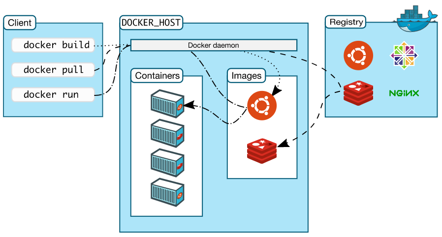
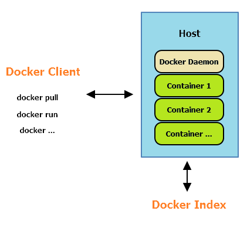
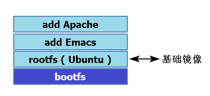
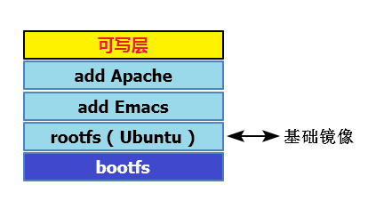
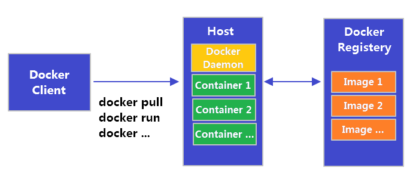

# Linux容器技术 VS 虚拟机
Linux 容器技术是一种新兴的虚拟化解决方案，它与传统的虚拟机不同。传统的虚拟机是通过中间层（常见的有：vmware workstation、virtualbox 等）将一个或者多个操作系统虚拟运行在真实物理机上。而容器是直接运行在真实物理机的操作系统内核之上的用户空间，因此，容器虚拟化又可被称为操作系统虚拟化，由于依赖于物理机操作系统的特性，容器只能运行与物理机系统内核相同或者相似的操作系统。

Linux 容器技术正是依赖于Linux 内核的Namespace 和 Cgroups （Control group）特性，因此，容器中只能运行Linux 类型的系统，而不能运行Windows系统，这也是Linux 容器技术与虚拟机技术相比在系统灵活性上的劣势。

下面的图片比较比较形象的展示了通过 Docker 容器和传统虚拟机部署应用在结构上面的不同之处：

可见，通过传统虚拟机方式部署的应用中不但要包含应用及其依赖的库，还需要包含完整的操作系统。一个10几兆的应用，动辄需要几个G的操作系统做支持，占用大量的系统资源。同时，由于虚拟机需要模拟硬件的行为，对内存和CPU资源的损耗也非常得大。

而Docker 容器只需要安装应用和它依赖的库，对系统资源的占用会小很多。同时，Docker 容器是在操作系统层面上实现虚拟化，可以直接复用真实物理机的操作系统。

# 什么是Docker？
Docker 本质上是一个用于将应用程序自动化部署到容器的管理工具。

Docker 诞生于 2013 年初，最初是 dotCloud 公司内部的一个业余项目。它基于 Google 公司推出的 Go 语言实现。 该项目后来加入了 Linux 基金会，遵从了 Apache 2.0 协议，项目代码在 GitHub 上进行维护。Docker 自开源后受到广泛的关注和讨论，以至于 dotCloud 公司后来都改名为 Docker Inc。Redhat 已经在其 RHEL6.5 中集中支持 Docker；Google 也在其 PaaS 产品中广泛应用。

Docker 项目的目标是实现轻量级的操作系统虚拟化解决方案。 Docker 的基础是 Linux 容器（LXC）等技术。在 LXC 的基础上 Docker 进行了进一步的封装，让用户不需要去关心容器的管理，使得操作更为简便。用户操作 Docker 的容器就像操作一个快速轻量级的虚拟机一样简单。

# Docker的特点
- 提供简单轻量的建模方式：简单，Docker 非常容器上手，用户只需要几分钟，就能把自己的项目Docker化。
- 更高效的虚拟化：Docker 容器的运行不需要额外的 hypervisor 支持，它是内核级的虚拟化，因此可以实现更高的性能和效率。
- 更轻松的迁移和扩展：Docker 容器几乎可以在任意的平台上运行，包括物理机、虚拟机、公有云、私有云、个人电脑、服务器等。 这种兼容性可以让用户把一个应用程序从一个平台直接迁移到另外一个。
- 职责的逻辑分离：使用Docker，开发人员只需要关心容器中运行的程序，运维人员只需要关心如何管理容器；Docker设计的目的就是加强开发人员写代码的环境与应用程序要部署的生成环境的一致性。
- 快速高效的开发生命周期：Docker的目标之一是缩短代码开发到测试到部署上线的运行周期，让应用程序具备可移植性，在容器中开发，以容器的形式交付和分发，这样开发、测试、生产，都使用相同的环境，这样也就避免了额外的调试和部署上的开销，这样就能有效的缩短产品的上线周期。
- 鼓励使用面向服务的架构：Docker推荐单个容器只运行一个应用程序或者进程，这样就形成了一个分布式的应用程序模型，在这种模式下应用程序或服务都可以表述为一系列内部互联的容器，从而使分布式部署应用程序扩展或调试都变得非常简单。这就像我们开发中常用的思想；高内聚，低耦合，单一任务。这样就能避免在同一服务器上部署不同服务时，可能带来的服务之间相互影响。这样服务运行中出现问题时，也比较容易定位问题的所在。

# Docker的使用场景
- 使用Docker容器开发、测试、部署服务：因为Docker本身非常轻量化，所以本地开发人员可以构建、运行并分享Docker容器。容器可以在开发环境中创建，然后再提交到测试，最终进入生产环境。
- 创建隔离的运行环境：在很多企业应用中，同一服务的不同版本可能服务于不同的用户，那么使用Docker非常容易创建不同的生成环境来运行不同的服务。
- 搭建测试环境：由于Docker的轻量化，所以开发者很容易利用Docker在本地搭建测试环境，用来测试程序在不用系统下的兼容性；甚至搭建集群的部署测试。
- 构建多用户的平台即服务（PaaS）基础设施。
- 提供软件即服务（SaaS）应用程序。
- 高性能、超大规模的宿主机部署。

# Docker的基本组成

Docker 包含了以下几个重要部分：

- Docker Client 客户端
- Docker Daemon 守护进程
- Docker Image 镜像
- Docker Container 容器
- Docker Registry 仓库

## 客户端 / 守护进程
Docker是C/S架构的程序：Docker客户端向Docker服务器端，也就是Docker的守护进程发出请求，守护进程处理完所有的请求工作并返回结果。Docker 客户端对服务器端的访问既可以是本地也可以通过远程来访问。

## Docker Image 镜像
镜像是Docker容器的基石，容器基于镜像启动和运行。镜像就好比容器的源代码，保存了用于启动容器的各种条件。

Docker的镜像是一个层叠的只读文件系统，最低端是一个引导文件系统（即bootfs），第二层是root文件系统（即rootfs），它位于bootfs之上，可以是一种或多种操作系统，比如Ubuntu或者CentOS。在Docker中，root文件系统永远只能是只读状态，并且docker运用联合加载技术又会在root文件系统之上加载更多的只读文件系统，联合加载指的是一次加载多个文件系统，但是在外面看起来只能看到一个文件系统，联合加载会将各层文件系统叠加到一起，这样最终的文件系统会包含所有的底层文件和目录，docker将这样的文件系统称为镜像。

## Docker Container 容器
容器是从镜像创建的运行实例。它可以被启动、开始、停止、删除。每个容器都是相互隔离的、保证安全的平台。可以把容器看做是一个简易版的 Linux 环境（包括root用户权限、进程空间、用户空间和网络空间等）和运行在其中的应用程序。

当一个容器启动时，Docker会在该镜像的最顶层加载一个读写文件系统，也就是一个可写的文件层，我们在Docker运行的程序，就是在这个层中进行执行的，当Docker第一次启动一个容器时，初始的读写层是空的，当文件系统发生变化时，这些变化都会应用到这一层上，比如像修改一个文件，该文件首先会从读写层下面的只读层复制到该读写层，该文件的只读版本依然存在，但是已经被读写层中的该文件副本所隐藏，这就是Docker的一个重要技术：写时复制（copy on write)。每个只读镜像层都是只读的，永远不会变化，当创建一个新容器时，Docker会构建出一个镜像栈，如下图所示：

## Docker Registry 仓库
Registry仓库是集中存放Docker镜像文件的场所。人们有时候会把Repository仓库和Registry仓库混为一谈，并不严格区分。实际上，Registry仓库上往往存放着多个Repository仓库，每个Repository仓库中又包含了多个Docker镜像，每个Docker镜像有不同的标签（tag）。

Registry仓库分为公开仓库（Public）和私有仓库（Private）两种形式。最大的公开仓库是 Docker Hub，存放了数量庞大的镜像供用户下载。 国内的公开仓库包括 Docker Pool 等，可以提供大陆用户更稳定快速的访问。

# Docker 依赖的 Linux内核特性
Docker依赖于Linux内核的两个重要特性：

- Namespaces 命名空间
- Control groups (cgroups) 控制组

## Namespaces 命名空间
很多编程语言都包含了“命名空间”的概念，我们可以认为“命名空间”是一种“封装”的概念， 而“封装”本身实际上实现的是代码的隔离。而在操作系统中，命名空间提供的是系统资源的隔离，而系统资源包括了进程、网络、文件系统等。

我们从Docker公开的文档来看，它使用了5种命名空间：

- PID（Process ID） 进程隔离
- NET（Network）管理网络接口
- IPC（InterProcess Communication）管理跨进程通信的访问
- MNT（Mount）管理挂载点
- UTS（Unix Timesharing System） 隔离内核和版本标识

那么，这些隔离的资源，是如何被管理起来的呢？这就需要用到——Control groups(cgroup)控制组了。

## Control groups (cgroups) 控制组
Control groups是Linux内核提供的，一种可以限制、记录、隔离进程组所使用的物理资源的机制。

最初是由google工程师提出，并且在2007年时被Linux的内核的2.6.24版本引进。可以说，Control groups就是为容器而生的，没有Control groups就没有容器技术的今天。

Control groups提供了以下功能：

- 资源限制：例如，memory(内存)子系统可以为进程组设定一个内存使用的上限，一旦进程组使用的内存达到了限额，该进程组再发出内存申请时，就会发出“out of memory”(内存溢出)的警告。
- 优先级设定：它可以设定哪些进程组可以使用更大的CPU或者磁盘IO的资源。
- 资源计量：它可以计算进程组使用了多少系统资源。尤其是在计费系统中，这一点十分重要。
- 资源控制：它可以将进程组挂起或恢复。

## Namespace 和 cgroup带给Docker的能力
到这里我们了解了Namespace和CGroup的概念和职能，而这两个特性带给了Docker哪些能力呢？如下：

- 文件系统隔离：首先是文件系统的隔离，每个Docker的容器，都可以拥有自己的root文件系统。
- 进程隔离：每个容器都运行在自己的进程环境中。
- 网络隔离：容器间的虚拟网络接口和IP地址都是分开的。
- 资源的隔离和分组：使用cgroups将cpu和内存之类的资源独立分配给每个Docker容器。

# 参考文章
<https://mp.weixin.qq.com/s/8VM-c_UkxYcVw2Itiapw4w>

<http://wiki.jikexueyuan.com/project/docker-technology-and-combat/>

<https://docs.docker.com/>

 