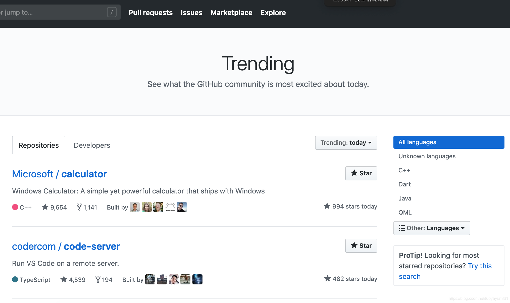
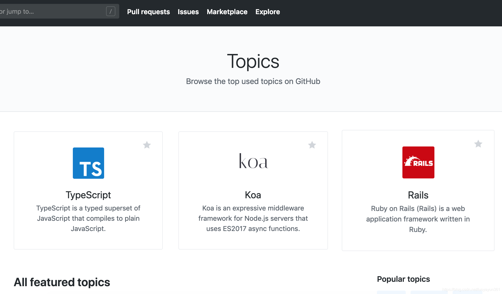
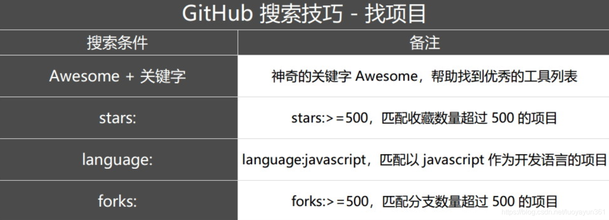
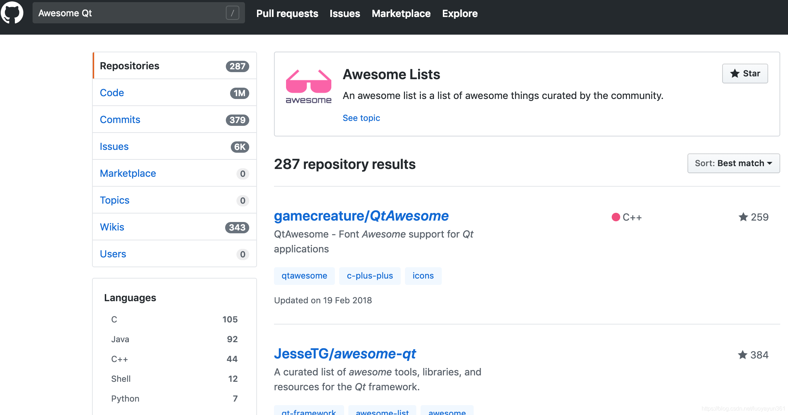
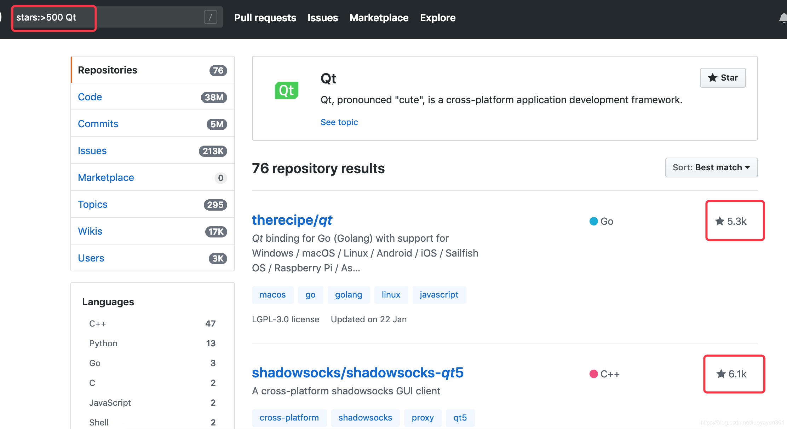
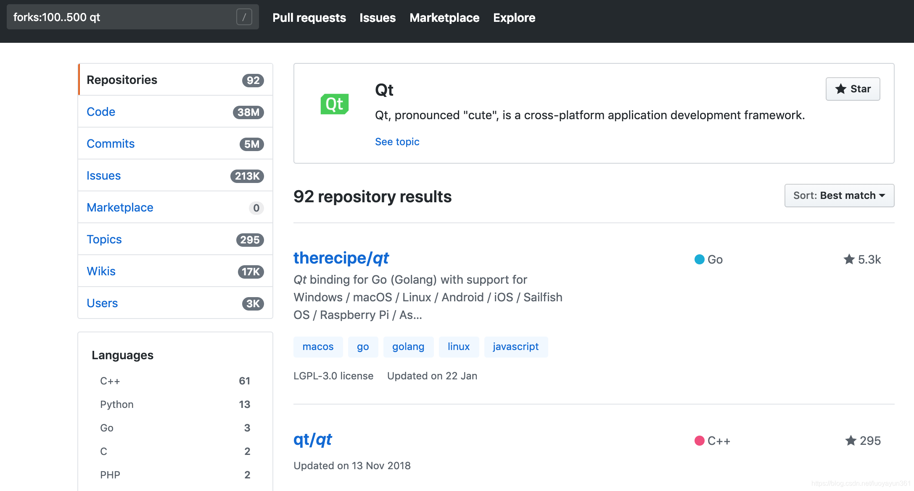
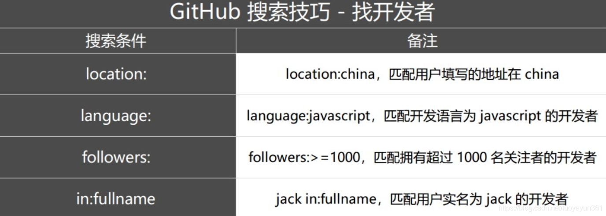
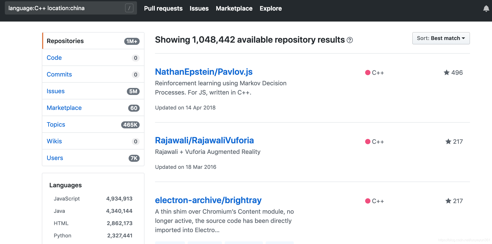

> 原文链接：<https://blog.csdn.net/luoyayun361/article/details/88374672>

# 前言
不得不说`GitHub`简直就是程序猿的福地，聚集了众多大神在上面分享，在这里可以发现无限的优良资源，不管是初学者还是正在进阶中的青铜王者，都可以在上面找到适合自己的好东西，用好`GitHub`可以让能力提升不止一点点。

那么，如何在这么庞大的资源平台下找到自己想要的内容呢？我搜集了一些实用的技巧，可以快速的定位到你想看到的内容，用好这些技巧，你就可以在这上面如鱼得水了。

# 正文
## 搜索GitHub热门
GitHub有两个热门栏目，分别是[GitHub Trend](GitHubTrend "https://github.com/trending")和[GitHub Topic](GitHubTopic "https://github.com/topics")。
其中，`GitHub Trend`页面总结了每天/每周/每月周期的热门`Repositories`和`Developers`，你可以看到在某个周期处于热门状态的开发项目和开发者。而`GitHub Topic`展示了最新和最流行的讨论主题，在这里你不仅能够看到开发项目，还能看到更多非开发技术的讨论主题，比如`Job`、`Chrome浏览器`等。

## 搜索项目
当我们想在 GitHub 上搜索想要的项目或者关键字时，通常的做法就是在主页左上角搜索栏输入后进行搜索，如下：

这样确实也能搜到很多条信息，然后再一条条的进行过滤，但是 GitHub 提供了一些高级搜索功能，可以快速过滤信息，可以 让你更快的找到自己想要的内容。参照如下表：

### Awesome + 关键字

Awesome已成功 GitHub 上不少优秀项目的命名之一，通过Awesome + 关键字的方式进行搜索，可以找到不少的优秀资源。
比如以上的搜索：

通过该关键字搜索出来的都是比较好的一些资源，排名靠前的项目人气都非常高。

### 设置搜索条件

除了Awesome关键字，我们还可以通过其他的一些限定条件来进行搜索，我们都知道 stars 数表示项目的人气值，越高表示项目越受欢迎。比如，查找 stars 数超过500的项目：

再比如说，想要搜索 forks 数在100~500之间的项目：

还可以限定搜索语言，直接按照上面的表格中对应的方式来搜索即可。

除此之外，我们还可以搜索关键字的位置。比如说，我们是按照关键字来进行搜索， 那么有些项目出现该关键字的位置不一样，有些是在标题中，有些是在 readme 中，还有在项目描述中，我们还可以指定搜索位置，如下：
搜索 “Qt” 关键字：

	qt in:name：表示在项目名称中搜索 qt 关键字
	qt in:readme：表示在项目readme中搜索 qt 关键字
	qt in:description：表示在 项目描述中搜索 qt 关键字
	qt in:USERNAME：表示在USERNAME中搜索 qt 关键字
	qt in:ORGNAME：表示在组织或机构名中搜索 qt 关键字

还可以按照项目大小来搜索：

	size:>=5000 Qt ：搜索大小超过5M 的包含 Qt 关键字项目

### 搜索开发者
我们可以通过一些限定条件来搜索开发者：

比如说：

	language:C++ location:china

搜索国内的开发者，语言限定为 C++

OK，还可以扩展更多的搜索方式，熟练使用这些搜索技巧可以更快的帮我们找到自己想要的资源。

# 参考资料
<https://help.github.com/en/articles/about-searching-on-github>

<https://sspai.com/post/46061>