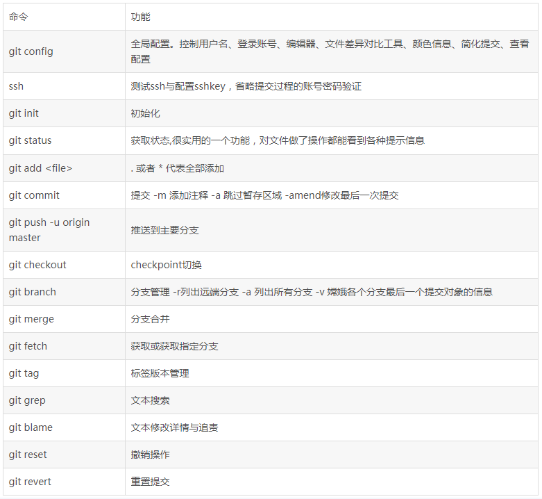

# 注册并登陆账号
GitHub网址：<https://github.com/>

# 下载并安装Git-for-Windows
下载地址：<https://gitforwindows.org/>

# 配置Git
## 创建SSH秘钥
打开Git客户端，输入命令：

	ssh-keygen -t rsa -C "your_email@youremail.com"

其中，`your_email@youremail.com`为注册GitHub时使用的邮箱。创建的秘钥默认储存路径为 `C:/Users/Administrator/.ssh/id_rsa`。生成秘钥时需要键入使用秘钥的密码，如果不输入则表示使用秘钥时不需要密码。

## 使用SSH秘钥连接GitHub
- 找到刚才生成的.ssh文件夹，用记事本等打开id_rsa.pub文件，并复制里面的全部内容。
- 打开GitHub主页，点击头像处打开下拉菜单，选择Settings 。
- 点击左侧展开的各种参数列表， SSH and GPG keys 。
- 点击绿色的New SSH Key按钮，在新页面中填入Title和Key。其中，Title可以随便填写；Key为刚才复制的内容。最后点击“Add SSH Key”。
- 再次打开Git Shell，输入命令：`$ ssh -T git@github.com`
- 将新增的key 添加到ssh-agent 中（如果输入 ssh-T git@github.com 出现 permission denial问题则别跳过这步，否则可跳过这一步）：

	eval "$(ssh-agent -s)"
	# 显示 Agengt pid 123456(随机生成的)
	ssh-add <默认文件夹/或者修改后的文件夹>

# 常用操作
## 复制远程仓库到本地
**在GitHub上创建一个代码库，拷贝链接。**

**打开Git Bash，并输入以下两行命令**：

	$ git config --global user.name “your name”
	$ git config --global user.email "your_email@youremail.com"

其中，yourname 最好是GitHub的用户名，your_email@youremail.com为注册GitHub时的邮箱。

在本地的硬盘上创建一个文件夹，作为本地仓库。进入文件夹后，打开Git Bash，并输入以下命令：

	$ git clone https://github.com/yourName/yourRepo.git

其中，yourName为GitHub用户名；yourRepo为第1步中在GitHub新建的仓库名称。

## 创建本地仓库
- Git Shell中bash命令行创建文件夹（window下右键创建也可接受）
- bash 命令行中进入文件夹，使用`git init`变成可Git管理的库（或者在文件夹中新建一个.git文件夹）
- 将项目粘贴到仓库中（粘贴后可以通过`git status`来查看你当前的状态）
- `git add .` 把该目录下的所有文件添加到仓库（注意点是用空格隔开的）
- `git commit -m`提交注释把项目提交到仓库

## 本地仓库关联远程仓库
在Github上创建好Git仓库后，可以和本地仓库进行关联了，在Git Shell中的本地仓库位置中输入：

	$ git remote add origin https://github.com/<用户名>/<目标仓库>.git

关联好之后我们就可以把本地仓库的内容推送到Github上的远程仓库了。

	$ git push -u origin master # 首次推送
	$ git push origin master

## 更新本地仓库

	$ cd local-repository-path // 切换到本地仓库目录
	$ git add . // 添加文件到本地代码库缓存
	$ git commit -m"第一次上传代码" // 将暂存区里的改动给提交到本地的版本库

## 更新远程仓库

	$ git push // git push 命令用于推送本地代码库到远程服务器代码库

# 常用命令简表

