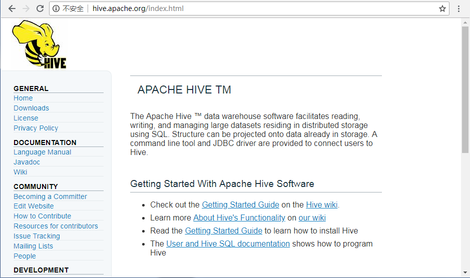
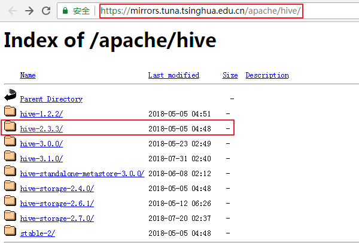
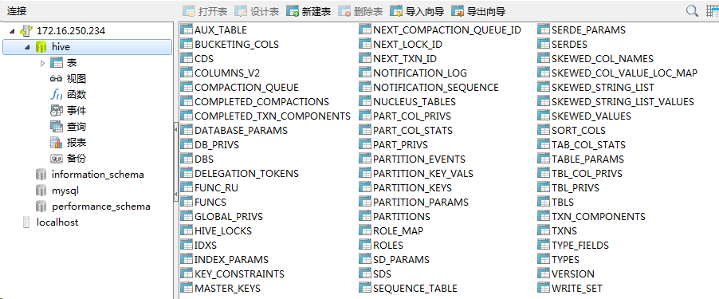

# Hive简介
`Hive`是建立在`Hadoop`基础上的数据仓库处理工具，使用类`SQL`的`HiveQL`语言实现数据查询，所有Hive的数据都存储在Hadoop兼容的文件系统（例如，`Amazon` `S3`、`HDFS`）中。Hive在加载数据过程中不会对数据进行任何的修改，只是将数据移动到HDFS中Hive设定的目录下，因此，Hive不支持对数据的改写和添加，所有的数据都是在加载的时候确定的。

Hive的设计特点如下：

- 支持索引，加快数据查询。
- 支持不同的存储类型，例如，纯文本文件、HBase 中的文件。
- 将元数据保存在关系数据库中，大大减少了在查询过程中执行语义检查的时间。
- 可以直接使用存储在Hadoop 文件系统中的数据。
- 内置大量用户函数UDF 来操作时间、字符串和其他的数据挖掘工具，支持用户扩展UDF 函数来完成内置函数无法实现的操作。
- 类SQL 的查询方式，将SQL 查询转换为 MapReduce 的job 在Hadoop集群上执行。

# Hive的安装与配置
## 环境准备
Hive官网地址：<http://hive.apache.org/index.html>

Hive下载地址：

- <https://archive.apache.org/dist/hive/>
- <http://mirrors.hust.edu.cn/apache/hive/>
- <https://mirrors.tuna.tsinghua.edu.cn/apache/hive/>
- <http://mirrors.shu.edu.cn/apache/hive/>
- <http://mirror.bit.edu.cn/apache/hive/>

在安装Hive之前，需要保证你的Hadoop集群已经正常启动，关于如何安装和启动hadoop集群，请参考文章：

<https://blog.csdn.net/pengjunlee/article/details/81589972>

注意：Hive只需在Hadoop集群的NameNode节点上安装即可，无需在DataNode节点上安装；

Hive默认使用内嵌的Derby数据库来存储它的元数据，但由于Derby数据库只支持单会话，所以，我们通常会使用Mysql作为它的外置存储引擎，方便多用户同时访问。

在本文中，我们将使用MySQL数据库来替换Hive默认的Derby数据库，这要求你需要先安装好MySQL，如何安装和启动MySQL，可以参考文章：<https://blog.csdn.net/pengjunlee/article/details/81212250>

## 安装hive

本文安装的是`apache-hive-2.3.3-bin.tar.gz`其下载地址为：
<https://mirrors.tuna.tsinghua.edu.cn/apache/hive/hive-2.3.3/apache-hive-2.3.3-bin.tar.gz>

安装目标文件夹：`/usr/local/hive-2.3.3`

按照如下步骤进行操作：

	# 切换到hive压缩包的下载目录
	[root@hadoop34 src]# cd /usr/local/src/
	# 据自己的实际需要下载相应版本的 hive 压缩包
	[root@hadoop34 src]# wget https://mirrors.tuna.tsinghua.edu.cn/apache/hive/hive-2.3.3/apache-hive-2.3.3-bin.tar.gz
	--2018-08-12 13:53:31--  https://mirrors.tuna.tsinghua.edu.cn/apache/hive/hive-2.3.3/apache-hive-2.3.3-bin.tar.gz
	Resolving mirrors.tuna.tsinghua.edu.cn (mirrors.tuna.tsinghua.edu.cn)... 101.6.8.193, 2402:f000:1:408:8100::1
	Connecting to mirrors.tuna.tsinghua.edu.cn (mirrors.tuna.tsinghua.edu.cn)|101.6.8.193|:443... connected.
	HTTP request sent, awaiting response... 200 OK
	Length: 232229830 (221M) [application/octet-stream]
	Saving to: ‘apache-hive-2.3.3-bin.tar.gz’
	 
	100%[==============================================================================>] 232,229,830 1.54MB/s   in 1m 52s 
	 
	2018-08-12 13:55:24 (1.97 MB/s) - ‘apache-hive-2.3.3-bin.tar.gz’ saved [232229830/232229830]
	 
	# 将下载好的 hive 压缩包解压到 /usr/local/
	[root@hadoop34 src]# tar zxvf apache-hive-2.3.3-bin.tar.gz -C /usr/local/
	# 由于 apache-hive-2.3.3-bin 目录名称比较长，将其重命名为 hive-2.3.3
	[root@hadoop34 src]# mv /usr/local/apache-hive-2.3.3-bin/ /usr/local/hive-2.3.3/
	# 为hadoop用户添加 hive-2.3.3 目录的操作权限
	[root@hadoop34 src]# chown -R hadoop:hadoop /usr/local/hive-2.3.3/

# 配置hive
## 配置环境变量(root权限)
在`/etc/profile`配置文件中添加`Hive`环境变量，内容如下：

	export HIVE_HOME=/usr/local/hive-2.3.3
	export HIVE_CONF_DIR=$HIVE_HOME/conf
	 
	PATH=$HIVE_HOME/bin:$PATH

所使用的操作命令如下：

	[root@hadoop34 src]# vim /etc/profile
	[root@hadoop34 src]# source /etc/profile

## 创建hive-site.xml

	# 在开始配置Hive之前，先执行如下命令，切换到Hive的操作账户，我的是 hadoop 
	[root@hadoop34 src]# su hadoop
	[hadoop@hadoop34 src]$ cd $HIVE_CONF_DIR
	# 以 hive-default.xml.template 为模板，创建 hive-site.xml
	[hadoop@hadoop34 conf]$ cp hive-default.xml.template  hive-site.xml

## 在HDFS中创建Hive所需目录
由于在`hive-site.xml`中有如下默认配置：

	<property>
	   <name>hive.metastore.warehouse.dir</name>
	   <value>/user/hive/warehouse</value>
	   <description>location of default database for the warehouse</description>
	</property>
	<property>
	   <name>hive.exec.scratchdir</name>
	   <value>/tmp/hive</value>
	   <description>HDFS root scratch dir for Hive jobs which gets created with write all (733) permission. </description>
	</property>

我们需要在HDFS中创建好相应的目录，操作命令如下：

	[hadoop@hadoop34 conf]$ hdfs dfs -mkdir -p /user/hive/warehouse
	[hadoop@hadoop34 conf]$ hdfs dfs -chmod -R 777 /user/hive/warehouse
	[hadoop@hadoop34 conf]$ hdfs dfs -mkdir -p /tmp/hive
	[hadoop@hadoop34 conf]$ hdfs dfs -chmod -R 777 /tmp/hive
	[hadoop@hadoop34 conf]$ hdfs dfs -ls /
	Found 2 items
	drwx------   - hadoop supergroup          0 2018-08-12 11:53 /tmp
	drwxr-xr-x   - hadoop supergroup          0 2018-08-12 14:31 /user
	[hadoop@hadoop34 conf]$ hdfs dfs -ls /tmp/
	Found 1 items
	drwxrwxrwx   - hadoop supergroup          0 2018-08-12 11:53 /tmp/hive
	[hadoop@hadoop34 conf]$ hdfs dfs -ls /user/hive
	Found 1 items
	drwxrwxrwx   - hadoop supergroup          0 2018-08-12 14:31 /user/hive/warehouse

## 配置hive-site.xml
### 配置Hive本地临时目录
将`hive-site.xml`文件中的`${system:java.io.tmpdir}`替换为hive的本地临时目录，例如我使用的是`/usr/local/hive-2.3.3/tmp`，如果该目录不存在，需要先进行创建，并且赋予读写权限。

	[hadoop@hadoop34 conf]$ cd $HIVE_HOME
	[hadoop@hadoop34 hive-2.3.3]$ mkdir tmp/
	[hadoop@hadoop34 hive-2.3.3]$ chmod -R 777 tmp/
	[hadoop@hadoop34 hive-2.3.3]$ cd $HIVE_CONF_DIR
	[hadoop@hadoop34 conf]$ vim hive-site.xml

在vim命令模式下执行如下命令完成替换：

	:%s#${system:java.io.tmpdir}#/usr/local/hive-2.3.3/tmp#g

例如：

	<property>
	    <name>hive.exec.local.scratchdir</name>
	    <value>${system:java.io.tmpdir}/${system:user.name}</value>
	    <description>Local scratch space for Hive jobs</description>
	</property>

替换为：

	<property>
	    <name>hive.exec.local.scratchdir</name>
	    <value>/usr/local/hive-2.3.3/tmp/${system:user.name}</value>
	    <description>Local scratch space for Hive jobs</description>
	</property>

### 配置Hive用户名
将`hive-site.xml`文件中的`${system:user.name}`替换为操作Hive的账户的用户名，例如我的是`hadoop`。 

在vim命令模式下执行如下命令完成替换：

	:%s#${system:user.name}#hadoop#g

例如:

	<property>
	    <name>hive.exec.local.scratchdir</name>
	    <value>/usr/local/hive-2.3.3/tmp/${system:user.name}</value>
	    <description>Local scratch space for Hive jobs</description>
	</property>

替换为：

	<property>
	    <name>hive.exec.local.scratchdir</name>
	    <value>/usr/local/hive-2.3.3/tmp/hadoop</value>
	    <description>Local scratch space for Hive jobs</description>
	</property>

### 修改Hive数据库配置
在`hive-site.xml`中，与Hive数据库相关的配置有如下几个：

<table border="1" cellpadding="0" cellspacing="0"><tbody><tr><td>属性名称</td><td>描述</td></tr><tr><td>javax.jdo.option.ConnectionDriverName</td><td>数据库的驱动类名称</td></tr><tr><td>javax.jdo.option.ConnectionURL</td><td>数据库的JDBC连接地址</td></tr><tr><td>javax.jdo.option.ConnectionUserName</td><td>连接数据库所使用的用户名</td></tr><tr><td>javax.jdo.option.ConnectionPassword</td><td>连接数据库所使用的密码</td></tr></tbody></table>

Hive默认的配置使用的是Derby数据库来存储Hive的元数据信息，其配置信息如下：

	<property>
	    <name>javax.jdo.option.ConnectionDriverName</name>
	    <value>org.apache.derby.jdbc.EmbeddedDriver</value>
	    <description>Driver class name for a JDBC metastore</description>
	</property>
	<property>
	    <name>javax.jdo.option.ConnectionURL</name>
	    <value>jdbc:derby:;databaseName=metastore_db;create=true</value>
	    <description>
	      JDBC connect string for a JDBC metastore.
	      To use SSL to encrypt/authenticate the connection, provide database-specific SSL flag in the connection URL.
	      For example, jdbc:postgresql://myhost/db?ssl=true for postgres database.
	    </description>
	</property>
	<property>
	    <name>javax.jdo.option.ConnectionUserName</name>
	    <value>APP</value>
	    <description>Username to use against metastore database</description>
	</property>
	<property>
	    <name>javax.jdo.option.ConnectionPassword</name>
	    <value>mine</value>
	    <description>password to use against metastore database</description>
	</property>

如果你需要将Derby数据库切换为MySQL数据库的话，只需要修改以上4项配置，例如，我的是：

	<property>
	    <name>javax.jdo.option.ConnectionDriverName</name>
	    <value>com.mysql.jdbc.Driver</value>
	    <description>Driver class name for a JDBC metastore</description>
	</property>
	<property>
	    <name>javax.jdo.option.ConnectionURL</name>
	    <value>jdbc:mysql://172.16.250.234:3306/hive?createDatabaseIfNotExist=true</value>
	    <description>
	      JDBC connect string for a JDBC metastore.
	      To use SSL to encrypt/authenticate the connection, provide database-specific SSL flag in the connection URL.
	      For example, jdbc:postgresql://myhost/db?ssl=true for postgres database.
	    </description>
	</property>
	<property>
	    <name>javax.jdo.option.ConnectionUserName</name>
	    <value>root</value>
	    <description>Username to use against metastore database</description>
	</property>
	<property>
	    <name>javax.jdo.option.ConnectionPassword</name>
	    <value>123456</value>
	    <description>password to use against metastore database</description>
	</property>

此外，还需要将MySQL的驱动包拷贝到Hive的lib目录下：

	[hadoop@hadoop34 conf]$ cp /home/hadoop/mysql-connector-java-5.1.43.jar $HIVE_HOME/lib/

## 配置hive-env.sh

	[hadoop@hadoop34 conf]$ cd $HIVE_CONF_DIR
	[hadoop@hadoop34 conf]$ cp hive-env.sh.template hive-env.sh
	[hadoop@hadoop34 conf]$ vim hive-env.sh
	# 编辑 hive-env.sh 增加下面3行内容
	export HADOOP_HOME=/usr/local/hadoop-2.9.1
	export HIVE_CONF_DIR=/usr/local/hive-2.3.3/conf
	export HIVE_AUX_JARS_PATH=/usr/local/hive-2.3.3/lib

# 启动和测试
## Hive数据库初始化

	[hadoop@hadoop34 conf]$ cd $HIVE_HOME/bin
	# 初始化mysql数据库
	[hadoop@hadoop34 bin]$ schematool -initSchema -dbType mysql
	SLF4J: Class path contains multiple SLF4J bindings.
	SLF4J: Found binding in [jar:file:/usr/local/hive-2.3.3/lib/log4j-slf4j-impl-2.6.2.jar!/org/slf4j/impl/StaticLoggerBinder.class]
	SLF4J: Found binding in [jar:file:/usr/local/hadoop-2.9.1/share/hadoop/common/lib/slf4j-log4j12-1.7.25.jar!/org/slf4j/impl/StaticLoggerBinder.class]
	SLF4J: See http://www.slf4j.org/codes.html#multiple_bindings for an explanation.
	SLF4J: Actual binding is of type [org.apache.logging.slf4j.Log4jLoggerFactory]
	Metastore connection URL:     jdbc:mysql://172.16.250.234:3306/hive?createDatabaseIfNotExist=true
	Metastore Connection Driver :     com.mysql.jdbc.Driver
	Metastore connection User:     root
	Starting metastore schema initialization to 2.3.0
	Initialization script hive-schema-2.3.0.mysql.sql
	Initialization script completed
	schemaTool completed

数据库初始化完成之后，会在MySQL数据库里生成如下metadata表用于存储Hive的元数据信息： 

## 启动Hive

	[hadoop@hadoop34 bin]$ cd $HIVE_HOME/bin
	# 使用 hive 命令启动Hive
	[hadoop@hadoop34 bin]$ ./hive
	which: no hbase in (/usr/local/hive-2.3.3/bin:/usr/local/jdk1.8.0_144/bin:/usr/local/jdk1.8.0_144/bin:/usr/lib64/qt-3.3/bin:/usr/local/hive-2.3.3/bin:/usr/local/bin:/usr/bin:/usr/local/sbin:/usr/sbin:/usr/local/zookeeper-3.4.12/bin:/home/hadoop/.local/bin:/home/hadoop/bin:/usr/local/hadoop-2.9.1/bin:/usr/local/hadoop-2.9.1/sbin:/home/hadoop/.local/bin:/home/hadoop/bin:/home/hadoop/.local/bin:/home/hadoop/bin:/usr/local/hadoop-2.9.1/bin:/usr/local/hadoop-2.9.1/sbin:/usr/local/zookeeper-3.4.12/bin:/home/hadoop/.local/bin:/home/hadoop/bin:/usr/local/hadoop-2.9.1/bin:/usr/local/hadoop-2.9.1/sbin)
	SLF4J: Class path contains multiple SLF4J bindings.
	SLF4J: Found binding in [jar:file:/usr/local/hive-2.3.3/lib/log4j-slf4j-impl-2.6.2.jar!/org/slf4j/impl/StaticLoggerBinder.class]
	SLF4J: Found binding in [jar:file:/usr/local/hadoop-2.9.1/share/hadoop/common/lib/slf4j-log4j12-1.7.25.jar!/org/slf4j/impl/StaticLoggerBinder.class]
	SLF4J: See http://www.slf4j.org/codes.html#multiple_bindings for an explanation.
	SLF4J: Actual binding is of type [org.apache.logging.slf4j.Log4jLoggerFactory]
	 
	Logging initialized using configuration in jar:file:/usr/local/hive-2.3.3/lib/hive-common-2.3.3.jar!/hive-log4j2.properties Async: true
	Hive-on-MR is deprecated in Hive 2 and may not be available in the future versions. Consider using a different execution engine (i.e. spark, tez) or using Hive 1.X releases.
	hive> show functions;
	OK
	!
	!=
	$sum0
	# 此处省略其余 265 条命令
	year
	|
	~
	Time taken: 5.682 seconds, Fetched: 271 row(s)
	hive> desc function sum;
	OK
	sum(x) - Returns the sum of a set of numbers
	Time taken: 0.008 seconds, Fetched: 1 row(s)
	hive>

## 测试Hive
### 准备测试数据
在Hive所在主机上新建一个`user_sample.txt`用来保存测试数据，内容如下：

	0612,Terry,M,22
	0613,Sherry,F,22
	0614,Smith,M,25
	0615,Tracy,F,24
	0616,Lucy,F,19
	0617,Sherry,F,23

### 执行新建库、表以及导入数据测试

	# 创建数据库测试
	hive> create database user_test;
	OK
	Time taken: 5.633 seconds
	# 切换数据库
	hive> use user_test;
	OK
	Time taken: 0.021 seconds
	# 创建数据表测试
	hive> create table user_sample
	( 
	user_num bigint, 
	user_name string, 
	user_gender string, 
	user_age int
	) row format delimited fields terminated by ','; 
	OK
	Time taken: 0.645 seconds
	# 从本地主机上加载数据到hive
	hive> load data local inpath '/home/hadoop/user_sample.txt' into table user_sample;
	Loading data to table user_test.user_sample
	OK
	Time taken: 0.589 seconds
	# 查看加载内容
	hive> select * from user_sample;
	OK
	612    Terry    M    22
	613    Sherry    F    22
	614    Smith    M    25
	615    Tracy    F    24
	616    Lucy    F    19
	617    Sherry    F    23
	Time taken: 0.173 seconds, Fetched: 6 row(s)
 