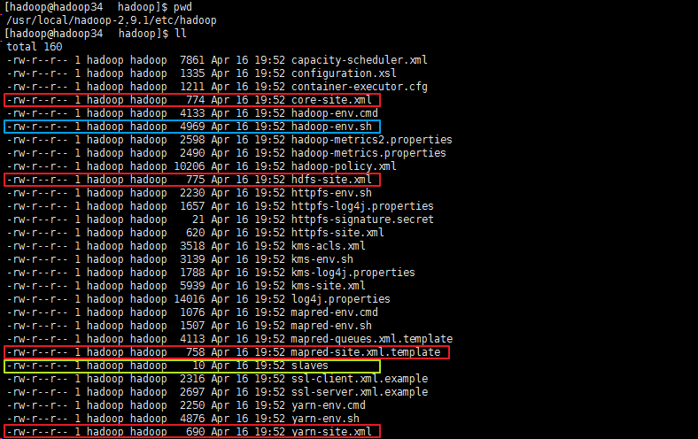
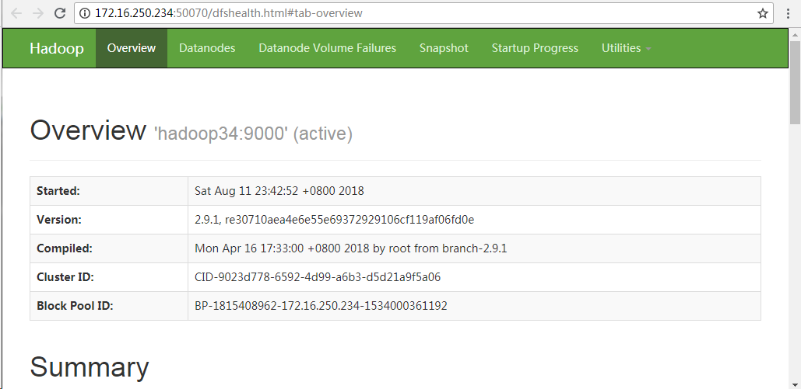
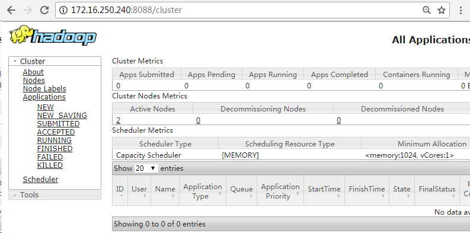

本篇文章主要对完全分布式Hadoop集群环境的安装与配置步骤进行介绍。

集群的节点规划信息如下：
<table border="1" cellpadding="0" cellspacing="0"><tbody><tr><td>Host Name</td><td>IP Address</td><td>Node Type</td><td>User Name</td></tr><tr><td>hadoop34</td><td>172.16.250.234</td><td>DataNode / NodeManager / NameNode</td><td>hadoop / root</td></tr><tr><td>hadoop39</td><td>172.16.250.239</td><td>DataNode / NodeManager / SecondaryNameNode</td><td>hadoop / root</td></tr><tr><td>hadoop40</td><td>172.16.250.240</td><td>DataNode / NodeManager /&nbsp;ResourceManager</td><td>hadoop / root</td></tr></tbody></table>
Hadoop官方地址：<http://hadoop.apache.org>

# 环境配置

	All nodes are disabled SELinux and firewalld
	All nodes can ping with each other
	All nodes have same hadoop directory structure and a same user account
	Create a hadoop user, home directory is /home/hadoop, add into root group
	hadoop directory is /usr/local/hadoop, directory owner is hadoop
	Master node and slave node can SSH with no password publick key authentication
	All nodes have same /etc/hosts, add master node and slave node record line

## 修改主机名（root权限）
由于`Hadoop`集群内部有时需要通过主机名来进行相互通信，因此我们需要保证每一台机器的主机名都不相同。

下面给出不同CentOS版本下修改主机名的操作命令：

Centos6:

	[root@localhost ~]# hostname                    # 查看当前的 hostname
	localhost
	[root@localhost ~]# vim /etc/sysconfig/network  # 编辑 network 文件修改hostname行（重启生效）
	[root@localhost ~]# cat /etc/sysconfig/network  # 检查修改
	NETWORKING=yes
	HOSTNAME=hadoop34
	[root@localhost ~]# hostname hadoop34           # 设置当前的hostname(立即生效）
	
Centos7:

	[root@localhost ~]# hostname                            # 查看当前的 hostnmae
	localhost
	[root@localhost ~]# hostnamectl set-hostname hadoop34   # 永久修改hostname(立即生效）
	[root@localhost ~]# hostname                            # 检查修改
	hadoop34

## 修改HOSTS（root权限）
修改HOSTS的原因主要有两点：

- `Hadoop`内部机制需要通过主机名对主机进行访问。
- 使用主机名对`Hadoop`集群进行配置，看起来更加一目了然。

在CentOS中修改`HOSTS`操作命令如下：

	# 修改每台机器的 /etc/hosts 文件
	[root@localhost ~]# vi /etc/hosts
	# 在文件中添加集群所有主机的 IP 和主机名的对应关系，IP 与主机名之间使用一个 TAB 键分隔
	172.16.250.234   hadoop34
	172.16.250.239   hadoop39
	172.16.250.240   hadoop40

如果想要多个主机名路由到同一个IP，只需要在IP后边添加多个主机名即可，多个主机名之间同样使用`TAB`键进行分隔，例如：

	172.16.250.234   hadoop34   namenode34   resourcemanager34

## 关闭SELinux（root权限）
因为CentOS的所有访问权限都是有SELinux来管理的，为了避免我们安装中由于权限关系而导致的失败，需要先将其关闭，以后根据需要再进行重新管理。

在CentOS中关闭SELinux使用如下操作命令：

	[root@localhost ~]# getenforce                                         # 查看当前的 SELinux 状态
	Enforcing
	# setenforce 1 可以设置 SELinux 为 enforcing 模式
	[root@localhost ~]# setenforce 0                                       # 将 SELinux 的状态临时设置为 Permissive 模式（立即生效）
	[root@localhost ~]# getenforce                                         # 检查修改
	Permissive
	[root@localhost ~]# vim /etc/selinux/config                            
	# 编辑 config 文件将 SELINUX=enforcing 修改为 SELINUX=disabled（重启生效）
	[root@localhost ~]# cat /etc/selinux/config                            # 检查修改
	 
	# This file controls the state of SELinux on the system.
	# SELINUX= can take one of these three values:
	#     enforcing - SELinux security policy is enforced.
	#     permissive - SELinux prints warnings instead of enforcing.
	#     disabled - No SELinux policy is loaded.
	SELINUX=disabled
	# SELINUXTYPE= can take one of these two values:
	#     targeted - Targeted processes are protected,
	#     mls - Multi Level Security protection.
	SELINUXTYPE=targeted 
	 
	[root@localhost ~]# sestatus                                  # 查看 SELinux 当前的详细状态
	SELinux status:                 enabled
	SELinuxfs mount:                /selinux
	Current mode:                   permissive
	Mode from config file:          disabled
	Policy version:                 24
	Policy from config file:        targeted

注意:使用`getenforce`命令获取当前`SELinux`的运行状态为`permissive`或者 `disabled`时均表示关闭。

## 关闭防火墙（root权限）
为避免由于防火墙策略导致安装失败问题，需要先关闭防火墙，下面给出不同CentOS版本下关闭防火墙的操作命令：

Centos6:

	[root@localhost ~]# service iptables start                 # 开启防火墙
	iptables: Applying firewall rules:                         [  OK  ]
	[root@localhost ~]# service iptables status                # 查看防火墙状态
	Table: filter
	Chain INPUT (policy ACCEPT)
	num  target     prot opt source               destination         
	1    ACCEPT     all  --  0.0.0.0/0            0.0.0.0/0           state RELATED,ESTABLISHED 
	2    ACCEPT     icmp --  0.0.0.0/0            0.0.0.0/0           
	3    ACCEPT     all  --  0.0.0.0/0            0.0.0.0/0           
	4    ACCEPT     tcp  --  0.0.0.0/0            0.0.0.0/0           state NEW tcp dpt:22 
	5    REJECT     all  --  0.0.0.0/0            0.0.0.0/0           reject-with icmp-host-prohibited 
	Chain FORWARD (policy ACCEPT)
	num  target     prot opt source               destination         
	1    REJECT     all  --  0.0.0.0/0            0.0.0.0/0           reject-with icmp-host-prohibited 
	Chain OUTPUT (policy ACCEPT)
	num  target     prot opt source               destination         
	[root@localhost ~]# chkconfig iptables off                 # 永久关闭防火墙（重启生效）
	[root@localhost ~]# service iptables stop                  # 临时关闭防火墙（立即生效）
	iptables: Setting chains to policy ACCEPT: filter          [  OK  ]
	iptables: Flushing firewall rules:                         [  OK  ]
	iptables: Unloading modules:                               [  OK  ]
	[root@localhost ~]# service iptables status                # 检查修改
	iptables: Firewall is not running.

Centos7: 

	# Centos7 中使用 systemctl 命令来管理服务，命令格式如下
	# systemctl [start 开启]|[stop 停止]|[restart 重启]|[status 状态][enable 开机启动]| [disable 禁止开机启动] 服务名称
	[root@localhost ~]# systemctl start firewalld              # 开启防火墙
	[root@localhost ~]# systemctl status firewalld             # 查看防火墙状态
	● firewalld.service - firewalld - dynamic firewall daemon
	   Loaded: loaded (/usr/lib/systemd/system/firewalld.service; disabled; vendor preset: enabled)
	   Active: active (running) since Wed 2018-08-08 09:18:09 CST; 24s ago           
	         # active (running) 表示防火墙开启
	     Docs: man:firewalld(1)
	 Main PID: 21501 (firewalld)
	   CGroup: /system.slice/firewalld.service
	           └─21501 /usr/bin/python -Es /usr/sbin/firewalld --nofork --nopid
	 
	Aug 08 09:18:07 localhost.localdomain systemd[1]: Starting firewalld - dynamic firewall daemon...
	Aug 08 09:18:09 localhost.localdomain systemd[1]: Started firewalld - dynamic firewall daemon.
	[root@localhost ~]# systemctl disable firewalld            # 永久关闭防火墙（重启生效）
	[root@localhost ~]# systemctl stop firewalld               # 临时关闭防火墙（立即生效）
	[root@localhost ~]# systemctl status firewalld             # 检查修改
	● firewalld.service - firewalld - dynamic firewall daemon
	   Loaded: loaded (/usr/lib/systemd/system/firewalld.service; disabled; vendor preset: enabled)
	   Active: inactive (dead)
	         # inactive (dead) 表示防火墙关闭
	     Docs: man:firewalld(1)
	 
	Aug 08 09:18:07 localhost.localdomain systemd[1]: Starting firewalld - dynamic firewall daemon...
	Aug 08 09:18:09 localhost.localdomain systemd[1]: Started firewalld - dynamic firewall daemon.
	Aug 08 09:19:24 localhost.localdomain systemd[1]: Stopping firewalld - dynamic firewall daemon...
	Aug 08 09:19:24 localhost.localdomain systemd[1]: Stopped firewalld - dynamic firewall daemon.

## JDK的安装与配置
由于`Hadoop`的编译及`MapReduce`的运行都需要使用JDK，所以需要在集群中的每一台机器上提前安装好能够满足Hadoop最低版本要求的JDK。

如何在CentOS中安装JDK，可以参考文章：<https://blog.csdn.net/pengjunlee/article/details/53932094>

## SSH免密码登录配置
在Hadoop集群中的各个节点之间需要使用`SSH`频繁地进行通信，为了避免每次的通信都要求输入密码，需要对各个节点进行SSH免密码登录配置。

### 开启sshd秘钥认证
在进行SSH免密码登录配置之前，需要先开启`sshd`秘钥认证：编辑每一台机器的`/etc/ssh/sshd_config`文件，去掉下面这3行前的`#`注释。

	# RSAAuthentication yes
	# PubkeyAuthentication yes
	# AuthorizedKeysFile      .ssh/authorized_keys

修改完成后保存，并执行以下命令重启`sshd`服务使修改生效。

	# Centos6: 
	service sshd restart                 # 重启 sshd 服务
	# Centos7: 
	systemctl restart  sshd              # 重启 sshd 服务

### 创建免密码登录账户
由于Hadoop集群中的各节点默认会使用当前的账号SSH免密码登录其它节点，所以需要在每个节点中创建一个相同的供 Hadoop集群专用的账户，本例中使用的账户为`hadoop`。

在各台机器中执行下面几行命令，创建免密码登录的`hadoop`账户。

	[root@localhost ~]# useradd hadoop
	[root@localhost ~]# passwd hadoop
	Changing password for user hadoop.
	New password: 
	Retype new password: 
	passwd: all authentication tokens updated successfully.

## 生成公钥和私钥
在每一台机器中都执行`su hadoop`命令，从`root`用户切换到要免密码登录的`hadoop`账户，然后执行`ssh-keygen -t rsa`命令，生成用来SSH免密码登录的公钥和私钥。

	[root@localhost ~]# su hadoop
	[hadoop@hadoop34 root]$ ssh-keygen -t rsa
	Generating public/private rsa key pair.
	Enter file in which to save the key (/home/hadoop/.ssh/id_rsa): 
	Enter passphrase (empty for no passphrase): 
	Enter same passphrase again: 
	Your identification has been saved in /home/hadoop/.ssh/id_rsa.
	Your public key has been saved in /home/hadoop/.ssh/id_rsa.pub.
	The key fingerprint is:
	SHA256:b7+xzQ8SlkIH4amLnxQuaSphVFKPSH04x0VkM2tTAPU hadoop@hadoop34
	The key's randomart image is:
	+---[RSA 2048]----+
	|  .o.o.*X.+.     |
	| ...=o+. B o     |
	|  .o.+. + E .    |
	|  .    . + . .   |
	| .      S . +    |
	|  o    + + o .   |
	| . .  = + o o .  |
	|  .  o + o . * . |
	|   ..   o   +.o..|
	+----[SHA256]-----+

上述秘钥生成过程中，无需指定秘钥存放目录和口令密码，直接回车，命令执行完毕后会在hadoop账户的家目录中`/home/hadoop/.ssh`生成两个文件：

    id_rsa: 私钥
    id_rsa.pub:公钥

### 将公钥导入到认证文件
秘钥生成之后，执行以下命令将每台机器的公钥都拷贝到认证文件`authorized_keys`中。

	[hadoop@hadoop34 bin]$ cat /home/hadoop/.ssh/id_rsa.pub >> /home/hadoop/.ssh/authorized_keys
	[hadoop@hadoop34 bin]$ ssh hadoop@hadoop39 cat /home/hadoop/.ssh/id_rsa.pub >> /home/hadoop/.ssh/authorized_keys
	The authenticity of host 'hadoop39 (172.16.250.239)' can't be established.
	ECDSA key fingerprint is SHA256:QWIpDi4MJ3VkzHwuSOE/3z1+QxiMfc9j5/VPH9cCnKY.
	ECDSA key fingerprint is MD5:cb:77:1c:a7:25:56:49:61:93:14:ab:8a:0a:3b:8e:f3.
	Are you sure you want to continue connecting (yes/no)? yes
	Warning: Permanently added 'hadoop39,172.16.250.239' (ECDSA) to the list of known hosts.
	hadoop@hadoop39's password:                       # 输入刚刚创建的 hadoop 账户的密码
	[hadoop@hadoop34 bin]$ ssh hadoop@hadoop40 cat /home/hadoop/.ssh/id_rsa.pub >> /home/hadoop/.ssh/authorized_keys
	The authenticity of host 'hadoop40 (172.16.250.240)' can't be established.
	ECDSA key fingerprint is SHA256:QWIpDi4MJ3VkzHwuSOE/3z1+QxiMfc9j5/VPH9cCnKY.
	ECDSA key fingerprint is MD5:cb:77:1c:a7:25:56:49:61:93:14:ab:8a:0a:3b:8e:f3.
	Are you sure you want to continue connecting (yes/no)? yes
	Warning: Permanently added 'hadoop40,172.16.250.240' (ECDSA) to the list of known hosts.
	hadoop@hadoop40's password:                       # 输入刚刚创建的 hadoop 账户的密码

查看`authorized_keys`文件内容如下：

	[hadoop@hadoop34 bin]$ cat /home/hadoop/.ssh/authorized_keys 
	ssh-rsa AAAAB3NzaC1yc2EAAAADAQABAAABAQC/psoBkOHlulUweuF2bQrRY1IjyR2d19Byu8GnoAlpPSabdtCfRD7m2XPymK8z1xe3lfPg1VHTlPnCEJg5WbcAxEp+R70tgjgCoUKuhrfdHGp+XvXSQ9SYq+iplSFwGj3DLrHeycDIc1l+jtCHaUb1+XdId3M2jRxD+RYZO6MOqnjflcRyAax01Sv4T3amp1h0nmAd4Bylk3BZdV98ClQ3ZPZnZbK62W88I617JpBoR1XjnbNxAVq6SeDSmL1lucQtf3bJTfZMVKUVsG0uewtUwQozV9AYmIHS6rKFvpXqvlTGuogoOSF1otVlt0pweEJ7bEgzS8qjg1MV6kFJMFeD hadoop@hadoop34
	ssh-rsa AAAAB3NzaC1yc2EAAAADAQABAAABAQDsH9nQF7ixOmhAUzilxHzgpT3wIHf+eibp/49RLbT3DFH3M9huWCQ613k2rcye8pSrNMKuirLoBjPWXrvEUEYrtLZTzSuJbyi6l0fcvPVvhUkYnOjOoEywc+CEPQilBL463wThRt6+4+gMqdPslSuZ8uRWe+5WGRuLUsBitEkEybUdkou+aeuSjukSqbaJvB6R8vVND0LocLAxLu6IzSrr3lOUu/l8WlPCKppDbbdzgPy0JOCocLB6cEcxOSaBpBK6Qf5YXfClI/lCj8F8yZVTHM5cYmheeLv0Z7icJdDbD+6j5QI3t2ad9Qwqit/mQQ1ILO/JCN7TF+rvAv3cltYD hadoop@hadoop39
	ssh-rsa AAAAB3NzaC1yc2EAAAADAQABAAABAQC9XQsRhN2VmYMPMZ1gngpRBoUBvUJXJADleDPGqk4stmo7TZoy9fMUB++UQsdDTM0C4+zEY7CZb6QRMRhNR7fw9v1F/bDijdYeOSt/SDcOAuShSAzoT0KI6AT+hWGq4JHDWbSydL/x1unLFbS16n9m1EXnvpZL2ksxbCGRMi4EN91+5uy2QmNujQsIkHVe6v04C+p1Q1N36SVurzOAbT6bDTGO++NvViN9EAEBMH0UUHWbbtxplNo7ADwoXKsY17Cu5EjoqVadF6stTfMbW5NFO2FFDUbylWB2ijf0DUfGQ2ayXKYCGrqjufnYs4vv59GJufn6iAh4SqHtt2okxA6L hadoop@hadoop40

### 设置认证文件访问权限（hadoop34主机）
在`hadoop34`主机上执行如下命令，对认证文件的操作权限进行设置：

	[hadoop@hadoop34 bin]$ chmod 700 /home/hadoop/.ssh
	[hadoop@hadoop34 bin]$ chmod 600 /home/hadoop/.ssh/authorized_keys

### 补全known_hosts中主机列表

	[hadoop@hadoop34 ~]$ vim /home/hadoop/.ssh/known_hosts 
	hadoop39,172.16.250.239 ecdsa-sha2-nistp256 AAAAE2VjZHNhLXNoYTItbmlzdHAyNTYAAAAIbmlzdHAyNTYAAABBBETbnFS5S1bJ2r8j9YxsoQLZJd8hG82ey7aeyMb09fVYjK6npXAyPOPmxhRROle3PEKM2yVN3mooPqUVfDk/NpU=
	hadoop40,172.16.250.240 ecdsa-sha2-nistp256 AAAAE2VjZHNhLXNoYTItbmlzdHAyNTYAAAAIbmlzdHAyNTYAAABBBETbnFS5S1bJ2r8j9YxsoQLZJd8hG82ey7aeyMb09fVYjK6npXAyPOPmxhRROle3PEKM2yVN3mooPqUVfDk/NpU=

发现此时`hadoop34`主机的`known_hosts`中仅有`hadoop39`和`hadoop40`两台主机的信息，缺少`hadoop34`主机自身的信息，所以需要ssh免密登录一次将自身的主机信息添加到`known_hosts`列表中。

	[hadoop@hadoop34 bin]$ ssh hadoop34
	The authenticity of host 'hadoop34 (172.16.250.234)' can't be established.
	ECDSA key fingerprint is SHA256:9/GfAEOJoVF5C6WoIPDYBqH1twQV4bpmxtRj0c4YF90.
	ECDSA key fingerprint is MD5:da:6f:4b:87:2e:81:ab:3b:e1:6c:76:3a:a3:e0:1a:7c.
	Are you sure you want to continue connecting (yes/no)? yes
	Warning: Permanently added 'hadoop34,172.16.250.234' (ECDSA) to the list of known hosts.
	Last login: Sat Aug 11 17:41:56 2018

再次查看`known_hosts`中的主机列表。

	[hadoop@hadoop34 ~]$ vim /home/hadoop/.ssh/known_hosts 
	hadoop39,172.16.250.239 ecdsa-sha2-nistp256 AAAAE2VjZHNhLXNoYTItbmlzdHAyNTYAAAAIbmlzdHAyNTYAAABBBETbnFS5S1bJ2r8j9YxsoQLZJd8hG82ey7aeyMb09fVYjK6npXAyPOPmxhRROle3PEKM2yVN3mooPqUVfDk/NpU=
	hadoop40,172.16.250.240 ecdsa-sha2-nistp256 AAAAE2VjZHNhLXNoYTItbmlzdHAyNTYAAAAIbmlzdHAyNTYAAABBBETbnFS5S1bJ2r8j9YxsoQLZJd8hG82ey7aeyMb09fVYjK6npXAyPOPmxhRROle3PEKM2yVN3mooPqUVfDk/NpU=
	hadoop34,172.16.250.234 ecdsa-sha2-nistp256 AAAAE2VjZHNhLXNoYTItbmlzdHAyNTYAAAAIbmlzdHAyNTYAAABBBEU7TSuLX7wyJMhr8GEc/Fw75tIcQDXRRVS20kAvp6zL+bZSbTE9kF+gkYBtiyEq0SEKWYPHjUUMRL4ZKhPmOWA=

### 将认证文件复制到其他主机
在`hadoop34`主机上执行以下命令将生成的`authorized_keys`、`known_hosts`两个文件从`master`复制到 `hadoop39`和`hadoop40`。

	# scp [要传输的本地文件] [远程主机用户名]@远程主机ip或主机名:[文件要传输到的目标位置]
	[hadoop@hadoop34 ~]$ scp /home/hadoop/.ssh/authorized_keys hadoop@hadoop39:/home/hadoop/.ssh/authorized_keys
	hadoop@hadoop39's password: 
	authorized_keys                                                                    100% 1191     1.4MB/s   00:00    
	[hadoop@hadoop34 ~]$ scp /home/hadoop/.ssh/authorized_keys hadoop@hadoop40:/home/hadoop/.ssh/authorized_keys
	hadoop@hadoop40's password: 
	authorized_keys                                                                    100% 1191     1.2MB/s   00:00    
	[hadoop@hadoop34 ~]$ scp /home/hadoop/.ssh/known_hosts hadoop@hadoop39:/home/hadoop/.ssh/known_hosts
	hadoop@hadoop39's password: 
	known_hosts                                                                        100%  555   511.8KB/s   00:00    
	[hadoop@hadoop34 ~]$ scp /home/hadoop/.ssh/known_hosts hadoop@hadoop40:/home/hadoop/.ssh/known_hosts
	hadoop@hadoop40's password: 
	known_hosts                                                                        100%  555   271.8KB/s   00:00

### 设置认证文件访问权限（hadoop39和hadoop40）

	# 在 hadoop39主机上执行
	[hadoop@hadoop39 .ssh]$ chmod 700 /home/hadoop/.ssh
	[hadoop@hadoop39 .ssh]$ chmod 600 /home/hadoop/.ssh/authorized_keys
	# 在 hadoop40主机上执行
	[hadoop@hadoop40 .ssh]$ chmod 700 /home/hadoop/.ssh
	[hadoop@hadoop40 .ssh]$ chmod 600 /home/hadoop/.ssh/authorized_keys

### SSH免密码登录测试
在`hadoop40`主机上执行`ssh hadoop34`命令就能够免密码登录`hadoop34`主机了。

	[hadoop@hadoop40 .ssh]$ ssh hadoop34
	Last login: Sat Aug 11 17:56:45 2018 from hadoop34
	[hadoop@hadoop34 ~]$ exit
	logout
	Connection to hadoop34 closed.

SSH免密码登录详细配置，请参考文章：<https://blog.csdn.net/pengjunlee/article/details/80919833>

# 搭建Hadoop集群
## 安装Hadoop
Hadoop安装其实就是一个将下载好的Hadoop压缩包解压到所有服务器上并进行配置的过程，推荐将Hadoop安装在各个节点服务器的相同目录下方便配置，我使用的Hadoop版本是`hadoop-2.9.1`，指定的Hadoop的安装目录是`/usr/local/hadoop-2.9.1`。

使用如下操作命令将下载好的`hadoop-2.9.1.tar.gz`解压至安装目录：

	[hadoop@hadoop34 src]$ tar zxvf hadoop-2.9.1.tar.gz -C /usr/local/

如果解压时使用的是`root`账户，那么还需要执行以下命令将Hadoop的安装目录的所有者和所属组改为`hadoop`：

	[hadoop@hadoop34 src]$ chown -R hadoop:hadoop /usr/local/hadoop-2.9.1/

编辑`/home/hadoop/.bash_profile`配置文件，增加`Hadoop`相关用户环境变量内容如下： 

	export HADOOP_HOME=/usr/local/hadoop-2.9.1
	PATH=$PATH:$HOME/.local/bin:$HOME/bin:$HADOOP_HOME/bin:$HADOOP_HOME/sbin
	export PATH

所使用到的命令如下：

	vim /home/hadoop/.bash_profile             # 编辑 .bash_profile 文件，增加 Hadoop 环境变量
	source /home/hadoop/.bash_profile          # 重新加载 .bash_profile 配置文件
	hadoop version                             # 检查修改，查看 Hadoop 版本信息

## 配置hadoop集群
Hadoop的Java相关配置由下面两种类型的配置文件共同决定：

- 只读的缺省配置，包括：`core-default.xml`, `hdfs-default.xml`, `yarn-default.xml`和`mapred-default.xml`。
- 节点的个性配置，包括：`etc/hadoop/core-site.xml`,`etc/hadoop/hdfs-site.xml`,`etc/hadoop/yarn-site.xml`和`etc/hadoop/mapred-site.xml`。

篇幅所限，只读的缺省配置就不再一一列出，想要了解的可以访问以下链接进行查看：

- <http://hadoop.apache.org/docs/r2.9.1/hadoop-project-dist/hadoop-common/core-default.xml>
- <http://hadoop.apache.org/docs/r2.9.1/hadoop-project-dist/hadoop-hdfs/hdfs-default.xml>
- <http://hadoop.apache.org/docs/r2.9.1/hadoop-yarn/hadoop-yarn-common/yarn-default.xml>
- <http://hadoop.apache.org/docs/r2.9.1/hadoop-mapreduce-client/hadoop-mapreduce-client-core/mapred-default.xml>

接下来，主要讲解如何对各节点进行个性化配置，一般情况下，我们只需要修改下图标示的几个文件即可。

### 配置core-site.xml

	<configuration>
	        <!-- The name of the default file system -->
	        <property>
	                <name>fs.defaultFS</name>
	                <value>hdfs://hadoop34:9000</value>
	        </property> 
	        <!-- The size of buffer for use in sequence files -->
	        <property> 
	                <name>io.file.buffer.size</name>
	                <value>131072</value>
	        </property> 
	        <!-- A base for other temporary directories -->
	        <property> 
	                <name>hadoop.tmp.dir</name>
	                <value>file:/usr/local/hadoop-2.9.1/tmp</value>
	        </property>
	</configuration>

### 配置hdfs-site.xml

	<configuration>
	        <property>
	                <name>dfs.namenode.name.dir</name>
	                <value>file:/usr/local/hadoop-2.9.1/data/namespace</value>
	                <final>true</final>
	                <description>Path on the local filesystem where the NameNode stores</description>
	        </property>
	        <property>
	                <name>dfs.datanode.data.dir</name>
	                <value>/usr/local/hadoop-2.9.1/data/dataspace</value>
	                <final>true</final>
	                <description>Path on the local filesystem where the DataNode stores Data</description>
	        </property>
	        <property>
	                <name>dfs.namenode.secondary.http-address</name>
	                <value>hadoop39:50090</value>
	                <final>true</final>
	                <description>The secondary namenode http server address and port</description>
	        </property>
	        <property>
	                <name>dfs.webhdfs.enabled</name>
	                <value>true</value>
	                <final>true</final>
	                <description>Enable WebHDFS (REST API) in Namenodes and Datanodes</description>
	        </property>
	        <property>
	                <name>dfs.permissions</name>
	                <value>false</value>
	                <final>true</final>
	                <description>Disable permission checking in HDFS</description>
	        </property>
	        <property>
	                <name>dfs.replication</name>
	                <value>2</value>
	                <final>true</final>
	                <description>Default block replication</description>
	        </property>
	</configuration>

### 配置mapred-site.xml

	<configuration>
	        <property>
	                <name>mapreduce.framework.name</name>
	                <value>yarn</value>
	                <final>true</final>
	                <description>The runtime framework for executing MapReduce jobs</description>
	        </property>
	</configuration>

### 配置yarn-site.xml 
	<configuration>
	        <property>
	                <name>yarn.resourcemanager.scheduler.address</name>
	                <value>hadoop40:8030</value>
	                <final>true</final>
	                <description>The address of the scheduler interface</description>
	        </property>
	        <property>
	                <name>yarn.resourcemanager.resource-tracker.address</name>
	                <value>hadoop40:8031</value>
	                <final>true</final>
	        </property>
	        <property>
	                <name>yarn.resourcemanager.address</name>
	                <value>hadoop40:8032</value>
	                <final>true</final>
	                <description>The address of the applications manager interface in the RM</description>
	        </property>
	        <property>
	                <name>yarn.resourcemanager.admin.address</name>
	                <value>hadoop40:8033</value>
	                <final>true</final>
	                <description>The address of the RM admin interface</description>
	        </property>
	        <property>
	                <name>yarn.resourcemanager.webapp.address</name>
	                <value>hadoop40:8088</value>
	                <final>true</final>
	                <description>The http address of the RM web application</description>
	        </property>
	        <property> 
	                <name>yarn.nodemanager.aux-services</name>
	                <value>mapreduce_shuffle</value>
	                <final>true</final>
	        </property>
	</configuration>

### 配置slaves

	hadoop34
	hadoop39
	hadoop40

### 配置hadoop-env.sh

	# 将
	export JAVA_HOME=${JAVA_HOME}
	# 修改为：
	export JAVA_HOME=/usr/local/jdk1.8.0_144

### 将配置分发到其他节点

	scp -r /usr/local/hadoop-2.9.1/etc/hadoop/* hadoop39:/usr/local/hadoop-2.9.1/etc/hadoop/
	scp -r /usr/local/hadoop-2.9.1/etc/hadoop/* hadoop40:/usr/local/hadoop-2.9.1/etc/hadoop/

# 操作Hadoop集群 
## 格式化NameNode
第一次启动HDFS需要先进行格式化，使用如下命令：

	# $HADOOP_PREFIX/bin/hdfs namenode -format <cluster_name>
	hdfs namenode -format hadoop_cluster

HDFS格式化完成之后，使用如下命令启动HDFS集群：

	# $HADOOP_PREFIX/sbin/start-dfs.sh
	start-dfs.sh

在集群的任意`HDFS`节点上执行`start-dfs.sh`命令，控制台打印的`HDFS`集群的启动流程如下：

	# 在HDFS集群中的任意节点上执行 start-dfs.sh 
	[hadoop@hadoop34 hadoop-2.9.1]$ start-dfs.sh 
	Starting namenodes on [hadoop34]
	hadoop34: starting namenode, logging to /usr/local/hadoop-2.9.1/logs/hadoop-hadoop-namenode-hadoop34.out
	hadoop34: starting datanode, logging to /usr/local/hadoop-2.9.1/logs/hadoop-hadoop-datanode-hadoop34.out
	hadoop40: starting datanode, logging to /usr/local/hadoop-2.9.1/logs/hadoop-hadoop-datanode-hadoop40.out
	hadoop39: starting datanode, logging to /usr/local/hadoop-2.9.1/logs/hadoop-hadoop-datanode-hadoop39.out
	Starting secondary namenodes [hadoop39]
	hadoop39: starting secondarynamenode, logging to /usr/local/hadoop-2.9.1/logs/hadoop-hadoop-secondarynamenode-hadoop39.out

HDFS集群启动完成之后，此时各个节点上的进程如下所示：

	# hadoop34
	[hadoop@hadoop34 hadoop-2.9.1]$ jps
	11123 DataNode
	11351 Jps
	10969 NameNode
	# hadoop39
	[hadoop@hadoop39 data]$ jps
	660 DataNode
	822 SecondaryNameNode
	893 Jps
	# hadoop40
	[hadoop@hadoop40 data]$ jps
	14811 DataNode
	15003 Jps

在浏览器中输入<http://172.16.250.234:50070>，查看HDFS的管理界面。 

注意：使用`start-dfs.sh`命令启动HDFS集群时，在集群的任意节点上执行该命令都能够启动集群。 

启动`YARN`使用如下命令：

	# $ $HADOOP_PREFIX/sbin/start-yarn.sh
	start-yarn.sh

在被指派为`ResourceManager`的主机上执行`start-yarn.sh`命令，控制台打印的YARN的启动流程如下：

	# 必须在 ResourceManager 所在的 hadoop40 主机上执行start-yarn.sh
	[hadoop@hadoop40 hadoop-2.9.1]$ start-yarn.sh 
	starting yarn daemons
	starting resourcemanager, logging to /usr/local/hadoop-2.9.1/logs/yarn-hadoop-resourcemanager-slave2.out
	hadoop34: starting nodemanager, logging to /usr/local/hadoop-2.9.1/logs/yarn-hadoop-nodemanager-hadoop34.out
	hadoop40: starting nodemanager, logging to /usr/local/hadoop-2.9.1/logs/yarn-hadoop-nodemanager-hadoop40.out
	hadoop39: starting nodemanager, logging to /usr/local/hadoop-2.9.1/logs/yarn-hadoop-nodemanager-hadoop39.out

待YARN启动完成之后，再次查看各个节点上运行的进程：

	# hadoop34
	[hadoop@hadoop34 hadoop-2.9.1]$ jps
	11504 NameNode
	11940 Jps
	11624 DataNode
	11784 NodeManager
	# hadoop39
	[hadoop@hadoop39 data]$ jps
	1347 NodeManager
	1076 DataNode
	1593 Jps
	1197 SecondaryNameNode
	# hadoop40
	[hadoop@hadoop40 hadoop-2.9.1]$ jps
	16264 NodeManager
	15721 DataNode
	16682 Jps
	16141 ResourceManager

在浏览器中输入<http://172.16.250.240:8088>，查看YARN的管理界面。

注意：

- 在使用`start-yarn.sh`命令启动YARN集群时，必须在ResourceManager所在节点上执行该命令才能够启动 `ResourceManager`；
- 当`Namenode`和`ResourceManger`不在同一台主机时，就不能在NameNode上启动YARN了，应该在ResouceManager所在的机器上启动YARN。 

# MapReduce测试 
为了验证`hadoop`集群是否安装成功，以及初体验一把MapReduce，接下来，我们以Hadoop安装包中自带的MapReduce 示例为例，简单统计一下`$HADOOP_HOME/etc/hadoop`目录下的配置文件中匹配`dfs[a-z.]+`的字符串都有哪些以及它们在配置文件中出现了多少次。

	[hadoop@hadoop34 hadoop]$ hdfs dfs -mkdir /input        # 在HDFS根目录下创建input目录
	[hadoop@hadoop34 hadoop]$ hdfs dfs -mkdir /output       # 在HDFS根目录下创建output目录
	[hadoop@hadoop34 hadoop]$ hdfs dfs -ls /                # 查看HDFS根目录下文件列表
	Found 2 items
	drwxr-xr-x   - hadoop supergroup          0 2018-08-12 00:20 /input
	drwxr-xr-x   - hadoop supergroup          0 2018-08-12 00:23 /output
	# 将本地主机上的 hadoop 文件夹上传到 HDFS的 input目录
	[hadoop@hadoop34 hadoop]$ hdfs dfs -put /usr/local/hadoop-2.9.1/etc/hadoop /input
	[hadoop@hadoop34 hadoop]$ hdfs dfs -ls /input/hadoop    # 查看HDFS中/input/hadoop目录下文件列表
	Found 29 items
	-rw-r--r--   2 hadoop supergroup       7861 2018-08-12 00:20 /input/hadoop/capacity-scheduler.xml
	-rw-r--r--   2 hadoop supergroup       1335 2018-08-12 00:20 /input/hadoop/configuration.xsl
	# 此处省略其余 25个文件信息 
	-rw-r--r--   2 hadoop supergroup       4876 2018-08-12 00:20 /input/hadoop/yarn-env.sh
	-rw-r--r--   2 hadoop supergroup       1971 2018-08-12 00:20 /input/hadoop/yarn-site.xml
	# 使用 hadoop 提供的mapreduce示例程序，统计上述29个文件中匹配'dfs[a-z.]+'的字符串出现的次数
	[hadoop@hadoop34 hadoop]$ hadoop jar /usr/local/hadoop-2.9.1/share/hadoop/mapreduce/hadoop-mapreduce-examples-2.9.1.jar grep /input/hadoop /output/first 'dfs[a-z.]+'
	[hadoop@hadoop34 hadoop]$ hdfs dfs -ls /output/first   # 查看结果存放目录/output/first 下的文件列表
	Found 2 items
	-rw-r--r--   2 hadoop supergroup          0 2018-08-12 00:52 /output/first/_SUCCESS
	-rw-r--r--   2 hadoop supergroup        338 2018-08-12 00:52 /output/first/part-r-00000
	# 你可以将结果文件目录从HDFS拷贝到本地主机的 /usr/local/hadoop-2.9.1/tmp/ 目录下
	[hadoop@hadoop34 hadoop]$ hdfs dfs -get /output/first /usr/local/hadoop-2.9.1/tmp/
	[hadoop@hadoop34 hadoop]$ ls /usr/local/hadoop-2.9.1/tmp/first/
	part-r-00000  _SUCCESS
	[hadoop@hadoop34 hadoop]$ cat /usr/local/hadoop-2.9.1/tmp/first/part-r-00000
	# 或者直接查看HDFS中mapreduce任务的统计结果
	[hadoop@hadoop34 hadoop]$ hdfs dfs -cat /output/first/part-r-00000
	# mapreduce任务执行完毕后的的统计结果内容如下:
	6    dfs.audit.logger
	4    dfs.class
	3    dfs.logger
	3    dfs.server.namenode.
	2    dfs.audit.log.maxfilesize
	2    dfs.period
	2    dfs.audit.log.maxbackupindex
	1    dfsmetrics.log
	1    dfsadmin
	1    dfs.webhdfs.enabled
	1    dfs.servers
	1    dfs.replication
	1    dfs.permissions
	1    dfs.namenode.secondary.http
	1    dfs.log
	1    dfs.file
	1    dfs.datanode.data.dir
	1    dfs.namenode.name.dir

注意： 在使用`hadoop jar`命令执行mapreduce任务的时候，用来存放计算结果的输出目录必须是一个尚未创建的目录。

# 参考文章：
<http://hadoop.apache.org/docs/r2.9.1/hadoop-project-dist/hadoop-common/SingleCluster.html>
<http://hadoop.apache.org/docs/r2.9.1/hadoop-project-dist/hadoop-common/ClusterSetup.html>
<http://hadoop.apache.org/docs/r2.9.1/hadoop-project-dist/hadoop-common/core-default.xml>
<http://hadoop.apache.org/docs/r2.9.1/hadoop-project-dist/hadoop-hdfs/hdfs-default.xml>
<http://hadoop.apache.org/docs/r2.9.1/hadoop-yarn/hadoop-yarn-common/yarn-default.xml>
<http://hadoop.apache.org/docs/r2.9.1/hadoop-mapreduce-client/hadoop-mapreduce-client-core/mapred-default.xml>
<http://hadoop.apache.org/docs/current/api/index.html>