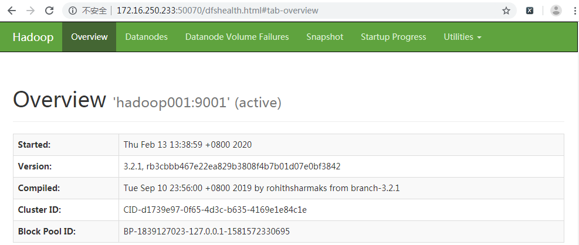
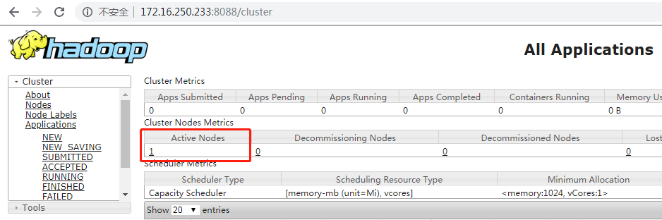

# 安装准备
## 下载Hadoop安装包
下载地址：<https://www.apache.org/dyn/closer.cgi/hadoop/common>

本例中，我下载的是当前最新的稳定版本`hadoop-3.2.1.tar.gz`。

## 下载JDK
下载地址：<https://www.oracle.com/technetwork/java/javase/downloads/index.html>

先执行如下命令，查看自己Linux服务器的操作系统位数，下载适用的JDK安装包。

	[root@localhost ~]# getconf LONG_BIT
	64

我的Linux操作系统是64位的，所以我选择下载`jdk-8u211-linux-x64.tar.gz`。

将下载好的`hadoop-3.2.1.tar.gz`和`jdk-8u211-linux-x64.tar.gz`安装包上传到服务器。

## 修改HOSTS配置

	[hadoop@localhost ~]$ sudo vi /etc/hosts
	## 在文件末尾添加一行
	127.0.0.1   hadoop001

如果报告如下错误：hadoop is not in the sudoers file. This incident will be reported.这是因为在`/etc/sudoers`文件里没有给当前用户添加sudo权限。

解决办法：

切换到root用户下，可执行`su`命令，然后输入root的密码。

`/etc/sudoers`文件默认情况下是只读的，若要修改它需要为其添加写权限，使用命令`chmod u+w /etc/sudoers`。

	[root@localhost ~]# ll /etc/sudoers
	-r--r-----. 1 root root 4188 Jul  7  2015 /etc/sudoers
	[root@localhost ~]# chmod u+w /etc/sudoers
	ll /etc/sudoers
	[root@localhost ~]# -rw-r-----. 1 root root 4188 Jul  7  2015 /etc/sudoers

编辑`/etc/sudoers`，执行`vi /etc/sudoers`命令，在`root ALL=(ALL) ALL`这一行下面添加一行，内容如下。

	## Allow root to run any commands anywhere
	root    ALL=(ALL)       ALL
	## 为 hadoop 用户添加 sudo 权限，sudo 时需要键入密码
	hadoop  ALL=(ALL)       ALL
	## 或者，为 hadoop 用户添加 sudo 权限，sudo 时无需密码
	## hadoop    ALL=(ALL)       NOPASSWD: ALL
	## 或者，为 bigdata 用户组下面的所有用户添加 sudo 权限，sudo 时需要键入密码
	## %bigdata  ALL=(ALL)       ALL
	## 或者，为 bigdata 用户组下面的所有用户添加 sudo 权限，sudo 时无需密码
	## %bigdata  ALL=(ALL)       NOPASSWD: ALL

修改完毕，保存文件，取消掉`/etc/sudoers`的写权限。

	[root@localhost ~]# chmod u-w /etc/sudoers

# 安装JDK
首先，将JDK安装包解压至安装目录。

	[hadoop@localhost ~]$ tar -zxvf jdk-8u211-linux-x64.tar.gz -C /usr/local/

然后，执行命令`vi ~/.bash_profile`在`~/.bash_profile`文件中增加Java环境变量。

	export JAVA_HOME=/usr/local/jdk1.8.0_211
	export JAVA_BIN=$JAVA_HOME/bin
	export JAVA_LIB=$JAVA_HOME/lib
	export CLASSPATH=.:$JAVA_LIB/tools.jar:$JAVA_LIB/dt.jar
	PATH=$PATH:$HOME/.local/bin:$HOME/bin:$JAVA_BIN
	 
	export PATH

环境变量配置完之后，记得执行`source ~/.bash_profile`命令使新添加的环境变量生效。

最后，输入`java -version`命令查看JDK是否安装成功。

	[hadoop@localhost ~]$ java -version
	java version "1.8.0_211"
	Java(TM) SE Runtime Environment (build 1.8.0_211-b12)
	Java HotSpot(TM) 64-Bit Server VM (build 25.211-b12, mixed mode)

# 安装Hadoop
首先，将`hadoop-3.2.1.tar.gz`解压至安装目录。

	[hadoop@localhost ~]$ tar -zxvf hadoop-3.2.1.tar.gz -C /usr/local/

接下来，编辑`~/.bash_profile`配置文件，增加Hadoop相关用户环境变量，添加后bash_profile文件完整内容如下： 

	export JAVA_HOME=/usr/local/jdk1.8.0_211
	export JAVA_BIN=$JAVA_HOME/bin
	export JAVA_LIB=$JAVA_HOME/lib
	export CLASSPATH=.:$JAVA_LIB/tools.jar:$JAVA_LIB/dt.jar
	 
	export HADOOP_HOME=/usr/local/hadoop-3.2.1
	 
	PATH=$PATH:$HOME/.local/bin:$HOME/bin:$JAVA_BIN:$HADOOP_HOME/bin:$HADOOP_HOME/sbin
	export PATH

同样地，环境变量配置完之后，记得执行`source ~/.bash_profile`命令使环境变量生效。

最后，还需要修改`%HADOOP_HOME%/etc/hadoop/`目录下面的几个配置文件。

## hadoop-env.sh

	# The java implementation to use.
	export JAVA_HOME=/usr/local/jdk1.8.0_211
	 
	# Location of Hadoop.
	export HADOOP_HOME=/usr/local/hadoop-3.2.1

## mapred-site.xml

	<configuration>
	        <property>
	                <name>mapreduce.framework.name</name>
	                <value>yarn</value>
	                <final>true</final>
	                <description>The runtime framework for executing MapReduce jobs</description>
	        </property>
	        <property>
	                <name>yarn.app.mapreduce.am.env</name>
	                <value>HADOOP_MAPRED_HOME=/usr/local/hadoop-3.2.1</value>
	        </property>
	        <property>
	                <name>mapreduce.map.env</name>
	                <value>HADOOP_MAPRED_HOME=/usr/local/hadoop-3.2.1</value>
	        </property>
	        <property>
	                <name>mapreduce.reduce.env</name>
	                <value>HADOOP_MAPRED_HOME=/usr/local/hadoop-3.2.1</value>
	        </property>
	</configuration>

## core-site.xml

	<configuration>
	        <property>
	                <name>fs.default.name</name>
	                <value>hdfs://hadoop001:9001</value>
	        </property>
	</configuration>

## hdfs-site.xml

	<configuration>
	        <property>
	                <name>dfs.replication</name>
	                <value>1</value>
	        </property>
	        <property>
	                <name>dfs.namenode.name.dir</name>
	                <value>/home/hadoop/dfs/namenode</value>
	        </property>
	        <property>
	                <name>dfs.datanode.data.dir</name>
	                <value>/home/hadoop/dfs/datanode</value>
	        </property>
	        <property>
	                <name>dfs.http.address</name>
	                <value>0.0.0.0:50070</value>
	        </property>
	</configuration>

## yarn-site.xml

	<configuration>
	        <!-- Site specific YARN configuration properties -->
	        <property>
	                <name>yarn.nodemanager.aux-services</name>
	                <value>mapreduce_shuffle</value>
	                <final>true</final>
	        </property>
	</configuration>

## workers
在Hadoop2.X中该配置文件名为`slaves`，清空文件内容，仅保留HOSTS中配置的**hadoop001**主机。

# 启动Hadoop
## 格式化NameNode
第一次启动HDFS需要先进行格式化，使用如下命令：

	# $HADOOP_PREFIX/bin/hdfs namenode -format <cluster_name>
	hdfs namenode -format

## 启动NameNode

	[hadoop@localhost ~]$ hdfs --daemon start namenode
	[hadoop@localhost ~]$ jps
	6355 NameNode
	6424 Jps

TIPS：如果启动失败，可以查看`%HADOOP_HOME%/logs/`目录下的日志进行错误排查。

## 启动DataNode
	[hadoop@localhost hadoop-3.2.1]$ hdfs --daemon start datanode
	[hadoop@localhost hadoop-3.2.1]$ jps
	6544 Jps
	6355 NameNode
	6477 DataNode
NameNode和DataNode启动之后，在浏览器中输入<http://172.16.250.233:50070>访问HDFS的管理界面。 

接下来就该启动Yarn了，在启动Yarn之前需要先对本机进行SSH免密码登录设置，否则执行`start-yarn.sh`命令启动nodemanagers 的时候会提示如下错误。

	[hadoop@localhost logs]$ start-yarn.sh
	Starting resourcemanager
	Starting nodemanagers
	hadoop001: Warning: Permanently added 'hadoop001' (ECDSA) to the list of known hosts.
	hadoop001: Permission denied (publickey,gssapi-keyex,gssapi-with-mic,password).

# 本机SSH免密码登录配置
## 关闭防火墙和SELinux（root权限）
Redhat使用了SELinux来增强安全，关闭的办法为：

**a. 永久有效**

修改`/etc/selinux/config`文件中的`SELINUX=enforcing`修改为`SELINUX=disabled`，然后重启。

**b. 临时生效**

	setenforce 0

关闭防火墙的方法为：

	开启：systemctl start firewalld.service
	关闭：systemctl stop firewalld.service

防火墙开机自启动设置：

	开启：systemctl enable iptables.service
	禁止：systemctl disable iptables.service

## 配置sshd（root权限）
编辑`/etc/ssh/sshd_config`文件，使用命令：`vi /etc/ssh/sshd_config`，去掉以下3行的`#`注释：

	RSAAuthentication yes
	PubkeyAuthentication yes
	AuthorizedKeysFile      .ssh/authorized_keys

重启sshd服务，使用命令：`systemctl restart sshd.service`。  

## 生成秘钥（普通用户权限）
从`root`用户切换到`hadoop`用户，可使用命令：`su hadoop`。然后， 执行命令`ssh-keygen -t rsa`来生成秘钥。无需指定口令密码，遇到询问直接回车，命令执行完毕后会在hadoop用户的家目录中（`/home/hadoop/.ssh`）生成两个文件：

- id_rsa: 私钥
- id_rsa.pub:公钥

## 将公钥导入到认证文件（普通用户权限）
使用命令：

	cat /home/hadoop/.ssh/id_rsa.pub >> /home/hadoop/.ssh/authorized_keys

## 设置认证文件访问权限（普通用户权限）

	chmod 700 /home/hadoop/.ssh
	chmod 600 /home/hadoop/.ssh/authorized_keys

# 启动Yarn

	[hadoop@localhost logs]$ start-yarn.sh
	Starting resourcemanager
	Starting nodemanagers
	[hadoop@localhost logs]$ jps
	8872 NameNode
	10632 Jps
	9257 DataNode
	10170 ResourceManager
	10284 NodeManager

启动成功之后，在浏览器中输入<http://172.16.250.233:8088>便可以查看YARN的管理界面了。

# MapReduce测试 
为了验证hadoop是否安装成功，以及初体验一把MapReduce，接下来，我们以Hadoop安装包中自带的MapReduce示例为例，简单统计一下`$HADOOP_HOME/etc/hadoop`目录下的配置文件中匹配`dfs[a-z.]+`的字符串都有哪些以及它们在配置文件中出现了多少次。

警告：Hadoop3.2.1版本中`etc/hadoop`目录下有一个`shellprofile.d`文件夹会导致测试失败，执行测试前记得删掉这个文件夹。

	hdfs dfs -rm -r -skipTrash /input/hadoop/shellprofile.d

或者，在上传文件之前删除本地的`shellprofile.d`文件夹。

	[hadoop@localhost ~]$ hdfs dfs -mkdir /input        # 在HDFS根目录下创建input目录
	[hadoop@localhost ~]$ hdfs dfs -mkdir /output       # 在HDFS根目录下创建output目录
	[hadoop@localhost ~]$ hdfs dfs -ls /                # 查看HDFS根目录下文件列表
	Found 4 items
	drwxr-xr-x   - hadoop supergroup          0 2020-02-13 15:01 /input
	drwxr-xr-x   - hadoop supergroup          0 2020-02-13 14:57 /output
	drwx------   - hadoop supergroup          0 2020-02-13 14:49 /tmp
	drwxr-xr-x   - hadoop supergroup          0 2020-02-13 14:55 /user
	# 将本地主机上的 hadoop 文件夹上传到 HDFS的 input目录
	[hadoop@localhost ~]$ hdfs dfs -put /usr/local/hadoop-3.2.1/etc/hadoop /input
	[hadoop@localhost ~]$ hdfs dfs -ls /input/hadoop    # 查看HDFS中/input/hadoop目录下文件列表
	Found 32 items
	-rw-r--r--   1 hadoop supergroup       8260 2020-02-13 15:13 /input/hadoop/capacity-scheduler.xml
	-rw-r--r--   1 hadoop supergroup       1335 2020-02-13 15:13 /input/hadoop/configuration.xsl
	# 此处省略其余 30个文件信息 
	# 使用 hadoop 提供的mapreduce示例程序，统计上述32个文件中匹配'dfs[a-z.]+'的字符串出现的次数
	[hadoop@localhost ~]$ hadoop jar /usr/local/hadoop-3.2.1/share/hadoop/mapreduce/hadoop-mapreduce-examples-3.2.1.jar grep /input/hadoop /output/demo 'dfs[a-z.]+'
	[hadoop@localhost ~]$ hdfs dfs -ls /output/demo   # 查看结果存放目录/output/demo 下的文件列表
	Found 2 items
	-rw-r--r--   1 hadoop supergroup          0 2020-02-13 15:19 /output/demo/_SUCCESS
	-rw-r--r--   1 hadoop supergroup        331 2020-02-13 15:19 /output/demo/part-r-00000
	# 你可以将结果文件目录从HDFS拷贝到本地主机的 /tmp/ 目录下
	[hadoop@localhost ~]$ hdfs dfs -get /output/demo /tmp/
	[hadoop@localhost ~]$ ls /tmp/demo/
	part-r-00000  _SUCCESS
	[hadoop@localhost ~]$ cat /tmp/demo/part-r-00000
	5	dfs.audit.logger
	3	dfs.logger
	3	dfs.server.namenode.
	2	dfs.audit.log.maxbackupindex
	2	dfs.audit.log.maxfilesize
	2	dfs.sh
	1	dfshealth.html
	1	dfsadmin
	1	dfs.replication
	1	dfs.namenode.servicerpc
	1	dfs.namenode.rpc
	1	dfs.namenode.name.dir
	1	dfs.log
	1	dfs.http.address
	1	dfs.datanode.data.dir
	1	dfs.namenode.ec.policies.max.cellsize
	# 或者直接查看HDFS中mapreduce任务的统计结果
	[hadoop@localhost ~]$ hdfs dfs -cat /output/demo/part-r-00000
	# mapreduce任务执行完毕后的的统计结果内容如下:
	5	dfs.audit.logger
	3	dfs.logger
	3	dfs.server.namenode.
	2	dfs.audit.log.maxbackupindex
	2	dfs.audit.log.maxfilesize
	2	dfs.sh
	1	dfshealth.html
	1	dfsadmin
	1	dfs.replication
	1	dfs.namenode.servicerpc
	1	dfs.namenode.rpc
	1	dfs.namenode.name.dir
	1	dfs.log
	1	dfs.http.address
	1	dfs.datanode.data.dir
	1	dfs.namenode.ec.policies.max.cellsize