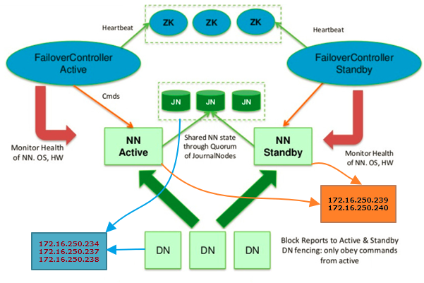
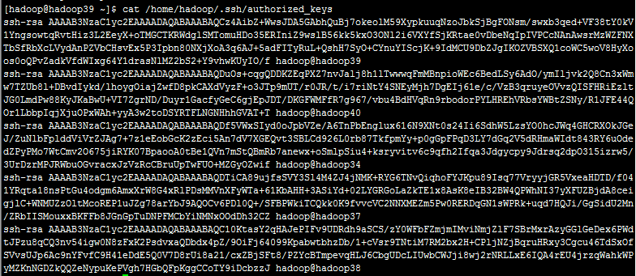
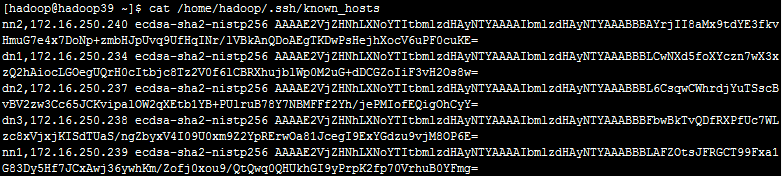

本篇文章将详细介绍如何在CentOS7服务器上安装并配置Hadoop3.2.1高可用集群。

Hadoop-HA集群的节点规划如下：
<table><tbody><tr><td> 
IP Address
 </td><td> 
Host Name
 </td><td> 
Node Type
 </td><td> 
User Name
 </td></tr><tr><td> 
172.16.250.234
 </td><td> 
DN1/JN1
 </td><td> 
DataNode/JournalNode
 </td><td> 
hadoop
 </td></tr><tr><td> 
172.16.250.237
 </td><td> 
DN2/JN2/RM1
 </td><td> 
DataNode/JournalNode/ResourceManager
 </td><td> 
hadoop
 </td></tr><tr><td> 
172.16.250.238
 </td><td> 
DN3/JN3/RM2
 </td><td> 
DataNode/JournalNode/ResourceManager
 </td><td> 
hadoop
 </td></tr><tr><td> 
172.16.250.239
 </td><td> 
NN1
 </td><td> 
Active NameNode
 </td><td> 
hadoop
 </td></tr><tr><td> 
172.16.250.240
 </td><td> 
NN2
 </td><td> 
Standby NameNode
 </td><td> 
hadoop
 </td></tr></tbody></table>

# 安装准备
## 修改主机名（root权限）
由于安装集群用到的服务器数量比较多，在这里先修改一下每一台机器的主机名方便区分。

以`172.16.250.234`服务器为例，将其主机名改为`hadoop34`。

	[root@localhost ~]# hostname             # 查看当前的 hostnmae
	localhost
	[root@localhost ~]# hostnamectl set-hostname hadoop34   # 永久修改hostname(立即生效）
	[root@localhost ~]# hostname                           # 检查修改
	hadoop34
## 修改HOSTS配置（root权限）
按照集群的规划在`/etc/hosts`文件中添加相应的IP地址与主机名映射。

	vi /etc/hosts
在文件中添加集群所有主机的**IP**和**HostName**的对应关系，IP与主机名之间使用一个`TAB`键分隔，多个主机名之间同样使用`TAB`键进行分隔。

	172.16.250.233 hadoop33
	172.16.250.234 hadoop34 DN1     JN1
	172.16.250.237 hadoop37 DN2     JN2     RM1
	172.16.250.238 hadoop38 DN3     JN3     RM2
	172.16.250.239 hadoop39 NN1
	172.16.250.240 hadoop40 NN2

## 禁用SELinux（root权限）
为了避免由于SELinux安全问题导致安装失败，暂时先将其关闭，以后再根据需要进行开启。

在CentOS中禁用SELinux使用如下命令：

	[root@localhost ~]# getenforce                                         # 查看当前的 SELinux 状态
	Enforcing
	# setenforce 1 可以设置 SELinux 为 enforcing 模式
	[root@localhost ~]# setenforce 0                                       # 将 SELinux 的状态临时设置为 Permissive 模式（立即生效）
	[root@localhost ~]# getenforce                                         # 检查修改
	Permissive
	[root@localhost ~]# vim /etc/selinux/config                            
	# 编辑 config 文件将 SELINUX=enforcing 修改为 SELINUX=disabled（重启生效）
	[root@localhost ~]# cat /etc/selinux/config                            # 检查修改
	 
	# This file controls the state of SELinux on the system.
	# SELINUX= can take one of these three values:
	#     enforcing - SELinux security policy is enforced.
	#     permissive - SELinux prints warnings instead of enforcing.
	#     disabled - No SELinux policy is loaded.
	SELINUX=disabled
	# SELINUXTYPE= can take one of these two values:
	#     targeted - Targeted processes are protected,
	#     mls - Multi Level Security protection.
	SELINUXTYPE=targeted 
	 
	[root@localhost ~]# sestatus                                  # 查看 SELinux 当前的详细状态
	SELinux status:                 enabled
	SELinuxfs mount:                /selinux
	Current mode:                   permissive
	Mode from config file:          disabled
	Policy version:                 24
	Policy from config file:        targeted

注意:使用`getenforce`命令获取当前`SELinux`的运行状态为`permissive`或者 `disabled时均表示关闭。

## 关闭防火墙（root权限）
同样地，为了避免由于防火墙策略导致安装失败，也暂时将其关闭，CentOS下关闭防火墙使用如下命令：

	# Centos7 中使用 systemctl 命令来管理服务，命令格式如下
	# systemctl [start 开启]|[stop 停止]|[restart 重启]|[status 状态][enable 开机启动]| [disable 禁止开机启动] 服务名称
	[root@localhost ~]# systemctl start firewalld              # 开启防火墙
	[root@localhost ~]# systemctl status firewalld             # 查看防火墙状态
	● firewalld.service - firewalld - dynamic firewall daemon
	   Loaded: loaded (/usr/lib/systemd/system/firewalld.service; disabled; vendor preset: enabled)
	   Active: active (running) since Wed 2018-08-08 09:18:09 CST; 24s ago           
	         # active (running) 表示防火墙开启
	     Docs: man:firewalld(1)
	 Main PID: 21501 (firewalld)
	   CGroup: /system.slice/firewalld.service
	           └─21501 /usr/bin/python -Es /usr/sbin/firewalld --nofork --nopid
	 
	Aug 08 09:18:07 localhost.localdomain systemd[1]: Starting firewalld - dynamic firewall daemon...
	Aug 08 09:18:09 localhost.localdomain systemd[1]: Started firewalld - dynamic firewall daemon.
	[root@localhost ~]# systemctl disable firewalld            # 永久关闭防火墙（重启生效）
	[root@localhost ~]# systemctl stop firewalld               # 临时关闭防火墙（立即生效）
	[root@localhost ~]# systemctl status firewalld             # 检查修改
	● firewalld.service - firewalld - dynamic firewall daemon
	   Loaded: loaded (/usr/lib/systemd/system/firewalld.service; disabled; vendor preset: enabled)
	   Active: inactive (dead)
	         # inactive (dead) 表示防火墙关闭
	     Docs: man:firewalld(1)
	 
	Aug 08 09:18:07 localhost.localdomain systemd[1]: Starting firewalld - dynamic firewall daemon...
	Aug 08 09:18:09 localhost.localdomain systemd[1]: Started firewalld - dynamic firewall daemon.
	Aug 08 09:19:24 localhost.localdomain systemd[1]: Stopping firewalld - dynamic firewall daemon...
	Aug 08 09:19:24 localhost.localdomain systemd[1]: Stopped firewalld - dynamic firewall daemon.

## 下载Hadoop安装包
下载地址：<https://www.apache.org/dyn/closer.cgi/hadoop/common>

本例中，我下载的是当前最新的稳定版本`hadoop-3.2.1.tar.gz`。

## 安装JDK
无论是HDFS，还是接下来要安装的Zookeeper集群，它们的运行都依赖于JDK环境，所以，需要先安装JDK。

CentOS下JDK安装与配置：<https://blog.csdn.net/pengjunlee/article/details/53932094>

提示：JDK安装包解压过程中，若出现Operation not permitted错误提示，表示hadoop用户对目标目录没有操作权限，可以使用如下命令修改目录的所属用户及所属组。

	chown -R hadoop:hadoop /usr/local/

## 安装Zookeeper
由于两个NameNode需要使用Zookeeper来实现故障时主备自动切换，所以在这里需要先提前安装并启动Zookeeper。

Zookeeper介绍及安装过程：<https://blog.csdn.net/pengjunlee/article/details/81637024>

## SSH免密码登录
在Hadoop集群中的各个节点之间需要使用SSH频繁地进行通信，为了避免每次的通信都要求输入密码，需要对各个节点进行 SSH免密码登录配置。

### 配置sshd（root权限）
编辑`/etc/ssh/sshd_config`文件，使用命令：`vi /etc/ssh/sshd_config`，去掉以下3行的`#`注释：

	RSAAuthentication yes
	PubkeyAuthentication yes
	AuthorizedKeysFile .ssh/authorized_keys

修改并保存文件，然后重启sshd服务，使用命令：`systemctl restart sshd.service`

### 生成秘钥
从root用户切换到hadoop，可使用命令：`su hadoop`。然后， 执行命令`ssh-keygen -t rsa`来生成秘钥。无需指定口令密码，直接回车，命令执行完毕后会在hadoop用户的家目录中（`/home/hadoop/.ssh`）生成两个文件：

- id_rsa: 私钥
- id_rsa.pub:公钥

### 将公钥导入到认证文件
在NN1节点（172.16.250.239）上执行如下命令，将自己的公钥导入到认证文件：

	cat /home/hadoop/.ssh/id_rsa.pub >> /home/hadoop/.ssh/authorized_keys

除NN1以外的其他节点使用如下命令将他们的公钥都导入到NN1的认证文件，以将NN2的公钥都导入到NN1认证文件为例：

	ssh hadoop@NN2 cat /home/hadoop/.ssh/id_rsa.pub >> /home/hadoop/.ssh/authorized_keys

其他3个DataNode节点也挨个导入一下，以DN1为例：

	ssh hadoop@DN1 cat /home/hadoop/.ssh/id_rsa.pub >> /home/hadoop/.ssh/authorized_keys

导入完成之后，NN1节点上的`authorized_keys`文件内容如下：

此时，NN1节点上的known_hosts文件内容如下：

提示：如果known_hosts中缺少哪一台主机的记录就自行ssh登录一下那台机器。

### 将认证文件复制到其他主机
接下来，我们还需要将NN1节点中的`authorized_keys`、`known_hosts`两个文件复制到其他节点。以复制文件到NN2节点为例，在NN1节点上执行命令如下：

	scp /home/hadoop/.ssh/authorized_keys hadoop@NN2:/home/hadoop/.ssh/authorized_keys
	scp /home/hadoop/.ssh/known_hosts hadoop@NN2:/home/hadoop/.ssh/known_hosts

### 设置认证文件访问权限
修改各个节点中`authorized_keys`、`known_hosts`两个文件的读写权限。

	chmod 700 /home/hadoop/.ssh
	chmod 600 /home/hadoop/.ssh/authorized_keys

建议到了这一步挨个测试一下，看看各个节点间是否能够ssh免密码登录成功。

# 搭建Hadoop集群
## 安装Hadoop
使用如下操作命令将下载好的`hadoop-3.2.1.tar.gz`解压至安装目录`/usr/local`：

	tar zxvf hadoop-3.2.1.tar.gz -C /usr/local/
编辑`/home/hadoop/.bash_profile`配置文件，增加Hadoop相关环境变量：

	export HADOOP_HOME=/usr/local/hadoop-3.2.1
	PATH=$PATH:$HOME/.local/bin:$HOME/bin:$HADOOP_HOME/bin:$HADOOP_HOME/sbin

修改完成之后，别忘了执行`source /home/hadoop/.bash_profile`命令来使配置生效，然后使用`hadoop version `命令来查看Hadoop的版本信息，确认Hadoop安装成功。

## 配置集群
重复执行上述步骤，将Hadoop安装到集群的所有机器上，接下来在其中的任意一台上进行配置修改。

### core-site.xml
	<configuration>
	        <!-- The name of the default file system -->
	        <property>
	                <name>fs.defaultFS</name>
	                <value>hdfs://hadoop-cluster</value>
	        </property>
	        <property>
	                <name>ha.zookeeper.quorum.hadoop-cluster</name>
	                <value>hadoop34:2181,hadoop39:2181,hadoop40:2181</value>
	        </property>
	        <property>
	                <name>hadoop.tmp.dir</name>
	                <value>/home/hadoop/data/tmp</value>
	        </property>
	</configuration>
### hdfs-site.xml
	<configuration>
	        <property>
	                <name>dfs.nameservices</name>
	                <value>hadoop-cluster</value>
	        </property>
	        <property>
	                <name>dfs.ha.namenodes.hadoop-cluster</name>
	                <value>nn1,nn2</value>
	        </property>
	        <property>
	                <name>dfs.namenode.rpc-address.hadoop-cluster.nn1</name>
	                <value>NN1:8020</value>
	        </property>
	        <property>
	                <name>dfs.namenode.rpc-address.hadoop-cluster.nn2</name>
	                <value>NN2:8020</value>
	        </property>
	        <property>
	                <name>dfs.namenode.http-address.hadoop-cluster.nn1</name>
	                <value>NN1:50070</value>
	        </property>
	        <property>
	                <name>dfs.namenode.http-address.hadoop-cluster.nn2</name>
	                <value>NN2:50070</value>
	        </property>
	        <property>
	                <name>dfs.namenode.shared.edits.dir</name>
	                <value>qjournal://JN1:8485;JN2:8485;JN3:8485/hadoop-cluster</value>
	        </property>
	        <property>
	                <name>dfs.namenode.name.dir</name>
	                <value>file:///usr/local/hadoop-3.2.1/data/namespace,file:///home/hadoop//data/namespace</value>
	                <description>Path on the local filesystem where the NameNode stores</description>
	        </property>
	        <property>
	                <name>dfs.datanode.data.dir</name>
	                <value>file:///usr/local/hadoop-3.2.1/data/dataspace,file:///home/hadoop/data/dataspace</value>
	                <description>Path on the local filesystem where the DataNode stores Data</description>
	        </property>
	        <property>
	                <name>dfs.journalnode.edits.dir</name>
	                <value>/home/hadoop/journalspace</value>
	        </property>
	        <property>
	                <name>dfs.ha.automatic-failover.enabled.hadoop-cluster</name>
	                <value>true</value>
	        </property>
	        <property>
	                <name>dfs.client.failover.proxy.provider.hadoop-cluster</name>
	                <value>org.apache.hadoop.hdfs.server.namenode.ha.ConfiguredFailoverProxyProvider</value>
	        </property>
	        <property>
	                <name>dfs.ha.fencing.methods</name>
	                <value>sshfence</value>
	        </property>
	        <property>
	                <name>dfs.ha.fencing.ssh.private-key-files</name>
	                <value>/home/hadoop/.ssh/id_rsa</value>
	        </property>
	        <property>
	                <name>dfs.ha.fencing.ssh.connect-timeout</name>
	                <value>30000</value>
	        </property>
	</configuration>
### mapred-site.xml
	<configuration>
	        <property>
	                <name>mapreduce.framework.name</name>
	                <value>yarn</value>
	                <final>true</final>
	                <description>The runtime framework for executing MapReduce jobs</description>
	        </property>
	        <property>
	                <name>mapreduce.jobhistory.address</name>
	                <value>NN2:10020</value>
	                <description>MapReduce JobHistory Server IPC host:port</description>
	        </property>
	        <property>
	                <name>mapreduce.jobhistory.webapp.address</name>
	                <value>NN2:19888</value>
	                <description>MapReduce JobHistory Server Web UI host:port</description>
	        </property>
	        <property>
	                <name>yarn.app.mapreduce.am.env</name>
	                <value>HADOOP_MAPRED_HOME=${HADOOP_HOME}</value>
	        </property>
	        <property>
	                <name>mapreduce.map.env</name>
	                <value>HADOOP_MAPRED_HOME=${HADOOP_HOME}</value>
	        </property>
	        <property>
	                <name>mapreduce.reduce.env</name>
	                <value>HADOOP_MAPRED_HOME=${HADOOP_HOME}</value>
	        </property>
	</configuration>
### yarn-site.xml
	<configuration>
	        <property>
	                <name>yarn.resourcemanager.ha.enabled</name>
	                <value>true</value>
	        </property>
	        <property>
	                <name>yarn.resourcemanager.cluster-id</name>
	                <value>yarn-cluster</value>
	        </property>
	        <property>
	                <name>yarn.resourcemanager.ha.rm-ids</name>
	                <value>rm1,rm2</value>
	        </property>
	        <property>
	                <name>yarn.resourcemanager.hostname.rm1</name>
	                <value>RM1</value>
	        </property>
	        <property>
	                <name>yarn.resourcemanager.hostname.rm2</name>
	                <value>RM2</value>
	        </property>
	        <property>
	                <name>yarn.resourcemanager.webapp.address.rm1</name>
	                <value>RM1:8088</value>
	        </property>
	        <property>
	                <name>yarn.resourcemanager.webapp.address.rm2</name>
	                <value>RM2:8088</value>
	        </property>
	        <property>
	                <name>yarn.nodemanager.aux-services</name>
	                <value>mapreduce_shuffle</value>
	                <description>A comma separated list of services</description>
	        </property>
	        <property>
	                <name>yarn.resourcemanager.recovery.enabled</name>
	                <value>true</value>
	                <description>Enable RM to recover state after starting. If true, then yarn.resourcemanager.store.class must be specified</description>
	        </property>
	        <property>
	                <name>yarn.resourcemanager.store.class</name>
	                <value>org.apache.hadoop.yarn.server.resourcemanager.recovery.ZKRMStateStore</value>
	                <description>The class to use as the persistent store.</description>
	        </property>
	        <property>
	                <name>yarn.resourcemanager.zk-address</name>
	                <value>hadoop33:2181,hadoop34:2181,hadoop37:2181</value>
	                <description>Comma separated list of Host:Port pairs.</description>
	        </property>
	</configuration>
### workers
	DN1
	DN2
	DN3
### hadoop-env.sh
	export JAVA_HOME=/usr/local/jdk1.8.0_211
配置文件全部修改完成之后，将修改后的配置分发到集群的其他节点上。

	scp -r /usr/local/hadoop-3.2.1/etc/hadoop/* nn2:/usr/local/hadoop-3.2.1/etc/hadoop/

# 启动Hadoop集群
## 启动JournalNode
首先，需要逐个启动三个JournalNode节点，使用jps命令查看是否启动成功。

	hdfs --daemon start journalnode

## 格式化Active NameNode
第一次启动HDFS需要先进行格式化NameNode，在`NN1`上执行如下命令：

	hdfs namenode -format

## 启动Active NameNode 
格式化完成之后，在NN1上执行如下命令：

	hdfs --daemon start namenode

## 同步数据到Standby NameNode
在`NN2`上执行如下命令，将nn1的元数据信息同步到NN2：

	hdfs namenode -bootstrapStandby

## 启动其余节点
	start-dfs.sh

## 启动ZKFC 
在NN1上执行如下操作，先在ZooKeeper上创建一个znode用来存储自动故障转移相关数据，再启动ZKFC守护进程。 

	hdfs zkfc -formatZK
	hdfs --daemon start zkfc

## 启动YARN
在NN1上执行如下命令启动Yarn 。

	start-yarn.sh

## 快捷启动命令
	# 启动hdfs集群
	start-dfs.sh
	# 停止hdfs集群
	stop-dfs.sh
	# 启动yarn
	start-yarn.sh
	# 停止yarn
	stop-yarn.sh