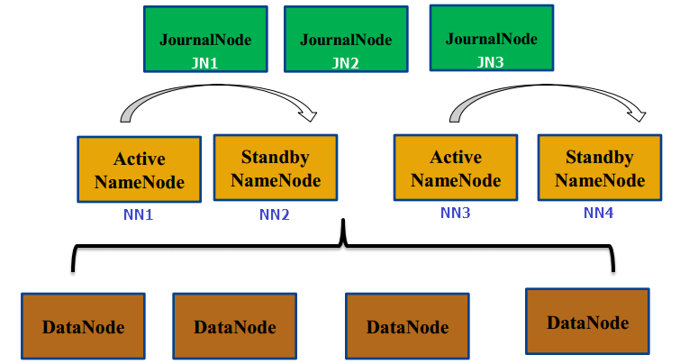

在《CentOS7下Hadoop3.2.1集群的安装与部署（上）》中我们我们完成了对Hadoop集群的安装与启动。接下来，重点对HDFS故障自动转移、Yarn HA配置、多Federation配置进行介绍。

# 启用HDFS故障自动转移
Hadoop集群启用故障自动转移，需要按照以下流程操作来对HDFS进行初始化：

	==>启动 JournalNodes
	==>初始化 Acitve NameNode
	==>启动 Acitve NameNode
	==>初始化Standby NameNode
	==>启动Hadoop集群
	==>创建ZK节点
	==>启动ZKFC

各个步骤详细内容如下：

1. 在所有的**JournalNode**上执行`hdfs --daemon start journalnode`来启动JournalNode 。
2. 在NN1上执行`hdfs namenode -format`完成 Acitve NameNode 的初始化。
3. 在NN1上执行`hdfs --daemon start namenode`，启动Acitve NameNode 。
4. 在NN2上执行`hdfs namenode -bootstrapStandby`，来同步NN1的元数据 。
5. 在NN1上执行`start-dfs.sh`，启动整个Hadoop 集群。
6. 在NN1上执行`hdfs zkfc -formatZK`，在ZooKeeper上创建一个znode用来存储自动故障转移相关数据。
7. 在NN1和NN2上执行`hdfs --daemon start zkfc`，启动ZKFC守护进程。
RM高可用

在这里，我选择使用Zookeeper作为RM状态的存储介质，在`yarn-site.xml`中进行配置：

	<configuration>
	        <property>
	                <name>yarn.resourcemanager.ha.enabled</name>
	                <value>true</value>
	        </property>
	        <property>
	                <name>yarn.resourcemanager.cluster-id</name>
	                <value>yarn-cluster</value>
	        </property>
	        <property>
	                <name>yarn.resourcemanager.ha.rm-ids</name>
	                <value>rm1,rm2</value>
	        </property>
	        <property>
	                <name>yarn.resourcemanager.hostname.rm1</name>
	                <value>RM1</value>
	        </property>
	        <property>
	                <name>yarn.resourcemanager.hostname.rm2</name>
	                <value>RM2</value>
	        </property>
	        <property>
	                <name>yarn.resourcemanager.webapp.address.rm1</name>
	                <value>RM1:8088</value>
	        </property>
	        <property>
	                <name>yarn.resourcemanager.webapp.address.rm2</name>
	                <value>RM2:8088</value>
	        </property>
	        <property>
	                <name>yarn.nodemanager.aux-services</name>
	                <value>mapreduce_shuffle</value>
	                <description>A comma separated list of services</description>
	        </property>
	        <property>
	                <name>yarn.resourcemanager.recovery.enabled</name>
	                <value>true</value>
	                <description>Enable RM to recover state after starting. If true, then yarn.resourcemanager.store.class must be specified</description>
	        </property>
	        <property>
	                <name>yarn.resourcemanager.store.class</name>
	                <value>org.apache.hadoop.yarn.server.resourcemanager.recovery.ZKRMStateStore</value>
	                <description>The class to use as the persistent store.</description>
	        </property>
	        <property>
	                <name>yarn.resourcemanager.zk-address</name>
	                <value>hadoop33:2181,hadoop34:2181,hadoop37:2181</value>
	                <description>Comma separated list of Host:Port pairs.</description>
	        </property>
	</configuration>

在完成了上述的配置之后将配置拷贝到Hadoop的所有节点，然后按照如下流程启动集群：

	==>启动Zookeeper集群
	==>执行 start-dfs.sh 启动HDFS集群
	==>分别在ResourceManager节点上执行yarn --daemon start resourcemanager 启动RM

启动成功之后执行如下命令查看RMs的状态：

	[hadoop@hadoop40 hadoop-3.2.1]$ yarn rmadmin -getServiceState rm1
	active
	[hadoop@hadoop40 hadoop-3.2.1]$ yarn rmadmin -getServiceState rm2
	standby

由于当前rm1是Active，如果访问rm2的后台管理界面将会自动重定向到rm1的后台管理界面。

# 多Federation
## hdfs-site.xml  

对上图所示，多个Federation共用同一个HDFS的情况，hdfs-site.xml 配置示例如下。

	<configuration>
		<property>
			<name>dfs.nameservices</name>
			<value>hadoop-cluster1,hadoop-cluster2</value>
			<description>Comma-separated list of nameservices.</description>
		</property>
	 
	<!-- 
	 hadoop cluster1
	-->
		<property>
			<name>dfs.ha.namenodes.hadoop-cluster1</name>
			<value>nn1,nn2</value>
			<description>The prefix for a given nameservice, contains a comma-separated list of namenodes for a given nameservice (eg EXAMPLENAMESERVICE).</description>
		</property>
		<property>
			<name>dfs.namenode.rpc-address.hadoop-cluster1.nn1</name>
			<value>NN1:8020</value>
			<description>RPC address for nomenode1 of hadoop-cluster1</description>
		</property>
		<property>
			<name>dfs.namenode.rpc-address.hadoop-cluster1.nn2</name>
			<value>NN2:8020</value>
			<description>RPC address for nomenode2 of hadoop-cluster1</description>
		</property>
		<property>
			<name>dfs.namenode.http-address.hadoop-cluster1.nn1</name>
			<value>NN1:50070</value>
			<description>The address and the base port where the dfs namenode1 web ui will listen on.</description>
		</property>
		<property>
			<name>dfs.namenode.http-address.hadoop-cluster1.nn2</name>
			<value>NN2:50070</value>
			<description>The address and the base port where the dfs namenode2 web ui will listen on.</description>
		</property>
	 
	<!-- 
	 hadoop cluster2
	-->
		<property>
			<name>dfs.ha.namenodes.hadoop-cluster2</name>
			<value>nn3,nn4</value>
			<description>The prefix for a given nameservice, contains a comma-separated list of namenodes for a given nameservice (eg EXAMPLENAMESERVICE).</description>
		</property>
		<property>
			<name>dfs.namenode.rpc-address.hadoop-cluster2.nn3</name>
			<value>NN3:8020</value>
			<description>RPC address for nomenode3 of hadoop-cluster2</description>
		</property>
		<property>
			<name>dfs.namenode.rpc-address.hadoop-cluster2.nn4</name>
			<value>NN4:8020</value>
			<description>RPC address for nomenode4 of hadoop-cluster2</description>
		</property>
		<property>
			<name>dfs.namenode.http-address.hadoop-cluster2.nn3</name>
			<value>NN3:50070</value>
			<description>The address and the base port where the dfs namenode3 web ui will listen on.</description>
		</property>
		<property>
			<name>dfs.namenode.http-address.hadoop-cluster2.nn4</name>
			<value>NN4:50070</value>
			<description>The address and the base port where the dfs namenode4 web ui will listen on.</description>
		</property>
	 
		<property>
			<name>dfs.namenode.name.dir</name>
			<value>file:///home/hadoop/hdfs/name</value>
			<description>Determines where on the local filesystem the DFS name nodeshould store the name table(fsimage). </description>
		</property>
		<property>
			<name>dfs.namenode.shared.edits.dir</name>
			<value>qjournal://JN1:8485;JN2:8485;JN3:8485/hadoop-cluster</value>
			<description>A directory on shared storage between the multiple namenodes in an HA cluster. </description>
		</property>
		<property>
			<name>dfs.datanode.data.dir</name>
			<value>file:///home/hadoop/hdfs/data</value>
			<description>Determines where on the local filesystem an DFS data node should store its blocks.</description>
		</property>
		<property>
			<name>dfs.ha.automatic-failover.enabled</name>
			<value>false</value>
			<description>Whether automatic failover is enabled. </description>
		</property>
		<property>
			<name>dfs.journalnode.edits.dir</name>
			<value>/home/hadoop/hdfs/journal/</value>
		</property>
	</configuration>
将`hadoop-cluster1`中的个两个NameNode（NN1,NN2）中的`hdfs-site.xml`该配置项修改如下。

	<property>
		<name>dfs.namenode.shared.edits.dir</name>
		<value>qjournal://JN1:8485;JN2:8485;JN3:8485/hadoop-cluster1</value>
		<description>A directory on shared storage between the multiple namenodes in an HA cluster. </description>
	</property>

将`hadoop-cluster2`中的个两个NameNode（NN3,NN4）中的`hdfs-site.xml`该配置项修改如下。

	<property>
		<name>dfs.namenode.shared.edits.dir</name>
		<value>qjournal://JN1:8485;JN2:8485;JN3:8485/hadoop-cluster2</value>
		<description>A directory on shared storage between the multiple namenodes in an HA cluster. </description>
	</property>

## 集群启动步骤
### 启动nn1与nn2

- 在所有的JournalNode上执行`hdfs --daemon start journalnode`来启动JournalNode 。
- 在nn1上执行`hdfs namenode -format -clusterId hadoop-cluster`完成nn1的初始化。
- 在nn1上执行`hdfs --daemon start namenode`，启动nn1。
- 在nn2上执行`hdfs namenode -bootstrapStandby`，来同步nn1的元数据 。
- 在nn2上执行`hdfs --daemon start namenode`，启动nn12。

经过以上四步操作，nn1和nn2均处理Standby状态。执行以下命令将nn1切换为Active：

	hdfs haadmin -ns hadoop-cluster1 -transitionToActive nn1

### 启动nn3与nn4

- 在nn3上执行`hdfs namenode -format -clusterId hadoop-cluster`完成nn3的初始化。
- 在nn3上执行`hdfs --daemon start namenode`，启动nn3。
- 在nn4上执行`hdfs namenode -bootstrapStandby`，来同步nn3的元数据 。
- 在nn4上执行`hdfs --daemon start namenode`，启动nn4。

经过以上四步操作，nn3和nn4均处理Standby状态。执行以下命令将nn3切换为Active：

	hdfs haadmin -ns hadoop-cluster2 -transitionToActive nn3

### 启动其他节点
在NN1上执行`start-dfs.sh`，启动整个Hadoop集群。 