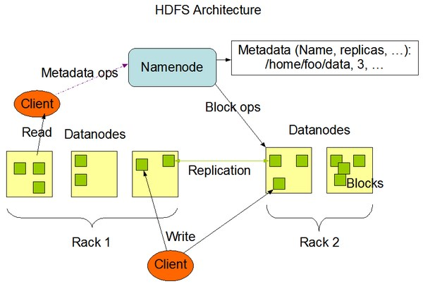
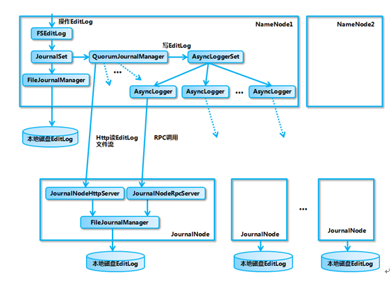
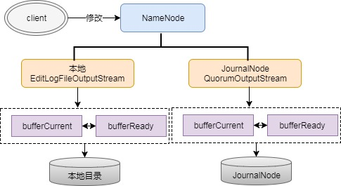
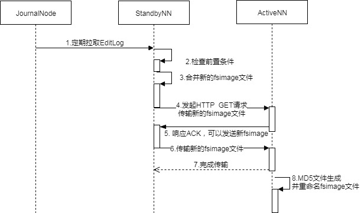
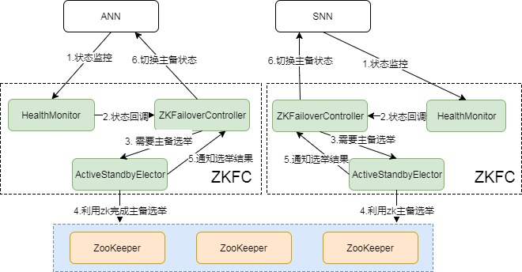

> 原文链接：<https://www.cnblogs.com/qcloud1001/p/7693476.html>

# 导语
最近分享过一次关于Hadoop技术主题的演讲，由于接触时间不长，很多技术细节认识不够，也没讲清楚，作为一个技术人员，本着追根溯源的精神，还是有必要吃透，也为自己的工作沉淀一些经验总结。网上关于Hadoop HA的资料多集中于怎么搭建HA，对于HA为什么要这么做描述甚少，所以本文对于HA是如何搭建的暂不介绍，主要是介绍HA是怎么运作，QJM又是怎么发挥功效的。

一、Hadoop 系统架构
1.1 Hadoop1.x和Hadoop2.x 架构
在介绍HA之前，我们先来看下Hadoop的系统架构，这对于理解HA是至关重要的。Hadoop 1.x之前，其官方架构如图所示:

从图中可看出，1.x版本之前只有一个Namenode,所有元数据由惟一的Namenode负责管理,可想而之当这个NameNode挂掉时整个集群基本也就不可用。

Hadoop 2.x的架构与1.x有什么区别呢。我们来看下2.x的架构：

2.x版本中，HDFS架构解决了单点故障问题，即引入双NameNode架构，同时借助共享存储系统来进行元数据的同步，共享存储系统类型一般有几类，如：Shared NAS+NFS、BookKeeper、BackupNode 和 Quorum Journal Manager(QJM)，上图中用的是QJM作为共享存储组件，通过搭建奇数结点的JournalNode实现主备NameNode元数据操作信息同步。Hadoop的元数据包括哪些信息呢，下面介绍下关于元数据方面的知识。

1.2 Hadoop 2.x元数据
Hadoop的元数据主要作用是维护HDFS文件系统中文件和目录相关信息。元数据的存储形式主要有3类：内存镜像、磁盘镜像(FSImage)、日志(EditLog)。在Namenode启动时，会加载磁盘镜像到内存中以进行元数据的管理，存储在NameNode内存；磁盘镜像是某一时刻HDFS的元数据信息的快照，包含所有相关Datanode节点文件块映射关系和命名空间(Namespace)信息，存储在NameNode本地文件系统；日志文件记录client发起的每一次操作信息，即保存所有对文件系统的修改操作，用于定期和磁盘镜像合并成最新镜像，保证NameNode元数据信息的完整，存储在NameNode本地和共享存储系统(QJM)中。

如下所示为NameNode本地的EditLog和FSImage文件格式，EditLog文件有两种状态： inprocess和finalized, inprocess表示正在写的日志文件，文件名形式:editsinprocess[start-txid]，finalized表示已经写完的日志文件,文件名形式：edits[start-txid][end-txid]； FSImage文件也有两种状态, finalized和checkpoint， finalized表示已经持久化磁盘的文件，文件名形式: fsimage_[end-txid], checkpoint表示合并中的fsimage, 2.x版本checkpoint过程在Standby Namenode(SNN)上进行，SNN会定期将本地FSImage和从QJM上拉回的ANN的EditLog进行合并，合并完后再通过RPC传回ANN。

	data/hbase/runtime/namespace
	├── current
	│ ├── VERSION
	│ ├── edits_0000000003619794209-0000000003619813881
	│ ├── edits_0000000003619813882-0000000003619831665
	│ ├── edits_0000000003619831666-0000000003619852153
	│ ├── edits_0000000003619852154-0000000003619871027
	│ ├── edits_0000000003619871028-0000000003619880765
	│ ├── edits_0000000003619880766-0000000003620060869
	│ ├── edits_inprogress_0000000003620060870
	│ ├── fsimage_0000000003618370058
	│ ├── fsimage_0000000003618370058.md5
	│ ├── fsimage_0000000003620060869
	│ ├── fsimage_0000000003620060869.md5
	│ └── seen_txid
	└── in_use.lock

上面所示的还有一个很重要的文件就是seen_txid,保存的是一个事务ID，这个事务ID是EditLog最新的一个结束事务id，当NameNode重启时，会顺序遍历从edits_0000000000000000001到seen_txid所记录的txid所在的日志文件，进行元数据恢复，如果该文件丢失或记录的事务ID有问题，会造成数据块信息的丢失。

HA其本质上就是要保证主备NN元数据是保持一致的，即保证fsimage和editlog在备NN上也是完整的。元数据的同步很大程度取决于EditLog的同步，而这步骤的关键就是共享文件系统，下面开始介绍一下关于QJM共享存储机制。

二、QJM原理
2.1 QJM背景
在QJM出现之前，为保障集群的HA，设计的是一种基于NAS的共享存储机制，即主备NameNode间通过NAS进行元数据的同步。该方案有什么缺点呢，主要有以下几点：

            1. 定制化硬件设备：必须是支持NAS的设备才能满足需求
            2. 复杂化部署过程：在部署好NameNode后，还必须额外配置NFS挂载、定制隔离脚本，部署易出错
            3. 简陋化NFS客户端：Bug多，部署配置易出错，导致HA不可用

所以对于替代方案而言，也必须解决NAS相关缺陷才能让HA更好服务。即设备无须定制化，普通设备即可配置HA，部署简单，相关配置集成到系统本身，无需自己定制，同时元数据的同步也必须保证完全HA，不会因client问题而同步失败。

2.2 QJM原理
2.2.1 QJM介绍
QJM全称是Quorum Journal Manager, 由JournalNode（JN）组成，一般是奇数点结点组成。每个JournalNode对外有一个简易的RPC接口，以供NameNode读写EditLog到JN本地磁盘。当写EditLog时，NameNode会同时向所有JournalNode并行写文件，只要有N/2+1结点写成功则认为此次写操作成功，遵循Paxos协议。其内部实现框架如下：

从图中可看出，主要是涉及EditLog的不同管理对象和输出流对象，每种对象发挥着各自不同作用：

FSEditLog # 所有EditLog操作的入口
JournalSet # 集成本地磁盘和JournalNode集群上EditLog的相关操作
FileJournalManager # 实现本地磁盘上 EditLog 操作
QuorumJournalManager # 实现JournalNode 集群EditLog操作
AsyncLoggerSet # 实现JournalNode 集群 EditLog 的写操作集合
AsyncLogger # 发起RPC请求到JN，执行具体的日志同步功能
JournalNodeRpcServer # 运行在 JournalNode 节点进程中的 RPC 服务，接收 NameNode 端的AsyncLogger 的 RPC 请求。
JournalNodeHttpServer # 运行在 JournalNode 节点进程中的 Http 服务，用于接收处于 Standby 状态的 NameNode 和其它 JournalNode 的同步 EditLog 文件流的请求。
下面具体分析下QJM的读写过程。

2.2.2 QJM 写过程分析
上面提到EditLog，NameNode会把EditLog同时写到本地和JournalNode。写本地由配置中参数dfs.namenode.name.dir控制，写JN由参数dfs.namenode.shared.edits.dir控制，在写EditLog时会由两个不同的输出流来控制日志的写过程，分别为：EditLogFileOutputStream(本地输出流)和QuorumOutputStream(JN输出流)。写EditLog也不是直接写到磁盘中，为保证高吞吐，NameNode会分别为EditLogFileOutputStream和QuorumOutputStream定义两个同等大小的Buffer，大小大概是512KB，一个写Buffer(buffCurrent)，一个同步Buffer(buffReady)，这样可以一边写一边同步，所以EditLog是一个异步写过程，同时也是一个批量同步的过程，避免每写一笔就同步一次日志。

这个是怎么实现边写边同步的呢，这中间其实是有一个缓冲区交换的过程，即bufferCurrent和buffReady在达到条件时会触发交换，如bufferCurrent在达到阈值同时bufferReady的数据又同步完时，bufferReady数据会清空，同时会将bufferCurrent指针指向bufferReady以满足继续写，另外会将bufferReady指针指向bufferCurrent以提供继续同步EditLog。上面过程用流程图就是表示如下：

这里有一个问题，既然EditLog是异步写的，怎么保证缓存中的数据不丢呢,其实这里虽然是异步,但实际所有日志都需要通过logSync同步成功后才会给client返回成功码，假设某一时刻NameNode不可用了，其内存中的数据其实是未同步成功的，所以client会认为这部分数据未写成功。

第二个问题是，EditLog怎么在多个JN上保持一致的呢。下面展开介绍。

1.隔离双写：

在ANN每次同步EditLog到JN时，先要保证不会有两个NN同时向JN同步日志。这个隔离是怎么做的。这里面涉及一个很重要的概念Epoch Numbers，很多分布式系统都会用到。Epoch有如下几个特性：

当NN成为活动结点时，其会被赋予一个EpochNumber
每个EpochNumber是惟一的，不会有相同的EpochNumber出现
EpochNumber有严格顺序保证，每次NN切换后其EpochNumber都会自增1，后面生成的EpochNumber都会大于前面的EpochNumber
QJM是怎么保证上面特性的呢，主要有以下几点：

第一步，在对EditLog作任何修改前，QuorumJournalManager(NameNode上)必须被赋予一个EpochNumber
第二步， QJM把自己的EpochNumber通过newEpoch(N)的方式发送给所有JN结点
第三步， 当JN收到newEpoch请求后，会把QJM的EpochNumber保存到一个lastPromisedEpoch变量中并持久化到本地磁盘
第四步， ANN同步日志到JN的任何RPC请求（如logEdits(),startLogSegment()等），都必须包含ANN的EpochNumber
第五步，JN在收到RPC请求后，会将之与lastPromisedEpoch对比，如果请求的EpochNumber小于lastPromisedEpoch,将会拒绝同步请求，反之，会接受同步请求并将请求的EpochNumber保存在lastPromisedEpoch
这样就能保证主备NN发生切换时，就算同时向JN同步日志，也能保证日志不会写乱，因为发生切换后，原ANN的EpochNumber肯定是小于新ANN的EpochNumber，所以原ANN向JN的发起的所有同步请求都会拒绝，实现隔离功能，防止了脑裂。

2. 恢复in-process日志

为什么要这步呢，如果在写过程中写失败了，可能各个JN上的EditLog的长度都不一样，需要在开始写之前将不一致的部分恢复。恢复机制如下：

ANN先向所有JN发送getJournalState请求；
JN会向ANN返回一个Epoch（lastPromisedEpoch)；
ANN收到大多数JN的Epoch后，选择最大的一个并加1作为当前新的Epoch，然后向JN发送新的newEpoch请求，把新的Epoch下发给JN；
JN收到新的Epoch后，和lastPromisedEpoch对比，若更大则更新到本地并返回给ANN自己本地一个最新EditLogSegment起始事务Id,若小则返回NN错误；
ANN收到多数JN成功响应后认为Epoch生成成功，开始准备日志恢复；
ANN会选择一个最大的EditLogSegment事务ID作为恢复依据，然后向JN发送prepareRecovery； RPC请求，对应Paxos协议2p阶段的Phase1a，若多数JN响应prepareRecovery成功，则可认为Phase1a阶段成功；
ANN选择进行同步的数据源，向JN发送acceptRecovery RPC请求，并将数据源作为参数传给JN。
JN收到acceptRecovery请求后，会从JournalNodeHttpServer下载EditLogSegment并替换到本地保存的EditLogSegment，对应Paxos协议2p阶段的Phase1b，完成后返回ANN请求成功状态。
ANN收到多数JN的响应成功请求后，向JN发送finalizeLogSegment请求，表示数据恢复完成，这样之后所有JN上的日志就能保持一致。
数据恢复后，ANN上会将本地处于in-process状态的日志更名为finalized状态的日志，形式如edits[start-txid][stop-txid]。

3.日志同步

这个步骤上面有介绍到关于日志从ANN同步到JN的过程,具体如下：

执行logSync过程，将ANN上的日志数据放到缓存队列中
将缓存中数据同步到JN，JN有相应线程来处理logEdits请求
JN收到数据后，先确认EpochNumber是否合法，再验证日志事务ID是否正常，将日志刷到磁盘，返回ANN成功码
ANN收到JN成功请求后返回client写成功标识，若失败则抛出异常
通过上面一些步骤，日志能保证成功同步到JN，同时保证JN日志的一致性，进而备NN上同步日志时也能保证数据是完整和一致的。

2.2.3 QJM读过程分析
这个读过程是面向备NN(SNN)的，SNN定期检查JournalNode上EditLog的变化，然后将EditLog拉回本地。SNN上有一个线程StandbyCheckpointer，会定期将SNN上FSImage和EditLog合并，并将合并完的FSImage文件传回主NN（ANN）上，就是所说的Checkpointing过程。下面我们来看下Checkpointing是怎么进行的。

在2.x版本中，已经将原来的由SecondaryNameNode主导的Checkpointing替换成由SNN主导的Checkpointing。下面是一个CheckPoint的流向图:

总的来说，就是在SNN上先检查前置条件，前置条件包括两个方面：距离上次Checkpointing的时间间隔和EditLog中事务条数限制。前置条件任何一个满足都会触发Checkpointing，然后SNN会将最新的NameSpace数据即SNN内存中当前状态的元数据保存到一个临时的fsimage文件( fsimage.ckpt）然后比对从JN上拉到的最新EditLog的事务ID，将fsimage.ckpt_中没有，EditLog中有的所有元数据修改记录合并一起并重命名成新的fsimage文件，同时生成一个md5文件。将最新的fsimage再通过HTTP请求传回ANN。通过定期合并fsimage有什么好处呢，主要有以下几个方面：

            1. 可以避免EditLog越来越大，合并成新fsimage后可以将老的EditLog删除
            2. 可以避免主NN（ANN）压力过大，合并是在SNN上进行的
            3. 可以保证fsimage保存的是一份最新的元数据，故障恢复时避免数据丢失

三、主备切换机制
要完成HA，除了元数据同步外，还得有一个完备的主备切换机制，Hadoop的主备选举依赖于ZooKeeper。下面是主备切换的状态图：

从图中可以看出，整个切换过程是由ZKFC来控制的，具体又可分为HealthMonitor、ZKFailoverController和ActiveStandbyElector三个组件。

ZKFailoverController # 是HealthMontior和ActiveStandbyElector的母体，执行具体的切换操作
HealthMonitor # 监控NameNode健康状态，若状态异常会触发回调ZKFailoverController进行自动主备切换
ActiveStandbyElector # 通知ZK执行主备选举，若ZK完成变更，会回调ZKFailoverController相应方法进行主备状态切换
在故障切换期间，ZooKeeper主要是发挥什么作用呢，有以下几点：

失败保护 # 集群中每一个NameNode都会在ZooKeeper维护一个持久的session,机器一旦挂掉，session就会过期，故障迁移就会触发
Active NameNode选择 # ZooKeeper有一个选择ActiveNN的机制，一旦现有的ANN宕机，其他NameNode可以向ZooKeeper申请排他成为下一个Active节点
防脑裂 # ZK本身是强一致和高可用的，可以用它来保证同一时刻只有一个活动节点
那在哪些场景会触发自动切换呢，从HDFS-2185中归纳了以下几个场景：

ActiveNN JVM奔溃 # ANN上HealthMonitor状态上报会有连接超时异常，HealthMonitor会触发状态迁移至SERVICE_NOT_RESPONDING, 然后ANN上的ZKFC会退出选举，SNN上的ZKFC会获得Active Lock, 作相应隔离后成为Active结点。
ActiveNN JVM冻结 # 这个是JVM没奔溃，但也无法响应，同奔溃一样，会触发自动切换。
ActiveNN 机器宕机 # 此时ActiveStandbyElector会失去同ZK的心跳，会话超时，SNN上的ZKFC会通知ZK删除ANN的活动锁，作相应隔离后完成主备切换。
ActiveNN 健康状态异常 # 此时HealthMonitor会收到一个HealthCheckFailedException，并触发自动切换。
Active ZKFC奔溃 # 虽然ZKFC是一个独立的进程，但因设计简单也容易出问题，一旦ZKFC进程挂掉，虽然此时NameNode是OK的，但系统也认为需要切换，此时SNN会发一个请求到ANN要求ANN放弃主结点位置，ANN收到请求后，会触发完成自动切换。
ZooKeeper奔溃 # 如果ZK奔溃了，主备NN上的ZKFC都会感知断连，此时主备NN会进入一个NeutralMode模式，同时不改变主备NN的状态，继续发挥作用，只不过此时，如果ANN也故障了，那集群无法发挥Failover, 也就不可用了，所以对于此种场景，ZK一般是不允许挂掉到多台，至少要有N/2+1台保持服务才算是安全的。
五、总结
上面介绍了下关于HadoopHA机制，归纳起来主要是两块：元数据同步和主备选举。元数据同步依赖于QJM共享存储，主备选举依赖于ZKFC和Zookeeper。整个过程还是比较复杂的，如果能理解Paxos协议，那也能更好的理解这个。希望这篇文章能让大家更深入了解关于HA方面的知识。

六、参考文献
[1.] http://zh.hortonworks.com/blog/hdfs-metadata-directories-explained/

[2.] https://blog.cloudera.com/blog/2014/03/a-guide-to-checkpointing-in-hadoop/

[3.] https://www.ibm.com/developerworks/cn/opensource/os-cn-hadoop-name-node/