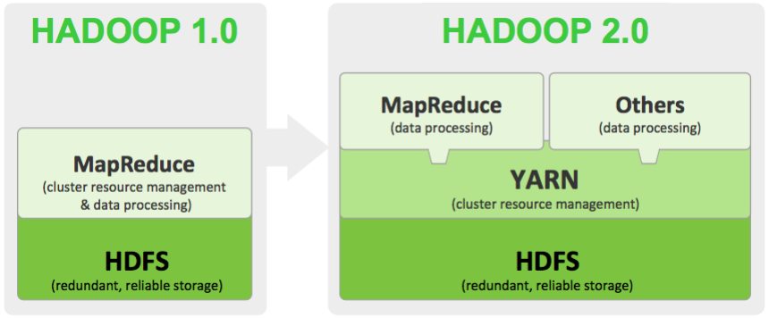
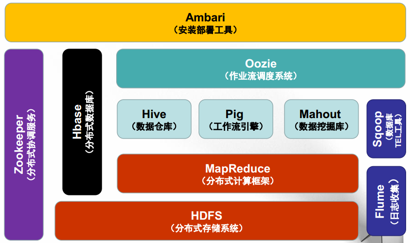
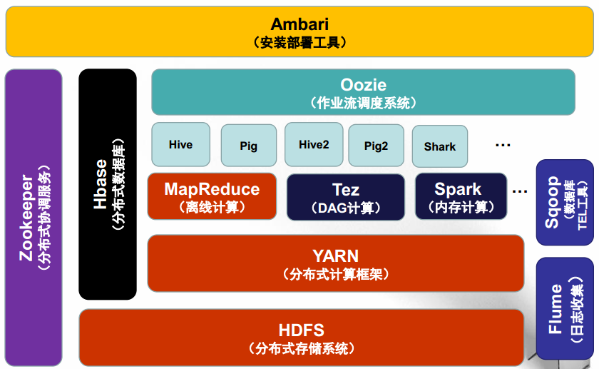
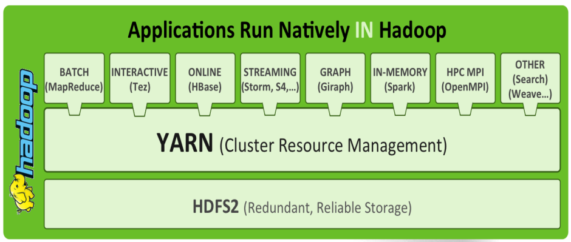
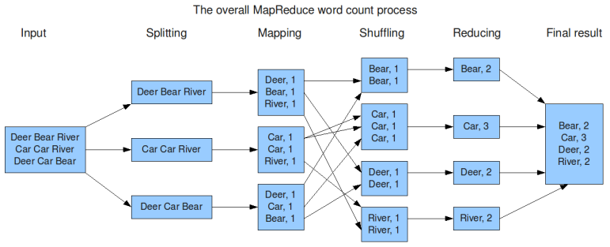
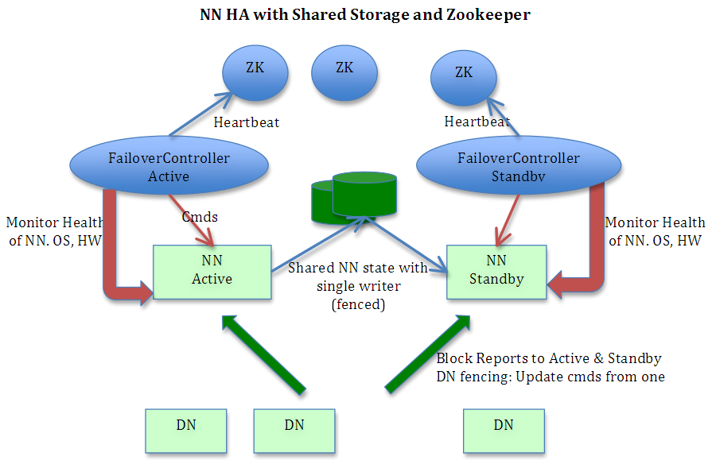
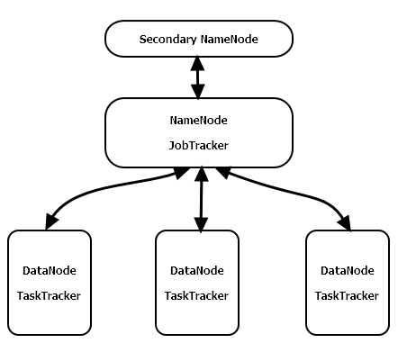

# Hadoop简介
百度百科是这样介绍Hadoop的：

	Hadoop是一个由Apache基金会所开发的分布式系统基础架构。用户可以在不了解分布式底层细节的情况下，开发分布式程序。充分利用集群的威力进行高速运算和存储。Hadoop实现了一个分布式文件系统（Hadoop Distributed File System），简称HDFS。HDFS有高容错性的特点，并且设计用来部署在低廉的（low-cost）硬件上；而且它提供高吞吐量（high throughput）来访问应用程序的数据，适合那些有着超大数据集（large data set）的应用程序。HDFS放宽了（relax）POSIX的要求，可以以流的形式访问（streaming access）文件系统中的数据。Hadoop的框架最核心的设计就是：HDFS和MapReduce。HDFS为海量的数据提供了存储，而MapReduce则为海量的数据提供了计算。

# 选择Hadoop的理由
- Hadoop的源代码完全开源且免费，任何人都可以拿到Hadoop的源代码并在此基础上进行二次开发来满足自己业务的特定需求。
- 社区活跃、参与者众多、学习资料齐全，对于开发中可能碰到的大多数问题都能够在网上找到解决办法，入门难度低。
- 完整的生态系统，Hadoop生态系统涉及分布式存储和计算的方方面面，能够满足绝大多数的业务开发需要，并提供一整套的解决方案。
- 已得到企业界验证，国内外已经有很多大数据公司通过使用Hadoop解决了他们的大数据问题。

# Hadoop的起源
Hadoop由`Apache Software Foundation`公司于2005年秋天作为Lucene的子项目Nutch的一部分正式引入。它的关键技术和核心思想来源于Google Lab开发的`Map/Reduce`和Google File System(`GFS`)的启发。

Google的几个核心思想：

- 大量使用廉价的普通PC服务器替代价格昂贵的超级计算机；
- 不使用存储（阿里的去IOE，去掉IBM的小型机、Oracle数据库、EMC存储设备）；
- 提供冗余的高可靠集群服务;

TIPS：Google使用集装箱来搭建数据中心，每个集装箱中的服务器多达上千台，为了降低能源损耗每一个数据中心还可自带发电厂，想在哪里建立数据中心就将集装箱移动到哪里。

此外Google还有两个对网页检索与排序具有非常重要指导意义的算法：

- 倒排索引法----如何通过关键词检索出网页；
- Page-Rank----如何给网页的价值评分，用于网页检索结果排序，是Google“在垃圾中找黄金”的关键算法；

# Hadoop 1.0 VS 2.0
下图展示了Hadoop 1.0和2.0两个版本在架构设计上面的不同之处。

在Hadoop 1.0时代，Map-Reduce是分布式计算框架唯一的选择。

到了Hadoop 2.0时代，由于YARN资源管理系统的出现，使得在Hadoop集群上可以同时运行多种计算框架，Map-Reduce，Spark，Strom，Tez等。

# Hadoop 的组成

以`Hadoop2.0`为例， 包含分布式存储系统HDFS、分布式计算框架MapReduce两大核心组件，以及资源管理系统YARN（2.0之后版本才有）。

- 分布式存储系统HDFS（Hadoop Distributed File System），适合PB级以上海量数据的存储，可提供高可靠性、高扩展性和高吞吐率的数据存储服务。HDFS的关键技术及思想源自于Google于2003年10月发表的GFS论文，可以把HDFS看作是GFS（Google File System）的克隆版。
- 分布式计算框架MapReduce，是Hadoop1.0时代可以使用的唯一分布式计算框架，具有易于编程、高容错性和高扩展性等优点。
- 资源管理系统YARN（Yet Another Resource Negotiator），Hadoop 2.0版本引入的新系统，负责集群资源的统一管理和调度，使得多种计算框架可以同时运行在一个Hadoop集群中。

下图演示了MapReduce如何对文件中单词的出现频率进行统计。

一个搭建好的Hadoop高可用集群结构如下图所示。

- NameNode（图中 NN Active），是HDFS的守护程序。用来记录文件是如何切分成数据块的，以及这些数据块被存储到哪些DataNode节点上。
- Secondary NameNode （图中 NN Standby），是NameNode的备用节点。定期与NameNode进行通讯，获取HDFS元数据快照，当NameNode故障时可切换为NameNode使用。
- DataNode （图中 DN），是HDFS的数据节点，负责把HDFS数据块写到本地文件系统。
- JobTracker （参见下图），运行于NameNode的后台程序。当用户提交作业（Job）代码后，JobTracker将决定哪些DataNode参与计算，然后切分作业并分配给参与计算的各节点，然后，监控各个节点的Task执行情况，对于执行失败的Task更换新的节点重新计算。
- TaskTracker（参见下图），运行于 DataNode 之上，用来管理各自节点上的Task，并将Task的执行情况上报给JobTracker。每一个节点只有一个TaskTracker，但一个TaskTracker可以启动多个JVM，用于并行执行 MapReduce任务。

 

 