# HBase简介
HBase是一个构建在HDFS上的、分布式的、面向列的开源数据库，它是Apache Hadoop生态系统中的重要一员。

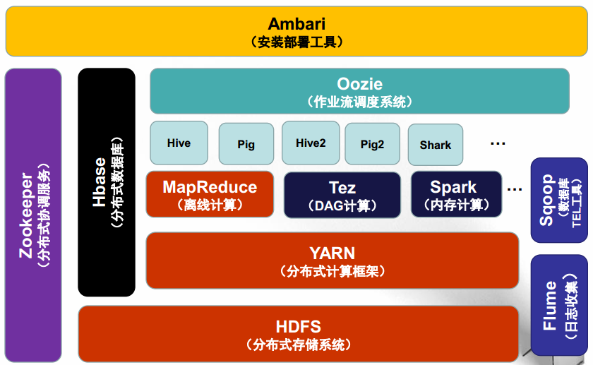

与mysql、oracle等关系型数据库RDBMS基于行模式的存储不同，HBase是基于列模式进行存储的，这使得它非常适合于存储海量非结构化或者半结构化的数据。通常HBase 需要构建在HDFS之上，并将其内部管理的数据文件全部存储在HDFS中。

## HBase与RDBMS比较
 	
<table><tbody><tr><td>&nbsp;</td><td> 
RDBMS
 </td><td> 
HBase
 </td></tr><tr><td> 
存储模式
 </td><td> 
面向行
 </td><td> 
面向列（族）
 </td></tr><tr><td> 
事务支持
 </td><td> 
多行ACID
 </td><td> 
单行
 </td></tr><tr><td> 
查询语言
 </td><td> 
SQL
 </td><td> 
提供简单的查询API，get/put/scan ...
 </td></tr><tr><td> 
索引支持
 </td><td> 
任意列可添加索引
 </td><td> 
Row key索引
 </td></tr><tr><td> 
数据规模
 </td><td> 
TB
 </td><td> 
PB
 </td></tr><tr><td> 
读写效率
 </td><td> 
1000/s
 </td><td> 
百万/s
 </td></tr><tr><td> 
表结构
 </td><td> 
数万行，上千列
 </td><td> 
数亿行，百万列
 </td></tr><tr><td> 
数据结构
 </td><td> 
每行的列完全相同
 </td><td> 
每行的列可以不同
 </td></tr><tr><td> 
数据布局
 </td><td> 
空列也占用存储空间，紧凑
 </td><td> 
空列不占用存储空间，稀疏
 </td></tr><tr><td> 
数据多版本
 </td><td> 
不支持
 </td><td> 
支持，默认以时间戳作为版本号
 </td></tr><tr><td> 
数据类型
 </td><td> 
多种类型
 </td><td> 
仅支持字符串（Byte array ）
 </td></tr></tbody></table>

## HBase与HDFS比较
### 相同点

- HBase与HDFS都具有良好的容错性和扩展性，都可以扩展到成百上千个节点。

### 不同点

- HDFS适合批处理场景，不支持数据随机查找、不适合增量数据处理、不支持数据更新。而这些HDFS不适用的这些场景刚好HBase都能满足。

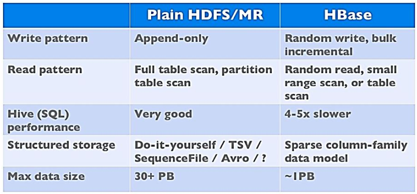

# Hbase数据模型
HBase是基于Google BigTable模型开发的，典型的key/value系统。

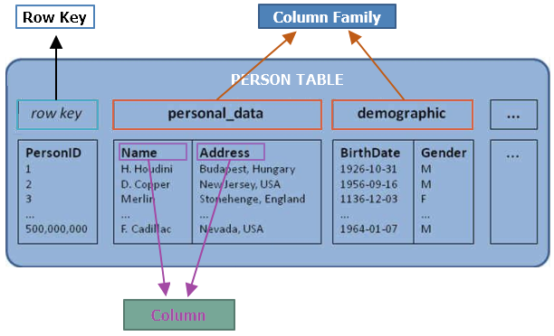

## Row Key
`Row Key`可以看作是表中每条记录的`主键`。

## Column Family
`Column Family`包含一个或者多个相关Column（列）。

## Column
`Column`属于某一个`Column Family`，包含在某一列中：`familyName:columnName`。

## Version Number
每个唯一的`Row Key`可以同时保存多个版本的记录，默认以系统时间戳作为版本号，类型为Long。Version Number也可由用户指定，无需以递增的顺序插入。

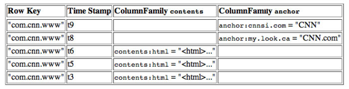

# Hbase物理模型
每个Column Family存储在HDFS上的一个单独文件中，Row Key和 Version Number在每个Column Family中均有一份。

例如，上例中的多版本数据在Hbase中其实是这么存储的。

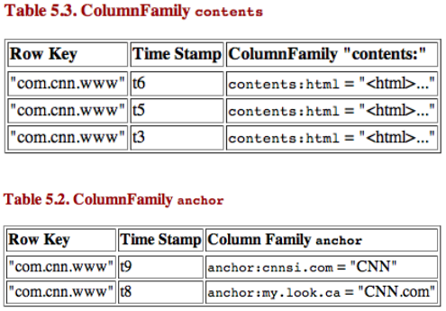

HBase为每个值维护了多级索引，即：`key, column family, column name, timestamp`。

## 物理存储
Hbase会将Table中的所有行都按照row key的字典序排列，并将Table 在行的方向上分割为多个Region。

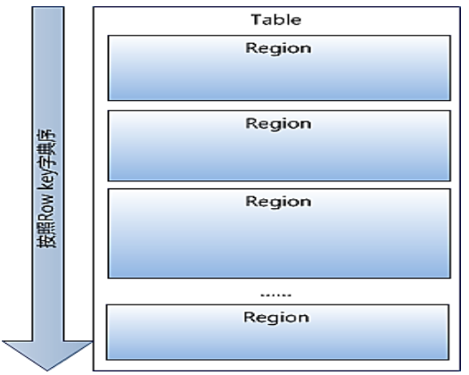

Region会按大小进行分割，每个表开始只有一个Region，随着数据增多， Region不断增大，当增大到一个阀值的时候，Region就会等分成两个新的region，之后会有越来越多的Region。

Region是HBase中分布式存储和负载均衡的最小单元。不同Region分布到不同RegionServer上。

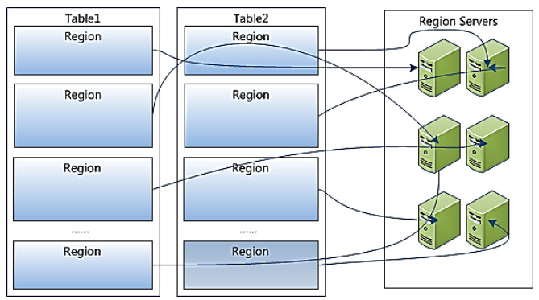

Region虽然是分布式存储的最小单元，但并不是存储的最小单元。

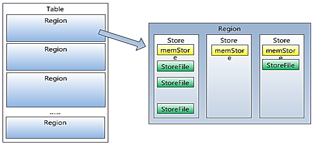

每个Region由一个或者多个Store组成，每个store保存一个Column Family，每个Strore又由一个memStore和0至多个StoreFile组成。memStore 存储在内存中， StoreFile存储在HDFS或者磁盘上。用户写入的数据最先会保存在memStore 中，当memStore 中存储的数据大小达到一定阈值的时候会将其写入到StoreFile。

# HBase架构

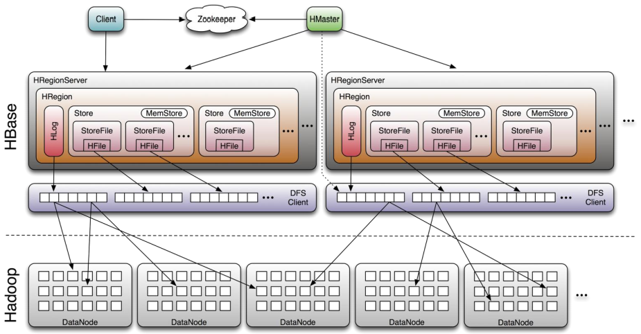

## Client
Client包含访问HBase的接口，并维护cache来加快对HBase的访问。

## Zookeeper
`HBase`使用`ZooKeeper`来实现Master的高可用。Master与RegionServers启动时会向ZooKeeper进行注册。当Master不可用时，ZooKeeper会自动选举一个RegionServer作为新的Master，避免Master单点故障。

在HBase中ZooKeeper 主要的职责如下：

- 保证任何时候，集群中有且只有一个Master
- 保存所有Region的寻址入口
- 实时监控Region server的上线和下线信息，并实时通知给Master
- 存储HBase的schema和table元数据

默认情况下，HBase管理ZooKeeper实例，比如， 启动或者停止ZooKeeper。

## Master

- 为Region server分配region
- 负责Region server的负载均衡
- 发现失效的Region server并重新分配其上的region
- 管理用户对table的增删改查操作

## Region Server

- 维护region，处理对这些region的IO请求
- 负责切分在运行过程中变得过大的region

## Write-Ahead-Log（ WAL）
WAL(Write-Ahead-Log)预写日志是Hbase的RegionServer在处理数据插入和删除的过程中用来记录操作内容的一种日志。

Client 向RegionServer提交数据的时候，RegionServer首先会将操作日志写入到HLog文件中去，只有当WAL日志写入成功的时候，客户端才会被告诉提交数据成功，然后再真正提交操作。这样做的好处是，即使数据写入Region失败，也能够根据WAL日志中的记录进行重试，防止数据丢失。

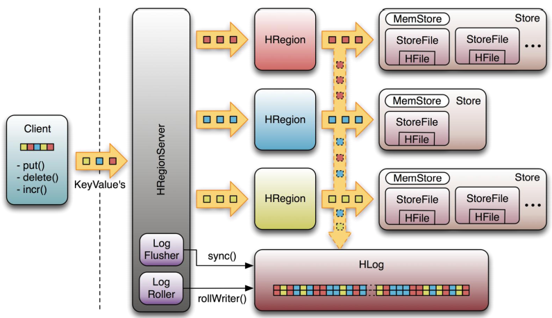

# HBase容错性
## Master容错
当Master不可用时，Zookeeper会重新选择一个新的Master。

- 无Master过程中，数据读取仍照常进行；
- 无master过程中， Region切分、负载均衡等无法进行；

## RegionServer容错
RegionServer定时向Zookeeper汇报心跳，如果一段时间内未出现心跳，Master会将该RegionServer上的Region重新分配到其他RegionServer上，并将失效服务器上WAL“预写”日志由主服务器进行分割并派送给其他RegionServer。

## Region定位
当用户通过 Row Key 检索某一条记录时，Hbase需要先定位到记录所在的Region，然后再进行查找。

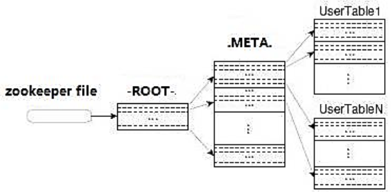

- 从ZooKeeper获取到`-ROOT-`表所在的Location，`-ROOT-`表包含`.META.`表所在的Region列表，这个表只会有一个Region；
- 从`.META.`表中获取到要检索的记录所在的Region，`.META.`表包含所有的用户表的Region列表，以及RegionServer的服务器地址；
- 在Region中检索出相应的数据；

# Hbase支持的操作
Hbase所有操作均是基于Row Key的，支持CRUD（`Create`、`Read`、`Update`和`Delete`）和Scan。Hbase没有内置Join操作，可使用MapReduce解决。

## 单行操作：

- Put
- Get
- Scan

## 多行操作：

- Scan
- MultiPut
 

 