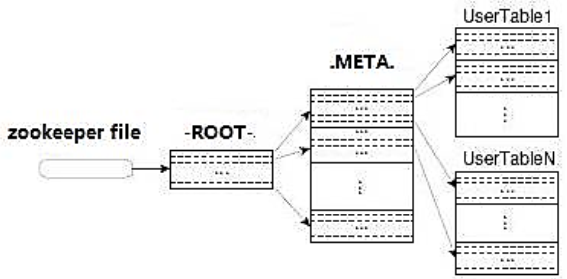

# 环境准备
## 安装Hadoop
访问[Hadoop官网](Hadoop官网 "https://archive.apache.org/dist/hadoop/core/")，下载Hadoop到Windows本地，本例中下载的是`hadoop-3.0.0.tar.gz`。

将Hadoop解压到合适的目录，并设置环境变量：

	HADOOP_HOME=C:\DevTolls\hadoop-3.0.0

并在`Path`环境变量增加两项：

	%HADOOP_HOME%\bin;%HADOOP_HOME%\sbin;

## 安装winutils插件

	

	
	

访问[winutils的Git项目地址](winutils的Git项目地址 "https://github.com/4ttty/winutils")，将下载的压缩包进行解压。

根据你的hadoop版本，将对应的目录下的`hadoop.dll`和`winutils.exe`复制到hadoop的`\bin`目录。 

若缺少`winutils.exe`的情况下启动`MapReduce`作业会出现如下错误：

	2020-04-13 18:47:37,788 WARN [org.apache.hadoop.util.Shell] - Did not find winutils.exe: {}
	
	java.io.FileNotFoundException: Could not locate Hadoop executable: C:\DevTolls\hadoop-3.0.0\bin\winutils.exe -see https://wiki.apache.org/hadoop/WindowsProblems 

# Map-Reduce项目
## 新建Maven项目
打开IDEA，进行如下操作新建一个Maven项目。

`File`==>`New1`==>`Project`...，创建一个Maven工程，先设置好JDK，选择不使用模板（不需要勾选`Create from archetype`），直接`Next`。 设置好`GroupId`、`ArtifactId`和`Project name`完成项目创建。

##引入Maven依赖
修改`pom.xml`文件，添加Hadoop相关的依赖，根据自己的实际情况，选择合适的版本。

	<?xml version="1.0" encoding="UTF-8"?>
	<project xmlns="http://maven.apache.org/POM/4.0.0"
	         xmlns:xsi="http://www.w3.org/2001/XMLSchema-instance"
	         xsi:schemaLocation="http://maven.apache.org/POM/4.0.0 http://maven.apache.org/xsd/maven-4.0.0.xsd">
	    <modelVersion>4.0.0</modelVersion>
	 
	    <groupId>com.pengjunlee</groupId>
	    <artifactId>wordcount-test</artifactId>
	    <version>1.0-SNAPSHOT</version>
	 
	    <properties>
	        <project.build.sourceEncoding>UTF-8</project.build.sourceEncoding>
	        <!--设置hadoop版本-->
	        <hadoop.version>3.0.0</hadoop.version>
	    </properties>
	 
	    <dependencies>
	        <!--hadoop 依赖-->
	        <dependency>
	            <groupId>junit</groupId>
	            <artifactId>junit</artifactId>
	            <version>4.12</version>
	        </dependency>
	        <dependency>
	            <groupId>org.apache.hadoop</groupId>
	            <artifactId>hadoop-client</artifactId>
	            <version>${hadoop.version}</version>
	        </dependency>
	        <dependency>
	            <groupId>org.apache.hadoop</groupId>
	            <artifactId>hadoop-common</artifactId>
	            <version>${hadoop.version}</version>
	        </dependency>
	        <dependency>
	            <groupId>org.apache.hadoop</groupId>
	            <artifactId>hadoop-hdfs</artifactId>
	            <version>${hadoop.version}</version>
	        </dependency>
	    </dependencies>
	 
	 
	</project>

## 编写代码 
### WordcountMapper
	import org.apache.hadoop.io.IntWritable;
	import org.apache.hadoop.io.LongWritable;
	import org.apache.hadoop.io.Text;
	import org.apache.hadoop.mapreduce.Mapper;
	 
	import java.io.IOException;
	 
	/**
	 * KEYIN:默认情况下，是mr框架所读到的一行文本的起始偏移量，Long;
	 * 在hadoop中有自己的更精简的序列化接口，所以不直接用Long，而是用LongWritable
	 * VALUEIN:默认情况下，是mr框架所读到的一行文本内容，String;此处用Text
	 * KEYOUT:是用户自定义逻辑处理完成之后输出数据中的key,在此处是单词，String；此处用Text
	 * VALUEOUT，是用户自定义逻辑处理完成之后输出数据中的value，在此处是单词次数，Integer，此处用IntWritable
	 * @author Administrator
	 */
	public class WordcountMapper extends Mapper<LongWritable, Text, Text, IntWritable>{
	    /**
	     * map阶段的业务逻辑就写在自定义的map()方法中
	     * maptask会对每一行输入数据调用一次我们自定义的map（）方法
	     */
	    @Override
	    protected void map(LongWritable key, Text value, Context context) throws IOException, InterruptedException {
	 
	        // 1 将maptask传给我们的文本内容先转换成String
	        String line = value.toString();
	 
	        // 2 根据空格将这一行切分成单词
	        String[] words = line.split(" ");
	 
	        // 3 将单词输出为<单词，1>
	        for(String word:words){
	            // 将单词作为key，将次数1作为value,以便于后续的数据分发，可以根据单词分发，以便于相同单词会到相同的reducetask中
	            context.write(new Text(word), new IntWritable(1));
	        }
	    }
	}
### WordcountReducer
	import org.apache.hadoop.io.IntWritable;
	import org.apache.hadoop.io.Text;
	import org.apache.hadoop.mapreduce.Reducer;
	 
	import java.io.IOException;
	 
	/**
	 * KEYIN , VALUEIN 对应mapper输出的KEYOUT, VALUEOUT类型
	 * KEYOUT，VALUEOUT 对应自定义reduce逻辑处理结果的输出数据类型 KEYOUT是单词 VALUEOUT是总次数
	 */
	public class WordcountReducer extends Reducer<Text, IntWritable, Text, IntWritable> {
	 
	    /**
	     * key，是一组相同单词kv对的key
	     */
	    @Override
	    protected void reduce(Text key, Iterable<IntWritable> values, Context context) throws IOException, InterruptedException {
	 
	        int count = 0;
	 
	        // 1 汇总各个key的个数
	        for(IntWritable value:values){
	            count +=value.get();
	        }
	 
	        // 2输出该key的总次数
	        context.write(key, new IntWritable(count));
	    }
	}
### WordcountDriver
	package com.pengjunlee.wordcount;
	 
	import org.apache.hadoop.conf.Configuration;
	import org.apache.hadoop.fs.Path;
	import org.apache.hadoop.io.IntWritable;
	import org.apache.hadoop.io.Text;
	import org.apache.hadoop.mapreduce.Job;
	import org.apache.hadoop.mapreduce.lib.input.FileInputFormat;
	import org.apache.hadoop.mapreduce.lib.output.FileOutputFormat;
	 
	/**
	 * 相当于一个yarn集群的客户端，
	 * 需要在此封装我们的mr程序相关运行参数，指定jar包
	 * 最后提交给yarn
	 * @author Administrator
	 */
	public class WordcountDriver {
	    public static void main(String[] args) throws Exception {
	        // 1 获取配置信息，或者job对象实例
	        Configuration configuration = new Configuration();
	        // 8 配置提交到yarn上运行,windows和Linux变量不一致
	//        configuration.set("mapreduce.framework.name", "yarn");
	//        configuration.set("yarn.resourcemanager.hostname", "node22");
	        Job job = Job.getInstance(configuration);
	 
	        // 6 指定本程序的jar包所在的本地路径
	//        job.setJar("/home/admin/wc.jar");
	        job.setJarByClass(WordcountDriver.class);
	 
	        // 2 指定本业务job要使用的mapper/Reducer业务类
	        job.setMapperClass(WordcountMapper.class);
	        job.setReducerClass(WordcountReducer.class);
	 
	        // 3 指定mapper输出数据的kv类型
	        job.setMapOutputKeyClass(Text.class);
	        job.setMapOutputValueClass(IntWritable.class);
	 
	        // 4 指定最终输出的数据的kv类型
	        job.setOutputKeyClass(Text.class);
	        job.setOutputValueClass(IntWritable.class);
	 
	        // 5 指定job的输入原始文件所在目录
	        FileInputFormat.setInputPaths(job, new Path(args[0]));
	        FileOutputFormat.setOutputPath(job, new Path(args[1]));
	 
	        // 7 将job中配置的相关参数，以及job所用的java类所在的jar包， 提交给yarn去运行
	//        job.submit();
	        boolean result = job.waitForCompletion(true);
	        System.exit(result?0:1);
	    }
	}
### log4j.properties
在`/resources`目录下添加`log4j.properties`配置。

	log4j.rootLogger=INFO, stdout  
	log4j.appender.stdout=org.apache.log4j.ConsoleAppender  
	log4j.appender.stdout.layout=org.apache.log4j.PatternLayout  
	log4j.appender.stdout.layout.ConversionPattern=%d %p [%c] - %m%n  
	log4j.appender.logfile=org.apache.log4j.FileAppender  
	log4j.appender.logfile.File=target/spring.log  
	log4j.appender.logfile.layout=org.apache.log4j.PatternLayout  
	log4j.appender.logfile.layout.ConversionPattern=%d %p [%c] - %m%n

## 启动测试
### 模拟数据
在项目根目录下新建一个`/input`文件夹，用来存放测试数据。

`demo.txt`内容如下：

	hello world
	dog fish
	hadoop 
	spark
	hello world
	dog fish
	hadoop 
	spark
	hello world
	dog fish
	hadoop 
	spark
### 配置启动参数
按照如下指引，新建一个启动配置。其中`Program arguments`中需指定输入样本数据目录和统计结果输出目录（必须是一个不存在的目录，否则会报错）。

### 测试结果
启动Application，运行完成之后项目根目录下会多出来一个`/output`目录，里面存放了程序的执行结果。

`part-r-00000`文件内容如下：

	dog	3
	fish	3
	hadoop	3
	hello	3
	spark	3
	world	3
 