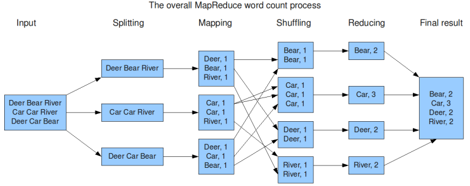
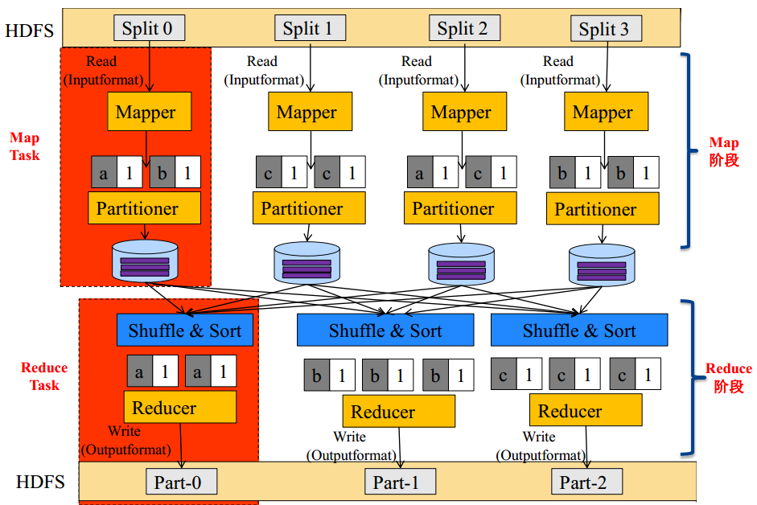
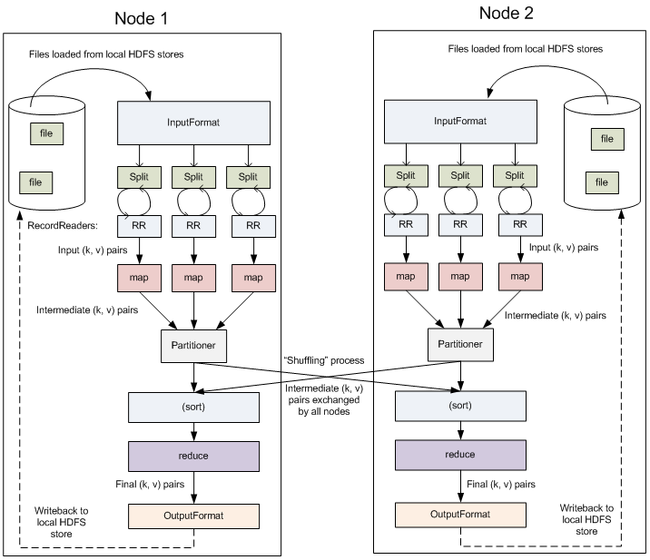
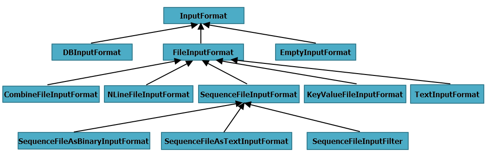
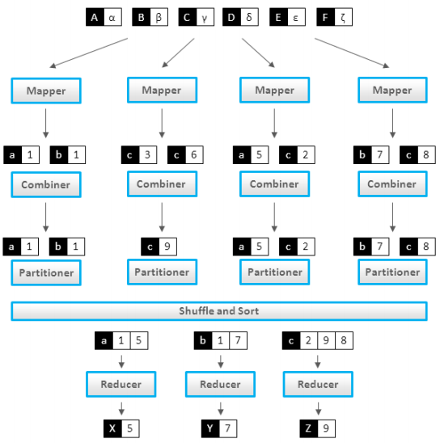
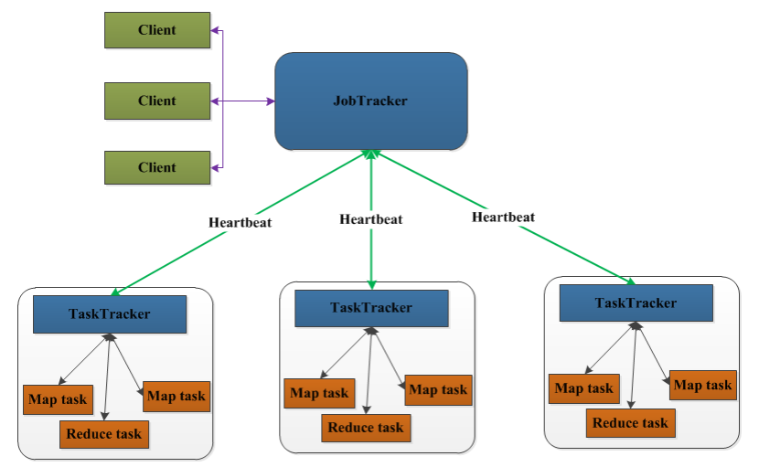
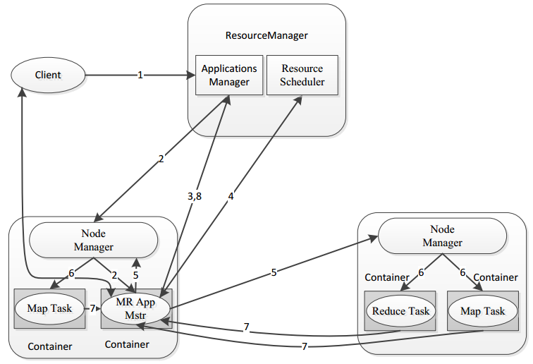
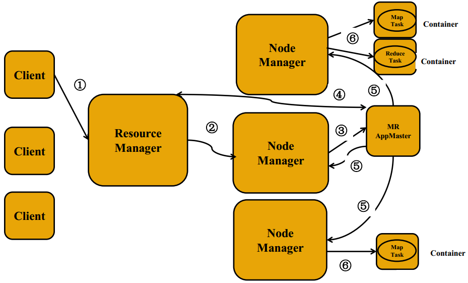
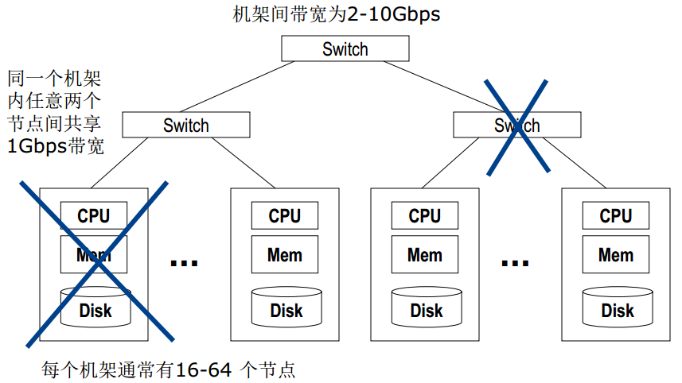
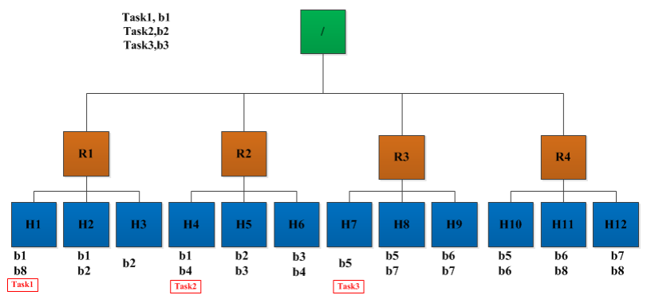

# MapReduce的起源&简介
MapReduce（"Map（映射）"和"Reduce（归约））是一种编程模型，用于大规模数据集（大于1TB）的并行运算。它的核心思想来源于Google在2004年12月发表的一篇MapReduce论文：`Our abstraction is inspired by the map and reduce primitives present in Lisp and many other functional languages`。大致意思是，MapReduce的灵感来源于函数式语言（比如[Lisp](Lisp "https://baike.baidu.com/item/Lisp/22083")）中的内置函数map和reduce。

MapReduce是面向大数据并行处理的计算模型、框架和平台，它隐含了以下三层含义：

- MapReduce是一个基于集群的高性能并行计算平台（Cluster Infrastructure）。它允许用市场上普通的商用服务器构成一个包含数十、数百至数千个节点的分布式和并行计算集群。
- MapReduce是一个并行计算与运行软件框架（Software Framework）。它提供了一个庞大但设计精良的并行计算软件框架，能自动完成计算任务的并行化处理，自动划分计算数据和计算任务，在集群节点上自动分配和执行任务以及收集计算结果，将数据分布存储、数据通信、容错处理等并行计算涉及到的很多系统底层的复杂细节交由系统负责处理，大大减少了软件开发人员的负担。
- MapReduce是一个并行程序设计模型与方法（Programming Model & Methodology）。它借助于函数式程序设计语言Lisp的设计思想，提供了一种简便的并行程序设计方法，用Map和Reduce两个函数编程实现基本的并行计算任务，提供了抽象的操作和并行编程接口，以简单方便地完成大规模数据的编程和计算处理。

##MapReduce的特点
### 优点
- 易于编程 MapReduce向用户提供了简单的编程接口，由框架层自动完成数据分布存储、数据通信、容错处理等复杂的底层处理细节，用户只需要使用接口实现自己的数据处理逻辑即可。
- 良好的扩展性 允许用户通过简单的增加机器来扩展它的计算能力和吞吐能力。
- 高容错性 MapReduce设计的初衷就是使程序能够部署在廉价的PC机器上，这就要求它具有很高的容错性。比如其中一台机器挂了，它可以把上面的计算任务转移到另外一个节点上运行，不至于这个任务运行失败，而且这个过程不需要人工参与，而完全是由 Hadoop内部完成的。
- 适合PB级以上海量数据的离线处理。

### 缺点
MapReduce不擅长做实时计算、流式计算、DAG（有向图）计算。

- 实时计算。MapReduce无法像Mysql一样，在毫秒或者秒级内返回结果。
- 流式计算。流式计算的输入数据是动态的，而MapReduce的输入数据集需提前上传到HDFS，是静态的，不能动态变化。
- DAG（有向图）计算。多个应用程序存在依赖关系，后一个应用程序的输入为前一个的输出。在这种情况下，MapReduce并不是不能做，而是使用后，每个MapReduce作业的输出结果都会写入到磁盘，会造成大量的磁盘IO，导致性能非常的低下。

MapReduce的典型应用场景----Wordcount：统计一大批文件中每个单词出现的次数；

类似的应用场景：

- 简单的数据统计，比如网站pv、 uv统计
- 搜索引擎建索引
- 海量数据查找
- 复杂数据分析算法实现，聚类算法、分类算法、推荐算法、图算法

# MapReduce编程模型
MapReduce将作业的整个运行过程分为两个阶段： Map（映射）阶段和Reduce（归约）阶段。

Map阶段由一定数量的Map Task组成，包含如下几个步骤：

- 输入数据格式解析： InputFormat
- 输入数据处理： Mapper
- 结果本地汇总：Combiner（ local reducer）
- 数据分组： Partitioner

Reduce阶段由一定数量的Reduce Task组成，包含如下几个步骤：

- 数据远程拷贝
- 数据按照key排序
- 数据处理： Reducer
- 数据输出格式： OutputFormat

以Wordcount为例，MapReduce的内部执行过程如下图所示。

外部物理结构如下图所示。

## InputFormat
`InputFormat`负责对数据文件进行分片（InputSplit），并处理好跨行问题。它会将分片数据解析成`key/value`对，默认的实现是`TextInputFormat`。`TextInputFormat`的 Key是行在文件中的偏移量，value是行内容，若行被截断，则读取下一个block的前几个字符。

Hadoop为用户提供了如下几个InputFormat实现。

**Block VS Spit**

<table><tbody><tr><td> 
Block
 </td><td> 
Split
 </td></tr><tr><td> 
HDFS中最小的数据存储单位
 </td><td> 
MapReduce中最小的计算单元
 </td></tr><tr><td> 
默认是128MB
 </td><td> 
默认与Block一一对应，可用用户自行控制
 </td></tr></tbody></table>

## Combiner
Combiner可以看做是`local reducer`，在Mapper计算完成后将相同的key对应的value进行合并（ Wordcount例子），如下图所示。

Combiner通常与Reducer逻辑是一样的，使用Combiner有如下好处：

- 减少Map Task输出数据量（磁盘IO）
- 减少Reduce-Map网络传输数据量(网络IO)

需要注意的是，并不是所有的MapReduce场景都能够使用Combiner，计算结果可以累加的场景一般可以使用，例如Sum，其他的例如求平均值 Average 则不能使用 Combiner。

## Partitioner
Partitioner决定了Map Task输出的每条数据交给哪个Reduce Task处理。默认实现是：`hash(key) mod R`，其中`R`是`Reduce Task`数目。

当然Hadoop也允许用户自定义Partitioner，比如`hash(hostname(URL)) mod R`确保相同域名的网页交给同一个Reduce Task处理。

# MapReduce的架构
## MapReduce 1.0架构
MapReduce 1.0是一个Master-Slave架构。

JobTracker是Master，通常只有一个，职责如下：

- 管理所有作业
- 将作业分解成一系列任务
- 将任务指派给TaskTracker
- 作业/任务监控、错误处理等

TaskTrackers 是 Slave，通常有多个，作用如下：

- 运行`Map Task`和`Reduce Task`
- 与JobTracker交互，执行命令，并汇报任务状态

`Map Task`是Map引擎，完成如下功能：

- 解析每条数据记录，传递给用户编写的Mapper
- 将Mapper输出数据写入本地磁盘（如果是map-only作业，则直接写入HDFS）

`Reduce Task`是Reduce引擎，完成如下功能：

- 从Map Task上远程读取输入数据
- 对数据排序
- 将数据按照分组传递给用户编写的Reducer

## MapReduce 2.0架构
在Hadoop2.0中引入了`YARN`资源管理器（ResourceManager和NodeManager）。

1. 用户通过Client与YARN交互，将MapReduce作业提交给ResourceManager，每一个MapReduce作业对应一个MRAppMaster，其中封装了MapReduce作业所需要的资源要求。
2. `Resource Scheduler`根据MRAppMaster的资源需求从集群中指定一个节点来运行MRAppMaster。并通过`Applications Manager`与该节点上的Node Manager进行通信，发送命令启动MRAppMaster。
3. MRAppMaster启动之后会向`Applications Manager`进行注册。
4. MRAppMaster向`Resource Scheduler`申请资源来执行Map Task和Reduce Task。
5. `Resource Scheduler`为MRAppMaster分配节点资源后，MRAppMaster与节点上的Node Manager进行通信，通知`Node Manager`启动`Map Task`和`Reduce Task`。
6. `Node Manager`执行启动命令启动`Map Task`和`Reduce Task`。
7. `Map Task`和`Reduce Task`在执行过程中通过心跳向MRAppMaster汇报自己的进度和状态。此时用户可以通过client与MRAppMaster交互，查看作业运行状态、管理作业。
8. MRAppMaster向Applications Manager汇报作业执行进度和状态，并在作业执行完成后通知ResourceManager进行资源回收。

整个运行流程如下图所示。

MRAppMaster的功能类似于1.0中的JobTracker，但不负责资源管理；功能包括：**任务划分、资源申请并将之二次分配给Map Task和Reduce Task、任务状态监控和容错。**

MRAppMaster容错性：一旦作业运行失败，由YARN的ResourceManager负责重新启动，最多重启次数可由用户设置，默认是2次。一旦超过最高重启次数，则作业运行失败。

Map Task和Reduce Task周期性向MRAppMaster汇报心跳，一旦Task挂掉，则MRAppMaster将为之重新申请资源，并运行之。最多重新运行次数可由用户设置，默认4次。

# 数据本地性

## 什么是数据本地性（ data locality）
如果任务运行在它将处理的数据所在的节点，则称该任务具有`数据本地性`，本地性可避免跨节点或机架数据传输，提高运行效率。

**数据本地性分类**：

- 同节点(node-local)
- 同机架(rack-local)
- 其他（ off-switch）

如下图所示，执行Task1所需的数据b1刚刚好在H1节点上，符合同节点(node-local)。Task2执行在R2机架的H4节点上，但其所需的数据b2最近的是机架R2下的H5上，所以符合同机架(rack-local)。Task3执行在机架R3下的H7节点，但其所需的数据b3却位于机架R2下的H5和H6上，属于其他（ off-switch）情况。

## 推测执行机制
一个MapReduce 作业由若干个Map任务和Reduce任务构成，作业的完成时间取决于最慢的任务完成时间。有时会因硬件老化、软件Bug等意外，导致某些任务可能运行非常慢。推测执行机制就是专门来处理这些意外情况的。

- 发现拖后腿的任务，比如某个任务运行速度远慢于任务平均速度
- 为拖后腿任务启动一个备份任务，同时运行
- 谁先运行完，则采用谁的结果

不能启用推测执行机制的情况，例如：

- 任务间存在严重的负载倾斜，某些Task的运算量本来就远高于其他的Task；
- 特殊任务，比如向数据库中写数据的任务，会导致内容重复写增加数据库负担；

需根据实际情况，决定是否为MapReduce启用推测执行机制，默认推测执行机制是启用的。

 