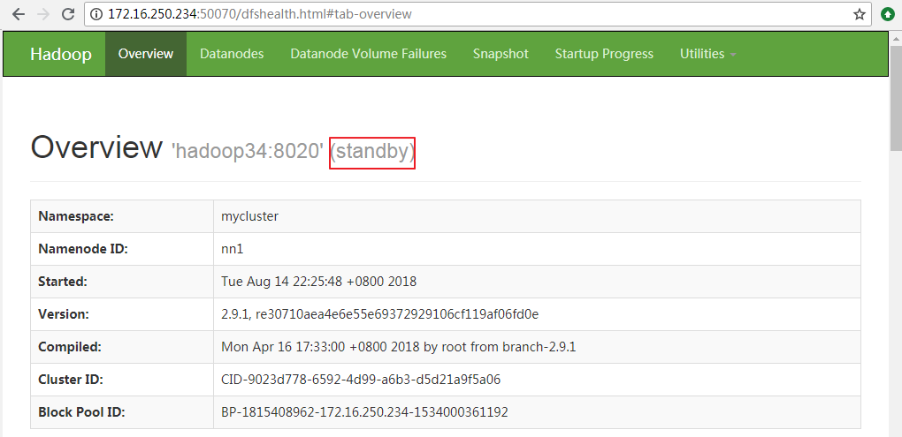
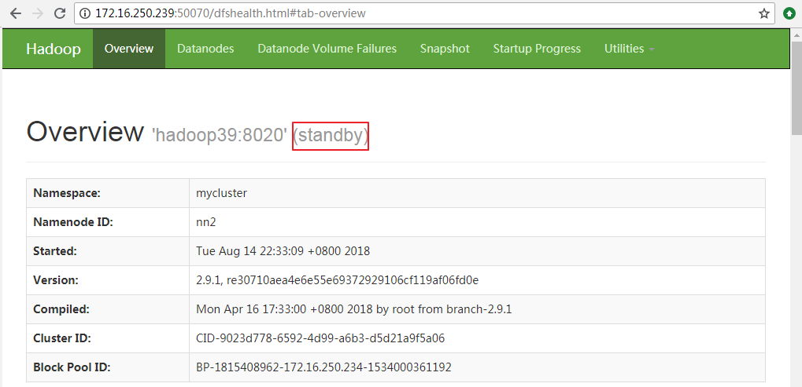
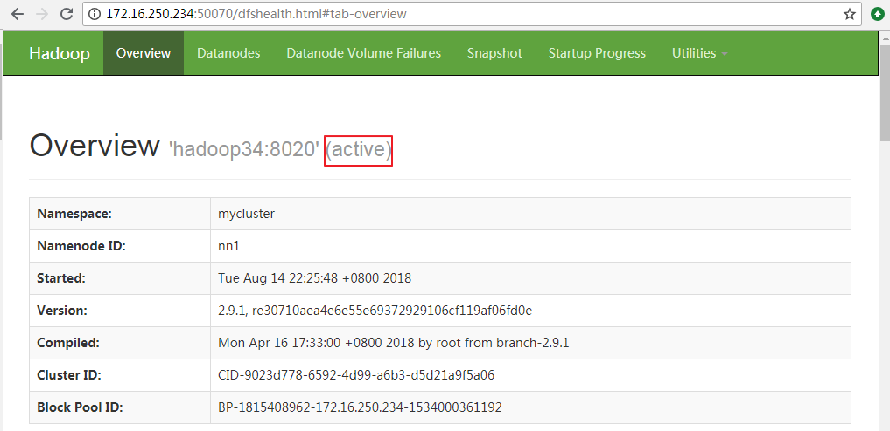
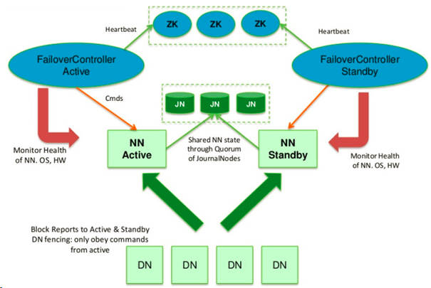

# 前言
在`Hadoop 1.X`版本中，NameNode是整个HDFS集群的单点故障（single point of failure，SPOF）：每一个HDFS集群只能有一个NameNode节点，一旦NameNode所在服务器宕机或者出现故障将导致整个集群都不可用，除非重启或者开启一个新的Namenode集群才能够恢复可用。

NameNode单点故障对HDFS集群的可用性产生影响主要表现在以下两种情况：

- 当NameNode所在服务器发生未知的异常（例如：服务器宕机）时，在NameNode被重新启动之前整个集群都将不可用。
- 当NameNode所在服务器执行某些日常维护任务（例如：软件或硬件升级）后重启服务器时，同样会导致HDFS集群在一段时间内不可用。

# HDFS高可用简介
在`Hadoop 2.X`版本中，HDFS引入了双NameNode架构，HA（High Available）通过将两个NameNode分别配置为`Active`/`Passive`状态来解决上述问题。处于Active状态的NameNode叫作Active Namenode，处于Passive状态的NameNode叫作Standby Namenode。 Standby Namenode作为Active Namenode的热备份，能够在NameNode发生故障或者由于日常服务器维护需要重启的时候以一种优雅的方式自动切换为Active Namenode。

Active Namenode处理客户端所有的操作请求（读写），Standby Namenode只是作为Active Namenode的Slave尽可能地与Active Namenode保持状态同步，使得在Active Namenode故障时能够快速完成切换。为了使Standby Namenode与Active Namenode数据保持同步，两个Namenode都需要与一组Journal Node进行通信。当Active Namenode执行的任务对namespace有所更改时，会确保将修改日志持久到Journal Node节点中的大部分。Standby Namenode持续监控这些Journal Node，当监测发现这些修改日志有变化时，就会将这些修改应用到自己的namespace，进而保持与Active Namenode中namespace元数据保持一致。当进行故障转移时，Standby Namenode在成为Active Namenode之前，会确保自己已经读取了Journal Node中的所有修改日志，从而保持数据状态与故障发生前一致。

为了确保故障转移能够快速完成，Standby Namenode需要维护最新的Block位置信息，即每个Block副本存放在集群中的哪些节点上。为了达到这一点，Datanode同时配置主备两个Namenode，并同时发送Block报告和心跳到两台Namenode。

任何时候只有一个Namenode处于活动状态对HA集群来说至关重要，否则可能出现数据丢失或者数据损坏。当两台Namenode都认为自己的Active Namenode时，会同时尝试写入数据（不会再去检测和同步数据）导致所谓的“裂脑现象”出现。为了达到这个目的并避免出现“裂脑现象”，管理员必须为共享存储配置至少一个（fencing）方法。在宕机期间，如果确定了之前的Active Namenode已经放弃活动状态，fencing进程将负责中断之前的Active Namenode对共享存储的访问和编辑，从而防止它继续对命名空间做出任何进一步的修改，使新的活动节点能够安全地进行故障转移。

更多关于Hadoop HA 机制的详细介绍请移步：<https://blog.csdn.net/pengjunlee/article/details/81583052> 。

接下来我们重点讲解如何基于QJM使用Zookeeper来配置HDFS-HA。

# 搭建Hadoop集群
本文重点讲解如何对HDFS进行HA高可用配置，Hadoop集群的搭建过程请参考：

<https://blog.csdn.net/pengjunlee/article/details/81589972>

搭建好的Hadoop集群的节点信息如下：
<table border="1" cellpadding="0" cellspacing="0"><tbody><tr><td>Host Name</td><td>IP Address</td><td>Node Type</td><td>User Name</td></tr><tr><td>hadoop34</td><td>172.16.250.234</td><td>DataNode / NodeManager / NameNode</td><td>hadoop / root</td></tr><tr><td>hadoop39</td><td>172.16.250.239</td><td>DataNode / NodeManager / SecondaryNameNode</td><td>hadoop / root</td></tr><tr><td>hadoop40</td><td>172.16.250.240</td><td>DataNode / NodeManager /&nbsp;ResourceManager</td><td>hadoop / root</td></tr></tbody></table>

## 添加HA详细配置
在上述Hadoop集群搭建完成之后，若要启用HA还需要对`hdfs-site.xml`和`core-site.xml`两个文件进行一点额外的配置。
在`HDFS-HA`集群中，使用`[nameservice ID]`来唯一识别一个HDFS实例，一个HDFS-HA集群可以含有多个（目前最多只支持两个）NameNode，集群同时又使用了`[name node ID]`来识别每一个NameNode。因此，在HDFS-HA集群中，NameNode的配置参数都以`[nameservice ID].[name node ID]`为后缀的。由于`dfs.nameservices`和`dfs.ha.namenodes.[nameservice ID]`两个配置项的值将决定后面一些配置项的名称，所以建议先配置这两个选项的值。

在本文中，`[nameservice ID]=mycluster`，两个`[name node ID]`分别为`nn1`和`nn2`，名称可以随意取，只需要保持前后一致即可。

### hdfs-site.xml
保持`hdfs-site.xml`原有的配置不变，再增加如下HA相关配置：

        <property>
                <name>dfs.nameservices</name>
                <value>mycluster</value>
                <description>指定nameservice ID的名称</description>
        </property>
        <property>
                <name>dfs.ha.namenodes.mycluster</name>
                <value>nn1,nn2</value>
                <description>指定各个NameNode在nameservice中的唯一标识符</description>
        </property>
        <property>
                <name>dfs.namenode.rpc-address.mycluster.nn1</name>
                <value>hadoop34:8020</value>
                <description>指定nn1 NameNode所监听的全限定RPC地址</description>
        </property>
        <property>
                <name>dfs.namenode.rpc-address.mycluster.nn2</name>
                <value>hadoop39:8020</value>
                <description>指定nn2 NameNode所监听的全限定RPC地址</description>
        </property>
        <property>
                <name>dfs.namenode.http-address.mycluster.nn1</name>
                <value>hadoop34:50070</value>
                <description>指定nn1 NameNode所监听的全限定HTTP地址</description>
        </property>
        <property>
                <name>dfs.namenode.http-address.mycluster.nn2</name>
                <value>hadoop39:50070</value>
                <description>指定nn2 NameNode所监听的全限定HTTP地址</description>
        </property>
        <property>
                <name>dfs.namenode.shared.edits.dir</name>
              <value>qjournal://hadoop34:8485;hadoop39:8485;hadoop40:8485/mycluster</value>
                <description>指定让NameNodes用来读写edits的Journal Nodes的RUI</description>
        </property>
        <property>
                <name>dfs.client.failover.proxy.provider.mycluster</name>
                <value>org.apache.hadoop.hdfs.server.namenode.ha.ConfiguredFailoverProxyProvider</value>
                <description>指定HDFS客户端联系Active NameNode所使用的Java类</description>
        </property>
        <property>
                <name>dfs.ha.fencing.methods</name>
                <value>sshfence</value>
                <description>故障转移时使用SSH登录Active NameNode并将其进程杀掉</description>
        </property>
        <property>
                <name>dfs.ha.fencing.ssh.private-key-files</name>
                <value>/home/hadoop/.ssh/id_rsa</value>
                <description>故障转移时SSH登录Active NameNode所使用的私钥文件路径</description>
        </property>
        <property>
                <name>dfs.ha.fencing.ssh.connect-timeout</name>
                <value>30000</value>
                <description>故障转移时SSH登录的超时毫秒数</description>
        </property>
        <property>
                <name>dfs.journalnode.edits.dir</name>
                <value>/home/hadoop/journaldata</value>
                <description>指定edits在JournalNode 上存储的绝对路径</description>
        </property>

### core-site.xml
保持`core-site.xml`其他的配置不变，仅将其中的`fs.defaultFS`配置：

    <property>
        <name>fs.defaultFS</name>
        <value>hdfs://hadoop34:9000</value>
    </property>

	# 修改为：

    <property>
        <name>fs.defaultFS</name>
        <value>hdfs://mycluster</value>
    </property>

## 同步NameNodes
在完成了上述的配置之后，你需要按照以下流程操作来实现NameNodes之间的数据同步：

	==> 启动 JournalNodes
	==> 初始化同步NameNodes
	==> 启动两个NameNode

具体的操作过程如下：

首先在`JournalNodes`所在的机器上分别执行如下命令来启动JournalNode 进程：

	[hadoop@hadoop34 hadoop]$ hadoop-daemon.sh start journalnode
	starting journalnode, logging to /usr/local/hadoop-2.9.1/logs/hadoop-hadoop-journalnode-hadoop34.out
	[hadoop@hadoop34 hadoop]$ jps
	3025 Jps
	2969 JournalNode

待所有的JournalNodes都启动完成之后，接下来初始化同步两个NameNodes中的元数据，分三种情况：

1. 如果你是在对一个全新的HDFS 集群进行HA配置，你可以先在任意一台NameNode上执行 hdfs namenode -format 格式化命令；
2. 如果你已经格式化过NameNode或者是将一个非HA 集群切换成HA集群，你需要在已格式化的NameNode上执行`hadoop-daemon.sh start namenode`命令将NameNode启动，然后在那些未格式化NameNode的机器上执行`hdfs namenode -bootstrapStandby`命令将NameNode元数据目录下的所有内容拷贝过来；
3. 如果你是在将一个非HA NameNode转换成HA NameNode，你可以执行`hdfs namenode -initializeSharedEdits `命令来使用本地NameNode的edits数据来初始化JournalNodes 。

如果此时还有NameNode未启动的，在其机器上执行下面的命令将其启动：

	hadoop-daemon.sh start namenode #启动NameNode

所有的NameNode都启动了之后，输入如下地址访问它们的HTTP后台管理界面查看各个NameNode是Active还是Standby：<http://172.16.250.239:50070>

如图所示，按照上述配置启动的`HA NameNode`都是Standby状态，需要使用`hdfs haadmin`管理命令将其中的一个切换为Active状态。

注：在HA集群环境里，备用的namenode还起到了检测命名空间状态的作用，因此就没有必要在集群中再运行`Secondary NameNode`、`CheckpointNode`和`BackupNode`了。 

## HA NameNode管理命令
`HA NameNodes`配置并启动完成之后，在集群中会额外新增了几个管理`HA NameNodes`的命令，启动集群然后输入 `hdfs haadmin`来查看这些命令的用法：

	[hadoop@hadoop34 hadoop]$ hdfs haadmin 
	Usage: haadmin [-ns <nameserviceId>]
	    [-transitionToActive [--forceactive] <serviceId>]
	    [-transitionToStandby <serviceId>]
	    [-failover [--forcefence] [--forceactive] <serviceId> <serviceId>]
	    [-getServiceState <serviceId>]
	    [-getAllServiceState]
	    [-checkHealth <serviceId>]
	    [-help <command>]
	 
	Generic options supported are:
	-conf <configuration file>        specify an application configuration file
	-D <property=value>               define a value for a given property
	-fs <file:///|hdfs://namenode:port> specify default filesystem URL to use, overrides 'fs.defaultFS' property from configurations.
	-jt <local|resourcemanager:port>  specify a ResourceManager
	-files <file1,...>                specify a comma-separated list of files to be copied to the map reduce cluster
	-libjars <jar1,...>               specify a comma-separated list of jar files to be included in the classpath
	-archives <archive1,...>          specify a comma-separated list of archives to be unarchived on the compute machines
	 
	The general command line syntax is:
	command [genericOptions] [commandOptions]

<table border="1" cellpadding="0" cellspacing="0"><tbody><tr><td>命令</td><td>作用</td></tr><tr><td>transitionToActive  transitionToStandby</td><td>转换指定NameNode&nbsp;的状态，Acitve或者Standby。</td></tr><tr><td>failover</td><td>在两个NameNode&nbsp;之间启动一次故障转移。</td></tr><tr><td>getServiceState</td><td>查看指定NameNode&nbsp;的状态，Acitve或者Standby。</td></tr><tr><td>getAllServiceState</td><td>查看所有NameNode&nbsp;的状态，Acitve或者Standby。</td></tr><tr><td>checkHealth</td><td>检查指定NameNode&nbsp;的健康状态</td></tr></tbody></table>

使用`hdfs haadmin`管理命令将两个Standby状态的NameNode中的nn1切换为Active状态： 

	[hadoop@hadoop34 hadoop]$ hdfs haadmin -transitionToActive nn1

再次登录到nn1的HTTP后台管理界面查看它的状态，已经切换为Active了。

## 配置自动故障转移
上述的`HA NameNodes`即使Active NameNode挂掉了也不会自动触发故障转移，需要我们手动进行故障转移。

接下来就来讲讲如何使用Zookeeper让上述HA NameNodes实现自动故障转移。

首先，需要搭建好Zookeeper集群，关于Zookeeper集群的安装方法，可以参考：

<https://blog.csdn.net/pengjunlee/article/details/81637024>

我搭建好的Zookeeper集群信息如下：
<table border="1" cellpadding="0" cellspacing="0"><tbody><tr><td>Host Name</td><td>IP Address</td><td>Zookeeper Port</td></tr><tr><td>hadoop34</td><td>172.16.250.234</td><td>2181</td></tr><tr><td>hadoop39</td><td>172.16.250.239</td><td>2181</td></tr><tr><td>hadoop40</td><td>172.16.250.240</td><td>2181</td></tr></tbody></table>

Zookeeper集群搭建完成之后，在3台Zookeeper节点上分别执行以下命令启动Zookeeper服务：

	[hadoop@hadoop34 conf]$ zkServer.sh start
	ZooKeeper JMX enabled by default
	Using config: /usr/local/zookeeper-3.4.12/bin/../conf/zoo.cfg
	Starting zookeeper ... STARTED

然后，停止整个HDFS-HA集群，然后在`hdfs-site.xml`和`core-site.xml`中增加如下配置：

`hdfs-site.xml`增加：

	<property>
	        <name>dfs.ha.automatic-failover.enabled</name>
	        <value>true</value>
	        <description>开启NameNode失败自动故障转移</description>
	</property>

`core-site.xml`增加：

    <property>
        <name>ha.zookeeper.quorum</name>
        <value>hadoop34:2181,hadoop39:2181,hadoop40:2181</value>
        <description>ZKFailoverController 自动故障转移所使用的ZK服务器列表</description>
    </property>

接下来，在ZooKeeper上创建一个用来存储自动故障转移数据的znode，在任意NameNode 上执行如下命令完成znode创建：

	# $HADOOP_PREFIX/bin/hdfs zkfc -formatZK
	[hadoop@hadoop34 hadoop]$ hdfs zkfc -formatZK

至此，自动故障转移就算是配置完成了。

配置了自动故障转移后，执行`start-dfs.sh`脚本将会在那些运行NameNode的机器上自动启动一个ZKFC守护进程，在ZKFC启动的过程中，它们会自动地选择一个NameNode作为`Acitve NameNode`。

如果你希望手动地启动单个ZKFC守护进程，可以使用下面的命令：

	# $HADOOP_PREFIX/sbin/hadoop-daemon.sh --script $HADOOP_PREFIX/bin/hdfs start|stop zkfc
	[hadoop@hadoop34 hadoop]$ hadoop-daemon.sh --script hdfs start zkfc
	starting zkfc, logging to /usr/local/hadoop-2.9.1/logs/hadoop-hadoop-zkfc-hadoop34.out
	[hadoop@hadoop34 hadoop]$ hadoop-daemon.sh --script hdfs stop zkfc
	stopping zkfc

# 参考文章

<http://hadoop.apache.org/docs/r2.9.1/hadoop-project-dist/hadoop-hdfs/HDFSHighAvailabilityWithQJM.html>