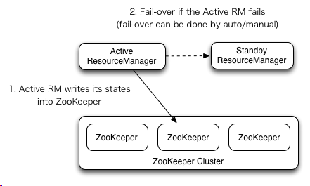
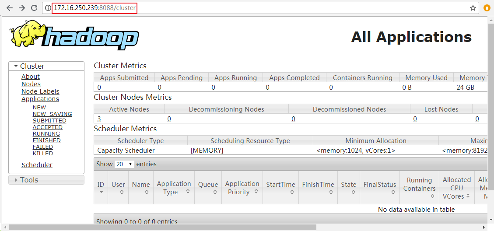

# 前言
在YARN中，`Resource Manager`（RM，资源管理器）负责整个系统的资源管理和调度，在`2.4`版本以前，它一直是整个YARN集群的单点故障。新的**ResourceManager HA**通过冗余一个Resource Manager形成一种Active/Standby的架构来避免ResourceManager的单点故障。

在`ResourceManager HA`架构中，任意时刻只会有一个ResourceManager处于Active状态，其他的RMs都处于Standby状态并等待着当Active RM出现故障时接管它的工作。触发ResourceManager切换为Active有以下两种方式：

- 方式一 自动故障转移

RMs提供了选项让我们使用Zookeeper的ActiveStandbyElector来决定哪一个RM应该为Active。当Active RM出现故障时，另一个RM会自动地被切换为Active并接管先前Active RM的工作。与HDFS中NameNode HA不同，由于ResourceManager HA内嵌的ActiveStandbyElector 已经同时起到了故障检测和Leader选举的作用，因此没有必要再启动一个独立的ZKFC 守护进程了。

- 方式二 手动切换并故障转移

如果自动故障转移未被启用，管理员需要使用 yarn rmadmin 命令手动地将RMs中的一个切换为Active。

# 当Active RM故障
如果我们在`yarn-site.xml`配置文件中配置了多个ResourceManager，Clients，ApplicationMasters (AMs) 和 NodeManagers (NMs)会尝试着轮询连接RMs中的每一个直到连接Active RM成功。

如果Active RM挂掉了，它们会重新轮询直到命中新的Active RM。默认的重试逻辑实现类为 `org.apache.hadoop.yarn.client.ConfiguredRMFailoverProxyProvider`，你可以通过实现 `org.apache.hadoop.yarn.client.RMFailoverProxyProvider`重写重试逻辑并将yarn-site.xml中的 `yarn.client.failover-proxy-provider`的值配置成你的自定义类。

# 搭建Zookeeper集群 
首先你需要搭建好Zookeeper集群，关于Zookeeper集群的安装方法，请移步：
<https://blog.csdn.net/pengjunlee/article/details/81637024>

我搭建好的Zookeeper集群信息如下：
<table border="1" cellpadding="0" cellspacing="0"><tbody><tr><td>Host Name</td><td>IP Address</td><td>Zookeeper Port</td></tr><tr><td>hadoop34</td><td>172.16.250.234</td><td>2181</td></tr><tr><td>hadoop39</td><td>172.16.250.239</td><td>2181</td></tr><tr><td>hadoop40</td><td>172.16.250.240</td><td>2181</td></tr></tbody></table>
Zookeeper集群搭建完成之后，在3台Zookeeper节点上分别执行以下命令启动Zookeeper服务：

	hadoop@hadoop34 conf]$ zkServer.sh start
	ZooKeeper JMX enabled by default
	Using config: /usr/local/zookeeper-3.4.12/bin/../conf/zoo.cfg
	Starting zookeeper ... STARTED

# 启用RM 重启恢复特性
使用Zookeeper作为RM状态的存储介质需要在yarn-site.xml中增加如下配置：

	<property>
	    <name>yarn.resourcemanager.recovery.enabled</name>
	    <value>true</value>
	    <description>Enable RM to recover state after starting. If true, then yarn.resourcemanager.store.class must be specified</description>
	</property>
	<property>
	    <name>yarn.resourcemanager.store.class</name>
	    <value>org.apache.hadoop.yarn.server.resourcemanager.recovery.ZKRMStateStore</value>
	    <description>The class to use as the persistent store.</description>
	</property>
	<property>
	    <name>yarn.resourcemanager.zk-address</name>
	    <value>hadoop34:2181,hadoop39:2181,hadoop40:2181</value>
	    <description>Comma separated list of Host:Port pairs. Each corresponds to a ZooKeeper server(e.g. "127.0.0.1:3000,127.0.0.1:3001,127.0.0.1:3002") to be used by the RM for storing RM state.This must be supplied when using org.apache.hadoop.yarn.server.resourcemanager.recovery.ZKRMStateStore as the value for yarn.resourcemanager.store.class</description>
	</property>

目前可用的RM状态存储实现类有如下三个：

	org.apache.hadoop.yarn.server.resourcemanager.recovery.ZKRMStateStore # a ZooKeeper based state-store implementation .
	org.apache.hadoop.yarn.server.resourcemanager.recovery.FileSystemRMStateStore # a Hadoop FileSystem based state-store implementation like HDFS and local FS , default .
	org.apache.hadoop.yarn.server.resourcemanager.recovery.LeveldbRMStateStore # a LevelDB based state-store implementation.

不同实现类的配置方式有所不同，详情请参考：
<http://hadoop.apache.org/docs/r2.9.1/hadoop-yarn/hadoop-yarn-site/ResourceManagerRestart.html>

# 配置自动故障转移
下表列举了一些与ResourceManager HA相关的必须或者重要的配置项。
<table border="1" cellpadding="0" cellspacing="0"><tbody><tr><td>Configuration Properties</td><td>Description</td></tr><tr><td>yarn.resourcemanager.zk-address</td><td>指定用于存储RM状态和进行Leader选举所使用的ZK-quorum列表。</td></tr><tr><td>yarn.resourcemanager.ha.enabled</td><td>启用RM HA。</td></tr><tr><td>yarn.resourcemanager.ha.rm-ids</td><td>列出RMs的逻辑IDs，例如：“rm1,rm2”。</td></tr><tr><td>yarn.resourcemanager.hostname.rm-id</td><td>指定每一个rm-id代表的RM所对应的主机名。</td></tr><tr><td>yarn.resourcemanager.address.rm-id</td><td>指定每一个rm-id用来让客户端提交任务的主机名和端口号，如果设置了该属性将自动覆盖in&nbsp;yarn.resourcemanager.hostname.rm-id的配置。</td></tr><tr><td>yarn.resourcemanager.scheduler.address.rm-id</td><td>指定每一个rm-id用来让ApplicationMasters获取资源的调度器主机名和端口号，如果设置了该属性将自动覆盖in&nbsp;yarn.resourcemanager.hostname.rm-id的配置。</td></tr><tr><td>yarn.resourcemanager.resource-tracker.address.rm-id</td><td>指定每一个rm-id用来让NodeManagers连接的主机名和端口号，如果设置了该属性将自动覆盖in&nbsp;yarn.resourcemanager.hostname.rm-id的配置。</td></tr><tr><td>yarn.resourcemanager.admin.address.rm-id</td><td>指定每一个rm-id,管理命令的主机名和端口号，如果设置了该属性将自动覆盖in&nbsp;yarn.resourcemanager.hostname.rm-id的配置。</td></tr><tr><td>yarn.resourcemanager.webapp.address.rm-id</td><td>指定每一个rm-id代表的RM所对应的HTTP-Web管理界面的主机名和端口号，如果 yarn.http.policy 为&nbsp;HTTPS_ONLY，该配置将被忽略。如果设置了该属性将自动覆盖in&nbsp;yarn.resourcemanager.hostname.rm-id的配置。</td></tr><tr><td>yarn.resourcemanager.webapp.https.address.rm-id</td><td>指定每一个rm-id代表的RM所对应的HTTPS-Web管理界面的主机名和端口号，如果 yarn.http.policy 为&nbsp;HTTP_ONLY，该配置将被忽略。如果设置了该属性将自动覆盖in&nbsp;yarn.resourcemanager.hostname.rm-id的配置。</td></tr><tr><td>yarn.resourcemanager.ha.id</td><td>指定当前RM的ID。</td></tr><tr><td>yarn.resourcemanager.ha.automatic-failover.enabled</td><td>启用自动故障转移，缺省情况下，它只会在启用HA配置的情况下生效。</td></tr><tr><td>yarn.resourcemanager.ha.automatic-failover.embedded</td><td>自动故障转移时是否使用内嵌的Leader选举策略选举 Active RM。缺省情况下，它只会在启用HA配置的情况下生效。</td></tr><tr><td>yarn.resourcemanager.cluster-id</td><td>指定当前RM集群的ID。供RM使用，以确保被选为Active的RM不会误接管其他集群。</td></tr><tr><td>yarn.client.failover-proxy-provider</td><td>客户端，AMs和NMs在故障转移时寻找新 Active RM所使用的实现类。</td></tr><tr><td>yarn.client.failover-max-attempts</td><td>FailoverProxyProvider尝试故障转移的最大次数。</td></tr><tr><td>yarn.client.failover-sleep-base-ms</td><td>用于计算故障切换之间的指数延迟的睡眠基数（以毫秒为单位）。</td></tr><tr><td>yarn.client.failover-sleep-max-ms</td><td>故障切换之间的最长休眠时间（以毫秒为单位）。</td></tr><tr><td>yarn.client.failover-retries</td><td>每次尝试连接到ResourceManager时的重试次数。</td></tr><tr><td>yarn.client.failover-retries-on-socket-timeouts</td><td>每次尝试在套接字超时时连接到ResourceManager的重试次数。</td></tr></tbody></table>
如果你想获取YARN的更多配置项的详细信息或查看各个配置项的默认值，请移步：
<http://hadoop.apache.org/docs/r2.9.1/hadoop-yarn/hadoop-yarn-common/yarn-default.xml>

本文使用RM故障转移的最简配置，yarn-site.xml内容如下：

	<property>
	   <name>yarn.resourcemanager.ha.enabled</name>
	   <value>true</value>
	</property>
	<property>
	   <name>yarn.resourcemanager.cluster-id</name>
	   <value>yarncluster</value>
	</property>
	<property>
	  <name>yarn.resourcemanager.ha.rm-ids</name>
	  <value>rm1,rm2</value>
	</property>
	<property>
	   <name>yarn.resourcemanager.hostname.rm1</name>
	  <value>hadoop39</value>
	</property>
	<property>
	  <name>yarn.resourcemanager.hostname.rm2</name>
	  <value>hadoop40</value>
	</property>
	<property>
	  <name>yarn.resourcemanager.webapp.address.rm1</name>
	  <value>hadoop39:8088</value>
	</property>
	<property>
	   <name>yarn.resourcemanager.webapp.address.rm2</name>
	   <value>hadoop40:8088</value>
	</property>
	<property>
	   <name>yarn.resourcemanager.zk-address</name>
	   <value>hadoop34:2181,hadoop39:2181,hadoop40:2181</value>
	</property>
	<property>
	  <name>yarn.nodemanager.aux-services</name>
	  <value>mapreduce_shuffle</value>
	</property>

在完成了上述的配置之后将配置拷贝到Hadoop的所有节点，然后按照如下流程启动集群：

	==>启动Zookeeper集群
	==>执行 start-dfs.sh 启动HDFS集群
	==>分别在ResourceManager节点上执行yarn-daemon.sh start resourcemanager 启动RM

启动成功之后执行如下命令查看RMs的状态：

	[hadoop@hadoop40 zookeeper-3.4.12]$ yarn rmadmin -getServiceState rm1
	active
	[hadoop@hadoop40 zookeeper-3.4.12]$ yarn rmadmin -getServiceState rm2
	standby

在浏览器地址栏输入地址：<http://172.16.250.239:8088>，rm1的后台管理界面如下图所示。

由于当前rm1是Active，如果访问rm2的后台管理界面将会自动重定向到rm1的后台管理界面。

# 宕机测试
在rm1执行如下命令来模拟rm1宕机的情况：

	# 停止ResourceManager
	[hadoop@hadoop39 redis-4.0.10]$ yarn-daemon.sh stop resourcemanager
	# 再次查看rm2的状态
	[hadoop@hadoop39 redis-4.0.10]$ yarn rmadmin -getServiceState rm2
	active

# 参考文章
<http://hadoop.apache.org/docs/r2.9.1/hadoop-yarn/hadoop-yarn-site/ResourceManagerHA.html>