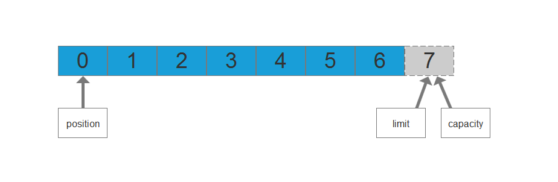

> 原文链接：<https://blog.csdn.net/qq_42917336/article/details/89093529>

# 前言
熟悉NIO的人想必一定不会陌生`buffer`中`position`,`limit`,`capacity`这三个属性吧，之前在学习的时候遇到一个问题:就是当你先往缓冲区写入一部分数据，然后调用`flip()`方法，再全部读取完数据，然后再调用`flip()`方法，此时这三个值的变化是怎样的，研究了一下，决定写下来分享一下。

# 正文
## 介绍

- position： 它指的是下一次读取或写入的位置。
- limit： 指定还有多少数据需要写出(在从缓冲区写入通道时)，或者还有多少空间可以读入数据(在从通道读入缓冲区时)，它初始化是与capacity的值一样，当调用flip()方法之后，它的值会改变成position的值，而position被置0。它箭头所指的位置是最后一位元素的下一位所在的位置。
- capacity： 指定了可以存储在缓冲区中的最大数据容量，实际上，它指定了底层数组的大小，或者至少是指定了准许我们使用的底层数组的容量，这个初始化后就不会再改变了。

## 图示
以上三个属性值之间有一些相对大小的关系：`0` <= `position` <= `limit` <= `capacity`。如果我们创建一个新的容量大小为`7`的`ByteBuffer`对象，在初始化的时候，`position`设置为`0`，`limit`和`capacity`被设置为`7`，在以后使用ByteBuffer对象过程中，`capacity`的值不会再发生变化，而其它两个个将会随着使用而变化。三个属性值分别如图所示：

初始化：

假设我们现在要往这个缓冲区里面写入**3**个字节，写完之后，`position`的箭头就会指向`3`的位置，而`limit`不变。

此时我们想从缓冲区读取这`3`个字节，就必须调用`flip()`方法，调用了`flip()`方法过后，`limit`置为`position`的位置，而`position`被置为`0`，也正应证了上面所说的，`position`它指的是下一次读取或写入的位置，`limit`它箭头所指的位置是最后一位元素的下一位所在的位置。

现在我们可以调用`get()`方法，一直从缓冲区里面取数据，直到取完为止，也就是当`position`与`limit`的值一样时，就取完了。

这一次简单的读写操作就完成了，如果想恢复成初始状态的话，可以调用`clear()`方法：

之前学到这里的时候有个疑问，不知道大家想过没有，就是我们在调用了`get()`方法从缓冲区取完里面的数据，立马去调用`flip()`方法，那这三个属性的值会是什么变化？如果当我只读了2个字节的数据之后，就不读了，然后再去调用`flip()`，这三个值又会是怎么变化？其实不管怎么绕，你只要懂得原理，就不难，咱们先看`flip()`源代码做了什么：

	public final Buffer flip() {
        limit = position;
        position = 0;
        mark = -1;
        return this;
    }

这里不难发现，调用`flip()`方法，无非就是给这几个变量赋值，将当前的`position`值赋给`limit`，然后将`position`的值置为`0`，`Mark`是一个标志变量，咱们以后会提到。熟悉以上代码就不难解决我提出的2个问题：

- 当你读取完调用`flip()`的方法      positon:0    limit:3   	capacity:7
- 当你读取2个字节之后调用`flip()`方法       positon:0    limit:2   	capacity:7

这里就解决了我之前遇到的这三个属性值变化的问题！！！

# 测试代码

**读取完调用flip**：

	package com.cing.nio;
	
	import java.io.FileInputStream;
	import java.nio.Buffer;
	import java.nio.ByteBuffer;
	import java.nio.channels.FileChannel;
	
	public class NioTest1 {
	    public static void main(String[] args) throws Exception{
	
	        FileInputStream fis = new FileInputStream("D:\\A.txt");
	        FileChannel fc = fis.getChannel();
	
	        ByteBuffer buffer = ByteBuffer.allocate(7);
	        output("初始化", buffer);
	
	        fc.read(buffer);
	        output("调用READ方法", buffer);
	
	        buffer.flip();
	        output("第一次调用flip", buffer);
	
	        while (buffer.remaining() > 0) {
	            byte b = buffer.get();
	        }
	        output("get()", buffer);
	
	        buffer.flip();
	        output("第二次flip", buffer);
	
	        fis.close();
	    }
	
	    public static void output(String step, Buffer buffer) {
	        System.out.println(step + " : ");
	        System.out.println("buffer: " + buffer + ", ");
	    }
	}

输出结果为：

	初始化 : 
	buffer: java.nio.HeapByteBuffer[pos=0 lim=7 cap=7], 
	调用READ方法 : 
	buffer: java.nio.HeapByteBuffer[pos=3 lim=7 cap=7], 
	第一次调用flip : 
	buffer: java.nio.HeapByteBuffer[pos=0 lim=3 cap=7], 
	get() : 
	buffer: java.nio.HeapByteBuffer[pos=3 lim=3 cap=7], 
	第二次flip : 
	buffer: java.nio.HeapByteBuffer[pos=0 lim=3 cap=7], 

**读取2字节之后调用flip**：

	package com.cing.nio;
	
	import java.io.FileInputStream;
	import java.nio.Buffer;
	import java.nio.ByteBuffer;
	import java.nio.channels.FileChannel;
	
	public class NioTest1 {
	    public static void main(String[] args) throws Exception{
	
	        FileInputStream fis = new FileInputStream("D:\\A.txt");
	        FileChannel fc = fis.getChannel();
	
	        ByteBuffer buffer = ByteBuffer.allocate(7);
	        output("初始化", buffer);
	
	        fc.read(buffer);
	        output("调用READ方法", buffer);
	
	        buffer.flip();
	        output("第一次调用flip", buffer);
	
	        while (buffer.remaining() > 1) {
	            byte b = buffer.get();
	        }
	        output("get()", buffer);
	
	        buffer.flip();
	        output("第二次flip", buffer);
	
	        fis.close();
	    }
	
	    public static void output(String step, Buffer buffer) {
	        System.out.println(step + " : ");
	        System.out.println("buffer: " + buffer + ", ");
	    }
	}

输出结果为：

	初始化 : 
	buffer: java.nio.HeapByteBuffer[pos=0 lim=7 cap=7], 
	调用READ方法 : 
	buffer: java.nio.HeapByteBuffer[pos=3 lim=7 cap=7], 
	第一次调用flip : 
	buffer: java.nio.HeapByteBuffer[pos=0 lim=3 cap=7], 
	get() : 
	buffer: java.nio.HeapByteBuffer[pos=2 lim=3 cap=7], 
	第二次flip : 
	buffer: java.nio.HeapByteBuffer[pos=0 lim=2 cap=7], 