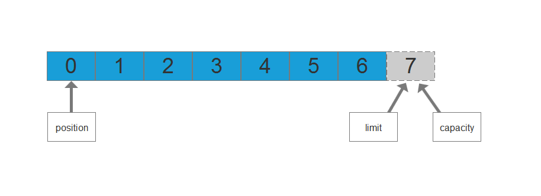
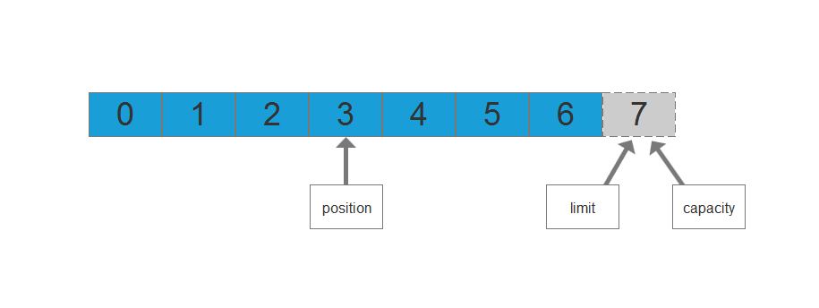
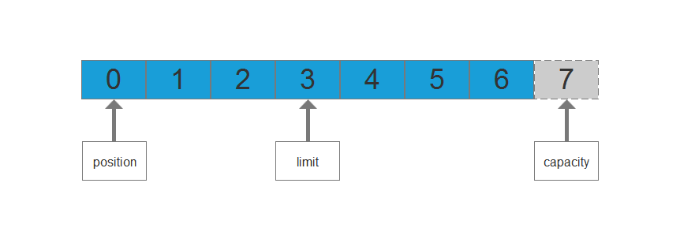
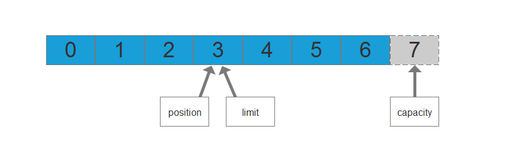
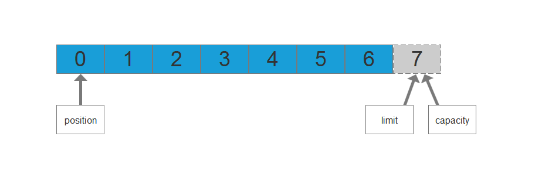

# 统计学
统计学可以分为：`描述统计学`和`推断统计学`

- `描述统计学`（descriptive statistics）：使用特定的数字或图表来体现数据的集中程度和离散程度，例如：某个班某次数学考试的平均分、最高分、各个分数段的人数分布，等等。
- `推断统计学`（inferential statistic）：以概率论为基础，根据样本数据来推断总体的数量特征。例如：产品质量检查，一般采用抽检，根据所抽样本的质量合格率作为总体的质量合格率的一个估计。

# 集中趋势
集中趋势（central tendency）或中央趋势，在统计学中是指一组数据向某一中心值聚拢的程度,它反映了一组数据中心点的位置所在。 最常见的几种集中趋势包括`算数平均数`、`中位数`及`众数`。

## 算数平均数
算术平均数（ arithmetic mean）：又称均值，它是集中趋势测定中最重要的一种平均数，可以分为简单算术平均数和加权算术平均数。

### 简单算术平均数
主要用于未分组的原始数据，例如，一组数据Xi（i=1,2,......,N）,其简单算术平均数的计算公式为：

例如，某次数学考试中，5位考生的成绩分别如下：

	70，85，62，98，92

则，5位考生成绩的简单算术平均数为： `（70+85+62+98+92）/5 = 81.4`

### 加权算术平均数
主要用于处理经分组整理的数据，例如，将原始数据分成k组，各组中的值为`X1，X2，...，Xk`，各组的频数分别为`f1，f2，...，fk`，加权算术平均数的计算公式为：

例如，以下是小明一学期的数学考试成绩：

|平时测验|期中考试|期末考试|
|--|--|--|
|80|90|95|

学校规定的学科综合成绩的计算方式是：

|平时测验占比|期中考试占比|期末考试占比|
|--|--|--|
|20%|30%|50%|

那么，小明一学期的数学综合成绩（加权算术平均数）为：

`（80*20%+90*30%+95*50%）/（20%+30%+50%）= 90.5`

# 中位数
中位数（Median）： 又称中值，将数据按大小顺序进行排列，居于数列中间位置的那个数据就是中位数。如果数据有偶数个，通常取最中间的两个数的平均数作为中位数。

例如：`58，32，46，92，73，88，23，63` 。

1. 先排序：`23，32，46，58，63，73，88，92`
2. 找出处于中间位置的数：`58，63`
3. 中位数为：`（58+63）/2 = 60.5`

# 众数
众数：一组数据中出现次数最多的数值叫作众数，有时众数在一组数中有好几个，常用大写字母`M`来表示。

例如：`1，2，2，3，3` 中的众数是 `2` 和 `3` ；`1，2，3，4，5` 中没有众数。

使用均值、中位数和众数来描述集中趋势的优缺点对比如下：

||优点|缺点|
|--|--|--|
|均值|充分利用所有数据，使用性强|容易受到极端值干扰|
|中位数|不受极端值干扰|缺乏敏感性|
|众数|当数据具有明显的集中趋势时，代表性好；不受极端值干扰|缺乏唯一性，可能有一个或多个，也可能一个都没有|

# 离散趋势
离散趋势：在统计学上描述观测值偏离中心位置的趋势，反映了所有观测值偏离中心的分布情况。

一组观测数据的频数分布有集中趋势和离散趋势两个主要特征。仅仅用集中趋势来描述数据的分布特征是不够的，只有把两者结合起来，才能全面地认识事物。我们经常会碰到平均数相同的两组数据其离散程度可以是不同的。一组数据的分布可能比较集中，差异较小，则平均数的代表性较好。另一组数据可能比较分散，差异较大，则平均数的代表性就较差。描述数据离散趋势的常用指标有极差、四分位数间距、方差、标准差、标准误差和变异系数等，其中方差和标准差最常用。

# 极差
极差：又称范围误差或全距(Range)，以R表示，用来简单地描述观测数据的范围大小，其计算公式为：

其中，`Xmax`为观测数据中的最大值，`Xmin`为观测数据中的最小值。

例如 ：`12，12，13，14，16，21` 的极差为 `21 - 12 = 9` 。

# 方差
方差：在统计描述中，方差用来计算每一个变量（观测值）与总体平均数之间的差异，其值越大就表示数据越分散，总体方差计算公式为：

其中，`Xi` 表示数据集中第 `i` 个数据的值，`μ` 表示数据集的总体均值。

或者简化为：

例如：`1，2，5，8，9`。

1. 先计算均值为：（1+2+5+8+9） / 5 = 5
2. 再计算方差为：[（1-5）^ 2 +（2-5）^ 2+（5-5）^ 2+（8-5）^ 2+（9-5）^ 2] / 5 = 10

# 标准差
标准差：中文环境中又常称均方差，用 σ 表示。标准差是方差的算术平方根，能反映一个数据集的离散程度，平均数相同的两组数据，标准差未必相同 。其计算公式为：

# 直方图
直方图：又称质量分布图，是一种统计报告图，由一系列高度不等的纵向条纹或线段表示数据分布的情况。 一般用横轴表示数据类型，纵轴表示分布情况。

例如：以下是某次数学考试，各个分数段的学生人数分布情况（频数分布表）。

|分数段|人数|
|--|--|
|0至59|5|
|60至69|51|
|70至79|20|
|80至89|6|
|90至100|1|

根据频数分布表，画出频数直方图如下：

# 贝叶斯公式
贝叶斯公式：也称为`贝叶斯法则`、`贝叶斯定理`或`贝叶斯规则`，是概率统计中应用所观察到的现象对有关概率分布的主观判断（即先验概率）进行修正的标准方法。

通常，事件A在事件B(发生)的条件下的概率，与事件B在事件A的条件下的概率是不一样的；然而，这两者是有确定的关系，贝叶斯法则就是这种关系的陈述。

其中P(Ai|B)是在随机事件B发生的情况下随机事件Ai发生的概率。A1，A2，...，An 为完备事件组，即

在贝叶斯法则中，每个名词都有约定俗成的名称：

- P(A)是事件A的先验概率或边缘概率。之所以称为"先验"是因为它不考虑任何事件B方面的因素。
- P(A|B)是已知事件B发生后事件A的条件概率，也由于得自事件B的取值而被称作事件A的后验概率。
- P(B|A)是已知事件A发生后事件B的条件概率，也由于得自事件A的取值而被称作事件B的后验概率。
- P(B)是事件B的先验概率或边缘概率，也作标准化常量（normalized constant）。

对于变量有两个以上的情况，贝式定理亦成立。例如：

	P(A|B,C)=P(B|A)*P(A)*P(C|A,B)/(P(B)*P(C|B))

这个式子可以由套用多次两个变量的贝氏定理及条件机率的定义导出。

例如：一棵树生病了，树的主人要外出，便委托邻居帮忙浇水，假设已知如果不浇水，树死去的概率为`0.8`，若浇水则树死去的概率为`0.15`，邻居会记得浇水的概率为`0.9`。

**（1）求主人回来时树还活着的概率**。

解： 记事件 **A** = {树活着}，事件 **B1** = {邻居记得浇水}，**B2** = {邻居不记得浇水}

P(A)=P(A|B1)P(B1)+P(A|B2)P(B2)=0.85*0.9+0.2*0.1=0.785

**（2）若主人回来时树已经死了，求邻居忘记浇水的概率**。

解： 记事件 **A** = {树死了}，事件 **B1** = {邻居记得浇水}，**B2** = {邻居忘记浇水}

# 二项分布
**二项分布**：二项分布（Binomial Distribution），即重复n次的伯努利试验（Bernoulli Experiment），特别地，当 n = 1 时，二项分布就变成 （0-1）分布了。其中，伯努利试验（Bernoulli experiment）指的是在同样的条件下重复地、相互独立地进行的一种随机试验，其特点是该随机试验只有两种可能结果：发生或者不发生。我们假设该项试验独立重复地进行了n次，那么就称这一系列重复独立的随机试验为n重伯努利试验，或称为伯努利概型。

设在一次试验中，事件A发生的概率为p（0<p<1），则在n重伯努利试验中，事件A恰好发生 k 次的概率为：

我们一般习惯上用ξ表示随机试验的结果，记作 ξ~B(n,p)， 即：

- 期望：Eξ=np；
- 方差：Dξ=npq；
- 其中：q=1-p

例如：抛十次硬币，用 **ξ** 记录正面向上的次数，则 **ξ~B(10,0.5)** 。抛六次骰子，用 **ξ** 记录出现 **6** 点的次数，则 **ξ~B(6,1/6)** 。

# 泊松分布
**泊松分布**：泊松分布（Poisson distribution）是一种统计与概率学里常见到的离散概率分布（discrete probability distribution），由法国数学家西莫恩·德尼·泊松（Siméon-Denis Poisson）在1838年时发表。它的概率函数为：

其中，**λ>0** 是一个常数，则称 **X** 服从参数为 **λ** 的泊松分布，记为 **X~π（λ）**。

泊松分布适合于描述单位时间（或空间）内随机事件发生的次数。如某一服务设施在一定时间内到达的人数，电话交换机接到呼叫的次数，汽车站台的候客人数，机器出现的故障数，自然灾害发生的次数，一块产品上的缺陷数，显微镜下单位分区内的细菌分布数等等。

当二项分布的n很大而p很小时，泊松分布可作为二项分布的近似，其中**λ**为**np**。通常当**n≧20**,**p≦0.05**时，就可以用泊松公式近似得计算。

例如：计算机硬件公司制造某种特殊型号的微型芯片，次品率达 0.1% ，各芯片成为次品相互独立。求在1000只产品中至少有 2 只次品的概率。以 X 记产品中的次品数， X~B(1000,0.001) 。

解：所求概率为

使用泊松分布来近似计算：λ=1000*0.001=1。

误差仅为 **-0.00000003** 。

# 分布律
**分布律**：对于离散型随机变量的概率分布使用分布律进行表示。

例如：将一个硬币抛三次，用 **X** 记录硬币在三次抛掷中正面向上的次数，求 **X** 的概率分布律。

解：记事件 **H** = { 正面向上 }，事件 **T** = { 背面向上 }

样本空间：**S** = { HHH,HHT,HTH,THH,HTT,THT,TTH,TTT }

**X** 所有可能的取值为：`0，1，2，3`

	P(X=0)=P{ TTT }=1/8
	P(X=1)=P{ HTT,THT,TTH }=3/8
	P(X=2)=P{ HHT,HTH,THH }=3/8
	P(X=3)=P{ HHH }=1/8

则 **X** 的概率分布律表示如下：

|X|0|1|2|3|
|-|-|-|-|-|
|P|1/8|3/8|3/8|1/8|

# 分布函数
**分布函数**：分布函数（累积分布函数，英文Cumulative Distribution Function, 简称CDF），是概率统计中重要的函数，用来描述随机变量的概率分布特征。

设 **X** 是一个随机变量，**x** 是任意实数，函数 **F(x)=P{X<=x}**称为 **X** 的分布函数。

分布函数的性质：

**F(x) 是一个不减函数；**

- **F(x) 是右连续的；**

将上例中的分布律的累积概率计算出来：

|X|0|1|2|3|
|-|-|-|-|-|
|P|1/8|3/8|3/8|1/8|
|累积概率|1/8|1/2|1/7|1|

绘制成分布函数如下：

# 概率密度函数
概率密度函数：对于随机变量 X 的分布函数 F(x)，存在非负可积函数 f(x)，使对于任意实数 x 满足：

则称 **X **为连续型随机变量，而 **f(x)** 称为 **X** 的概率密度函数（Probability Density Function），简称概率密度（PDF）。

概率密度函数的性质：

**1. f(x) ≧ 0 且**

**2. 对于任意实数 x1，x2（x1 ≦ x2 ），满足**

**3. 若 f(x) 在 x 点连续，则有**

**例如**：一个靶子是半径为 2m 的圆盘，设击中靶上任一同心圆盘上的点的概率与该圆盘的面积成正比，并设射击都能中靶，以 **X** 表示弹着点与圆心的距离，试求随机变量 **X** 的分布函数。

解：在这个例子中，**X** 的概率密度函数是

将 **X** 的概率密度函数绘制成图形如下：

根据图形，若是要求**P(0<X<2)**则是求概率密度曲线与 **x=X** ,**y=0** 所围成的绿色三角形的面积，其分布函数如下：

# 均匀分布
**均匀分布**：在概率论和统计学中，均匀分布也叫矩形分布，它是对称概率分布，在相同长度间隔的分布概率是等可能的。 均匀分布由两个参数a和b定义，它们是数轴上的最小值和最大值，通常缩写为X~U（a，b）。

**均匀分布的概率密度函数为**：

**均匀分布的累积分布函数为**：

# 正态分布
**正态分布**：正态分布（Normal distribution），也称“常态分布”，又名高斯分布（Gaussian distribution），若随机变量 **X** 服从一个位置参数为 **μ** 、尺度参数为 **σ** 的概率分布，且其概率密度函数为

则这个随机变量就称为正态随机变量，正态随机变量服从的分布就称为正态分布，记作 **X~N(μ,σ ^2)** ，读作 **X** 服从 **N(μ,σ ^2)** ，或 **X** 服从正态分布。

正态曲线呈钟型，两头低，中间高，左右对称因其曲线呈钟形，因此人们又经常称之为钟形曲线。其中，**μ** 为正态分布的期望值决定了正态分布的位置，**σ** 为正态分布的标准差决定了其分布的幅度。

当 **μ = 0**,**σ = 1**时的正态分布就成为标准正态分布。

为了便于描述和应用，常将一般正态分布转化成标准正态分布：

 
