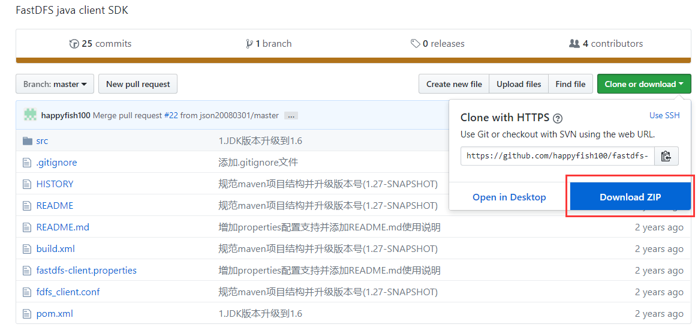
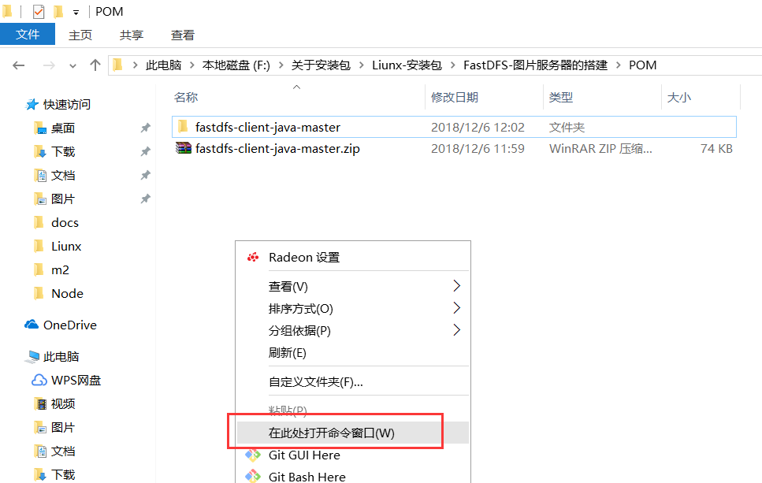
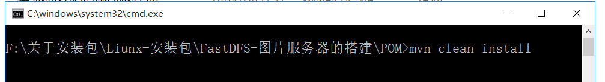
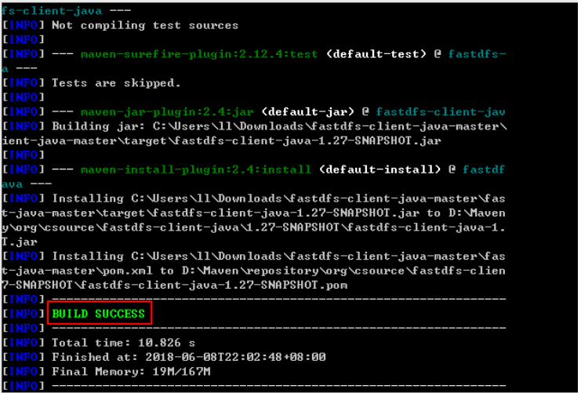
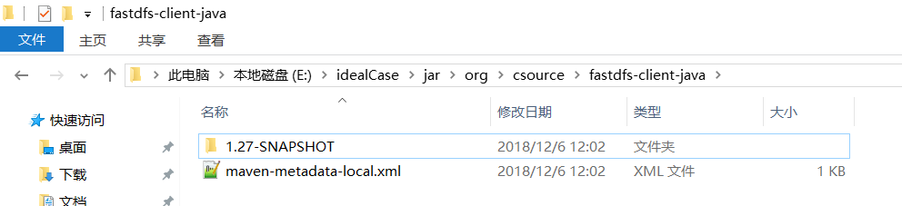
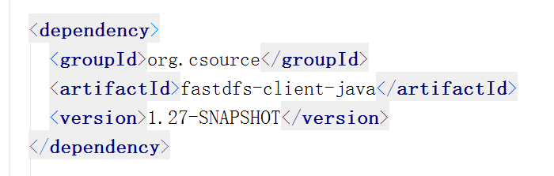

> 原文地址：<https://www.cnblogs.com/mlq2017/p/10076084.html>

因为`fastdfs-client-java-1.27-SNAPSHOT.jar`这个依赖包在`maven`中央仓库是没有的。

需要自己编译源码成jar本地安装到`maven`的本地仓库，安装完以后就能正常引用了（注意：本地必须安装了Maven，并配置好Maven环境变量）。

	<dependency>
	      <groupId>org.csource</groupId>
	      <artifactId>fastdfs-client-java</artifactId>
	      <version>1.27-SNAPSHOT</version>
	</dependency>

**1、** [下载开发包工具](https://pan.baidu.com/s/1eAdXYMvhW3LpUB01Bc_9SQ "下载开发包工具")  或者[Github](https://github.com/happyfish100/fastdfs-client-java "Github")下载    或者   [点我](https://github.com/MlqBeginner/BlogGardenWarehouse/blob/master/fastdfs-client-java-master.zip "点我")下载

**2、** 需要把`fastdfs-client-java`开发工具包打包到本地的Maven仓库

**2.1**：解压`fastdfs-client-java-master`

**2.2**：进入`fastdfs-client-java`目录，在此处打开命令窗口`cmd`

**2.3**：输入`mvn clean install`

**3、** 构建一小会，如出现以下。则成功把`fastdfs-client-java`打包到本地的`Maven`仓库

至此，更新项目Maven，`pom.xml`文件就不会出现找不到`fastdfs-client-java`依赖了。（成功导入`fastdfs-client-java`依赖）

