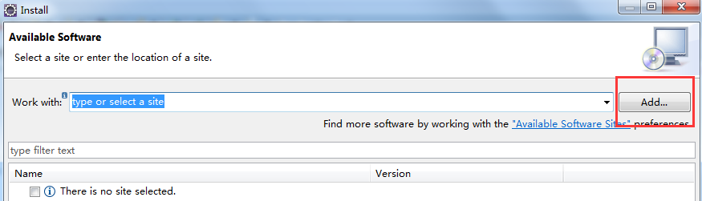
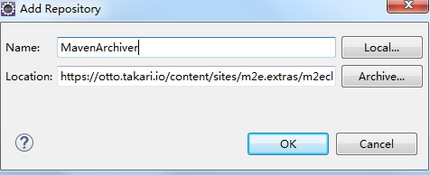

> 原文地址：<https://www.cnblogs.com/asderx/p/6541945.html>

# 异常描述
eclipse导入新的maven项目时，`pom.xml`第一行报错：

org.apache.maven.archiver.MavenArchiver.getManifest(org.apache.maven.project.MavenProject, org.apache.maven.archiver.MavenArchiveConfiguration)

# 解决办法

`Help` ——> `Install New SoftWare`

`Add`，输入以下地址：

	https://otto.takari.io/content/sites/m2e.extras/m2eclipse-mavenarchiver/0.17.2/N/LATEST
	
	# 或者
	
	http://repo1.maven.org/maven2/.m2e/connectors/m2eclipse-mavenarchiver/0.17.2/N/LATEST/

按照安装提示，一直next，重启eclipse之后，执行`maven` ——> `update project`