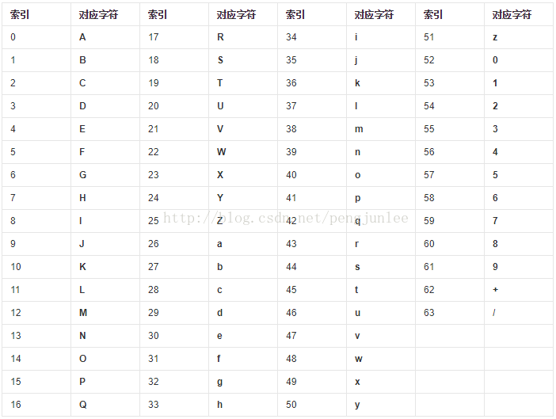
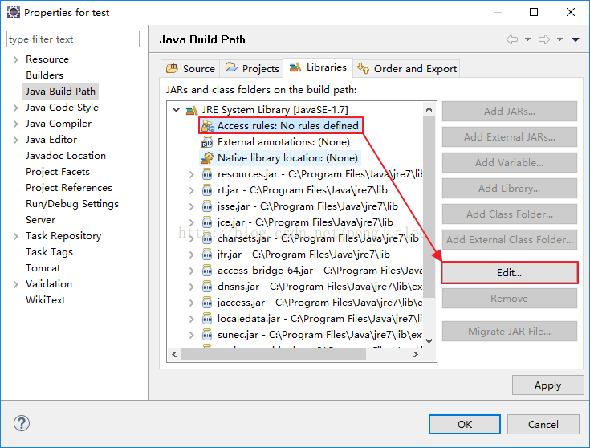
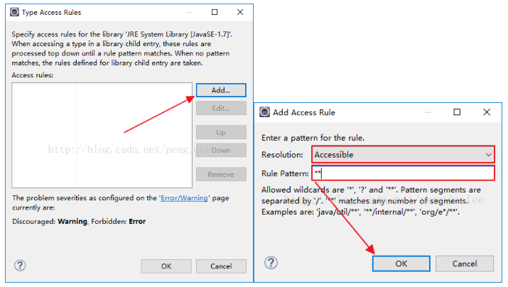

# Base64简介
Base64是网络上最常见的用于传输`8Bit`字节码的编码方式之一，**Base64就是一种基于64个可打印字符来表示二进制数据的方法**。Base64编码是从二进制到字符的过程，可用于在HTTP环境下传递较长的标识信息。

按照RFC2045的定义，Base64被定义为：`Base64内容传送编码被设计用来把任意序列的8位字节描述为一种不易被人直接识别的形式。（The Base64 Content-Transfer-Encoding is designed to represent arbitrary sequences of octets in a form that need not be humanly readable.）`  

# BASE64编码原理
Base64要求把每三个8Bit的字节转换为四个6Bit的字节（`3*8 = 4*6 = 24`），然后把`6Bit`再添两位高位0，组成四个`8Bit`的字节，也就是说，转换后的字符串理论上将要比原来的长`1/3`。

Base64编码遵循以下规则： 

- 把3个字符变成4个字符。 
- 每76个字符加一个换行符。 
- 最后的结束符也要处理。 

转码过程示例：

	3*8=4*6
	内存1个字节占8位
	转前： s 1 3
	先转成ascii：对应 115 49 51
	再转成2进制：01110011 00110001 00110011
	3*8、共24位： 01110011 00110001 00110011
	6位一组、分为4组：011100 110011 000100 110011
	然而计算机是以byte（1byte=8位）为最小单位进行数据存储的，6位不够8位，高位需补0
	每一组高位补两个0： 00011100 00110011 00000100 00110011
	得到4个整数值： 28 51 4 51 

对照转换表：结果c z E z  

从严格意义上来说，BASE64编码算法并不算是真正的加密算法，它只是将源数据转码成为了一种不易阅读的形式，而转码的规则是公开的（解码很容易）。转码之后的数据具有不可读性，需要解码后才能阅读。 

**注**：BASE64加密后产生的字节位数是8的倍数，如果不够位数以=符号填充。   

# Java实现BASE64

## 反射
    /* encode by Base64 */
    public static String encodeBase64(byte[] input) throws Exception
    {
 
        Class clazz = Class.forName("com.sun.org.apache.xerces.internal.impl.dv.util.Base64");
 
        Method mainMethod = clazz.getMethod("encode", byte[].class);
 
        mainMethod.setAccessible(true);
 
        Object retObj = mainMethod.invoke(null, new Object[]
        {
                input
        });
 
        return (String) retObj;
 
    }
    /* decode by Base64 */
 
    public static byte[] decodeBase64(String input) throws Exception
    {
 
        Class clazz = Class.forName("com.sun.org.apache.xerces.internal.impl.dv.util.Base64");
 
        Method mainMethod = clazz.getMethod("decode", String.class);
 
        mainMethod.setAccessible(true);
 
        Object retObj = mainMethod.invoke(null, input);
 
        return (byte[]) retObj;
 
    }
## 使用commons-codec.jar
    /* encode by Base64 */
    public static String encodeBase64(byte[] input) throws Exception
    {
 
        return new String(Base64.encodeBase64(input));
 
    }
    /* decode by Base64 */
 
    public static byte[] decodeBase64(String input) throws Exception
    {
 
        return Base64.decodeBase64(input);
 
    }

**Base64.encodeBase64()**有几个重载的方法：

- Base64.encodeBase64(binaryData)            //默认不换行
- Base64.encodeBase64(binaryData, isChunked) //isChunked为true时换行,false不换行
- Base64.encodeBase64Chunked(binaryData)     //默认换行
- Base64.encodeBase64String(binaryData)      //以字符串形式返回

然而，标准的Base64并不适合直接放在URL里传输，因为URL编码器会把标准Base64中的`“/”`和`“+”`字符变为形如`“%XX”`的形式，而这些`“%”`号在存入数据库时还需要再进行转换，因为ANSI SQL中已将`“%”`号用作通配符。

为解决此问题，可采用一种用于URL的改进Base64编码，它不仅在末尾去掉填充的'='号，并将标准Base64中的“+”和“/”分别改成了“-”和“_”，这样就免去了在URL编解码和数据库存储时所要作的转换，避免了编码信息长度在此过程中的增加，并统一了数据库、表单等处对象标识符的格式。

Base64中有以下几个方法，用于提供安全的URL(转换+为-、/为_、将多余的=去掉)：

- Base64.encodeBase64(binaryData, isChunked, urlSafe)//urlSafe为true时进行安全转换
- Base64.encodeBase64URLSafe(binaryData)//默认进行安全转换
- Base64.encodeBase64URLSafeString(binaryData)//默认进行安全转换，并以字符串形式返回

使用`sun.misc.BASE64Encoder`和`sun.misc.BASE64Decoder`

    /* encode by Base64 */
    public static String encodeBase64(byte[] input) throws Exception
    {
        return new BASE64Encoder().encode(input);
 
    }
    /* decode by Base64 */
 
    public static byte[] decodeBase64(String input) throws Exception
    {
 
        byte[] output = null;
 
        try
        {
 
            BASE64Decoder decoder = new BASE64Decoder();
 
            output = decoder.decodeBuffer(input);
 
        }
        catch (IOException e)
        {
 
            e.printStackTrace();
 
        }
 
        return output;
 
    }

**注**：在eclipse中对sun.misc包默认访问策略为Forbidden(禁止)，会导致该包无法导入，解决办法：
`-->右键项目 -->Properties -->Java Bulid Path-> Libraries`  
`-->JRE System Library-->Access rules`  
`-->双击Type Access Rules在Accessible中添加accessible，下面填上**` 点击确定。 

