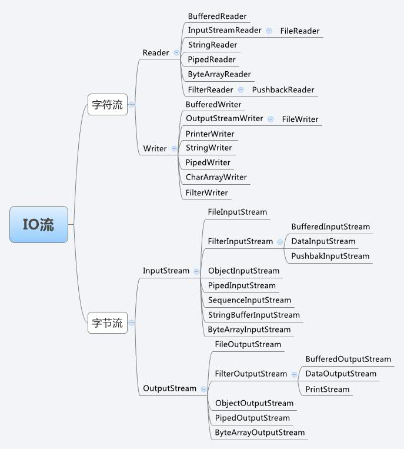
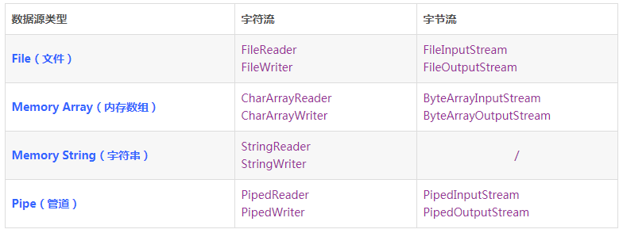

在Java中，对于数据的输入/输出（**I/O**）操作以“流”（**stream**）方式进行，数据的来源可以是文件、网络、内存缓存等。 

# 一、JavaIO流的分类

J2SDK提供了各种各样的“`流`”，用以操作不同种类的数据，J2SDK所提供的所有流都位于`java.io`包内，从不同的角度对这些流进行归类：

- 按数据流向不同可以分为输入流和输出流。
- 按处理数据单位不同可以分为字节流和字符流。
- 按照流类的功能不同可以分为节点流和处理流。 

## 输入流和输出流  
流具有方向性，至于是输入流还是输出流则是一个相对的概念，一般是站在程序的角度去判断，从数据源读取数据到程序中的是输入流，相反从程序中向外写数据的是输出流。

## 字节流和字符流  
- 字节流以字节（byte，1byte=8bit）为单位，一个字节一个字节的读写数据。从上图可以看出，所有的字节流均继承自抽象类InputStream/OutputStream。
- 字符流以字符（Java中，一个字符为2byte=16bit）为单位，一个字符一个字符的读写数据。所有的字符流均继承自抽象类Reader/Writer。

## 节点流和处理流
- 节点流为直接与数据源（节点）相连，可以从数据源读写数据的流。

- 处理流是“连接”在已存在的流（节点流或处理流）之上，可以为程序提供更加强大的读写操作功能的流。 

# 二、InputStream，OutputStream，Reader和Writer

InputStream是所有字节输入流的超类，其包含的基本方法如下。 

	// 从输入流中读取一个字节。并以整数的形式返回（0-255）。
	// 如果读取前已经到了输入流的末尾返回-1。
	int read() throws IOException;
 
	// 从输入流中读取一定数量的字节，并将其存储在缓冲区数组 b中。以整数形式返回实际读取的字节数。
	// 如果读取前已经到了输入流的末尾返回-1。
	int read(byte[] b) throws IOException;
 
	// 读取输入流中len个字节到数组 b中，并将读取的第一个字节存储在元素 b[off] 中，下一个存储在 b[off+1] 中，依次类推。
	// 读取的字节数最多等于 len，也可能小于该值。以整数形式返回实际读取的字节数。
	// 如果读取前已经到了输入流的末尾返回-1。
	int read(byte[] b, int off, int len) throws IOException;
 
	// 跳过和丢弃此输入流中数据的 n个字节。返回跳过的实际字节数。
	// 如果 n为负数，则不跳过任何字节。
	long skip(long n) throws IOException;
 
	// 返回此输入流下一个方法调用可以不受阻塞地从此输入流读取（或跳过）的估计字节数。
	// 如果到达输入流末尾，则返回 0。
	int available() throws IOException;
 
	// 关闭此输入流并释放与该流关联的所有系统资源。
	void close() throws IOException;
 
	// 在此输入流中标记当前的位置。调用reset()方法会根据此标记的位置重新定位此流，以便后续重新读取相同的字节。
	// readlimit参数告知此输入流在标记位置失效之前允许读取的字节数。
	void mark(int readlimit);
 
	// 将此流重新定位到最后一次对此输入流调用 mark()方法时的位置。
	void reset() throws IOException;
 
	// 测试此输入流是否支持 mark()和 reset() 方法。
	// 是否支持 mark()和 reset()是特定输入流实例的不变属性。
	boolean markSupported();

OutputStream是所有字节输出流的超类，其包含的基本方法如下。

	// 将指定的字节写入此输出流。
	// 要写入的字节是参数 b的低8位，b的 24 个高位将被忽略。
	void write(int b) throws IOException;
 
	// 将一个字节数组中的数据写入输出流。
	void write(byte[] b) throws IOException;
 
	// 将指定 byte数组中从偏移量 off 开始的 len 个字节写入此输出流。
	void write(byte[] b, int off, int len) throws IOException;
 
	// 刷新此输出流并强制将输出流中缓存的数据写出。
	void flush() throws IOException;
 
	// 关闭此输出流并释放与此流有关的所有系统资源。
	void close() throws IOException;

Reader是所有字符输入流的超类，其包含的基本方法如下。

	// 试图将字符读入指定的字符缓冲区。
	// 返回添加到缓冲区中的字符数量。
	int read(CharBuffer target) throws IOException;
 
	// 读取单个字符，并以整数的形式返还，范围在 0 到 65535 之间。
	// 如果读取前已经到了输入流的末尾返回-1.
	int read() throws IOException;
 
	// 将字符读入数组cbuf，并返回读取的字符数。
	// 如果读取前已经到了输入流的末尾返回-1.
	int read(char[] cbuf) throws IOException;
 
	// 读取输入流中len个字符到数组 cbuf中,并将读取的第一个字符存储在元素cbuf[off]中，下一个存储在 cbuf[off+1]中，依次类推。
	// 读取的字符数最多等于 len，也可能小于该值。以整数形式返回实际读取的字符数。
	// 如果读取前已经到了输入流的末尾返回-1.
	int read(char[] cbuf, int off, int len) throws IOException;
 
	// 跳过和丢弃此输入流中数据的 n个字符。返回跳过的实际字符数。
	// 如果 n 为负数，则不跳过任何字符。
	long skip(long n) throws IOException;
 
	// 判断是否准备读取此流。
	boolean ready() throws IOException;
 
	// 关闭此输入流并释放与该流关联的所有系统资源。
	void close() throws IOException;
 
	// 在此输入流中标记当前的位置。调用reset()方法会根据此标记的位置重新定位此流，以便后续重新读取相同的字符。
	// readlimit参数告知此输入流在标记位置失效之前允许读取的字符数。
	void mark(int readlimit);
 
	// 将此流重新定位到最后一次对此输入流调用 mark()方法时的位置。
	void reset() throws IOException;
 
	// 测试此输入流是否支持 mark()和 reset() 方法。
	// 是否支持 mark()和 reset()是特定输入流实例的不变属性。
	boolean markSupported();

Writer是所有字符输出流的超类，其包含的基本方法如下。

	// 将指定的字符写入此输出流。
	// 要写入的字符是参数 c的低16位。c的 16 个高位将被忽略。
	void write(int c) throws IOException;
 
	// 将一字符数组中的数据写入输出流。
	void write(char[] cbuf) throws IOException;
 
	// 将指定 cbuf数组中从偏移量 off 开始的 len 个字符写入此输出流。
	void write(char[] cbuf, int off, int len) throws IOException;
 
	// 将字符串str写入此输出流。
	void write(String str) throws IOException;
 
	// 将字符串str中从off开始的len个字符写入此输出流。
	void write(String str, int off, int len) throws IOException;
 
	// 将指定字符序列添加到此 writer。
	Writer append(CharSequence csq) throws IOException;
 
	// 将指定字符序列中索引从start到end之间的字符写入到此输出流。
	Writer append(CharSequence csq, int start, int end) throws IOException;
 
	// 将指定字符添加到此 writer。
	Writer append(char c) throws IOException;
 
	// 刷新此输出流并强制将输出流中缓冲的数据写出。
	void flush() throws IOException;
 
	// 关闭此输出流并释放与此流有关的所有系统资源。
	void close() throws IOException;

# 三、节点流

根据数据来源不同对节点流进行分类如下图。

# 四、处理流
  
## 缓冲流
J2SDK提供了四种缓冲流：`BufferedReader`、`BufferedWriter`、`BufferedInputStream`和`BufferedOutputStream`。缓冲流对读写的数据提供了缓冲的功能，可以提高读写的效率，同时还增加了一些新的方法。

- BufferedReader新增了readLine()方法用于读取一行字符串（以\r或\n分隔）。
- BufferedWriter新增了newLine()方法用于写入一个分隔符。

	public static void main(String[] args) {
		try {
			BufferedWriter bw = new BufferedWriter(new FileWriter(
					"D:\\io\\bufferedTest.txt"));
			String s;
			for (int i = 0; i < 10; i++) {
				s = String.valueOf(Math.random());
				bw.write(s);
				bw.newLine();
			}
			bw.flush();
			bw.close();
 
			Reader reader = new FileReader("D:\\io\\bufferedTest.txt");
			BufferedReader br = new BufferedReader(reader);
			while ((s = br.readLine()) != null) {
				System.out.println(s);
			}
			br.close();
		} catch (FileNotFoundException e) {
			System.out.println("找不到指定文件!");
			System.exit(-1);
		} catch (IOException e) {
			System.out.println("系统错误！");
			System.exit(-1);
		}
	}

## 转换流
J2SDK提供了InputStreamReader和OutputStreamWriter两个转换流，用于将字节流转换为字符流。

	public static void main(String[] args) {
		try {
			OutputStream outStream = new FileOutputStream(
					"D:\\io\\transformIo.txt");
			OutputStreamWriter outWriter = new OutputStreamWriter(outStream);
			outWriter.write("2017年3月25日风雨大作。。。");
			outWriter.close();
 
			outWriter = new OutputStreamWriter(new FileOutputStream(
					"D:\\io\\transformIo.txt", true), "GBK");
			outWriter.write("2017年3月26日电闪雷鸣。。。");
			outWriter.close();
		} catch (FileNotFoundException e) {
			System.out.println("找不到指定文件!");
			System.exit(-1);
		} catch (UnsupportedEncodingException e) {
			System.out.println("编码异常！");
			System.exit(-1);
 
		} catch (IOException e) {
			System.out.println("写入错误！");
			System.exit(-1);
		}
 
		System.out.println("写入成功！");
	}

## 数据流
J2SDK提供了DataInputStream和DataOutputStream两个数据流，用以提供存取与机器无关的Java原始数据类型数据（如：int，double等）的方法。

	public static void main(String[] args) {
		try {
			ByteArrayOutputStream byteOut = new ByteArrayOutputStream();
			DataOutputStream dataOut = new DataOutputStream(byteOut);
			dataOut.writeChar(65);
			dataOut.writeUTF("B");
			dataOut.writeBoolean(false);
			dataOut.writeChars("CD");
			dataOut.writeFloat(0.1111f);
			dataOut.close();
 
			DataInputStream dataIn = new DataInputStream(
					new ByteArrayInputStream(byteOut.toByteArray()));
			System.out.println(dataIn.readChar());
			System.out.println(dataIn.readUTF());
			System.out.println(dataIn.readBoolean());
			System.out.println(dataIn.readChar());
			System.out.println(dataIn.readChar());
			System.out.println(dataIn.readFloat());
 
		} catch (IOException e) {
			System.out.println("写入错误！");
			System.exit(-1);
		}
 
	}

## Print流
J2SDK提供了PrintWriter和PrintStream两个Print流，提供了重载的print()和println()方法用于多种数据类型的输出。

	public static void main(String[] args) {
		try {
			FileOutputStream in = new FileOutputStream(
					"D:\\io\\PrintIoTest.txt");
			PrintStream printer = new PrintStream(in);
			System.setOut(printer);
 
			BufferedReader br = new BufferedReader(new InputStreamReader(
					System.in));
			String s;
			while ((s = br.readLine()) != null) {
				if (s.equalsIgnoreCase("exit")) {
					break;
				}
				System.out.println(s);
			}
 
		} catch (IOException e) {
			System.out.println("系统错误！");
			System.exit(-1);
		}
	}

## Object流
J2SDK提供了ObjectInputStream和ObjectOutputStream两个Object流，用于将实现了Serializable接口的对象实例直接以二进制的形式进行存取的方法。

	import java.io.Serializable;
	 
	class User implements Serializable {
		private static final long serialVersionUID = 1L;
		String userName;
		int userAge;
		transient String phoneNum;
	}
 

	public static void main(String[] args) {
		User user = new User();
		user.phoneNum = "0756-8888888";
		user.userAge = 17;
		user.userName = "弄玉";
		OutputStream os;
		try {
			os = new FileOutputStream("D:\\io\\ObjectIoTest.txt");
			ObjectOutputStream oos = new ObjectOutputStream(os);
			oos.writeObject(user);
			oos.flush();
			oos.close();
 
			FileInputStream fis = new FileInputStream(
					"D:\\io\\ObjectIoTest.txt");
			ObjectInputStream ois = new ObjectInputStream(fis);
			user = (User) ois.readObject();
			System.out.println(user.userName + " " + user.userAge + " "
					+ user.phoneNum);
			ois.close();
		} catch (FileNotFoundException e) {
			System.out.println("找不到指定文件!");
			System.exit(-1);
		} catch (ClassNotFoundException e) {
			System.out.println("类型错误!");
			System.exit(-1);
		} catch (IOException e) {
			System.out.println("系统错误！");
			System.exit(-1);
		}
 
	}

对于对象中使用`transient`关键字修饰的属性在序列化时将被忽略。对象还可以通过实现`Externalizable`接口，并实现`writeExternal()`和`readExternal()`方法来自己指定序列化和反序列化的实现过程。

# 五、流操作的典型示例

	import java.io.File;
	import java.io.FileInputStream;
	import java.io.FileNotFoundException;
	import java.io.FileOutputStream;
	import java.io.IOException;
	import java.io.InputStream;
	import java.io.OutputStream;
	 
	public class FileOperator {
	 
		private static final int bytes = 1024 * 1024;
	 
		/**
		 * 文件复制
		 * @param sourcePath 文件源路径，例如：“D:\\IO\text.txt”
		 * @param targetPath 目标文件路径
		 */
		public static void copyFile(String sourcePath, String targetPath) {
			File sourceFile = new File(sourcePath);
			long targetSize = 0;
			try {
				byte[] buffer = new byte[bytes];
				InputStream inStream = new FileInputStream(sourceFile); // 读入源文件
				OutputStream outStream = new FileOutputStream(targetPath);
				int len;
				while ((len = inStream.read(buffer)) > 0) {
					outStream.write(buffer, 0, len);
					targetSize += len;
				}
				outStream.close();
				inStream.close();
			} catch (FileNotFoundException e) {
				System.out.println("系统找不到指定文件：" + sourcePath);
				System.exit(-1);
			} catch (IOException e) {
				System.out.println("文件复制发生错误，复制失败！");
				System.exit(-1);
			}
			System.out.println("复制完成：");
			System.out.println("源文件大小：" + sourceFile.length());
			System.out.println("复制大小：" + targetSize);
		}
	 
		public static void main(String[] args) {
			String sourcePath = "D:\\io\\";
			String targetPath = "D:\\a";
			File file=new File(sourcePath);
			System.out.println(file.getAbsolutePath());
			System.out.println(file.getPath());
			System.out.println(file.getName());
			System.out.println(file.getParent());
			copyFolder(sourcePath, targetPath);
		}
	 
		/**
		 * 复制文件夹
		 * @param sourcePath 文件夹源路径，例如:“D:\\IO”
		 * @param targetPath 目标文件夹路径
		 */
		public static void copyFolder(String sourcePath, String targetPath) {
	 
				File sourceFile = new File(sourcePath);
				File targetFolder=new File(targetPath);
				if(!targetFolder.exists()){
					targetFolder.mkdirs();
				}
				if(sourceFile.isDirectory()){
					File[] files=sourceFile.listFiles();
					for(File file:files){
						if(file.isDirectory()){
						copyFolder(file.getAbsolutePath(), targetPath+File.separator+file.getName());}
						else{
							copyFile(file.getAbsolutePath(),targetPath+File.separator+file.getName());
						}
					}
				}
				else{
					copyFile(sourcePath,targetPath+File.separator+sourceFile.getName());
				}
				
		}
	}