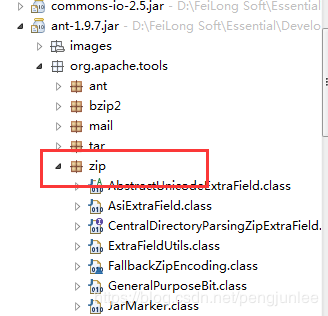

可以看出 `org.apache.tools.zip` 是 `ant-**.jar` 里面的。

 

所以要引入`org.apache.tools.zip`，直接maven引入`ant`即可。

        <!-- https://mvnrepository.com/artifact/org.apache.ant/ant -->
        <dependency>
            <groupId>org.apache.ant</groupId>
            <artifactId>ant</artifactId>
            <version>1.10.5</version>
        </dependency>
 