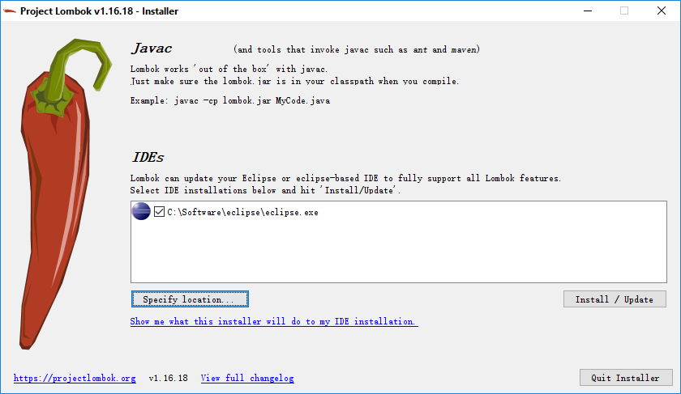
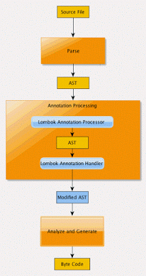

> 转载自：[lombok的使用和原理](https://my.oschina.net/darkness/blog/510808 "lombok的使用和原理")

# 一、项目背景

在写Java程序的时候经常会遇到如下情形：

新建了一个Class类，然后在其中设置了几个字段，最后还需要花费很多时间来建立getter和setter方法。

lombok项目的产生就是为了省去我们手动创建getter和setter方法的麻烦，它能够在我们编译源码的时候自动帮我们生成getter和setter方法。即它最终能够达到的效果是：在源码中没有getter和setter方法，但是在编译生成的字节码文件中有getter和setter方法。

比如源码文件： 

	import java.io.Serializable;  
	   
	import lombok.Data;  
	   
	@Data  
	public class BasicClusterInfo implements Serializable {  
	   
	    private static final long serialVersionUID = 3478135817352393604L;  
	    private String            hbaseKey;  
	    private int               receiverCount;  
	}

以下是编译上述源码文件得到的字节码文件，对其反编译得到的结果  

	public class BasicClusterInfo extends java.lang.Object implements java.io.Serializable{  
	    public BasicClusterInfo();  
	    public java.lang.String getHbaseKey();  
	    public int getReceiverCount();  
	    public void setHbaseKey(java.lang.String);  
	    public void setReceiverCount(int);  
	    public boolean equals(java.lang.Object);  
	    public boolean canEqual(java.lang.Object);  
	    public int hashCode();  
	    public java.lang.String toString();  
	}

# 二、eclipse安装lombok

为**IDE**安装**lombok**插件非常简单，以**eclipse**环境为例，其安装过程分为以下几个步骤：

**1) 下载lombok.jar包**

- lombok的官网地址：<https://projectlombok.org/>
- lombok的下载地址：<https://projectlombok.org/download.html>
- lombok项目的Github地址：<https://github.com/rzwitserloot/lombok>

**2) 运行lombok.jar**

在windows命令行中输入以下命令： 

`java -jar D:\software\lombok.jar`

其中 `D:\software\lombok.jar` 这是**windows**下`lombok.jar`所在的位置， 数秒后将弹出以下对话框，以指定**eclipse**的安装路径。

**3) 确认完eclipse的安装路径后，点击 `install/update` 按钮，即可完成安装。**

**4) 安装完成之后，请确认eclipse安装路径下是否多了一个lombok.jar包，并且其配置文件eclipse.ini中是否添加了如下内容: **

`-javaagent:lombok.jar`  
`-Xbootclasspath/a:lombok.jar`  

那么恭喜你已经安装成功，否则将缺少的部分添加到相应的位置即可 。

**5)重启eclipse。**

# 三、项目中使用lombok

在项目中使用lombok的方法很简单，分为四个步骤：

1. 在需要自动生成getter和setter方法的类上，加上@Data注解。
2. 在编译类路径中加入lombok.jar包，若是maven工程，引入相关依赖即可。 

	<dependencies>
	    <dependency>
	        <groupId>org.projectlombok</groupId>
	        <artifactId>lombok</artifactId>
	        <version>1.16.18</version>
	    </dependency>
	</dependencies>

3. 使用支持lombok的编译工具编译源代码（关于支持lombok的编译工具，见“五、支持lombok的编译工具”）。
4. 编译得到的字节码文件中自动生成了getter和setter方法。 

# 四、原理分析

接下来对lombok的工作原理进行分析，以Oracle的javac编译工具为例。

自从Java 6起，javac就支持`JSR 269 Pluggable Annotation Processing API`规范，只要程序实现了该API，就能在javac运行的时候得到调用。

举例来说，现在有一个实现了`JSR 269 API`的程序A,那么使用javac编译源码的时候具体流程如下：

1. javac对源代码进行分析，生成一棵抽象语法树(AST)。
2. 运行过程中调用实现了"JSR 269 API"的A程序。
3. 此时A程序就可以完成它自己的逻辑，包括修改第一步骤得到的抽象语法树(AST)。
4. javac使用修改后的抽象语法树(AST)生成字节码文件。 

详细的流程图如下： 

# 五、支持lombok的编译工具

- 由“四、原理分析”可知，Oracle javac直接支持lombok。
- 常用的项目管理工具Maven所使用的java编译工具来源于配置的第三方工具，如果我们配置这个第三方工具为Oracle javac的话，那么Maven也就直接支持lombok了。
- Intellij Idea配置的编译工具为Oracle javac的话，也就直接支持lombok了。
- Eclipse中使用的不是Oracle javac这个编译工具，而是自己实现的Eclipse Compiler for Java (ECJ).要想使ECJ支持lombok，得进行设置，具体是在Eclipse程序目录中的eclipse.ini文件中添加如下两行设置：
 

	-javaagent:[lombok.jar所在路径]
	-Xbootclasspath/a:[lombok.jar所在路径]

# 六、常用lombok注解

lombok 提供的注解不多，可以参考官方视频的讲解和官方文档。

Lombok 注解在线帮助文档：<http://projectlombok.org/features/index>

下面是几个比较常用的 lombok 注解：

    @Data   ：注解在类上；提供类所有属性的 getting 和 setting 方法，此外还提供了equals、canEqual、hashCode、toString 方法
    @Setter：注解在属性上；为属性提供 setting 方法
    @Getter：注解在属性上；为属性提供 getting 方法
    @Log4j ：注解在类上；为类提供一个 属性名为log 的 log4j 日志对象
    @NoArgsConstructor：注解在类上；为类提供一个无参的构造方法
    @AllArgsConstructor：注解在类上；为类提供一个全参的构造方法  

# 七、其他问题

现在使用Intellij Idea作为Java项目的IDE，配置Oracle javac作为编译工具。

现在有一个A类，其中有一些字段，没有创建它们的setter和getter方法，使用了lombok的@Data注解，另外有一个B类，它调用了A类实例的相应字段的setter和getter方法。

编译A类和B类所在的项目，并不会报错，因为最终生成的A类字节码文件中存在相应字段的setter和getter方法。但是，IDE发现B类源代码中所使用的A类实例的setter和getter方法在A类源代码中找不到定义，IDE会认为这是错误。

要解决以上这个不是真正错误的错误，可以下载安装Intellij Idea中的"Lombok plugin"。  

# 八、lombok的罪恶
使用lombok虽然能够省去手动创建setter和getter方法的麻烦，但是却大大降低了源代码文件的可读性和完整性，降低了阅读源代码的舒适度。  

# 参考文献
           [1] <http://stackoverflow.com/questions/6107197/how-does-lombok-work>
           [2] <https://projectlombok.org/download.html>
           [3] <http://stackoverflow.com/questions/3061654/what-is-the-difference-between-javac-and-the-eclipse-compiler>
           [4] <http://www.ibm.com/developerworks/library/j-lombok/>
           [5] <http://notatube.blogspot.com/2010/12/project-lombok-creating-custom.html>