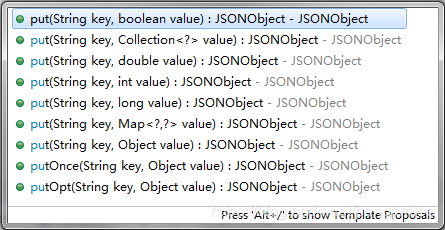
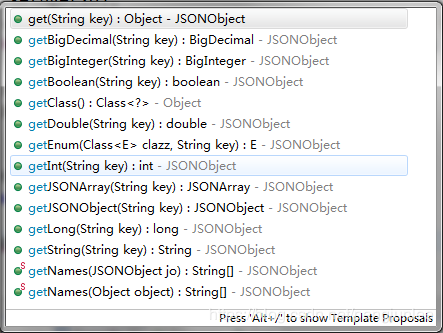

# 引入org.json依赖
在 maven 项目中使用 org.json ，需引入依赖：

	<!-- 引入org.json所需依赖 -->
	<dependency>
		<groupId>org.json</groupId>
		<artifactId>json</artifactId>
		<version>20160810</version>
	</dependency>

# 构建JSONObject
## 直接构建
可以直接使用 new 关键字实例化一个JSONObject对象，然后调用它的 put() 方法对其字段值进行设置。

 范例：

		JSONObject jsonObj = new JSONObject();
		jsonObj.put("female", true);
		jsonObj.put("hobbies", Arrays.asList(new String[] { "yoga", "swimming" }));
		jsonObj.put("discount", 9.5);
		jsonObj.put("age", "26");
		jsonObj.put("features", new HashMap<String, Integer>() {
			private static final long serialVersionUID = 1L;
			{
				put("height", 175);
				put("weight", 70);
			}
		});
		System.out.println(jsonObj);
结果：

	{
		"features": {
			"weight": 70,
			"height": 175
		},
		"hobbies": ["yoga", "swimming"],
		"discount": 9.5,
		"female": true,
		"age": 26
	}

## 使用Map构建
范例：

	Map<String, Object> map = new HashMap<String, Object>();
	map.put("female", true);
	map.put("hobbies", Arrays.asList(new String[] { "yoga", "swimming" }));
	map.put("discount", 9.5);
	map.put("age", "26");
	map.put("features", new HashMap<String, Integer>() {
		private static final long serialVersionUID = 1L;
		{
			put("height", 175);
			put("weight", 70);
		}
	});
	JSONObject jsonObj = new JSONObject(map);
	System.out.println(jsonObj);

程序执行结果与上例相同。

## 使用JavaBean构建
范例：
 
	import java.util.Map;
	 
	public class UserInfo {
	 
		private Boolean female;
		private String[] hobbies;
		private Double discount;
		private Integer age;
		private Map<String, Integer> features;
	 
		public Boolean getFemale() {
			return female;
		}
	 
		public void setFemale(Boolean female) {
			this.female = female;
		}
	 
		public String[] getHobbies() {
			return hobbies;
		}
	 
		public void setHobbies(String[] hobbies) {
			this.hobbies = hobbies;
		}
	 
		public Double getDiscount() {
			return discount;
		}
	 
		public void setDiscount(Double discount) {
			this.discount = discount;
		}
	 
		public Integer getAge() {
			return age;
		}
	 
		public void setAge(Integer age) {
			this.age = age;
		}
	 
		public Map<String, Integer> getFeatures() {
			return features;
		}
	 
		public void setFeatures(Map<String, Integer> features) {
			this.features = features;
		}
	 
	}
 

	UserInfo userInfo = new UserInfo();
	userInfo.setFemale(true);
	userInfo.setHobbies(new String[] { "yoga", "swimming" });
	userInfo.setDiscount(9.5);
	userInfo.setAge(26);
	userInfo.setFeatures(new HashMap<String, Integer>() {
		private static final long serialVersionUID = 1L;
		{
			put("height", 175);
			put("weight", 70);
		}
	});
	JSONObject jsonObj = new JSONObject(userInfo);
	System.out.println(jsonObj);

程序执行结果与上例相同。

# 解析JSONObject
JSONObject为每一种数据类型都提供了一个getXXX(key)方法，例如：获取字符串类型的字段值就使用getString()方法，获取数组类型的字段值就使用getJSONArray()方法。

范例：

	// 获取基本类型数据
	System.out.println("Female: " + jsonObj.getBoolean("female"));
	System.out.println("Discount: " + jsonObj.getDouble("discount"));
	System.out.println("Age: " + jsonObj.getLong("age"));
	
	// 获取JSONObject类型数据
	JSONObject features = jsonObj.getJSONObject("features");
	String[] names = JSONObject.getNames(features);
	System.out.println("Features: ");
	for (int i = 0; i < names.length; i++) {
		System.out.println("\t"+features.get(names[i]));
	}

	// 获取数组类型数据
	JSONArray hobbies = jsonObj.getJSONArray("hobbies");
	System.out.println("Hobbies: ");
	for (int i = 0; i < hobbies.length(); i++) {
		System.out.println("\t"+hobbies.get(i));
	}

结果：

	Female: true
	Discount: 9.5
	Age: 26
	Features: 
		70
		175
	Hobbies: 
		yoga
		swimming