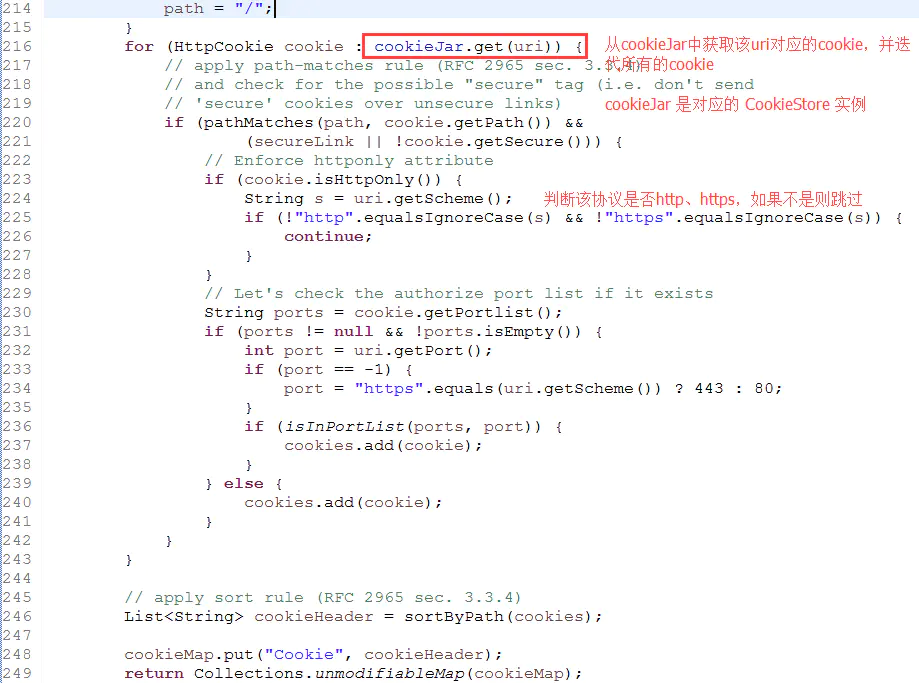
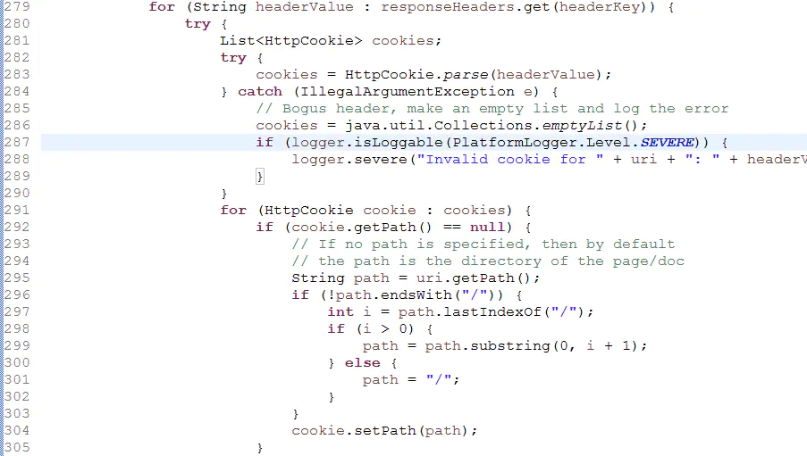
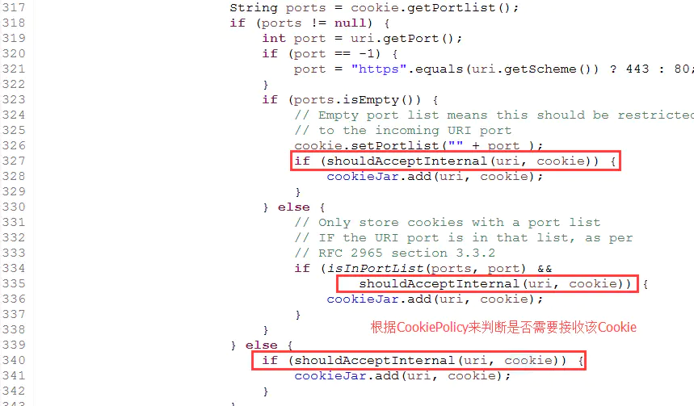
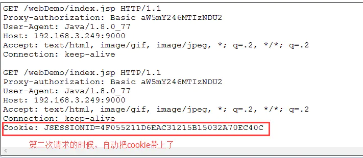

> 原文作者：jijs  
> [HttpURLConnection 中Cookie 使用](https://www.jianshu.com/p/7a18524f1bfa "HttpURLConnection 中Cookie 使用")
> [CookiePolicy 原理解析](https://www.jianshu.com/p/8767434fac92 "CookiePolicy 原理解析")

如果想通过`HttpURLConnection`访问网站，网站返回`cookie`信息，下次再通过`HttpURLConnection`访问时，把网站返回`cookie`信息再返回给该网站。可以使用下面代码。

	CookieManager manager = new CookieManager();
	CookieHandler.setDefault(manager);

通过这两行代码就可以把网站返回的cookie信息存储起来，下次访问网站的时候，自动帮你把cookie信息带上。

CookieManager还可以设置CookiePolicy。设置如下：

	CookieManager manager = new CookieManager();
	//设置cookie策略，只接受与你对话服务器的cookie，而不接收Internet上其它服务器发送的cookie
	manager.setCookiePolicy(CookiePolicy.ACCEPT_ORIGINAL_SERVER);

# CookieHandler 源码分析

	public abstract class CookieHandler {
	
	    private static CookieHandler cookieHandler;
	
	    public synchronized static CookieHandler getDefault() {
	        SecurityManager sm = System.getSecurityManager();
	        if (sm != null) {
	            sm.checkPermission(SecurityConstants.GET_COOKIEHANDLER_PERMISSION);
	        }
	        return cookieHandler;
	    }
	   
	    public synchronized static void setDefault(CookieHandler cHandler) {
	        SecurityManager sm = System.getSecurityManager();
	        if (sm != null) {
	            sm.checkPermission(SecurityConstants.SET_COOKIEHANDLER_PERMISSION);
	        }
	        cookieHandler = cHandler;
	    }
	    
	    public abstract Map<String, List<String>>
	        get(URI uri, Map<String, List<String>> requestHeaders)
	        throws IOException;
	
	    public abstract void
	        put(URI uri, Map<String, List<String>> responseHeaders)
	        throws IOException;
	}

`CookieHandler`是抽象类，内部提供了静态的`setDefault`方法，并且`private static CookieHandler cookieHandler;`是静态的，子类需要实现`get()`和`put()`方法。

- get()方法返回该uri相关的cookie。
- put()方法是存储该uri相关的cookie。

jdk1.6中提供了CookieHandler的实现类`CookieManager`。

# CookieManager 源码分析
## get()方法
`CookieManager.get()`方法实现了从CookieStore中获取该uri对应的cookie。

## put()方法

首先解析http响应头信息中的cookie，并存储到`List<HttpCookie> cookies`中。

循环cookies中的cookie，根据设置的CookiePolicy来判断是否接收该Cookie信息，如果接收则存储到CookieStore。

# Cookie实现机制
这样每次在调用HttpURLConnection访问网站的时候，通过CookieHandler.getDefault()方法获取CookieManager实例（静态的方法，全局都可用）。
从解析http的响应头中的cookie调用CookieHandler中的put方法存放到CookieStore中。
再次访问网站的时候调用CookieHandler中的get方法获取该uri响应的cookie，并提交到该站点中。
这样开发人员就不需要干预cookie信息，则每次访问网站会自动携带cookie。

# 代码示例
本例子中使用到了CookieHandler、CookieManager 、CookieStore、 HttpCookie。

	public class CookieManagerDemo {
	
	    //打印cookie信息
	    public static void printCookie(CookieStore cookieStore){
	        List<HttpCookie> listCookie = cookieStore.getCookies();
	        listCookie.forEach(httpCookie -> {
	            System.out.println("--------------------------------------");
	            System.out.println("class      : "+httpCookie.getClass());
	            System.out.println("comment    : "+httpCookie.getComment());
	            System.out.println("commentURL : "+httpCookie.getCommentURL());
	            System.out.println("discard    : "+httpCookie.getDiscard());
	            System.out.println("domain     : "+httpCookie.getDomain());
	            System.out.println("maxAge     : "+httpCookie.getMaxAge());
	            System.out.println("name       : "+httpCookie.getName());
	            System.out.println("path       : "+httpCookie.getPath());
	            System.out.println("portlist   : "+httpCookie.getPortlist());
	            System.out.println("secure     : "+httpCookie.getSecure());
	            System.out.println("value      : "+httpCookie.getValue());
	            System.out.println("version    : "+httpCookie.getVersion());
	            System.out.println("httpCookie : "+httpCookie);
	        });
	    }
	
	    public static void requestURL() throws Exception{
	        URL url = new URL("http://192.168.3.249:9000/webDemo/index.jsp");
	        HttpURLConnection conn = (HttpURLConnection)url.openConnection();
	        String basic = Base64.getEncoder().encodeToString("infcn:123456".getBytes());
	        conn.setRequestProperty("Proxy-authorization", "Basic " + basic);
	        BufferedReader br = new BufferedReader(new InputStreamReader(conn.getInputStream()));
	        String line = null;
	        while((line=br.readLine())!=null){
	            System.out.println(line);
	        }
	        br.close();
	    }
	
	    public static void main(String[] args) throws Exception {
	        
	        CookieManager manager = new CookieManager();
	        //设置cookie策略，只接受与你对话服务器的cookie，而不接收Internet上其它服务器发送的cookie
	        manager.setCookiePolicy(CookiePolicy.ACCEPT_ORIGINAL_SERVER);
	        CookieHandler.setDefault(manager);
	        
	        printCookie(manager.getCookieStore());
	        //第一次请求
	        requestURL();
	
	        printCookie(manager.getCookieStore());
	        //第二次请求
	        requestURL();
	    }
	    
	}

从抓包结果中发现，第二次访问该站点的时候，会自动携带Cookie信息。

# CookiePolicyCookiePolicy策略机制解析
CookiePolicy策略可以精确控制程序接收那些cookie，拒绝接受那些cookie。

	public interface CookiePolicy {
	
	    public static final CookiePolicy ACCEPT_ALL = new CookiePolicy(){
	        public boolean shouldAccept(URI uri, HttpCookie cookie) {
	            return true;
	        }
	    };
	
	    public static final CookiePolicy ACCEPT_NONE = new CookiePolicy(){
	        public boolean shouldAccept(URI uri, HttpCookie cookie) {
	            return false;
	        }
	    };
	
	    public static final CookiePolicy ACCEPT_ORIGINAL_SERVER  = new CookiePolicy(){
	        public boolean shouldAccept(URI uri, HttpCookie cookie) {
	            if (uri == null || cookie == null)
	                return false;
	            return HttpCookie.domainMatches(cookie.getDomain(), uri.getHost());
	        }
	    };
	
	    public boolean shouldAccept(URI uri, HttpCookie cookie);
	}

从源码中可以看出`CookiePolicy`默认提供了3种策略实现机制：

- CookiePolicy.ACCEPT_ALL 从源码中可以发现直接return true。就是接受所有的cookie。
- CookiePolicy.ACCEPT_NONE 从源码中可以发现直接return false。就是拒绝所有的cookie。
- CookiePolicy.ACCEPT_ORIGINAL_SERVER 内部调用了HttpCookie.domainMatches的方法。该方法是判断cookie的域和URL的域是否一样，如果一样就return true。只接收域名相同的Cookie

如果该cookie策略不满足需求，还可以自己定义策略，只要实现CookiePolicy接口中的`public boolean shouldAccept(URI uri, HttpCookie cookie);`方法即可。

自定义CookiePolicy，只接受URI域名中包含`infcn`或者，cookie域中包含`infcn`的cookie：

	public class MyCookiePolicy implements CookiePolicy{
	    @Override
	    public boolean shouldAccept(URI uri, HttpCookie cookie) {
	        if(uri.getAuthority().toLowerCase().indexOf("infcn")!=-1 
	                || cookie.getDomain().toLowerCase().indexOf("infcn")!=-1){
	            return true;
	        }
	        return false;
	    }
	}

