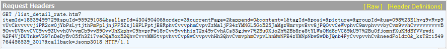

本文将示例如何使用`SpiderHttpUtils`来爬取某知名*猫平台的评论信息。

以<https://detail.tmall.com/item.htm?id=18539499729>宝贝为例，使用Fiddler抓包工具获取到它的评论请求地址如下，其中的 currentPage 参数即为被爬取的评论的页码。

 pom.xml 文件中引入依赖包：

	<parent>
		<groupId>org.springframework.boot</groupId>
		<artifactId>spring-boot-starter-parent</artifactId>
		<version>1.5.7.RELEASE</version>
		<relativePath />
	</parent>
	<dependencies>
		<dependency>
			<groupId>org.apache.commons</groupId>
			<artifactId>commons-text</artifactId>
			<version>1.6</version>
		</dependency>
		<dependency>
			<groupId>org.apdplat</groupId>
			<artifactId>word</artifactId>
			<version>1.3</version>
		</dependency>
		<dependency>
			<groupId>org.json</groupId>
			<artifactId>json</artifactId>
		</dependency>
		<dependency>
			<groupId>junit</groupId>
			<artifactId>junit</artifactId>
			<scope>test</scope>
		</dependency>
	</dependencies>

爬取评论的完整代码如下：

	import java.io.BufferedReader;
	import java.io.BufferedWriter;
	import java.io.File;
	import java.io.FileOutputStream;
	import java.io.FileReader;
	import java.io.FileWriter;
	import java.io.IOException;
	import java.io.OutputStreamWriter;
	import java.text.MessageFormat;
	import java.util.ArrayList;
	import java.util.Collections;
	import java.util.HashMap;
	import java.util.Iterator;
	import java.util.List;
	import java.util.Map;
	import java.util.Random;
	import java.util.regex.Matcher;
	import java.util.regex.Pattern;
	 
	import org.apache.commons.text.StringEscapeUtils;
	import org.apdplat.word.WordSegmenter;
	import org.apdplat.word.segmentation.SegmentationAlgorithm;
	import org.apdplat.word.segmentation.Word;
	import org.json.JSONArray;
	import org.json.JSONObject;
	import org.junit.Test;
	 
	import spider.SpiderHttpUtils;
	 
	public class SpiderTest {
	 
		public Map<String, String> getHeaders() {
			Map<String, String> headers = new HashMap<String, String>();
			headers.put("Host", "rate.tmall.com");
			headers.put("Referer",
					" https://detail.tmall.com/item.htm?spm=a220m.1000858.1000725.1.50be3bd8ewlaTd&id=41504319950&user_id=1975415428&cat_id=2");
			// headers.put("Accept-Language",
			// "zh-CN,zh;q=0.9,en;q=0.8,zh-TW;q=0.7");
			headers.put("User-Agent",
					"Mozilla/5.0 (Windows NT 6.1; Win64; x64) AppleWebKit/537.36 (KHTML, like Gecko) Chrome/71.0.3578.98 Safari/537.36");
			headers.put("Cookie",
					"cna=LuKHFKl4TlECAXQZ4Ux2g/Nd; cookie2=1d8425e75fcbd3cdaa40611db6680374; t=17fe97a643f4e1510f9e2977f9cbdd7d; _tb_token_=5734e153a5d34; otherx=e%3D1%26p%3D*%26s%3D0%26c%3D0%26f%3D0%26g%3D0%26t%3D0; x=__ll%3D-1%26_ato%3D0; dnk=pengjun%5Cu674E; lid=pengjun%E6%9D%8E; hng=CN%7Czh-CN%7CCNY%7C156; sn=%E5%85%A8%E6%A3%89%E6%97%B6%E4%BB%A3%E5%AE%98%E6%96%B9%E6%97%97%E8%88%B0%E5%BA%97%3Azfx; tk_trace=1; tracknick=pengjun%5Cu674E;lgc=pengjun%5Cu674E; enc=0F%2FkiNyKc%2F1vIUcjp6C7VI6tjD6K9gSaTtAQPlmY8CraZFMzXZMEcgDnr0LKd0SvSeKPrUQAqqEU%2Bq0O3aXG4Q%3D%3D; SHTSID=F8504BDA308C40A1867B84AA984C7914; uc1=cookie16=WqG3DMC9UpAPBHGz5QBErFxlCA%3D%3D&cookie21=U%2BGCWk%2F7pY%2FF&cookie15=UtASsssmOIJ0bQ%3D%3D&existShop=false&pas=0&cookie14=UoTZ5OSpoR6Xcg%3D%3D&tag=8&lng=zh_CN; uc3=vt3=F8dByEze4ekEsQsgc1A%3D&id2=VWeT3jqq6jDz&nk2=E6EQ1CLKS%2FnL&lg2=VT5L2FSpMGV7TQ%3D%3D; _l_g_=Ug%3D%3D; unb=682167773; cookie1=V3oTBcYJDILlbjtF3qOSEAd2Amf77M7oTu0rSZnkuIc%3D; login=true; cookie17=VWeT3jqq6jDz; _nk_=pengjun%5Cu674E;csg=1d4e91d8; skt=af3747a6827ebc42; _m_h5_tk=0ca05f482e46af75317d66b214d43689_1550465686263; _m_h5_tk_enc=2c51b947b84a5ef62f7c6523f04bbce9; x5sec=7b22726174656d616e616765723b32223a223762303932326363393666646437303062663361636430393164343932353530434b4731714f4d46454a335338706254376175634a686f4c4e6a67794d5459334e7a637a4f7a453d227d; whl=-1%260%260%260; l=bBN1mgHrvxpFLmphBOCwNQKXnqQTlIRRguSJGpWpi_5LUsvecl7OllzxWUv6Vj5P9zLB42mIJ0JTgFyQ5Ppf.; isg=BMPDJZxTm0CbSVClfvjWFCVzUofBKAVE096Au_WgcyLLtOHWfQtayJoiKgRfFK9y");
			return headers;
		}
	 
		/**
		 * 爬取评论内容
		 */
		@Test
		public void testSpider() throws IOException, InterruptedException {
			// 构建正则表达式对响应内容进行匹配过滤
			String regEx = "jsonp\\d+\\?\\(([\\s\\S]*)\\)";
			Pattern pat = Pattern.compile(regEx);
	 
			// 请求地址
			String url = null;
			// 响应内容
			String retStr = null;
			Random random = new Random();
			// 用来保存评论到文件
			FileOutputStream fos = new FileOutputStream(new File("D:/简柔洁面巾_评论.txt"));
			OutputStreamWriter osw = new OutputStreamWriter(fos, "UTF-8");
			BufferedWriter bw = new BufferedWriter(osw);
			int lineCount = 0;
			// 逐页对评论进行爬取并写入文件
			for (int i = 1; i < 100; i++) {
				System.out.println("开始爬取第 " + i + " 页评论");
				url = MessageFormat.format(
						" https://rate.tmall.com/list_detail_rate.htm?itemId=41504319950&spuId=303661613&sellerId=1975415428&order=3&currentPage={0}&append=0&content=1&tagId=&posi=&picture=&groupId=&ua=098%23E1hvnpvRvphvUvCkvvvvvjiPRLspljEhn2qpsjthPmPyljDvRsLhtjrWPLsyAjn8RphvCvvvphmCvpvZ7Dl0eP5w7Di43kS5PbE4Bxi%2Fz1htvpvhvvCvpUwCvvpv9hCv2QhvCvvvMMGEvpCWvXfYMBlre8g7%2B3%2Bilj7Jyb8rwZDl%2BboJ%2BulABzcGeE9fV5EUAWAXeBOqb64B9Cka%2BfvsxI2heB6t%2BFBCAfyp%2Bu0OjomUy4oGULIKogyCvvOCvhE2zWoivpvUvvCC8Nrej68tvpvIvvCvpvvvvvvvvhOVvvvCw9vvB9OvvUHmvvCVC9vv9ogvvhOVvvmCb9hCvvOv9hCvvvvtvpvhvvCvp8wCvvpvvhHh9phv2HiwJSaQzHi475CnzT6Cvvyv9XRbIQvvD7w%3D&needFold=0&_ksTS=1550459693930_943&callback=jsonp944",
						i);
				retStr = SpiderHttpUtils.sendGet(true, url, null, getHeaders(), "utf-8");
				Thread.sleep(random.nextInt(4000) + 2000);
				Matcher mat = pat.matcher(retStr);
				if (mat.find()) {
					String jsonstr = mat.group(1);
					String finalJson = StringEscapeUtils.unescapeJava(jsonstr);
					try {
						JSONObject retJson = new JSONObject(finalJson);
						JSONObject rateDetail = retJson.getJSONObject("rateDetail");
						JSONArray rateList = rateDetail.getJSONArray("rateList");
						for (int index = 0; index < rateList.length(); index++) {
							JSONObject jsonObject = rateList.getJSONObject(index);
							bw.write(jsonObject.getString("rateContent"));
							lineCount += 1;
							bw.newLine();
						}
					} catch (Exception e) {
						e.printStackTrace();
						System.out.println(jsonstr);
						// break;
					}
				}
			}
			// 关闭文件流
			bw.close();
			System.out.println("共爬取 " + lineCount + " 行评论");
		}
	 
		/**
		 * 对爬取到的评论内容进行分词
		 */
		@Test
		public void testWord() throws IOException {
			FileReader reader = new FileReader("D:/简柔洁面巾_评论.txt");
			BufferedReader br = new BufferedReader(reader);
			String str = null;
			Map<String, IKWord> map = new HashMap<String, IKWord>();
			while ((str = br.readLine()) != null) {
				List<Word> words = WordSegmenter.seg(str, SegmentationAlgorithm.BidirectionalMaximumMatching);
				for (Word word : words) {
					String text = word.getText();
					IKWord ikWord = map.get(text);
					if (map.containsKey(text)) {
						ikWord.addCount(1);
					} else {
						ikWord = new IKWord();
						ikWord.setWord(text);
						ikWord.setCount(1);
						map.put(text, ikWord);
					}
				}
			}
			br.close();
			reader.close();
	 
			FileWriter writer = new FileWriter("D:/简柔洁面巾_分词.txt");
			BufferedWriter bw = new BufferedWriter(writer);
			List<IKWord> list = new ArrayList<IKWord>();
			list.addAll(map.values());
			Collections.sort(list);
			Iterator<IKWord> iterator = list.iterator();
			while (iterator.hasNext()) {
				IKWord next = iterator.next();
				bw.write(next.getWord() + " " + next.getCount());
				bw.newLine();
			}
			bw.close();
			writer.close();
		}
	}

 

	public class IKWord implements Comparable<IKWord> {
	 
		private Integer count;
	 
		private String word;
	 
		@Override
		public int compareTo(IKWord that) {
			return that.count - this.count;
		}
	 
		public boolean equals(IKWord that) {
			return (this.word.equals(that.word));
		}
	 
		public Integer getCount() {
			return count;
		}
	 
		public void setCount(Integer count) {
			this.count = count;
		}
	 
		public String getWord() {
			return word;
		}
	 
		public void setWord(String word) {
			this.word = word;
		}
	 
		public void addCount(Integer count) {
			this.count += count;
		}
	 
	}
 