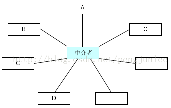
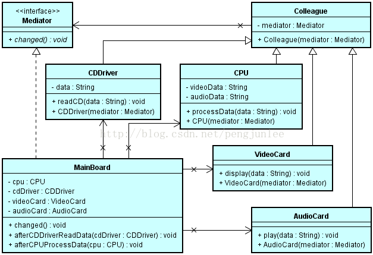

# 一、什么是中介者模式
中介者(Mediator)模式（亦被称为调停者模式）是一种对象的行为模式。用一个中介对象来封装一系列的对象交互。中介者使各对象不需要显式地相互引用，从而使其耦合松散，而且可以独立地改变它们之间的交互。

中介者模式的本质：封装交互

设计意图：面向对象设计鼓励将行为分布到各个对象中。这种分布可能会导致多个对象之间需要相互交互，从而形成紧密耦合，不利于对象的修改和维护。在最坏的情况下,每一个对象都需要知道其他所有对象，如下图所示。

虽然将一个系统分割成许多对象通常可以增强可复用性，但是对象间相互连接的激增又会降低其可复用性。大量的相互连接使得一个对象似乎不太可能在没有其他对象的支持下工作----系统表现为一个不可分割的整体。而且，对系统的行为进行任何较大的改动都十分困难，因为行为被分布在许多对象中。结果是：你可能不得不定义很多子类以定制系统的行为。

中介者模式通过引入一个中介对象，形成了一个以中介者为中心的星形结构，如下图所示。某一个对象不再通过直接的联系与另一个对象发生相互作用，而是让所有的对象都只和中介者对象进行交互，从而实现了对象之间的解耦。中介者对象的存在保证了对象结构上的稳定，也就是说，系统的结构不会因为新对象的引入造成大量的修改工作。

# 二、中介者模式的结构
 

中介者模式涉及的角色及其职责如下：

- 抽象中介者(Mediator)角色：一般定义为接口，用来定义各个同事之间交互需要的方法，可以是公共的通信方法，比如 changed()方法，大家都用，也可以是小范围的交互方法。

- 具体中介者(ConcreteMediator)角色：实现Mediator中定义的接口，它需要了解并维护各个同事对象，并负责具体的协调各同事对象的交互关系。

- 抽象同事(Colleague)角色：通常实现成为抽象类，主要负责约束同事对象的类型，并实现一些具体同事类之间的公共功能，比如，每个具体同事类都应该知道中介者对象，也就是具体同事类都会持有中介者对象，都可以定义到这个类里面。

- 具体同事(ConcreteColleague)角色：继承自Colleague，实现自己的业务，在需要与其他同事通信的时候，就与持有的中介者通信，中介者负责与他的同事交互。

中介者模式结构示意源代码如下：

先来看看所有同事的父类的定义。

	/**
	 * 同事类的抽象父类
	 */
	public abstract class Colleague {
	 
		/**
		 * 持有中介者对象，每一个同事类都知道它的中介者对象
		 */
		private Mediator mediator;
	 
		public Colleague(Mediator mediator) {
			this.mediator = mediator;
		}
	 
		/**
		 * 获取当前同事类对应的中介者对象
		 */
		public Mediator getMediator() {
			return mediator;
		}
	}

再来看看具体的同事类，在示意中它们的实现是差不多的，示例代码如下。  

	/**
	 * 具体的同事类A
	 */
	public class ConcreteColleagueA extends Colleague {
	 
		public ConcreteColleagueA(Mediator mediator) {
			super(mediator);
		}
	 
		public void someOperation() {
			// 在需要跟其他同事通信的时候，通知中介者对象
			getMediator().changed(this);
		}
	}
 

	/**
	 * 具体的同事类B
	 */
	public class ConcreteColleagueB extends Colleague {
	 
		public ConcreteColleagueB(Mediator mediator){
			super(mediator);
		}
		
		public void someOperation(){
			//在需要跟其他同事通信的时候，通知中介者对象
			getMediator().changed(this);
		}
	}

接下来看看中介者接口的定义，示例代码如下。  

	/**
	 * 中介者，定义各个同事对象通信的接口
	 */
	public interface Mediator {
	 
		/**
		 * 同事对象在自身改变的时候来通知中介者的方法，让中介者负责相应的与其他同事对象的交互
		 */
		public void changed(Colleague colleague);
	}

最后来看看具体的中介者实现，示例代码如下。  

	/**
	 * 具体的中介者实现
	 */
	public class ConcreteMediator implements Mediator {
	 
		/**
		 * 持有并维护同事A
		 */
		private ConcreteColleagueA colleagueA;
		/**
		 * 持有并维护同事B
		 */
		private ConcreteColleagueB colleagueB;
	 
		/**
		 * 设置中介者需要了解并维护的同事A对象
		 */
		public void setConcreteColleagueA(ConcreteColleagueA colleagueA) {
			this.colleagueA = colleagueA;
		}
	 
		/**
		 * 设置中介者需要了解并维护的同事B对象
		 */
		public void setConcreteColleagueB(ConcreteColleagueB colleagueB) {
			this.colleagueB = colleagueB;
		}
	 
		@Override
		public void changed(Colleague colleague) {
			// 某个同事类发生了变化，通常需要与其他同事交互
			// 具体协调相应的同事对象来实现协作行为
	 
		}
	 
	}

# 三、中介者模式应用举例
《研磨设计模式》中给出这么一个场景：使用电脑来看电影。  
在日常生活中，我们经常使用电脑来看电影，把这个过程描述出来，简化后假定会有如下的交互过程：

1. 首先是光驱要读取光盘上的数据，然后告诉主板，它的状态改变了。
2. 主板去得到光驱的数据，把这些数据交给CPU进行分析处理。
3. CPU处理完后，把数据分成了视频数据和音频数据，通知主板，它处理完了。
4. 主板去得到CPU处理过后的数据，分别把数据交给显卡和声卡，去显示视频和播放声音。

如果使用调停者模式把这个过程描述出来，该如何具体实现呢？

要使用调停者模式来实现示例，首先要区分出同事对象和调停者对象。很明显，主板是中介者，而光驱、声卡、CPU、显卡等配件，都是作为同事对象。

根据中介者模式的知识，设计出的程序类图结构如下。

下面来看看代码实现，会更清楚。

抽象同事类的定义跟标准的实现是差不多的，示例代码如下。

	/**
	 * 抽象同事类
	 */
	public abstract class Colleague {
	 
		// 持有一个中介者对象
		private Mediator mediator;
	 
		/**
		 * 构造函数
		 */
		public Colleague(Mediator mediator) {
			this.mediator = mediator;
		}
	 
		/**
		 * 获取当前同事类对应的中介者对象
		 */
		public Mediator getMediator() {
			return mediator;
		}
	}

定义众多的同事类，示例代码如下。 

	/**
	 * 光驱类，一个同事类
	 */
	public class CDDriver extends Colleague {
	 
		// 光驱读取出来的数据
		private String data = "";
	 
		/**
		 * 构造函数
		 */
		public CDDriver(Mediator mediator) {
			super(mediator);
		}
	 
		/**
		 * 获取光盘读取出来的数据
		 */
		public String getData() {
			return data;
		}
	 
		/**
		 * 读取光盘
		 */
		public void readCD(String data) {
			// 逗号前是视频显示的数据，逗号后是声音
			this.data = data;
			// 通知主板，自己的状态发生了改变
			getMediator().changed(this);
		}
	}
 

		/**
		 * CPU类，一个同事类
		 */
		public class CPU extends Colleague {
		 
			// 分解出来的视频数据
			private String videoData = "";
			// 分解出来的声音数据
			private String audioData = "";
		 
			/**
			 * 构造函数
			 */
			public CPU(Mediator mediator) {
				super(mediator);
			}
		 
			/**
			 * 获取分解出来的视频数据
			 */
			public String getVideoData() {
				return videoData;
			}
		 
			/**
			 * 获取分解出来的声音数据
			 */
			public String getAudioData() {
				return audioData;
			}
		 
			/**
			 * 处理数据，把数据分成视频和音频的数据
			 */
			public void processData(String data) {
				// 把数据分解开，前面是视频数据，后面是音频数据
				String[] array = data.split(",");
				this.videoData = array[0];
				this.audioData = array[1];
				// 通知主板，CPU完成工作
				getMediator().changed(this);
			}
		}
 

	/**
	 * 显卡类，一个同事类
	 */
	public class VideoCard extends Colleague {
		
		/**
		 * 构造函数
		 */
		public VideoCard(Mediator mediator) {
			super(mediator);
		}
	 
		/**
		 * 显示视频数据
		 */
		public void display(String data) {
			System.out.println("您正在观看的是：" + data);
		}
	}
 

	/**
	 * 声卡类，一个同事类
	 */
	public class AudioCard extends Colleague {
	 
		/**
		 * 构造函数
		 */
		public AudioCard(Mediator mediator) {
			super(mediator);
		}
	 
		/**
		 * 播放音频数据
		 */
		public void play(String data) {
			System.out.println("画外音：" + data);
		}
	}

接下来看看抽象中介者的定义，此处仅定义一个让同事对象在自身改变的时候来通知中介者的接口，示例代码如下。 

	/**
	 * 中介者接口
	 */
	public interface Mediator {
		/**
		 * 同事对象在自身改变的时候来通知中介者的方法 让中介者去负责相应的与其他同事对象的交互
		 */
		public void changed(Colleague c);
	}

再来看看具体中介者的实现，示例代码如下。 

	/**
	 * 主板类，实现中介者接口
	 */
	public class MainBoard implements Mediator {
	 
		// 需要知道要交互的同事类——光驱类
		private CDDriver cdDriver = null;
		// 需要知道要交互的同事类——CPU类
		private CPU cpu = null;
		// 需要知道要交互的同事类——显卡类
		private VideoCard videoCard = null;
		// 需要知道要交互的同事类——声卡类
		private AudioCard audioCard = null;
	 
		public void setCdDriver(CDDriver cdDriver) {
			this.cdDriver = cdDriver;
		}
	 
		public void setCpu(CPU cpu) {
			this.cpu = cpu;
		}
	 
		public void setVideoCard(VideoCard videoCard) {
			this.videoCard = videoCard;
		}
	 
		public void setAudioCard(AudioCard audioCard) {
			this.audioCard = audioCard;
		}
	 
		@Override
		public void changed(Colleague c) {
			if (c instanceof CDDriver) {
				// 表示光驱已经读取数据了
				this.afterCDDriverReadData((CDDriver) c);
			} else if (c instanceof CPU) {
				// 表示CPU已经处理数据了
				this.afterCPUProcessData((CPU) c);
			}
		}
	 
		/**
		 * 光驱读取数据以后与其他对象的交互
		 */
		private void afterCDDriverReadData(CDDriver cd) {
			// 先获取光驱读取的数据
			String data = cd.getData();
			// 把这些数据传递给CPU进行处理
			cpu.processData(data);
		}
	 
		/**
		 * CPU处理完数据后与其他对象的交互
		 */
	 
		private void afterCPUProcessData(CPU cpu) {
			// 先获取CPU处理后的数据
			String videoData = cpu.getVideoData();
			String audioData = cpu.getAudioData();
			// 把这些数据传递给显卡和声卡展示出来
			videoCard.display(videoData);
			audioCard.play(audioData);
		}
	 
	}

大功告成，在客户端中测试一下，示例代码如下。 

	public class Client {
		public static void main(String[] args) {
			// 创建中介者——主板
			MainBoard mediator = new MainBoard();
			// 创建同事类
			CDDriver cdDriver = new CDDriver(mediator);
			CPU cpu = new CPU(mediator);
			VideoCard videoCard = new VideoCard(mediator);
			AudioCard audioCard = new AudioCard(mediator);
			// 让中介者知道所有同事
			mediator.setCdDriver(cdDriver);
			mediator.setCpu(cpu);
			mediator.setVideoCard(videoCard);
			mediator.setAudioCard(audioCard);
			// 开始看电影，把光盘放入光驱，光驱开始读盘
			cdDriver.readCD("东京热,真的好热！");
	 
		}
	}

运行程序打印结果如下：  

您正在观看的是：东京热  
画外音：真的好热！  

如上例所示，对于光驱对象、CPU对象、显卡对象和声卡对象，需要相互交互，虽然只是简单演示，但是也能看出来，它们的交互是比较麻烦的，于是定义一个中介者对象----主板对象，来维护它们之间的交互关系，从而使得这些对象松散耦合。  
如果这个时候需要修改它们的交互关系，直接到中介者里面修改就好了，也就是说它们的关系已经独立封装到中介者对象里面了，可以独立地改变它们之间的交互关系，而不用去修改这些同事对象。  

# 四、广义中介者
在实际应用开发中，经常会使用简化版的中介者模式进行开发，被称为广义中介者，常有如下简化:

- 通常会去掉同事对象的父类，这样可以让任意的对象，只要需要相互交互，就可以成为同事。 
- 通常不定义Mediator接口，把具体的中介者对象实现成为单例。
- 同事对象不再持有中介者，而是在需要的时候直接获取中介者对象并调用；中介者也不再持有同事对象，而是在具体处理方法里面去创建，或者获取，或者从参数传入需要的同事对象。  

# 五、中介者模式的优缺点
**使用中介者模式的优点**：

- 松散耦合   
中介者模式通过把多个同事对象之间的交互封装到中介者对象里面，从而使得同事对象之间松散耦合，基本上可以做到互补依赖。这样一来，同事对象就可以独立地变化和复用，而不再像以前那样“牵一处而动全身”了。

- 集中控制交互  
多个同事对象的交互，被封装在中介者对象里面集中管理，使得这些交互行为发生变化的时候，只需要修改中介者对象就可以了，当然如果是已经做好的系统，那么就扩展中介者对象，而各个同事类不需要做修改。

- 多对多变成一对多  
没有使用中介者模式的时候，同事对象之间的关系通常是多对多的，引入中介者对象以后，中介者对象和同事对象的关系通常变成双向的一对多，这会让对象的关系更容易理解和实现。 

**使用中介者模式的缺点**：

中介者模式的一个潜在缺点是，过度集中化。如果同事对象的交互非常多，而且比较复杂，当这些复杂性全部集中到中介者的时候，会导致中介者对象变得十分复杂，而且难于管理和维护。  

# 六、中介者模式的适用性
在以下条件下可以考虑使用中介者模式：

- 如果一组对象之间的通信方式比较复杂，导致相互依赖、结构混乱，可以采用中介者模式，把这些对象相互的交互管理起来，各个对象都只需要和中介者交互，从而使得各个对象松散耦合，结构也更清晰易懂。
- 如果一个对象引用很多的对象，并直接跟这些对象交互，导致难以复用该对象，可以采用中介者模式，把这个对象跟其他对象的交互封装到中介者对象里面，这个对象只需要和中介者对象交互就可以了。  

# 七、总结
中介者模式通过引入一个中介对象，让其他的对象都只和中介对象交互，而中介对象知道如何和其他所有的对象交互，这样对象之间的交互关系就没有了，从而实现了对象之间的解耦。

对于中介对象而言，所有相互交互的对象，被视为同事类，中介对象就是来维护各个同事之间的关系，而所有的同事类都只是和中介对象交互。

每个同事对象，当自己发生变化的时候，不需要知道这会引起其他对象有什么变化，它只需要通知中介者就可以了，然后由中介者去与其他对象交互。这样松散耦合带来的好处是，除了让同事对象之间相互没有关联外，还有利于功能的修改和扩展。
有了中介者以后，所有的交互都封装到中介者对象里面，各个对象就不再需要维护这些关系了。扩展关系的时候也只需要扩展或修改中介者对象就可以了。  