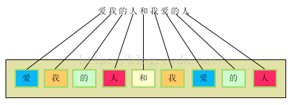
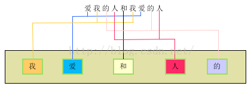
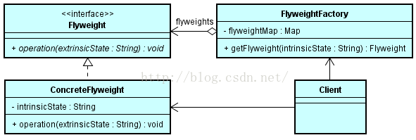
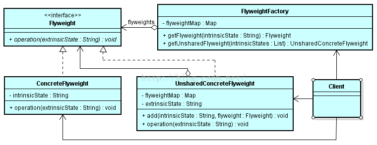
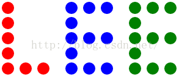

# 一、什么是享元模式
享元Flyweight模式是构造型模式之一，它通过共享数据使得相同对象在内存中仅创建一个实例，以降低系统创建对象实例的性能消耗。

以博客里写文章为例来说吧，把文章和文章中的文字看作对象，我们每在博客里写一个字就相当于是创建一个文字对象，假如我们写的文章有一万个字，那我们岂不是要创建一万次文字对象，如此频繁的创建对象势必会严重拖累系统的性能。

享元模式通过数据共享使得重复使用的相同对象在内存中仅创建一次：这就好比汉字中的 “的” 字虽然在文章中反复出现，但它仅在第一次被使用的时候创建 “的” (共享对象)并保存起来，之后再用到 “的” 字的话直接获取之前创建好的 “的” 对象即可，不需要再次创建了。

下面是两张使用享元模式前后的对比图，看完这两张图相信大家就能理解享元模式的作用了。

使用享元模式前： 

使用享元模式后： 

# 二、享元模式在Java中的典型应用
在Java语言中，String类型就使用了享元模式。String对象是final类型，对象一旦创建就不可改变，同时JAVA会确保一个字符串常量（例如："Flyweight"）在常量池中只能存在一份拷贝,例如下面这段简单代码： 

	  String str1="Flyweight";
	  String str2="Flyweight";
	 
	  if(str1==str2){
	   System.out.println("str1与str2指向同一对象");
	  }
	  else
	  {
	   System.out.println("str1与str2指向不同对象");
	  }

打印结果：

`str1与str2指向同一对象  `

在以上代码中if语句比较的是对象str1和str2中存储的内存地址是否相同，从最终的打印结果可以看出：两次创建的字符串常量"Flyweight"内存地址相同，即两个字符串其实是同一个对象。

# 三、享元模式的结构
享元模式分为单纯享元模式和复合享元模式两种。

## 单纯享元模式

单纯享元模式涉及的角色及其职责如下：

- 抽象享元(Flyweight)角色：所有具体享元类的父类或实现的接口，以规定所有具体享元角色需要实现的方法。
- 具体享元(ConcreteFlyweight)角色：又叫单纯享元角色，是抽象享元角色的具体实现类，如果有内蕴状态的话，它负责为内蕴状态提供存储空间。具体享元对象的内蕴状态必须与对象所处的周围环境无关，从而使得享元对象可以在系统内共享。
- 享元工厂(FlyweightFactory)角色：负责创建和管理享元角色。本角色必须保证享元对象可以被系统适当地共享。当客户端调用某个享元对象的时候，享元工厂角色会检查系统中是否已经存在符合要求的享元对象，如果已经存在则直接提供，若不存在则新创建一个。

单纯享元模式结构示意源代码如下：

在单纯的享元模式中，Flyweight接口用以规定出所有具体享元角色需要实现的方法。

	public interface Flyweight {
	 
		/**
		 * 用以规定所有具体享元角色需要实现的方法.
		 */
		void operation(String extrinsicState);
	 
	}

具体享元ConcreteFlyweight一方面要保存需共享的内蕴状态，另一方面将外蕴状态作为参数传入operation()方法中，可改变方法的行为，但并不改变对象的内蕴状态。 

	public class ConcreteFlyweight implements Flyweight {
	 
		private String intrinsicState = null;
	 
		/**
		 * 构造函数中内蕴状态作为参数传入.
		 */
		public ConcreteFlyweight(String intrinsicState) {
			this.intrinsicState = intrinsicState;
		}
	 
		/**
		 * 外蕴状态作为参数传入方法中，可改变方法的行为，但并不改变对象的内蕴状态.
		 */
		@Override
		public void operation(String extrinsicState) {
			System.out.println();
			System.out.println("内蕴状态：" + intrinsicState);
			System.out.println("外蕴状态：" + extrinsicState);
			System.out.println("&&&&&&&&&&&&&&&&&&&&&&&&&&&&&&");
		}
	 
		public String toString() {
			return this.intrinsicState;
		}
	}

享元工厂FlyweightFactory负责维护一个享元对象存储池（Flyweight Pool）来存放内部状态的对象。为了调用方便，该工厂类一般使用单例模式来实现。  

	import java.util.HashMap;
	import java.util.Map;
	 
	public class FlyweightFactory {
	 
		// 用来登记和存储已经创建过的享元对象
		private Map<String, Flyweight> flyweightMap = new HashMap<String, Flyweight>();
	 
		// 采用单例模式
		private static FlyweightFactory flyweightFactory = new FlyweightFactory();
	 
		// 私有化享元工厂的构造方法
		private FlyweightFactory() {
		}
	 
		// 获取单例享元工厂的实例
		public static FlyweightFactory getFlyweightFactory() {
			return flyweightFactory;
		}
	 
		public Flyweight getFlyweight(String intrinsicState) {
			Flyweight flyweight = flyweightMap.get(intrinsicState);
			if (null == flyweight) {
				flyweight = new ConcreteFlyweight(intrinsicState);
				flyweightMap.put(intrinsicState, flyweight);
			}
			return flyweight;
		}
	 
		public Map<String, Flyweight> getFlyweightMap() {
			return flyweightMap;
		}
	 
	}

在Client类中创建的main()方法中进行测试。 

	import java.util.Map.Entry;
	 
	public class Client {
	 
		public static void main(String[] args) {
			FlyweightFactory flyweightFactory = FlyweightFactory.getFlyweightFactory();
			flyweightFactory.getFlyweight("爱").operation("位置1");
			flyweightFactory.getFlyweight("我").operation("位置2");
			flyweightFactory.getFlyweight("的").operation("位置3");
			flyweightFactory.getFlyweight("人").operation("位置4");
			flyweightFactory.getFlyweight("和").operation("位置5");
			flyweightFactory.getFlyweight("我").operation("位置6");
			flyweightFactory.getFlyweight("爱").operation("位置7");
			flyweightFactory.getFlyweight("的").operation("位置8");
			flyweightFactory.getFlyweight("人").operation("位置9");
			
			System.out.println("已存储的享元对象个数："+flyweightFactory.getFlyweightMap().size()+"个");
			for (Entry<String, Flyweight> entry : flyweightFactory.getFlyweightMap().entrySet()) {
				System.out.println(entry.getValue());
			}
	 
		}
	 
	}

运行程序打印结果如下：  

内蕴状态：爱  
外蕴状态：位置1  
&&&&&&&&&&&&&&&&&&&&&&&&&&&&&&  

内蕴状态：我  
外蕴状态：位置2  
&&&&&&&&&&&&&&&&&&&&&&&&&&&&&&  

内蕴状态：的  
外蕴状态：位置3  
&&&&&&&&&&&&&&&&&&&&&&&&&&&&&&  

内蕴状态：人  
外蕴状态：位置4  
&&&&&&&&&&&&&&&&&&&&&&&&&&&&&&  

内蕴状态：和  
外蕴状态：位置5  
&&&&&&&&&&&&&&&&&&&&&&&&&&&&&&  

内蕴状态：我   
外蕴状态：位置6  
&&&&&&&&&&&&&&&&&&&&&&&&&&&&&&  

内蕴状态：爱  
外蕴状态：位置7  
&&&&&&&&&&&&&&&&&&&&&&&&&&&&&&  

内蕴状态：的  
外蕴状态：位置8  
&&&&&&&&&&&&&&&&&&&&&&&&&&&&&&  

内蕴状态：人  
外蕴状态：位置9  
&&&&&&&&&&&&&&&&&&&&&&&&&&&&&&  
已存储的享元对象个数：5个  
爱  
我  
的  
人  
和  

从以上程序的运行结果不难看出，虽然我们新建了9个Flyweight对象，但在内存池中实际上只有5个，这就是共享的含义。 

## 复合享元模式 
在单纯享元模式中，所有的享元对象都是单纯享元对象，也就是说都是可以直接共享的。还有一种较为复杂的情况，将一些单纯享元对象使用合成模式加以组合，形成复合享元对象。这样的复合享元对象本身不能共享，但是它们可以分解成单纯享元对象，而后者则可以共享。  

与单纯享元模式相比，复合享元模式增加了一个复合享元(UnsharedConcreteFlyweight)角色，复合享元角色所代表的对象是不可以共享的，又称作不可共享的享元对象。

复合享元角色实现了抽象享元角色所规定的接口，也就是operation()方法，这个方法有一个参数，代表复合享元对象的外蕴状态。一个复合享元对象的所有单纯享元对象的外蕴状态都是与复合享元对象的外蕴状态相等的；而一个复合享元对象所含有的单纯享元对象的内蕴状态一般是不相等的，不然就没有使用价值了。

复合享元模式本质上就相当于将原本掺杂在一起的单纯享元对象，根据不同的外蕴状态重新进行了二次分组。这就好比在饭店点餐时，饭店会将不同顾客点的菜记录在顾客自己的点菜单(账单)上一样，与将所有顾客点的菜都记录到一个点菜单上相比，分开记录很明显更便于管理、一目了然，接下来我们就以点餐为例来学习复合享元模式。

复合享元模式与单纯享元模式的差异代码如下：

首先复合享元模式增加了一个不可共享的复合享元(UnsharedConcreteFlyweight)角色。 

	import java.util.HashMap;
	import java.util.Map;
	 
	public class UnsharedConcreteFlyweight implements Flyweight {
		
		//用来登记和存储已经创建过的享元对象
		private Map<String, Flyweight> flyweightMap = new HashMap<String, Flyweight>();
		
		//指定所有享元对象的外蕴状态
		private String extrinsicState = null;
	 
		// 增加一个新的单纯享元对象到集合中
		public void add(String intrinsicState, Flyweight flyweight) {
			flyweightMap.put(intrinsicState, flyweight);
		}
	 
		@Override
		public void operation(String extrinsicState) {
			this.extrinsicState = extrinsicState;
		}
	 
		public void getFlyweight(String intrinsicState){
			Flyweight flyweight=flyweightMap.get(intrinsicState);
			if(null!=flyweight){
				flyweight.operation(extrinsicState);
			}
			else{
				System.out.println();
				System.out.println(extrinsicState+"未点过:"+intrinsicState);
				System.out.println("&&&&&&&&&&&&&&&&&&&&&&&&&&&");
			}
		}
	 
		public Map<String, Flyweight> getFlyweightMap() {
			return flyweightMap;
		}
		
	}

享元工厂FlyweightFactory仅需添加一个用于获取复合享元对象的getUnsharedFlyweight()方法，其他代码无需修改。 

	public class FlyweightFactory {
	 
		/**
		 * 此处省略单纯享元模式中享元工厂已有代码
		 * ...
		 * ...
		 * 原有代码不变，仅新增一个getUnsharedFlyweight()方法.
		 */
	 
		public UnsharedConcreteFlyweight getUnsharedFlyweight(List<String> intrinsicStates) {
			UnsharedConcreteFlyweight unsharedFlyweight = new UnsharedConcreteFlyweight();
			for (String intrinsicState : intrinsicStates) {
				unsharedFlyweight.add(intrinsicState, getFlyweight(intrinsicState));
			}
			return unsharedFlyweight;
		}
	 
	}

在Client客户端类进行测试，其修改后代码如下。 

	import java.util.ArrayList;
	import java.util.List;
	 
	public class Client {
	 
		public static void main(String[] args) {
		List<String> intrinsicStates = new ArrayList<String>();
	        intrinsicStates.add("木须肉");
	        intrinsicStates.add("地三鲜");
	        intrinsicStates.add("孜然牛肉");
	        
	        FlyweightFactory flyFactory =FlyweightFactory.getFlyweightFactory();
	        
	        UnsharedConcreteFlyweight unsharedFlyweight1 = flyFactory.getUnsharedFlyweight(intrinsicStates);
	        UnsharedConcreteFlyweight unsharedFlyweight2 = flyFactory.getUnsharedFlyweight(intrinsicStates);
	        
	        System.out.println("复合享元对象是否可以共享：" + (unsharedFlyweight1 == unsharedFlyweight2));
	       
	        unsharedFlyweight1.operation("一号桌");
	        unsharedFlyweight2.operation("五号桌");
	        
	        //开始给一号桌上菜了
	        unsharedFlyweight1.getFlyweight("木须肉");
	        unsharedFlyweight1.getFlyweight("地三鲜");
	        unsharedFlyweight1.getFlyweight("孜然牛肉");
	        unsharedFlyweight1.getFlyweight("霸王餐");
	        
	        System.out.println();
	        
	        String intrinsicState ="木须肉";
	        Flyweight flyweight1 = unsharedFlyweight1.getFlyweightMap().get(intrinsicState);
	        Flyweight flyweight2 = unsharedFlyweight2.getFlyweightMap().get(intrinsicState);
	        System.out.println("不同复合享元对象中的单纯享元对象是否可以共享：" + (flyweight1 == flyweight2));
		}
	 
	}

运行程序打印结果如下：  

复合享元对象是否可以共享：false

内蕴状态：木须肉  
外蕴状态：一号桌  
&&&&&&&&&&&&&&&&&&&&&&&&&&&

内蕴状态：地三鲜  
外蕴状态：一号桌  
&&&&&&&&&&&&&&&&&&&&&&&&&&&

内蕴状态：孜然牛肉  
外蕴状态：一号桌  
&&&&&&&&&&&&&&&&&&&&&&&&&&&

一号桌未点过:霸王餐  
&&&&&&&&&&&&&&&&&&&&&&&&&&&

不同复合享元对象中的单纯享元对象是否可以共享：true  

# 四、享元模式应用举例
场景：如下图所示，我们要做一个画图程序，为简单起见，假设该画图程序仅能画相同大小(直径20mm)的圆，但圆的颜色和位置可以不同。 

如果想要使用享元模式来对该画图程序进行设计的话，首先要提取出享元对象(圆)的内蕴状态和外蕴状态。

内蕴状态：圆的颜色。  
外蕴状态：圆的位置。

接下来，首先定义享元对象的抽象接口Circle，只含有一个draw()方法。

	public interface Circle {
	 
		//画圆方法，需传入绘制的坐标x,y
		void draw(int x,int y);
	}

然后再定义具体享元角色类ConcreteCircle。

	import java.awt.Color;
	 
	public class ConcreteCircle implements Circle {
		
		//内蕴状态，圆的颜色
		private Color color;
		
		//构造函数中内蕴状态作为参数传入.
		public ConcreteCircle(Color color){
			super();
			this.color=color;
		}
	 
		// 外蕴状态作为参数传入绘图方法中，用以指定绘图位置.
		@Override
		public void draw(int x, int y) {
			System.out.println("圆的颜色："+this.color+"，坐标：X "+x+",Y "+y+"。");
		}
	 
	}

再定义享元工厂类CircleFactory。

	import java.awt.Color;
	import java.util.HashMap;
	import java.util.Map;
	 
	public class CircleFactory {
	 
		private Map<Color, Circle> circleMap = new HashMap<Color, Circle>();
	 
		// 采用单例模式
		private static CircleFactory circleFactory = new CircleFactory();
	 
		// 私有化享元工厂的构造方法
		private CircleFactory() {
		}
	 
		// 获取单例享元工厂的实例
		public static CircleFactory getCircleFactory() {
			return circleFactory;
		}
	 
		public Circle getCircle(Color color) {
			Circle circle = circleMap.get(color);
			if (null == circle) {
				circle = new ConcreteCircle(color);
				circleMap.put(color, circle);
			}
			return circle;
		}
	}

最后创建客户端Client类。

	import java.awt.Color;
	 
	public class Client {
		
		public static void main(String[] args) {
			/**
			 *  7个红色圆的坐标：(0,0) (0,25) (0,50) (0,75) (0,100) (25,100) (50,100)
			 * 11个蓝色圆的坐标：(100,0) (125,0) (150,0) (100,25) (100,50) (125,50) (150,50) (100,75) (100,100) (125,100) (150,100)
			 * 11个绿色圆的坐标：(200,0) (225,0) (250,0) (200,25) (200,50) (225,50) (250,50) (200,75) (200,100) (225,100) (250,100)
			 */
			CircleFactory circleFactory=CircleFactory.getCircleFactory();
			
			circleFactory.getCircle(Color.RED).draw(0, 0);
			circleFactory.getCircle(Color.RED).draw(0, 25);
			circleFactory.getCircle(Color.RED).draw(0, 50);
			circleFactory.getCircle(Color.RED).draw(0, 75);
			circleFactory.getCircle(Color.RED).draw(0, 100);
			circleFactory.getCircle(Color.RED).draw(25, 100);
			circleFactory.getCircle(Color.RED).draw(50, 100);
			/**
			 * ...篇幅所限，蓝色圆和绿色圆的绘制代码此处省略...
			 */
		}
	}

运行程序打印结果如下：

圆的颜色：java.awt.Color[r=255,g=0,b=0]，坐标：X 0,Y 0。  
圆的颜色：java.awt.Color[r=255,g=0,b=0]，坐标：X 0,Y 25。  
圆的颜色：java.awt.Color[r=255,g=0,b=0]，坐标：X 0,Y 50。  
圆的颜色：java.awt.Color[r=255,g=0,b=0]，坐标：X 0,Y 75。  
圆的颜色：java.awt.Color[r=255,g=0,b=0]，坐标：X 0,Y 100。  
圆的颜色：java.awt.Color[r=255,g=0,b=0]，坐标：X 25,Y 100。  
圆的颜色：java.awt.Color[r=255,g=0,b=0]，坐标：X 50,Y 100。  

# 五、享元模式的适用性
Flyweight模式的有效性很大程度上取决于如何使用它以及在何处使用它。当出现下列情形时可以考虑使用Flyweight模式。

1. 一个应用程序使用了大量的对象。
2. 完全由于使用大量的对象，造成很大的存储开销。
3. 对象的大多数状态都可变为外部状态。
4. 如果删除对象的外部状态，那么可以用相对较少的共享对象取代很多组对象。
5. 应用程序不依赖对象标识。 

# 六、享元模式的特点
**享元模式的优点**：减少对象数量，节省内存空间。

**享元模式的缺点**：

1. 享元模式使得系统更加复杂。为了使对象可以共享，需要将一些状态外部化，这使得程序的逻辑复杂化。
2. 享元模式将享元对象的状态外部化，而读取外部状态使得运行时间稍微变长。 

`享元模式的本质：分离与共享`

# 七、总结
享元模式是一个考虑系统性能的设计模式，通过使用享元模式可以节约内存空间，提高系统的性能。享元模式的核心在于享元工厂类，享元工厂类的作用在于提供一个用于存储享元对象的享元池，用户需要对象时，首先从享元池中获取，如果享 元池中不存在，则创建一个新的享元对象返回给用户，并在享元池中保存该新增对象。 