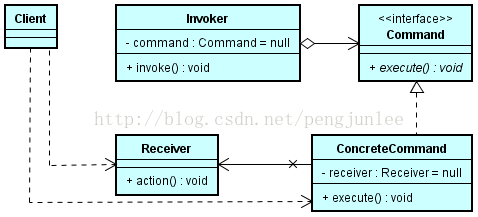

# 一、什么是命令模式
命令(Command)模式又叫作动作(Action)模式或事务(Transaction)模式，是一种对象的行为模式。将一个请求封装为一个对象，从而使你可用不同的请求对客户进行参数化；对请求排队或记录请求日志，以及支持可撤消的操作。

命令模式的本质：封装请求

设计意图：命令模式通过将请求封装到一个命令(Command)对象中，实现了请求调用者和具体实现者之间的解耦。 

# 二、命令模式的适用性

在以下条件下可以考虑使用命令模式：

- 如果需要抽象出需要执行的动作，并参数化这些对象，可以选用命令模式。将这些需要执行的动作抽象成为命令，然后实现命令的参数化配置。
- 如果需要在不同的时刻指定、排列和执行请求，可以选用命令模式。将这些请求封装成为命令对象，然后实现将请求队列化。
- 如果需要支持取消操作，可以选用命令模式，通过管理命令对象，能很容易地实现命令的恢复和重做功能。
- 如果需要支持当系统崩溃时，能将系统的操作功能重新执行一遍，可以选用命令模式。将这些操作功能的请求封装成命令对象，然后实现日志命令，就可以在系统恢复以后，通过日志获取命令列表，从而重新执行一遍功能。
- 在需要事务的系统中，可以选用命令模式。命令模式提供了对事务进行建模的方法。命令模式有一个别名就是Transaction。  

# 三、命令模式的结构

命令模式涉及的角色及其职责如下：

- 抽象命令(Command)角色：一般定义为接口，用来定义执行命令的接口。
- 具体命令(ConcreteCommand)角色：通常会持有接收者对象，并调用接收者对象的相应功能来完成命令要执行的操作。
- 接收者(Receiver)角色：真正执行命令的对象。任何类都可能成为接收者，只要它能够实现命令要求实现的相应功能。
- 调用者(Invoker)角色：要求命令对象执行请求，通常会持有命令对象，可以持有很多的命令对象。这个是客户端真正触发命令并要求命令执行相应操作的地方，也就是说相当于使用命令对象的入口。
- 客户端(Client)角色：创建具体的命令对象，并且设置命令对象的接收者。

命令模式结构示意源代码如下：

先来看看抽象命令接口的定义。示例代码如下：

	/**
	 * 命令接口
	 */
	public interface Command {
	 
		/**
		 * 执行命令
		 */
		public void execute();
	}

接下来看看具体命令是如何实现的。示例代码如下：

	/**
	 * 具体的命令实现
	 */
	public class ConcreteCommand implements Command {
	 
		/**
		 * 持有相应的接收者对象
		 */
		private Receiver receiver = null;
	 
		/**
		 * 构造方法，传入相应的接收者对象
		 * 
		 * @param receiver 相应的接收者对象
		 */
		public ConcreteCommand(Receiver receiver) {
			this.receiver = receiver;
		}
	 
		/**
		 * 执行命令
		 */
		@Override
		public void execute() {
			// 通常会转调接收者对象的相应方法，让接收者来真正执行功能
			receiver.action();
		}
	 
	}

再来看看接收者的定义。示例代码如下： 

	/**
	 * 命令的接收者
	 */
	public class Receiver {
	 
		/**
		 * 示意方法，真正执行命令相应的操作
		 */
		public void action() {
			System.out.println("接收者开始行动。。。");
		}
	}

下面该来看看调用者如何实现的了。示例代码如下：

	/**
	 * 命令的调用者
	 */
	public class Invoker {
	 
		/**
		 * 持有命令对象
		 */
		private Command command = null;
	 
		/**
		 * 设置调用者持有的命令对象
		 * 
		 * @param command 命令对象
		 */
		public void setCommand(Command command) {
			this.command = command;
		}
	 
		/**
		 * 示意方法，调用命令执行请求
		 */
		public void invoke() {
			command.execute();
		}
	}

再来看看客户端的实现。

	public class Client {
		public static void main(String[] args) {
			// 创建接收者
			Receiver receiver = new Receiver();
			// 创建命令对象，设定它的接收者
			Command command = new ConcreteCommand(receiver);
			// 创建调用者，把命令对象设置进去
			Invoker invoker = new Invoker();
			invoker.setCommand(command);
			// 调用者调用命令
			invoker.invoke();
		}
	}

# 四、命令模式的优点

- 更松散的耦合  
命令模式使得发起命令的对象——客户端，和具体实现命令的对象——接收者对象完全解耦，也就是说发起命令的对象完全不知道具体实现对象是谁，也不知道如何实现。

- 更动态的控制  
命令模式把请求封装起来，可以动态地对它进行参数化、队列化和日志化等操作，从而使得系统更灵活。

- 很自然的复合命令  
命令模式中的命令对象能够很容易地组合成复合命令，如宏命令，从而使系统操作更简单，功能更强大。

- 更好的扩展性  
由于发起命令的对象和具体的实现完全解耦，因此扩展新的命令就很容易，只需要实现新的命令对象，然后在装配的时候，把具体的实现对象设置到命令对象中，然后就可以使用这个命令对象，已有的实现完全不用变化。 

# 五、认识命令模式

- **参数化配置**

所谓命令模式的参数化配置，指的是：可以用不同的命令对象，去参数化配置客户的请求。即：对于Invoker的同一个请求，为其配置不同的Command对象，就会执行不同的功能。

- **可撤销的操作**

可撤销操作的意思就是：放弃该操作，回到未执行该操作前的状态。  
有两种基本的思路来实现可撤销的操作，一种是补偿式，又称反操作式，比如要撤销的操作是加的功能，那么可以用相反的操作即减的功能去实现，撤销加多少就减多少。  
使用命令模式可以实现补偿式的可撤销操作，首先需要把操作过的命令记录下来，形成命令的历史列表，撤销的时候就从最后一个开始执行撤销。同样的方式，还可以实现恢复的功能。  
另外一种实现可撤销操作的方式是存储恢复式，意思就是把操作前的状态记录下来，然后要撤销操作的时候就直接恢复回去就可以了（可以使用备忘录模式实现）。

- **宏命令**

什么是宏命令呢？简单点说就是包含多个命令的命令，是一个命令的组合。以去饭店吃饭为例，一般的流程都是：选座位-->点菜-->上菜-->享用美食-->结账，如果将这几个步骤中涉及的命令打包一起执行的话，就可以看作是一个宏命令。

- **队列请求**

所谓队列请求，就是对命令对象进行排队，组成命令队列，然后依次取出命令对象来执行。还是以去饭店吃饭为例，已经点菜的顾客可能有很多人，点的每一道菜都可以看成是一条命令（需要厨师去做菜，服务员上菜），这些被点的菜就构成了一个命令队列。厨师一般都会按照点菜的先后顺序去做菜，谁的菜先点，就先做谁的。

- **日志请求**

所谓日志请求，就是把请求的历史纪录保存下来，一般是采用永久存储的方式。如果在运行请求的过程中，系统崩溃了，那么当系统再次运行时，就可以从保存的历史记录中获取日志请求，并重新执行命令。  
日志请求的实现有两种方案：一种是直接使用Java中的序列化方法；另外一种就是在命令对象中添加上存储和装载的方法，其实就是让命令对象自己实现类似序列化的功能。  

# 六、总结
命令模式是对命令的封装。命令模式把发出命令的责任和执行命令的责任分割开，委派给不同的对象。  

每一个命令都是一个操作：请求的一方发出请求要求执行一个操作；接收的一方收到请求，并执行操作。命令模式允许请求的一方和接收的一方独立开来，使得请求的一方不必知道接收请求的一方的接口，更不必知道请求是怎么被接收，以及操作是否被执行、何时被执行，以及是怎么被执行的。  