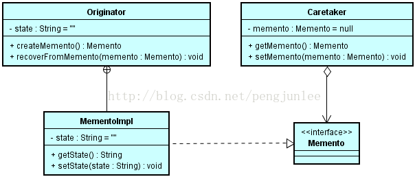

# 一、什么是备忘录模式
备忘录(Memento)模式又叫作快照(Snapshot)模式或Token模式，是一种对象的行为模式。在备忘录模式里，一个备忘录是一个对象，它存储另一个对象（备忘录的原发器）在某个瞬间的内部状态。备忘的目的就是为了以后在需要的时候，可以将原发器对象的状态恢复（undo/rollback）到备忘录所保存的状态。

备忘录的本质：保存和恢复状态

设计意图：在不破坏封装性的前提下，捕获一个对象的内部状态，并在该对象之外保存这个状态。这样就可以将该对象恢复（undo/rollback）到原先保存的状态了。  

# 二、备忘录模式的结构

备忘录模式涉及的角色及其职责如下：

+ 原发器(Originator)角色：原发器根据需要决定将自己的哪些内部状态保存到备忘录中，并可以使用备忘录来恢复内部状态。
+ 备忘录(Memento)角色：负责存储原发器对象的内部状态，但是具体需要存储哪些状态是由原发器对象来决定的。另外备忘录应该只能由原发器对象来访问它内部的数据，原发器外部的对象不应该访问到备忘录对象的内部数据。  
	&emsp;&emsp;为了控制对备忘录对象的访问，备忘录模式中出现了窄接口和宽接口的概念。
	+ 窄接口：管理者只能看到备忘录的窄接口，窄接口的实现中通常没有任何的方法，只是一个类型标识。窄接口使得管理者只能将备忘录传递给其他对象。
	+ 宽接口：原发器能够看到备忘录的宽接口，从而可以从备忘录中获取到所需的数据，来将自己恢复到备忘录中所保存的状态。理想情况是：只允许生成备忘录的原发器来访问该备忘录的内部状态，通常实现成为原发器内的一个私有内部类。
+ 管理者(Caretaker)角色:备忘录管理者，或者称为备忘录负责人。主要负责保存好备忘录对象，但是不能对备忘录对象的内容进行操作或检查。

备忘录模式结构示意源代码如下：

先来看看备忘录窄接口的定义。 

	/**
	 * 备忘录的窄接口，没有任何方法定义
	 */
	public interface Memento {
	}

再看看原发器角色，它里面会有备忘录对象的实现，此处将真正的备忘录对象当作原发器对象的一个私有内部类来实现。示例代码如下：  

	public class Originator {
	 
		/**
		 * 示意，表示原发器的状态
		 */
		private String state = "";
	 
		/**
		 * 创建备忘录，保存原发器的状态
		 * 
		 * @return 创建好的备忘录对象
		 */
		public Memento createMemento() {
			return new MementoImpl(state);
		}
	 
		/**
		 * 将原发器恢复到备忘录中保存的状态
		 * 
		 * @param 保存有原发器状态的备忘录对象
		 */
		public void recoverFromMemento(Memento memento) {
			MementoImpl mementoImpl = (MementoImpl) memento;
			this.state = mementoImpl.getState();
		}
	 
		public String getState() {
			return state;
		}
	 
		public void setState(String state) {
			this.state = state;
		}
	 
		/**
		 * 真正的备忘录对象，实现了备忘录窄接口 实现成私有的内部类，不让外部访问
		 */
		private static class MementoImpl implements Memento {
	 
			/**
			 * 示意，表示需要保存的状态
			 */
			private String state = "";
	 
			public MementoImpl(String state) {
				super();
				this.state = state;
			}
	 
			public String getState() {
				return state;
			}
		}
	 
	}

接下来是备忘录管理者的示例代码。  

	public class Caretaker {
	 
		/**
		 * 记录被保存的备忘录对象
		 */
		private Memento memento = null;
	 
		public Memento getMemento() {
			return memento;
		}
	 
		public void setMemento(Memento memento) {
			this.memento = memento;
		}
	 
	}

创建一个客户端来测试一下，示例代码如下。  

	public class Client {
		public static void main(String[] args) {
			// 创建一个原发器
			Originator o = new Originator();
			// 设置其初始状态
			o.setState("state 0");
			// 打印原发器当前的状态
			System.out.println("原发器的初始状态：" + o.getState());
			// 将原发器当前的状态保存到备忘录中
			Memento memento = o.createMemento();
			// 创建一个管理者
			Caretaker c = new Caretaker();
			// 将创建好的备忘录交给管理者进行管理
			c.setMemento(memento);
			// 改变原发器的状态
			o.setState("state 1");
			// 打印原发器当前的状态
			System.out.println("原发器改變后状态：" + o.getState());
			// 将原发器状态恢复到备忘录保存的状态
			o.recoverFromMemento(c.getMemento());
			// 再次打印原发器当前的状态
			System.out.println("原发器恢復后状态：" + o.getState());
		}
	}

运行程序打印结果如下：  

原发器的初始状态：state 0  
原发器改變后状态：state 1  
原发器恢復后状态：state 0  

在备忘录模式中，备忘录对象通常用来记录原发器中需要保存的内部状态，为了不破坏原发器对象的封装性，一般只让原发器自己来操作它的备忘录对象。为了保证这一点，通常会把备忘录对象作为原发器对象的内部类来实现，而且实现成私有的，这样就断了外部来访问这个备忘录对象的途径。

把备忘录对象设计成为一个私有的内部类，外部只能通过备忘录对象的窄接口来获取备忘录对象，而这个接口没有任何方法，仅仅起到了一个标识对象类型的作用，从而保证内部的数据不会被外部获取或是操作，保证了原发器对象的封装性，也就不再暴露原发器对象在内部结构了。  

# 三、备忘录模式的适用性
在以下条件下可以考虑使用备忘录模式：

+ 如果必须保存一个对象在某一个时刻的全部或部分状态，方便在以后需要的时候，可以把该对象恢复到先前的状态。
+ 如果需要保存一个对象的内部状态，但是如果用接口来让其它对象直接得到这些需要保存的状态，将会暴露对象的实现细节并破坏对象的封装性，这时可以使用备忘录模式，把备忘录对象实现成为原发器对象的私有内部类，从而保证只有原发器对象才能访问该备忘录对象。这样既保存了需要保存的状态，又不会暴露原发器对象的内部实现细节。  

# 四、备忘录模式的实现

+ 增量存储：
如果需要频繁地创建备忘录对象，而且创建和应用备忘录对象来恢复状态的顺序是可控的，那么可以让备忘录进行增量存储，也就是备忘录可以仅仅存储原发器内部相对于上一次存储状态后的增量改变。
+ 结合原型模式：
在原发器对象创建备忘录对象的时候，如果原发器对象中全部或者大部分的状态都需要保存，一个简洁的方式就是直接克隆一个原发器对象。
+ 离线存储：
备忘录的数据可以实现成为离线存储，除了存储在内存中，还可以把备忘录数据存储到文件中、XML中、数据库中，从而支持跨越会话的备份和恢复功能。  

# 五、备忘录模式的优缺点

**使用备忘录模式的优点**：

+ 更好的封装性  
备忘录模式通过使用备忘录对象，来封装原发器对象的内部状态，虽然这个对象是保存在原发器对象的外部，但是由于备忘录对象的窄接口并不提供任何方法。这样有效地保证了对原发器对象内部状态的封装，不把原发器对象的内部实现细节暴露给外部。
+ 简化了原发器  
在备忘录模式中，原发器不再需要管理和保存其内部状态的一个个版本，而是交由管理者或客户端对这些状态的版本进行管理，从而让原发器对象得到简化。
+ 窄接口和宽接口  
备忘录模式，通过引入窄接口和宽接口，使得不同的地方，对备忘录对象的访问是不一样的。窄接口保证了只有原发器才可以访问备忘录对象存储的状态。

**使用备忘录模式的缺点**：

+ 标准的备忘录模式的实现机制是依靠缓存来实现的，因此，当需要备忘的数据量较大时，或者是存储的备忘录对象数据量不大但是数量很多的时候，或者是用户很频繁地创建备忘录对象的时候，这些都会导致非常大的开销。
+ 管理者负责维护备忘录，然而，管理者并不知道备忘录中有多少个状态。因此当存储备忘录时，一个本来很小的管理者，可能会产生大量的存储开销。 

# 六、总结
备忘录模式的功能，首先是在不破坏封装性的前提下，捕获一个对象的内部状态。这里要注意两点，一个是不破坏封装性，也就是对象不能暴露它不应该暴露的细节；另外一个是捕获的是对象的内部状态，而且通常还是运行期间某个时刻对象的内部状态。

之所以要捕获这些内部状态，是为了在以后的某个时候，可以将该对象的状态恢复到备忘录所保存的状态，这才是备忘录真正的目的。前面保存状态就是为了后面恢复，虽然不是一定要恢复，但是目的是为了恢复。  

在备忘录模式中，备忘录对象通常用来记录原发器中需要保存的内部状态，为了不破坏原发器对象的封装性，一般只让原发器自己来操作它的备忘录对象。为了保证这一点，通常会把备忘录对象作为原发器对象的内部类来实现，而且实现成私有的，这样就断了外部来访问这个备忘录对象的途径。  