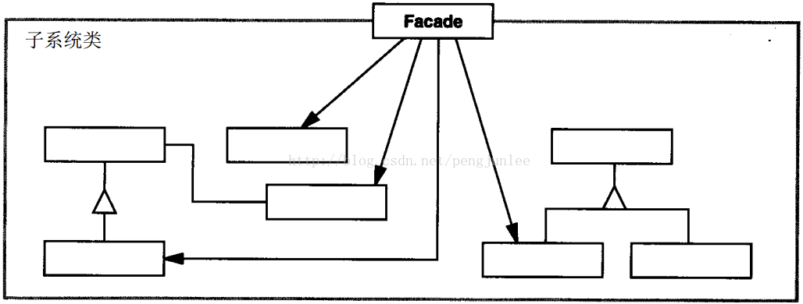
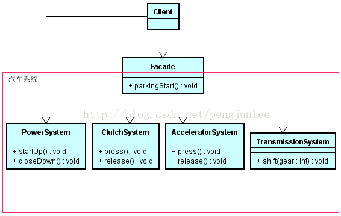

# 一、什么是外观模式
外观(Facade)模式是一种对象的结构型模式。为子系统中的一组接口提供一个一致的界面， Facade模式定义了一个高层接口，这个接口使得这一子系统更加容易使用。

外观模式的本质：封装交互，简化调用

设计意图：隐藏系统的复杂性，并向客户端提供一个可以访问系统的简单接口，以降低用户使用系统的复杂性。

将一个系统划分成为若干个子系统有利于降低系统的复杂性。一个常见的设计目标是使子系统间的通信和相互依赖关系达到最小，达到该目标的途径之一就是引入一个外观(Facade)对象，它为子系统中较一般的设施提供了一个单一而简单的界面。

如图所示，引入外观角色之后，用户只需要直接与外观角色交互，用户与子系统之间的复杂关系由外观角色来实现，从而降低了系统的耦合度。 

二、外观模式的结构
外观模式没有一个一般化的类图表示，下图仅是一个功能示意。

外观模式涉及的角色及其职责如下：

- 外观(Facade)角色：定义整个系统对外的高层接口，通常需要调用内部多个子系统，从而把客户的请求代理给适当的子系统对象。

- 子系统(Subsystem)角色：接受Facade对象的委派，真正实现功能，各个子系统对象之间可能有交互。但是请注意，Facade对象知道各个子系统，但是各个子系统不应该知道Facade对象。

此处为了示意，我们举一个简单的例子：汽车停车起步。

汽车停车起步简化之后一般会包括以下几个操作步骤：发动汽车-->踩下离合-->挂档-->松开离合-->踩油门。当然这只是一个极简化了的步骤，真实的操作步骤可能比这还要复杂得多(还要配合刹车等操作)。然而，即便就是这经过简化的步骤，也经常会把许多学车的新手搞得手忙脚乱、连连憋熄火。

这是一个典型的用户与一个系统（汽车）中的多个子系统（动力系统，离合器，变速器，油门）进行交互的情形，用户需要和所有的子系统交互，才能完成自己想要实现的功能，这其实是极不合理的，也极容易出错，毕竟并非所有的用户都是“老司机”，你说是吧！

接下来我们使用外观模式来改造，实现以上的功能，类图结构如下：

下面是其实现的源代码：

首先来看看各个子系统的定义，包括：动力系统、离合器、加速器、变速器四个子系统。

	/**
	 * 动力系统
	 */
	public class PowerSystem {
	 
		/**
		 * 汽车发动
		 */
		public void startUp() {
			System.out.println("汽车发动。。。。");
		}
	 
		/**
		 * 汽车熄火
		 */
		public void closeDown() {
			System.out.println("汽车熄火。。。。");
		}
	}
 

	/**
	 * 离合器
	 */
	public class ClutchSystem {
	 
		/**
		 * 踩下离合
		 */
		public void press() {
			System.out.println("踩下离合。。。。");
		}
	 
		/**
		 * 松开离合
		 */
		public void release() {
			System.out.println("松开离合。。。。");
		}
	}
 

	/**
	 * 变速器
	 */
	public class TransmissionSystem {
	 
		/**
		 * 挂挡操作
		 * @param gear 所挂档位
		 */
		public void shift(int gear) {
			switch (gear) {
			case -1:
				System.out.println("挂倒档。。。。");
				break;
			case 0:
				System.out.println("挂空档。。。。");
				break;
			case 1:
				System.out.println("挂一档。。。。");
				break;
			case 2:
				System.out.println("挂二档。。。。");
				break;
			case 3:
				System.out.println("挂三档。。。。");
				break;
			case 4:
				System.out.println("挂四档。。。。");
				break;
			case 5:
				System.out.println("挂五档。。。。");
				break;
			}
		}
	}
 

	/**
	 * 加速器，即油门
	 */
	public class AcceleratorSystem {
	 
		/**
		 * 踩下油门
		 */
		public void press() {
			System.out.println("踩下油门。。。。");
		}
	 
		/**
		 * 松开油门
		 */
		public void release() {
			System.out.println("松开油门。。。。");
		}
	}

接下来该看看外观的定义了，示例代码如下。  

	/**
	 * 外观类
	 */
	public class Facade {
	 
		/**
		 * 示意方法，停车起步
		 */
		public void parkingStart() {
			// 创建需要转调的子系统对象实例
			ClutchSystem clutchSystem = new ClutchSystem();
			TransmissionSystem transmissionSystem = new TransmissionSystem();
			AcceleratorSystem acceleratorSystem = new AcceleratorSystem();
			// 转调子系统的功能
			clutchSystem.press();
			transmissionSystem.shift(1);
			clutchSystem.release();
			acceleratorSystem.press();
			System.out.println("汽车开始动了。。。。");
		}
	 
	}

创建一个客户端类测试一下，示例代码如下。  

	public class Client {
	 
		public static void main(String[] args) {
	 
			PowerSystem powerSystem = new PowerSystem();
			// 发动汽车
			// 此处作为示意，用户可以跳过外观，直接与子系统进行交互
			powerSystem.startUp();
			// 创建外观实例
			Facade facade = new Facade();
			// 停车起步
			facade.parkingStart();
		}
	}

运行程序打印结果如下：  

汽车发动。。。。  
踩下离合。。。。  
挂一档。。。。  
松开离合。。。。  
踩下油门。。。。  
汽车开始动了。。。。  

在以上代码示例中，为简明起见，只为Facade对象添加了一个“停车起步”的功能，事实上它还可以有更多其他的功能，Facade对象这个“停车起步”的功能其实就相当于是为已经发动了的汽车增加了一个“一键停车起步”的功能。

并未把“发动汽车”这个步骤一并加入的Facade对象中，主要是为了作一个示意：根据实际需要，用户是可以越过Facade层，直接与子系统进行交互的。

# 三、外观模式的适用性
在以下条件下可以考虑使用外观模式：

- 当你要为一个复杂子系统提供一个简单接口时。子系统往往因为不断演化而变得越来越复杂。大多数模式使用时都会产生更多更小的类。这使得子系统更具可重用性，也更容易对子系统进行定制，但这也给那些不需要定制子系统的用户带来一些使用上的困难。facade可以提供一个简单的缺省视图，这一视图对大多数用户来说已经足够，而那些需要更多的可定制性的用户可以越过facade层。

- 客户程序与抽象类的实现部分之间存在着很大的依赖性。引入facade将这个子系统与客户以及其他的子系统分离，可以提高子系统的独立性和可移植性。

- 当你需要构建一个层次结构的子系统时，使用 facade模式定义子系统中每层的入口点。如果子系统之间是相互依赖的，你可以让它们仅通过facade进行通讯，从而简化了它们之间的依赖关系。

# 四、外观模式和中介者模式
外观模式和中介者模式非常类似，但是却有本质的区别。

中介者模式主要用来封装多个对象之间相互的交互，多用在系统内部的多个模块之间；而外观模式封装的是单向的交互，是从客户端访问系统的调用，没有从系统中来访问客户端的调用。

在中介者模式的实现里面，是需要实现具体的交互功能的；而外观模式的实现里面，一般是组合调用或是转调内部实现的功能，通常外观模式本身并不实现这些功能。

中介者模式的目的主要是松散多个同事之间的耦合，把这些耦合关系全部放到中介者中去实现；而外观模式的目的是简化客户端的调用，这点和中介者模式也不同。

# 五、外观模式的优缺点
**使用外观模式的优点**：

- 松散耦合

外观模式松散了客户端与子系统的耦合关系，让子系统内部的模块能更容易扩展和维护。

- 简单易用

外观模式让子系统更加易用，客户端不再需要了解子系统内部的实现，也不需要跟众多子系统内部的模块进行交互，只需要跟外观交互就可以了，相当于外观类为外部客户端使用子系统提供了一站式服务。

- 更好地划分访问的层次

通过合理使用Facade，可以帮助我们更好地划分访问的层次。有些方法是对系统外的，有些方法是在系统内部使用的。把需要暴露给外部的功能集中到外观中，这样既方便客户端使用，也很好地隐藏了内部的细节。

**使用外观模式的缺点**

- 不能很好地限制客户使用子系统类，如果对客户访问子系统类做太多的限制则减少了可变性和灵活性。

- 在不引入抽象外观类的情况下，增加新的子系统可能需要修改外观类或客户端的源代码，违背了“开闭原则”。

# 六、总结
Facade封装了子系统外部和子系统内部多个模块的交互过程，从而简化了外部的调用。通过外观，子系统为外部提供一些高层的接口，以方便它们的使用。

外观模式很好地体现了“最少知识原则”。

如果不使用外观模式，客户端通常需要和子系统内部的多个模块交互，也就是说客户端会和这些模块之间都有依赖关系，任意一个模块的变动都可能会引起客户端的变动。

使用外观模式后，客户端只需要和外观类交互，即只和这个外观类有依赖关系，不需要再去关心子系统内部模块的变动情况了。

这样一来，客户端不但简单，而且这个系统会更有弹性。当系统内部多个模块发生变化的时候，这个变化可以被这个外观类吸收和消化，并不需要影响到客户端，换句话说就是：可以在不影响客户端的情况下，实现系统内部的维护和扩展。 