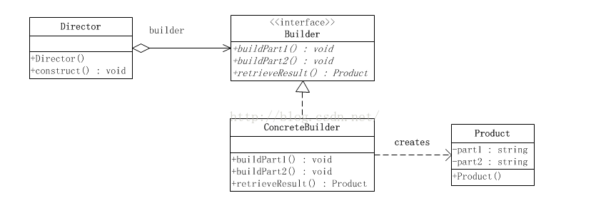

# 前言
在听完厉风行老师《设计模式系列课程》中的建造者模式一节后顿时感觉有点头大，感觉它有点像工厂方法模式，查看了网上很多文章也是众说纷纭，看到了corn的[这篇文章]( http://www.cnblogs.com/lwbqqyumidi/p/3742562.html "设计模式总结篇系列：建造者模式（Builder）")才有点拨开云雾见晴天的感觉。

# 一、什么是建造者模式
建造者（Builder）模式也叫生成器模式，是由GoF提出的23种设计模式中的一种，其设计意图是：将一个复杂对象的构建与它的表示分离，使得同样的构建过程可以创建不同的表示。

GoF给出的描述很简短，不易理解，我是这样理解的：我们要创建的对象会包含有各种各样的属性（可以是对象，也可以不是对象，就好比汽车的零配件），这些属性就叫做这个对象的表示，有了属性之后我们还需要将这些属性按照一定的规则或者顺序组装起来才能创造出对象来（这就好比用汽车零件组装汽车），而这个组装的过程就是对象的构建，Builder模式将对象的表示与对象的构建分别交由建造者和指挥者去负责，整个对象的创建过程对客户端是隐藏的，客户端只需要去调用建造者和指挥者去创建对象，而不必关系这个对象都有哪些属性，以及各个属性之间是怎么样进行组装的，达到了责任划分和封装的目的。  

# 二、建造者模式的结构
建造者模式适合于创建比较复杂的对象，所谓复杂有两个方向：

- 创建过程复杂，创建的步骤有严格的顺序。
- 创建对象的结构复杂，创建对象包含的属性数量多。

针对以上两类的复杂对象Builder模式也分别演化出了两种表现形式。

**第一种：通过Product、ConcreteBuilder、Builder和Director形成的建造者模式。**

从上图可以看出，这种Builder模式包含4个角色：产品(Product)，具体建造者(ConcreteBuilder)，建造者(Builder)，指挥者(Director)

产品：需要创建的对象产品

+ 建造者：本质为抽象类，里面的抽象方法供具体建造者重写。
+ 具体建造者：创建产品的实例并且实现建造者多个方法对产品进行装配。
+ 指挥者：有条不紊的按顺序调用建造者抽象类及其方法。

我们都知道计算机重装系统是一件很复杂的事情，首先你要备份重要数据、格式化硬盘，安装操作系统，然后再拷贝数据，安装驱动，安装常用软件，等等...，接下来我们就以重装计算机操作系统为例来体会一下Builder模式的作用。

我们需要一个类来说明安装后的系统要包含哪些东西，这个类就是我们要创建的产品类。 

	public class SysApplication {
		// 系统中的文件数据
		private String data;
		// 操作系统
		private String operationSystem;
		// 驱动
		private String driver;
		// 包含哪些有用的软件
		private String usefulSoftware;
		public String getData() {
			return data;
		}
		public void setData(String data) {
			this.data = data;
		}
		public String getOperationSystem() {
			return operationSystem;
		}
		public void setOperationSystem(String operationSystem) {
			this.operationSystem = operationSystem;
		}
		public String getDriver() {
			return driver;
		}
		public void setDriver(String driver) {
			this.driver = driver;
		}
		public String getUsefulSoftware() {
			return usefulSoftware;
		}
		public void setUsefulSoftware(String usefulSoftware) {
			this.usefulSoftware = usefulSoftware;
		}
	}
 
再创建一个ISysInstallBuilder接口把重装系统过程中我们要做的事情都罗列出来，这个接口就扮演了Builder模式中的建造者角色。

	public interface ISysInstallBuilder {
		// 备份数据
		public void backupdata();
		// 格式化硬盘
		public void formatDisk();
		// 复制数据
		public void copyData();
		// 安装操作系统
		public void installOperationSystem();
		// 安装驱动
		public void installDriver();
		// 安装有用的软件
		public void installUsefulSoftware();
		// 获取安装好的系统
		public SysApplication getSystemApplication();
	}
 
接下来我们来实现安装Windows XP系统的具体建造者类WinXpInstallBuilder，以后需要安装Windows XP系统就用它。

	public class WinXpInstallBuilder implements ISysInstallBuilder {
		private SysApplication systemApplication = new SysApplication();
		@Override
		public void backupdata() {
			// 此处填写数据备份相关代码
			System.out.println("备份数据");
		}
		@Override
		public void formatDisk() {
			// 此处填写硬盘格式化相关代码
			System.out.println("格式化硬盘");
		}
		@Override
		public void copyData() {
			// 此处填写复制数据相关代码
			System.out.println("复制数据");
			this.systemApplication.setData("原系统备份的数据");
		}
		@Override
		public void installOperationSystem() {
			// 此处填写安装Windows XP操作系统相关代码
			System.out.println("安装Windows XP操作系统");
			this.systemApplication.setOperationSystem("Windows XP");
		}
		@Override
		public void installDriver() {
			// 此处填写安装Windows XP驱动相关代码
			System.out.println("安装Windows XP驱动");
			this.systemApplication.setDriver("Windows XP驱动");
		}
		@Override
		public void installUsefulSoftware() {
			// 此处填写安装Windows XP操作系统下常用软件相关代码
			System.out.println("安装Windows XP操作系统下常用软件");
			this.systemApplication.setUsefulSoftware("Windows XP操作系统下常用软件");
		}
		@Override
		public SysApplication getSystemApplication() {
			// 将安装好的系统返回
			return this.systemApplication;
		}
	}
 
 
现在我们有了一个具体建造者类WinXpInstallBuilder，接下来我们尝试着用它来重装一下系统。

	public class MainClass {
		public static void main(String[] args) {
			// 创建一个WinXpInstallBuilder
			ISysInstallBuilder builder = new WinXpInstallBuilder();
			// 调用WinXpInstallBuilder，开始装系统了
			builder.backupdata();
			builder.copyData();
			builder.formatDisk();
			builder.installDriver();
			builder.installOperationSystem();
			builder.installUsefulSoftware();
			// 获取到安装好的系统
			SysApplication sysApplication = builder.getSystemApplication();
			System.out.println("----------系统信息如下----------");
			System.out.println("数据：" + sysApplication.getData());
			System.out.println("驱动：" + sysApplication.getDriver());
			System.out.println("操作系统：" + sysApplication.getOperationSystem());
			System.out.println("软件：" + sysApplication.getUsefulSoftware());
		}
	}
 
运行程序打印结果如下：

备份数据  
复制数据  
格式化硬盘  
安装Windows XP驱动  
安装Windows XP操作系统  
安装Windows XP操作系统下常用软件  
----------系统信息如下----------  
数据：原系统备份的数据  
驱动：Windows XP驱动  
操作系统：Windows XP  
软件：Windows XP操作系统下常用软件  

细心的你可能发现了，我安装的这个系统是有问题的，我把系统安装步骤的顺序搞乱了，复制数据应该放在格式化硬盘并安装好操作系统之后，安装驱动应该放在安装操作系统之后。由于安装系统的步骤比较复杂，虽然我已经很小心翼翼可还是把安装步骤给搞错了，怎样才能让系统按照正确的步骤安装而不会搞乱顺序呢？到了指挥者出场的时刻了。

	public class SysInstallDirector {
		private ISysInstallBuilder builder;
		public SysInstallDirector(ISysInstallBuilder builder) {
			this.builder = builder;
		}
		public void installSystem() {
			builder.backupdata();
			builder.formatDisk();
			builder.installOperationSystem();
			builder.installDriver();
			builder.installUsefulSoftware();
			builder.copyData();
		}
	}

接下来我们再使用指挥者装一次系统试试。

	public class Client{
		public static void main(String[] args) {
			// 创建一个WinXpInstallBuilder
			ISysInstallBuilder builder = new WinXpInstallBuilder();
			//创建一个指挥者
			SysInstallDirector director = new SysInstallDirector(builder);
			//建造者在指挥者的指挥下开始安装系统了
			director.installSystem();
			// 从建造者手里获取到安装好的系统
			SysApplication sysApplication = builder.getSystemApplication();
			System.out.println("----------系统信息如下----------");
			System.out.println("数据：" + sysApplication.getData());
			System.out.println("驱动：" + sysApplication.getDriver());
			System.out.println("操作系统：" + sysApplication.getOperationSystem());
			System.out.println("软件：" + sysApplication.getUsefulSoftware());
		}
	}

运行程序打印结果如下：

数据备份  
硬盘格式化  
安装Windows XP操作系统  
安装Windows XP驱动  
安装Windows XP操作系统下常用软件  
复制数据  
----------系统信息如下----------  
数据：原系统备份的数据  
驱动：Windows XP驱动  
操作系统：Windows XP  
软件：Windows XP操作系统下常用软件  

在有了指挥者的帮忙后，系统按照正确的顺序安装完成了。

接下来我们再实现一个安装Win7系统的具体建造者类Win7InstallBuilder。

	public class Win7InstallBuilder implements ISysInstallBuilder {
		private SysApplication systemApplication = new SysApplication();
		@Override
		public void backupdata() {
			// 此处填写数据备份相关代码
			System.out.println("数据备份");
		}
		@Override
		public void formatDisk() {
			// 此处填写硬盘格式化相关代码
			System.out.println("硬盘格式化");
		}
		@Override
		public void copyData() {
			// 此处填写复制数据相关代码
			System.out.println("复制数据");
			this.systemApplication.setData("原系统备份的数据");
		}
		@Override
		public void installOperationSystem() {
			// 此处填写安装安装Win7操作系统相关代码
			System.out.println("安装Win7操作系统");
			this.systemApplication.setOperationSystem("Win7");
		}
		@Override
		public void installDriver() {
			// 此处填写安装安装Win7驱动相关代码
			System.out.println("安装Win7驱动");
			this.systemApplication.setDriver("Win7驱动");
		}
		@Override
		public void installUsefulSoftware() {
			// 此处填写安装安装Win7操作系统下常用软件相关代码
			System.out.println("安装Win7操作系统下常用软件");
			this.systemApplication.setUsefulSoftware("Win7操作系统下常用软件");
		}
		@Override
		public SysApplication getSystemApplication() {
			// 将安装好的系统返回
			return this.systemApplication;
		}
	}

在客户端中测试一下安装Win7系统。

	public class Client{
		public static void main(String[] args) {
			// 创建一个Win7InstallBuilder
			ISysInstallBuilder builder = new Win7InstallBuilder();
			// 创建一个指挥者
			SysInstallDirector director = new SysInstallDirector(builder);
			// 建造者在指挥者的指挥下开始安装系统了
			director.installSystem();
			// 从建造者手里获取到安装好的系统
			SysApplication sysApplication = builder.getSystemApplication();
			System.out.println("----------系统信息如下----------");
			System.out.println("数据：" + sysApplication.getData());
			System.out.println("驱动：" + sysApplication.getDriver());
			System.out.println("操作系统：" + sysApplication.getOperationSystem());
			System.out.println("软件：" + sysApplication.getUsefulSoftware());
		}
	}

运行程序打印结果如下：

数据备份  
硬盘格式化  
安装Win7操作系统  
安装Win7驱动  
安装Win7操作系统下常用软件  
复制数据  
----------系统信息如下----------  
数据：原系统备份的数据  
驱动：Win7驱动  
操作系统：Win7  
软件：Win7操作系统下常用软件  

Win7系统也被正确安装，Builder模式通过指挥者和建造者将要创建的对象属性和属性的装配过程进行分离，一样的创建过程由于传入的具体建造者不同最终创建出了完全不同的对象，而且无需再担忧把组装顺序搞混了。

**第二种：通过静态内部类实现复杂对象的无序构造。**

创建一个个人信息类PersonalInfo，其中包含个人信息包括：电话号码，地址，姓名，年龄，性别，身份证号。

	public class PersonalInfo {
		private String name;
		private int age;
		private String gender;
		private String address;
		private String iDNumber;
		private String phoneNumber;
		public String getPhoneNumber() {
			return phoneNumber;
		}
		public String getAddress() {
			return address;
		}
		public String getName() {
			return name;
		}
		public int getAge() {
			return age;
		}
		public String getGender() {
			return gender;
		}
		public String getIDNumber() {
			return iDNumber;
		}
		public static class Builder {
			private String name;
			private int age;
			private String gender;
			private String address;
			private String iDNumber;
			private String phoneNumber;
			public Builder(String name) {
				this.name = name;
			}
			public Builder phoneNumber(String phoneNumber) {
				this.phoneNumber = phoneNumber;
				return this;
			}
			public Builder address(String address) {
				this.address = address;
				return this;
			}
			public Builder age(int age) {
				this.age = age;
				return this;
			}
			public Builder gender(String gender) {
				this.gender = gender;
				return this;
			}
			public Builder iDNumber(String iDNumber) {
				this.iDNumber = iDNumber;
				return this;
			}
			public PersonalInfo build() {
				return new PersonalInfo(this);
			}
		}
		private PersonalInfo(Builder builder) {
			this.address = builder.address;
			this.age = builder.age;
			this.gender = builder.gender;
			this.iDNumber = builder.iDNumber;
			this.name = builder.name;
			this.phoneNumber = builder.phoneNumber;
		}
	}

在客户端中使用此类创建个人信息测试一下。

	public class Client{
		public static void main(String[] args) {
			PersonalInfo personalInfo = new PersonalInfo.Builder("姬如雪")
					.address("幻音坊").age(19).gender("女").build();
			System.out.println("------------个人信息----------------");
			System.out.println("姓名："+personalInfo.getName());
			System.out.println("住址："+personalInfo.getAddress());
			System.out.println("年龄："+personalInfo.getAge());
			System.out.println("性别："+personalInfo.getGender());
		}
	}

运行程序打印结果如下：

------------个人信息----------------  
姓名：姬如雪  
住址：幻音坊  
年龄：19  
性别：女  

此种方式通过级联方式去创建对象，可自由控制创建对象的属性个数，减少了重复代码，使对象的创建更加形象直观。

# 三、建造者模式应用场景
如果碰到以下情况，可以考虑使用建造者模式：

- 当创建复杂对象的算法应该独立于该对象的组成部分以及它们的装配方式时。
- 当构造过程必须允许被构造的对象有不同的表示时。
- 创建的是一个复合对象：被创建的对象为一个具有复合属性的复合对象