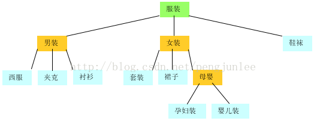
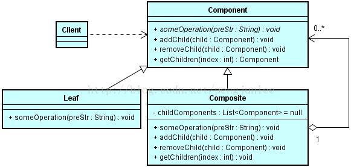
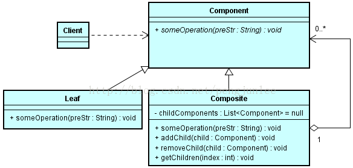

# 一、什么是组合模式
组合(Composite)模式是一种对象的行为模式。将对象组合成树形结构以表示“部分-整体”的层次结构。组合模式使得用户对单个对象和组合对象的使用具有一致性。

组合模式的本质：统一叶子对象和组合对象。

组合模式的目的：让客户端不再区分操作的是组合对象还是叶子对象，而是以一个统一的方式来操作。 

# 二、组合模式的适用性

在开发中， 我们经常可能要递归构建树状的组合结构，比如以下的商品类别树： 

仔细观察上面的商品类别树，有以下几个明显的特点。

+ 有一个根节点，比如“服装”，它没有父节点，它可以包含其他的节点。
+ 树枝节点，有一类节点可以包含其他的节点，称之为树枝节点，比如“男装”、“女装”和“母婴”。
+ 叶子节点，有一类节点没有子节点，称之为叶子节点，比如“衬衣”、“夹克”、“裙子”、“套装”等。

如果碰到类似上面这种，需使用对象树来描述或实现的功能，都可以考虑使用组合模式，比如读取XML文件，或是对语句进行语法解析等。

# 三、组合模式的结构

组合模式涉及的角色及其职责如下：

+ 抽象组件(Component)角色：为组合对象和叶子对象声明公共的接口，让客户端可以通过这个接口来访问和管理整个对象树，并可以为这些定义的接口提供缺省的实现。
+ 组合对象(Composite)角色：通常会存储子组件(组合对象、叶子对象)，定义包含子组件的那些组件的行为，并实现在抽象组件中定义的与子组件有关的操作，例如子组件的添加(addChild)和删除(removeChild)等。
+ 叶子对象(Leaf)角色：定义和实现叶子对象的行为，并且它不再包含其他的子节点对象。
+ 客户端(Client)角色：通过Component接口来统一操作组合对象和叶子对象，以创建出整个对象树结构。

组合模式结构示意源代码如下：

先看看抽象组件类的定义，示例代码如下。 

	/**
	 * 抽象的组件对象，为组合中的对象声明接口，实现接口的缺省行为
	 */
	public abstract class Component {
	 
		// 示意方法，子组件对象可能有的功能方法
		public abstract void someOperation(String preStr);
	 
		public void addChild(Component child) {
			// 缺省的实现，抛出异常，因为叶子对象没有这个功能，或子类未实现这个功能
			throw new UnsupportedOperationException("对象不支持此功能");
		}
	 
		public void removeChild(Component child) {
			// 缺省的实现，抛出异常，因为叶子对象没有这个功能，或子类未实现这个功能
			throw new UnsupportedOperationException("对象不支持此功能");
		}
	 
		public Component getChildren(int index) {
			// 缺省的实现，抛出异常，因为叶子对象没有这个功能，或子类未实现这个功能
			throw new UnsupportedOperationException("对象不支持此功能");
		}
	}

接下来看看组合类的定义，示意代码如下。 

	import java.util.ArrayList;
	import java.util.List;
	 
	public class Composite extends Component {
	 
		/**
		 * 示意属性，组件的名字
		 */
		private String name = "";
	 
		public Composite(String name) {
			this.name = name;
		}
	 
		/**
		 * 用来存储组合对象中包含的子组件对象
		 */
		private List<Component> childComponents = null;
	 
		/**
		 * 示意方法，此处用于输出组件的树形结构，通常在里面需要实现递归的调用
		 */
		@Override
		public void someOperation(String preStr) {
			// 先把自己输出
			System.out.println(preStr + "+" + name);
			// 如果还包含其他子组件，那么就输出这些子组件对象
			if (null != childComponents) {
				// 添加一个空格，表示向后缩进一个空格
				preStr += "   ";
				// 输出当前对象的子组件对象
				for (Component component : childComponents) {
					// 递归地进行子组件相应方法的调用，输出每个子组件对象
					component.someOperation(preStr);
				}
			}
	 
		}
	 
		/**
		 * 向组合对象中添加组件对象
		 */
		public void addChild(Component child) {
			// 延迟初始化
			if (null == childComponents) {
				childComponents = new ArrayList<Component>();
			}
			childComponents.add(child);
		}
	 
		/**
		 * 从组合对象中移除组件对象
		 */
		public void removeChild(Component child) {
			if (null != childComponents) {
				childComponents.remove(child);
			}
		}
	 
		/**
		 * 根据索引获取组合对象中对应的组件对象
		 */
		public Component getChildren(int index) {
			if (null != childComponents) {
				if (index >= 0 && index < childComponents.size()) {
					return childComponents.get(index);
				}
			}
			return null;
		}
	}

再来看看叶子类的定义，示例代码如下。 

	public class Leaf extends Component {
	 
		/**
		 * 示意属性，组件的名字
		 */
		private String name = "";
	 
		public Leaf(String name) {
			this.name = name;
		}
	 
		/**
		 * 示意方法，此处用于输出组件的树形结构
		 */
		@Override
		public void someOperation(String preStr) {
			System.out.println(preStr + "-" + name);
		}
	 
	}

在客户端中使用Component接口来操作组合对象结构，示意代码如下。 

	public class Client {
	 
		public static void main(String[] args) {
			// 定义多个Composite组合对象
			Component root = new Composite("服装");
			Component c1 = new Composite("男装");
			Component c2 = new Composite("女装");
			Component c3 = new Composite("母婴");
	 
			// 定义多个Leaf叶子对象
			Component leaf1 = new Leaf("西服");
			Component leaf2 = new Leaf("夹克");
			Component leaf3 = new Leaf("衬衫");
			Component leaf4 = new Leaf("裙子");
			Component leaf5 = new Leaf("套装");
			Component leaf6 = new Leaf("鞋袜");
			Component leaf7 = new Leaf("孕妇装");
			Component leaf8 = new Leaf("婴儿装");
	 
			// 组合成为树形的对象结构
			root.addChild(c1);
			root.addChild(c2);
			root.addChild(leaf6);
			c1.addChild(leaf1);
			c1.addChild(leaf2);
			c1.addChild(leaf3);
			c2.addChild(leaf4);
			c2.addChild(leaf5);
			c2.addChild(c3);
			c3.addChild(leaf7);
			c3.addChild(leaf8);
	 
			// 调用根对象的输出功能输出整棵树
			root.someOperation("");
		}
	 
	}

运行程序打印结果如下：  

+服装  
&emsp;&emsp;+男装  
&emsp;&emsp;&emsp;&emsp;-西服  
&emsp;&emsp;&emsp;&emsp;-夹克  
&emsp;&emsp;&emsp;&emsp;-衬衫  
&emsp;&emsp;+女装  
&emsp;&emsp;&emsp;&emsp;-裙子  
&emsp;&emsp;&emsp;&emsp;-套装  
&emsp;&emsp;&emsp;&emsp;+母婴  
&emsp;&emsp;&emsp;&emsp;&emsp;&emsp;-孕妇装  
&emsp;&emsp;&emsp;&emsp;&emsp;&emsp;-婴儿装  
&emsp;&emsp;-鞋袜  

从以上的示例可以看出，组合模式的关键就在于抽象组件角色，作为组合对象和叶子对象的父类，这个抽象组件类既可以代表叶子对象，也可以代表组合对象，这样用户在操作的时候，始终是在操作组件对象，不必再去区分是在操作组合对象还是叶子对象，从而使得对叶子对象和组合对象的使用具有了一致性。  

# 四、组合模式的安全性和透明性

+ 组合模式的安全性是指：从客户使用组合模式上看是否更安全。如果是安全的，那么就不会有发生误操作的可能，能访问的方法都是被支持的功能。
+ 组合模式的透明性是指：从客户使用组合模式上看是否需要区分到底是组合对象还是叶子对象。如果是透明的，那就不用再区分，对于客户而言，都是组件对象，具体的类型对于客户而言是透明的，是客户无须关心的。

**透明性的实现：**

如果把管理子组件的操作定义在Component中，那么客户端只需要面对Component，而无须关心具体的组件类型，这种实现方式就是透明性的实现。前面结构示意代码中就是采用的这一实现方式。

但是透明性的实现是以安全性为代价的，因为在Component中定义的一些方法，对于叶子对象来说是没有意义的，比如增加、删除子组件对象。但这些方法对客户却是透明的，因此客户可能会对叶子对象调用这种增加或删除子组件的方法，这样的操作是不安全的。

组合模式的透明性实现，通常的方式是：在Component中声明管理子组件的操作，并在Component中为这些方法提供默认的实现，对于叶子对象不支持的功能，可以直接抛出一个异常，来表示不支持这个功能。

**安全性的实现：**

如果把管理子组件的操作定义在Composite中，那么客户端在使用叶子对象的时候，就不会发生使用添加子组件或是删除子组件的操作了，因为压根就没有这样的功能，这种实现方式是安全的。

但是这样一来，客户端在使用的时候，就必须区分到底使用的是Composite对象，还是叶子对象，不同对象的功能是不一样的。

**两种实现方式的选择：**

对于组合模式而言，在安全性和透明性上，会更看重透明性，毕竟组合模式的功能就是要让用户对叶子对象和组合对象的使用具有一致性。

因此，在使用组合模式的时候，应多采用透明性的实现方式，少用安全性的实现方式。 

# 五、组合模式的优缺点

**使用组合模式的优点**：

+ 统一了组合对象和叶子对象。
+ 简化了客户端调用，无须区分操作的是组合对象还是叶子对象。
+ 更容易扩展，有了Component的约束，新定义的Composite或Leaf子类能够很容易地与已有的结构一起工作。

**使用组合模式的缺点**： 很难限制组合中的组件类型。 

# 六、总结
组合模式通过把叶子对象当成特殊的组合对象看待，从而对叶子对象和组合对象一视同仁，全部当成了Component对象，有机地统一了叶子对象和组合对象。

正是因为统一了叶子对象和组合对象，在将对象构建成树形结构的时候，才不需要做区分，反正是组件对象里面包含其他的组件对象，如此递归下去：也才使得对于树形结构的操作变得简单，不管对象类型，统一操作。 