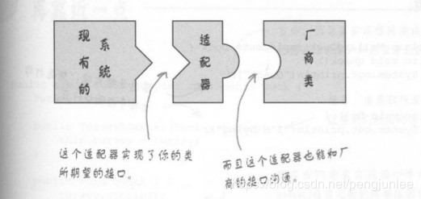
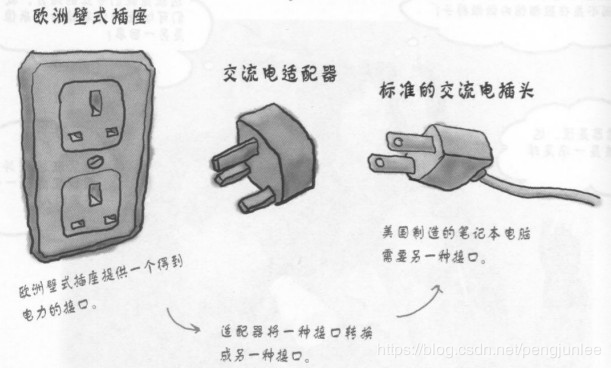
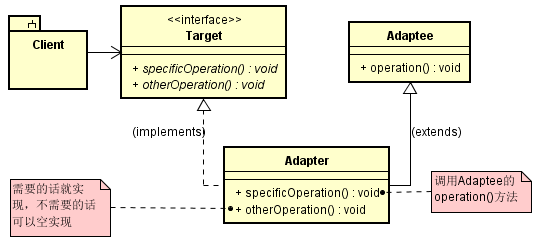
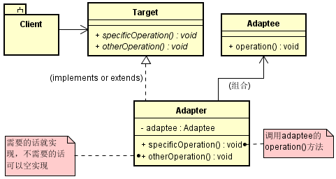
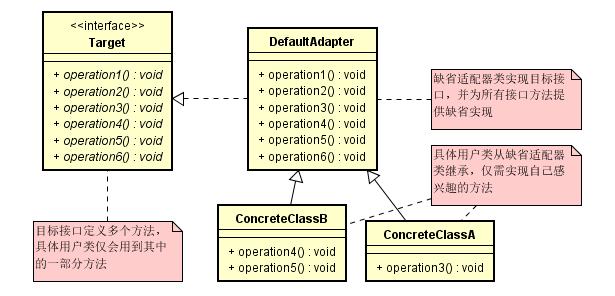

# 1、什么是适配器模式
适配器(Adapter)模式又叫做包装( Wrapper )模式，是由GOF提出的23种设计模式中的一种结构型设计模式，Adapter模式的设计意图：将一个类的接口转换成客户希望的另外一个接口，使得原本由于接口不兼容而不能一起工作的那些类可以在一起工作。  

# 2、适配器模式的适用场景

如图所示，有时，为复用而设计的工具类常常会因为它的接口与专业应用领域所需要的接口不匹配而不能够被复用。

再举个Java界面程序开发中的真实案例：我们要设计一个绘图编辑器，这个编辑器允许用户绘制和排列基本图元(线、多边形、正文等)，图元对象的抽象我们用一个 Shape 接口来定义，所有的具体图元类型都要实现 Shape 接口：LineShape类对应于直线，PolygonShape类对应于多边形，TextShape类对应于正文，等等。

对于像LineShape和PolygonShape这样的基本图元类由于它们的编辑功能本来就很有限，我们很容易就能够实现。但是对于可以显示和编辑正文的TextShape子类来说，实现相当困难，因为即使是基本的正文编辑也要涉及到复杂的屏幕刷新和缓冲区管理。同时，外界可能已经存在了一个现成的工具类TextView可以用于显示和编辑正文。理想的情况是我们可以复用这个TextView类以实现TextShape类的功能，不巧的是这个TextView类的设计者当时并没有考虑 Shape 的存在，导致TextView类和 Shape的接口互不兼容。

类似地，像上面这种情况，我们希望能够复用TextView这样已经存在的类，但此类与我们系统要求的接口不匹配，我们该如何处理呢？

我们可以改变TextView类使它兼容Shape接口，但前提是必须有这个TextView类的源代码。然而即使我们得到了这些源代码，修改TextView也是没有什么意义的：因为不应该仅仅为了实现一个应用，就去修改那些为复用而设计的工具箱类，迫使它们实现与特定领域相关的接口(此处是 Shape 接口)。

我们可以不用上面的方法，转而定义一个TextShape类，由它来适配TextView的接口和Shape的接口。我们可以用下面两种方法做成这件事：

1. 将TextShape继承TextView并实现Shape接口
2. 将一个TextView实例作为TextShape的组成部分，并且使用TextView的接口去实现TextShape接口。

以上两种方法恰恰对应于Adapter模式的两个版本：类的适配器模式和对象的适配器模式。我们将TextShape称之为适配器Adapter。

从以上案例可以看出，适配器模式其实是一种补偿型模式，在进行全新系统设计的时候很少会用到。而当你遇到以下情况，你或许可以考虑使用Adapter模式。

- 你想使用一个已经存在的类，而它的接口不符合你的需求。
- 你想创建一个可以复用的类，该类可以与其他不相关的类或不可预见的类（即那些接口可能不一定兼容的类）协同工作。
- （仅适用于对象Adapter）你想使用一些已经存在的子类，但是不可能对每一个都进行子类化以匹配它们的接口。

# 3、适配器模式的结构
适配器模式分为类的适配器模式(采用继承实现)、对象的适配器模式(采用对象组合方式实现)和接口的适配器模式三种。

类适配器通过继承对一个类与另一个接口进行匹配，如下图所示。

类适配器模式涉及的角色及其职责如下：

- 客户端(Client)类：该类需要与符合条件的特定的接口协同工作。
- 目标(Target)接口类：客户端所需要的接口，在类适配器模式下该角色只能是接口。
- 适配者(Adaptee)类：需要被适配的类，适配者类一般是一个具体类，包含了客户端希望使用的某些业务方法。
- 适配器(Adapter)类：该类对适配者类和目标接口类进行适配，在类适配器模式下通过继承方式实现，即：Adapter 继承 Adaptee 并实现 Target 接口。

类适配器模式结构示意源代码如下：

Target类包含Client类所需要的与特定领域相关的接口。

	public interface Target {
		// Adaptee适配者有此方法的实现，但方法名可以不同
		void specificOperation();
	 
		// Adaptee适配者没有的其他方法
		void otherOperation();
	}

Adaptee类包含了客户端希望使用的某些业务方法，但Adaptee类不符合Client类所需接口的要求。

	public class Adaptee {
		public void operation() {
			System.out.println("执行Adaptee的operation()方法...");
		}
	}

Adapter类继承Adaptee并实现Target接口，这样Adapter类既符合Client类所需接口的要求，又包含了Client类希望使用的而原属于Adaptee类的业务方法。

	public class Adapter extends Adaptee implements Target {
		@Override
		public void specificOperation() {
			this.operation();
		}
	 
		@Override
		public void otherOperation() {
			System.out.println("执行Adapter的otherOperation()方法...");
		}
	}

为简单起见我们为Client类添加一个clientOperation()方法，该方法需要传入一个Target接口对象，在该Target接口对象中我们要复用现有的Adaptee类的方法。

	public class Client {
	 
		public static void clientOperation(Target target) {
			target.specificOperation();
			target.otherOperation();
		}
	 
		public static void main(String[] args) {
			Adapter adapter = new Adapter();
			clientOperation(adapter);
		}
	}

运行程序打印结果如下：

执行Adaptee的operation()方法...  
执行Adapter的otherOperation()方法...  

对象适配器通过组合对一个类及其子类与另一个接口进行匹配，如下图所示。   

适配器模式涉及的角色及其职责如下：

- 客户端(Client)类：该类需要与符合条件的特定的接口协同工作。
- 目标(Target)接口类：客户端所需要的接口，在对象适配器模式下该角色可以是接口、抽象类或者非final的具体类。
- 适配者(Adaptee)类：需要被适配的类，适配者类一般是一个具体类，包含了客户端希望使用的某些业务方法。
- 适配器(Adapter)类：该类对适配者类和目标接口类进行适配，在对象适配器模式下通过组合方式实现，即：Adapter类继承Target类或者实现Target接口，并在其内部包含一个Adaptee对象的引用，通过对其内部的Adaptee对象的调用实现客户端所需要的接口。　

接下来以Target为接口举例，对象适配器模式结构示意源代码如下：

Target类包含Client类所需要的与特定领域相关的接口。

	public interface Target {
		// Adaptee适配者有此方法的实现，但方法名可以不同
		void specificOperation();
		// Adaptee适配者没有的其他方法
		void otherOperation();
	}

Adaptee 包含了 Client 希望使用的某些业务方法，但 Adaptee 不符合 Client 的接口要求。

	public class Adaptee {
		public void operation() {
			System.out.println("执行Adaptee的operation()方法...");
		}
	}

Adapter 实现 Target 接口，并在其内部包含一个 Adaptee 对象的引用，通过对其内部的 Adaptee 对象的方法调用来实现客户端所需要的接口。 

	public class Adapter implements Target {
		private Adaptee adaptee;
		public Adapter(Adaptee adaptee) {
			super();
			this.adaptee = adaptee;
		}
		@Override
		public void specificOperation() {
			this.adaptee.operation();
		}
		@Override
		public void otherOperation() {
			System.out.println("执行Adapter的otherOperation()方法...");
		}
	}

同样的，Client 依旧要与一个 Target 接口协同工作，对Client进行简单修改。 

	public class Client {
	 
	    public static void clientOperation(Target target){
	        target.specificOperation();
	        target.otherOperation();
	    }
	 
	    public static void main(String[] args) {
	        Adapter adapter = new Adapter(new Adaptee());
	        clientOperation(adapter);
	    }
	 
	}

运行程序打印结果如下：

执行Adaptee的operation()方法...  
执行Adapter的otherOperation()方法...  

接口适配器模式又被叫作缺省适配器(DefaultAdapter)模式，DefaultAdapter 为一个接口提供缺省实现，这样需实现该接口的类就可以直接从 DefaultAdapter 进行扩展，而不必再从原有接口进行扩展。当原接口中定义的方法很多，而其中大部分方法又不被需要时，这种模式非常实用。由缺省适配器类（由于该类一般都只为接口提供缺省的空实现，所以该类一般都被定义为抽象类）直接实现接口，并为所有方法提供缺省实现。这样，如果有用户类需要实现该接口就可以直接继承适配器类，并只需实现感兴趣的方法就可以了。 

缺省适配器模式涉及的角色及其职责如下： 

- 目标(Target)接口类：用户类所需要实现的接口，定义有很多方法，但这些方法不一定全都被用户类所需要。
- 缺省适配器(DefaultAdapter)类：实现目标接口，并为所有接口方法提供缺省实现。
- 具体(ConcreteClass)用户类：用户类要实现某一个接口，但是又用不到接口所规定的所有的方法。

类适配器模式结构示意源代码如下：

Target接口类是用户类所需要实现的接口，该接口定义有很多方法。

	public interface Target {
		public void operation1();
		public void operation2();
		public void operation3();
		public void operation4();
		public void operation5();
		public void operation6();
	}

DefaultAdapter类实现Target接口，并为所有接口方法提供缺省实现。 

	public class DefaultAdapter implements Target {
		public void operation1() {
			System.out.println("执行缺省适配器的operation1()方法...");
		}
		public void operation2() {
			System.out.println("执行缺省适配器的operation2()方法...");
		}
		public void operation3() {
			System.out.println("执行缺省适配器的operation3()方法...");
		}
		public void operation4() {
			System.out.println("执行缺省适配器的operation4()方法...");
		}
		public void operation5() {
			System.out.println("执行缺省适配器的operation5()方法...");
		}
		public void operation6() {
			System.out.println("执行缺省适配器的operation6()方法...");
		}
	}

接下来就要定义用户类了，我们定义两个具体用户类 ConcreteClassA 和 ConcreteClassB ，两个类都只实现 Target 接口中的部分方法。 

	public class ConcreteClassA extends DefaultAdapter {
		public void operation3() {
			System.out.println("执行ConcreteClassA的operation3()方法...");
		}
	}
 
	
	public class ConcreteClassB extends DefaultAdapter {
		public void operation4() {
			System.out.println("执行ConcreteClassB的operation4()方法...");
		}
		public void operation5() {
			System.out.println("执行ConcreteClassB的operation5()方法...");
		}
	}

在很多情况下，用户类会需要实现某一个接口，但是又用不到接口所规定的所有的方法。通常的处理方法是，用户类要实现所有的方法，为那些有用的方法添加实现，为那些没有用的方法添加空的、平庸的实现。为不需要的方法添加空实现其实是一种浪费，有时也是一种混乱。除非看过这些方法的源代码或文档，程序员可能会以为这些方法不是空的。即便他知道其中有一些方法是空的，也不一定知道哪些方法是空的，哪些方法不是空的。缺省适配模式可以很好的处理这一情况。

从以上两个具体用户类 ConcreteClassA 和 ConcreteClassB的代码可以看出：两个用户类通过继承缺省适配器类，而无需再为接口中的全部方法添加实现。 

# 4、适配器模式应用举例
**应用场景：**
SD内存卡是一种很常见的手机外置存储设备，我们可以通过给手机插入一个SD卡来扩展手机的存储空间， 当SD卡中存储的文件很多需要整理的时候问题来了，直接在手机上对SD卡中的文件进行整理(拷贝、删除、移动、修改等等)操作起来很不方便，于是我们想如果能够将SD卡插入电脑，然后通过电脑对SD卡上的文件进行整理该多方便。可不幸的是，大多数的电脑仅能连接具有USB接口的设备，显然，SD卡并不具备USB接口。

以上是适配器模式的一个典型应用场景，SD卡是专门为手机而设计的，在设计之初也并未想过要去把它插入电脑。现在我们想要把SD卡插入到电脑了，却发现SD卡因不具有USB插头而不能插入电脑。此时，再去重新设计和生产一种新型的具有USB接口的SD卡显然也并不合理。但是，很明显SD卡与U盘等USB接口设备都是存储设备，二者并无本质区别，理论上来说是完全可以插入电脑的。那么我们到底该怎么办呢？

以上问题的解决方法其实很简单：找一个USB接口的读卡器，将SD卡插入到读卡器，再将读卡器插入电脑，此时你会发现SD卡连上电脑了。

上例中的读卡器其实就是一个适配SD卡和USB接口的适配器，接下来我们用Java代码来进行演示说明。

首先，为了使演示更加清晰，我们重新定义一个File类，用来表示SD卡中存储的文件。

	public class File {
		//文件名
		private String fileName;
		//文件大小
		private Double fileSize;
		//构造方法中指定文件名和文件大小
		public File(String fileName, Double fileSize) {
			super();
			this.fileName = fileName;
			this.fileSize = fileSize;
		}
		public String getFileName() {
			return fileName;
		}
		public Double getFileSize() {
			return fileSize;
		}
	}

我们的SD卡类提供了基本的文件添加、文件删除、显示已存储文件的功能，其完整代码如下。   

	import java.util.HashMap;
	import java.util.Map;
	import java.util.Map.Entry;
	 
	public class SDCard {
	 
	    // SD卡的存储空间总大小
	    private Double volume;
	 
	    // SD卡的可用存储空间大小
	    private Double vacantVolume;
	 
	    // 将SD卡中存储的文件保存到一个Map里面
	    private Map<String, File> fileMap = new HashMap<String, File>();
	 
	    public SDCard(Double volume) {
	        super();
	        this.volume = volume;
	        this.vacantVolume = volume;
	    }
	 
	    public Double getVacantVolume() {
	        return vacantVolume;
	    }
	 
	    public void setVacantVolume(Double vacantVolume) {
	        this.vacantVolume = vacantVolume;
	    }
	 
	    public Double getVolume() {
	        return volume;
	    }
	 
	    public Map<String, File> getFileMap() {
	        return fileMap;
	    }
	 
	    public void addFile(File file) {
	        File tempFile = this.fileMap.get(file.getFileName());
	        if (null != tempFile) {
	            System.out.println("文件《" + file.getFileName() + "》已存在，添加失败...");
	        } else {
	            if (this.vacantVolume > file.getFileSize()) {
	 
	                this.fileMap.put(file.getFileName(), file);
	                this.vacantVolume = this.vacantVolume - file.getFileSize();
	                System.out.println("添加文件《" + file.getFileName() + "》成功...");
	            } else {
	                System.out.println("剩余存储空间不足，文件《" + file.getFileName()
	                        + "》添加失败...");
	            }
	        }
	    }
	 
	    public void deleteFile(String fileName) {
	        File tempFile = this.fileMap.get(fileName);
	        if (null == tempFile) {
	            System.out.println("文件《" + fileName + "》不存在，删除失败...");
	        } else {
	            this.fileMap.remove(fileName);
	            this.vacantVolume = this.vacantVolume + tempFile.getFileSize();
	            System.out.println("删除文件《" + fileName + "》成功...");
	        }
	    }
	 
	    public void listFiles() {
	        if (fileMap.size() > 0) {
	            System.out.println();
	            System.out
	                    .println("$$$$$$$$$$$$$$$$$$$$文件列表$$$$$$$$$$$$$$$$$$$$");
	            int i = 1;
	            for (Entry<String, File> entry : fileMap.entrySet()) {
	                System.out.println(i + ". 文件名：《"
	                        + entry.getValue().getFileName() + "》，文件大小："
	                        + entry.getValue().getFileSize() + "兆。");
	                i++;
	            }
	            System.out.println();
	        }
	    }
	}

接下来定义一个USB存储设备的接口类 USBDevice，其声明的方法如下。  

	import java.util.List;
	 
	public interface USBDevice {
		
		//返回USB存储设备的总容量
		public Double getUSBVolume();
		//返回USB存储设备的剩余可用空间
		public Double getUSBVacantVolume();
		//列出USB存储设备中的文件信息
		public void listUSBFiles();
		//添加文件到USB存储设备
		public void addToUSB(File file);
		//从USB存储设备删除单个文件
		public void deleteFromUSB(String fileName);
		//从USB存储设备批量删除文件
		public void deleteFromUSB(List<String> fileNames);
	 
	}

接下来该定义我们的适配器类了，该类名为 CardReader (读卡器),它通过调用SD卡类中的方法实现了在 USBDevice 中声明的接口方法，代码如下。 

	import java.util.List;
	 
	public class CardReader implements USBDevice{
		
		private SDCard sdCard;
		
		public CardReader(SDCard sdCard) {
			super();
			this.sdCard = sdCard;
		}
	 
		@Override
		public Double getUSBVolume() {
			return this.sdCard.getVolume();
		}
	 
		@Override
		public Double getUSBVacantVolume() {
			return this.sdCard.getVacantVolume();
		}
	 
		@Override
		public void listUSBFiles() {
			this.sdCard.listFiles();
		}
	 
	 
		@Override
		public void addToUSB(File file) {
			this.sdCard.addFile(file);		
		}
	 
		@Override
		public void deleteFromUSB(String fileName) {
			this.sdCard.deleteFile(fileName);		
		}
	 
		@Override
		public void deleteFromUSB(List<String> fileNames) {
			if(null!=fileNames && fileNames.size()>0){
				for(String fileName:fileNames){
					this.sdCard.deleteFile(fileName);
				}
			}		
		}
	}

最后定义电脑 Computer 类，该类仅支持插入具有USB接口的设备(即实现了 USBDevice 接口的对象)，我们在此为其添加了一个 USBDevice 的内部属性代表连接到电脑的USB设备，在 Computer 类中创建一个Main方法进行测试。 

	import java.util.ArrayList;
	 
	public class Computer {
	 
		private USBDevice usbDevice;
	 
		private USBDevice getUsbDevice() {
			return usbDevice;
		}
	 
		private void setUsbDevice(USBDevice usbDevice) {
			this.usbDevice = usbDevice;
		}
	 
		public static void main(String[] args) {
	 
			// 新建一个大小为1024M的SD卡
			SDCard sdCard = new SDCard(1024D);
	 
			// 在SD卡中存入两个文件
			sdCard.addFile(new File("Java从入门到放弃.pdf", 10D));
			sdCard.addFile(new File("不良人之灵主.avi", 68D));
	 
			// 拷入重复文件测试
			sdCard.addFile(new File("不良人之灵主.avi", 68D));
	 
			// 列出SD卡中文件信息
			sdCard.listFiles();
	 
			// 接下来将SD卡插入到读卡器
			CardReader cardReader = new CardReader(sdCard);
			Computer computer = new Computer();
			
			// 再将读卡器插入电脑
			computer.setUsbDevice(cardReader);
			computer.getUsbDevice().addToUSB(new File("唐伯虎点秋香.rmvb", 600D));
			computer.getUsbDevice().addToUSB(new File("C++基础算法.txt", 0.01D));
			computer.getUsbDevice().addToUSB(new File("冰河世纪4.rmvb", 888D));
			computer.getUsbDevice().listUSBFiles();
			computer.getUsbDevice().deleteFromUSB("Java从入门到放弃.pdf");
			computer.getUsbDevice().listUSBFiles();
			computer.getUsbDevice().deleteFromUSB(new ArrayList<String>() {
				{
					add("Java从入门到放弃.pdf");
					add("不良人之灵主.avi");
				}
			});
			computer.getUsbDevice().listUSBFiles();
		}
	}

运行程序结果打印如下：  

添加文件《Java从入门到放弃.pdf》成功...  
添加文件《不良人之灵主.avi》成功...  
文件《不良人之灵主.avi》已存在，添加失败...   
 
$$$$$$$$$$$$$$$$$$$$文件列表$$$$$$$$$$$$$$$$$$$$  
1. 文件名：《Java从入门到放弃.pdf》，文件大小：10.0兆。  
2. 文件名：《不良人之灵主.avi》，文件大小：68.0兆。  
 
添加文件《唐伯虎点秋香.rmvb》成功...  
添加文件《C++基础算法.txt》成功...  
剩余存储空间不足，文件《冰河世纪4.rmvb》添加失败...  
 
$$$$$$$$$$$$$$$$$$$$文件列表$$$$$$$$$$$$$$$$$$$$  
1. 文件名：《唐伯虎点秋香.rmvb》，文件大小：600.0兆。  
2. 文件名：《Java从入门到放弃.pdf》，文件大小：10.0兆。  
3. 文件名：《C++基础算法.txt》，文件大小：0.01兆。  
4. 文件名：《不良人之灵主.avi》，文件大小：68.0兆。  
 
删除文件《Java从入门到放弃.pdf》成功...  
 
$$$$$$$$$$$$$$$$$$$$文件列表$$$$$$$$$$$$$$$$$$$$  
1. 文件名：《唐伯虎点秋香.rmvb》，文件大小：600.0兆。  
2. 文件名：《C++基础算法.txt》，文件大小：0.01兆。  
3. 文件名：《不良人之灵主.avi》，文件大小：68.0兆。  
 
文件《Java从入门到放弃.pdf》不存在，删除失败...  
删除文件《不良人之灵主.avi》成功...  
 
$$$$$$$$$$$$$$$$$$$$文件列表$$$$$$$$$$$$$$$$$$$$  
1. 文件名：《唐伯虎点秋香.rmvb》，文件大小：600.0兆。  
2. 文件名：《C++基础算法.txt》，文件大小：0.01兆。  

# 5、适配器模式的选择
通过使用适配器模式，我们可以达到以下目的：

1. 复用现有的类，解决现有类和复用环境要求不一致的问题。
2. 将目标类和适配者类解耦，通过引入一个适配器类重用现有的适配者类，而无需修改原有代码。
3. 一个对象适配器可以把适配者类和它的子类都适配到目标接口。

类适配器模式和对象适配器模式比较：

- 类适配器通过继承方式来实现，是静态的；而对象适配器通过组合方式来实现，是动态的。
- 对于类适配器，适配器直接继承自 Adaptee ，这使得适配器不能和 Adaptee 的子类一起工作。
- 对于对象适配器，同一个适配器可以把 Adaptee 和它的子类都适配到目标接口。
- 对于类适配器，适配器可以重定义 Adaptee 的部分行为，相当于子类覆盖父类的部分实现方法。
- 对于对象适配器，要重定义 Adaptee 的行为比较困难，这种情况下，需要定义 Adaptee 的子类来实现重定义，然后让适配器组合子类。

# 参考文章
< GoF经典的著作《 Design Patterns: Elements of Reusable Object-Oriented Software 》（《设计模式：可复用面向对象软件的基础》）>

[https://www.ibm.com/developerworks/cn/java/j-lo-adapter-pattern/index.html](https://www.ibm.com/developerworks/cn/java/j-lo-adapter-pattern/index.html "适配器模式原理及实例介绍")

[https://blog.csdn.net/name_110/article/details/6903819](https://blog.csdn.net/name_110/article/details/6903819 "JDK中的设计模式之适配器模式")

[https://www.cnblogs.com/xwdreamer/archive/2012/03/29/2424008.html](https://www.cnblogs.com/xwdreamer/archive/2012/03/29/2424008.html "设计模式之缺省适配模式")