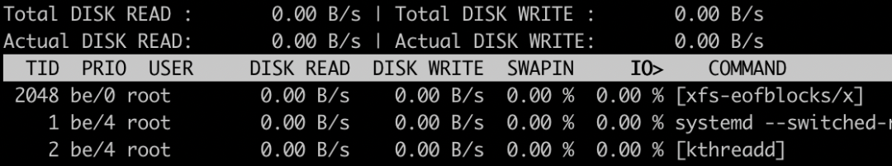
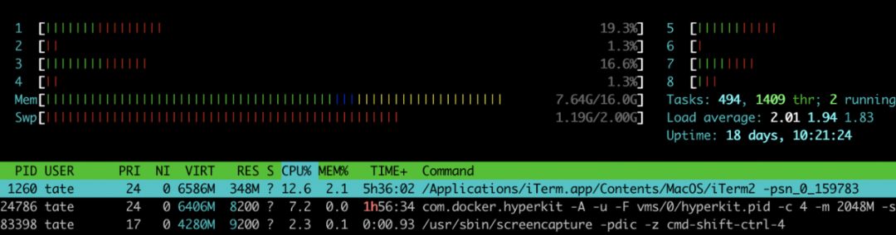
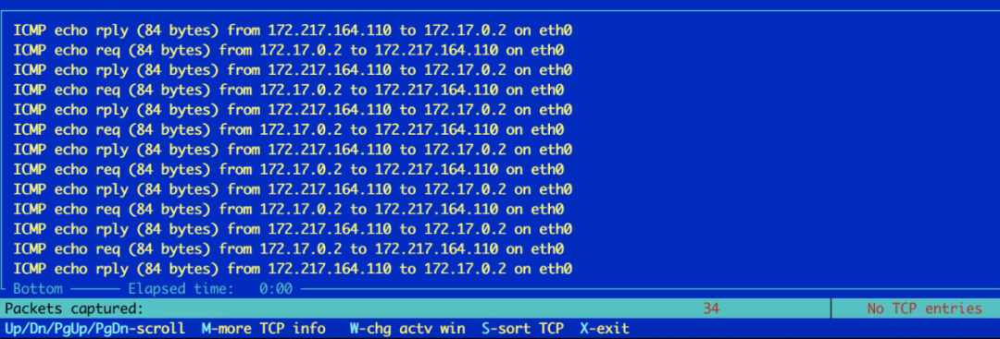
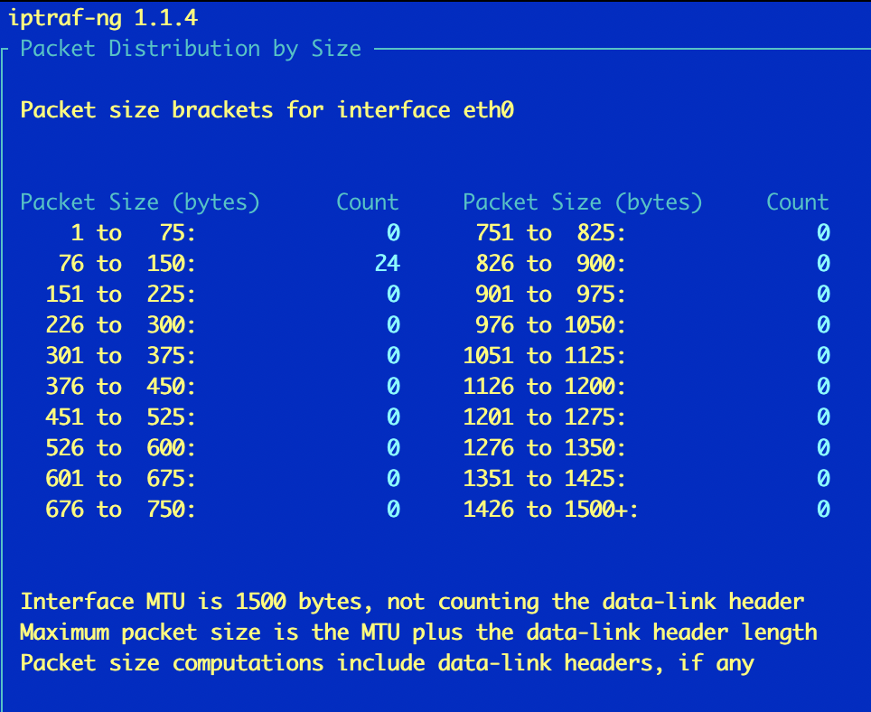
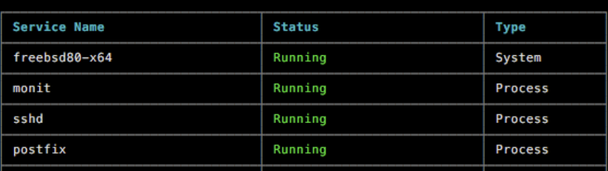
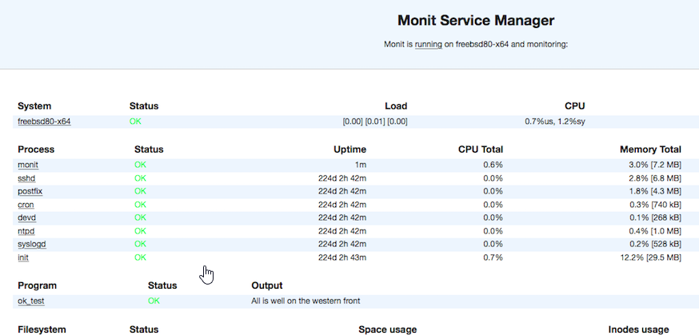

> 原文链接：<https://maimai.cn/article/detail?fid=1474924545&efid=L-4CQXaCUHjFiXYOHjnVTg&use_rn=1>

本文介绍了作者常用的 **4** 个 Linux 监控工具，希望可以帮助读者提高生产力。

身为一个运维开发人员，如果你不知道眼下当前服务器底层操作系统中正在发生什么，那就有点合眼摸象了。其实，你可以根据相应数据做出一定的推测，但是要做到这一点，就需要原始数据，并且数据要有一定的实时性。

你需要能够根据操作系统当前的运行状态，结合监控数据来做出合理判断，采取相应措施。

你是否曾经遇到过一台服务器运行缓慢，但是 CPU 使用率看起来不是很高的情况？你是否遇到过服务器的网络利用率很高，但是定位不到导致高网络利用率的进程情况？

下面介绍的这些工具可以给你提供帮助。最重要的是，它们中的大多数都可以在没有 GUI 的情况下使用，并且能轻松安装在大多数服务器上。以下就是我每天用到的一些不错的 Linux 监控工具，它们可以帮助我快速准确地诊断和定位问题。

# iotop
如果你想知道到底哪些进程消耗了服务器宝贵的 I/O 资源，那么请使用 iotop！我无数次地使用它通过 IOPS 参数来定位那些疯狂占用磁盘 IO 的耗时进程。

	yum -y install iotop

你只是无法从传统工具（如 top）中获取原始数据。当使用 iotop 时，你会发现正如工具的名字所描述的一样，它会展示进程和系统的 I/O 资源使用情况。

你可以将其用于多种目的，但最关键的是查看磁盘使用情况并标记潜在的性能瓶颈。将此工具与 top 或 htop 等其他工具结合使用，能帮你更全面地了解服务器当前负载情况。

我不建议将 iotop 用于基准测试。尽管你能清楚地了解每个进程占用多少 I/O 资源，但它更适合实时监控而不是重复的性能测试。如果你对 I/O 基准测试感兴趣，我推荐一个名为 fio 的工具。

<http://fio.readthedocs.io/en/latest/fio_doc.html>

# htop
这是我本人的最爱的监控工具之一。该工具比 top 工具更具视觉吸引力，并且拥有出色的默认配色方案。使用它，你就可以马上对系统当前运行情况有一个清晰了解。

	yum -y install htop

你能清晰地在水平条形图中查看计算机内核数目以及它们的利用率。同样的，你还可以获得内存使用情况的简单统计信息，并且在底部也有经典的 top 进程列表。

我热衷于 htop 的主要原因是它能快速地提供我所关注的信息。我就是想看看服务器每核 CPU 使用率和内存使用率在图形上是怎样的 - 而不是一个无聊的百分比。

如果你肯定某个进程正在耗尽系统上的所有核心从而打开 htop 进行查看，那么就会发现大片红色，整个过程快速而简单。

# IPTraf
这是一个诊断网络问题非常有用的工具。使用此工具，你可以监控正在网络传输的网络流量。也能以特定的接口或流量类型（例如特定的 TCP 端口）进行过滤。它与 Wireshark 功能非常相似，不同之处在于它更轻巧，并且也可以在没有 GUI 的情况下运行。

yum -y install iptraf

http://iptraf.seul.org/

http://www.wireshark.org/

另外，该监控工具还有一些非常棒的功能，比如按数据包大小对流量进行统计细分：

您可以使用 tcpdump 或 tshark 之类的命令行工具执行类似的操作，但是此工具是菜单驱动的，更易于浏览。如果你更倾向于交互式地过滤和查看网络流量情况，那么 IPTraf 这款工具会如你所愿。

# Monit
这是你可以在 Linux 上使用的最灵活、功能最强大的监视工具之一。Monit 出现了很多年，它能通过多种方式进行配置以支持不同类型的阈值监控和性能告警。

yum -y install monit

http://mmonit.com/

Monit 允许你指定要在 Linux 操作系统上监视的进程、端口、文件等。它支持使用复杂的回退计时器 back-off timer 和消息来设置动态警报模式。

一个监控场景比如你想要监控特定进程以确保其正在运行。如果该进程崩溃一次，只需重新启动它即可。如果它开始多次连续地崩溃，那就不要重新启动该进程，而应该发送警报。这样的监控场景可以通过 Monit 的几行配置轻松实现。

Monit 甚至为守护程序提供了一个不错的轻量级 Web 界面，让你一眼就能看到服务器发生了什么：

无论你是管理单个服务器还是集群，Monit 提供了最简单，最高效和最划算的（免费！）方法来帮你监控服务的运行状态。

# 结论
非常感谢你抽出宝贵的时间阅读本文。我希望在你了解到我提到的这些 Linux 监控工具，以及为什么它们在分析系统异常时能发挥如此重要的作用后，能使您乐在其中，并有所收获。

延展阅读：

http://medium.com/better-programming/4-linux-monitoring-tools-you-should-use-38a136e68639