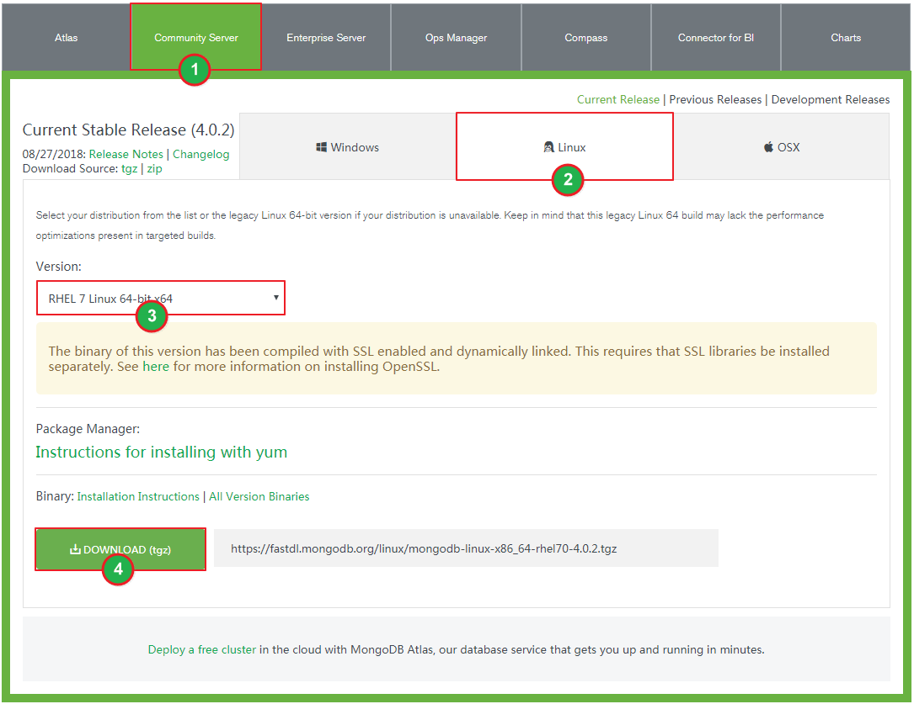

本篇文章主要对如何在Linux下安装与配置 MongoDB 进行介绍。

# 环境准备
- Linux版本：CentOS 7.2
- MongoDB压缩包下载地址：<https://www.mongodb.com/download-center#atlas>

选择你所需的版本：

我使用的是 `mongodb-linux-x86_64-rhel70-4.0.2.tgz` ，其下载地址为：
<https://fastdl.mongodb.org/linux/mongodb-linux-x86_64-rhel70-4.0.2.tgz>

可以使用如下命令直接将压缩包下载至 Linux 服务器，下载过程中可能会报 Unable to establish SSL connection 错误：

	[root@hadoop40 soft]# wget https://fastdl.mongodb.org/linux/mongodb-linux-x86_64-rhel70-4.0.2.tgz
	--2018-10-08 16:50:39-- https://fastdl.mongodb.org/linux/mongodb-linux-x86_64-rhel70-4.0.2.tgz
	Resolving fastdl.mongodb.org (fastdl.mongodb.org)... 13.35.8.98, 13.35.8.53, 13.35.8.95, ...
	Connecting to fastdl.mongodb.org (fastdl.mongodb.org)|13.35.8.98|:443... connected.
	Unable to establish SSL connection.

将下载地址改为 <http://fastdl.mongodb.org/linux/mongodb-linux-x86_64-rhel70-4.0.2.tgz> ，即可下载成功。

	[root@hadoop40 soft]# wget http://fastdl.mongodb.org/linux/mongodb-linux-x86_64-rhel70-4.0.2.tgz
	--2018-10-08 16:53:31-- http://fastdl.mongodb.org/linux/mongodb-linux-x86_64-rhel70-4.0.2.tgz
	Resolving fastdl.mongodb.org (fastdl.mongodb.org)... 13.35.8.53, 13.35.8.95, 13.35.8.80, ...
	Connecting to fastdl.mongodb.org (fastdl.mongodb.org)|13.35.8.53|:80... connected.
	HTTP request sent, awaiting response... 200 OK
	Length: 84586631 (81M) [application/x-gzip]
	Saving to: ‘mongodb-linux-x86_64-rhel70-4.0.2.tgz’
	 
	100%[================================================>] 84,586,631 2.04MB/s in 40s
	 
	2018-10-08 16:54:11 (2.04 MB/s) - ‘mongodb-linux-x86_64-rhel70-4.0.2.tgz’ saved [84586631/84586631]

当然，你也可以先下载好MongoDB压缩包，然后使用WinSCP等远程连接工具将其上传到服务器上。

# 安装MongoDB
	# 将下载好的 MongoDB 压缩包解压到 /usr/local/
	[root@hadoop40 soft]# tar zxvf mongodb-linux-x86_64-rhel70-4.0.2.tgz -C /usr/local/
	mongodb-linux-x86_64-rhel70-4.0.2/README
	mongodb-linux-x86_64-rhel70-4.0.2/THIRD-PARTY-NOTICES
	mongodb-linux-x86_64-rhel70-4.0.2/MPL-2
	mongodb-linux-x86_64-rhel70-4.0.2/GNU-AGPL-3.0
	mongodb-linux-x86_64-rhel70-4.0.2/LICENSE-Community.txt
	mongodb-linux-x86_64-rhel70-4.0.2/bin/mongodump
	mongodb-linux-x86_64-rhel70-4.0.2/bin/mongorestore
	mongodb-linux-x86_64-rhel70-4.0.2/bin/mongoexport
	mongodb-linux-x86_64-rhel70-4.0.2/bin/mongoimport
	mongodb-linux-x86_64-rhel70-4.0.2/bin/mongostat
	mongodb-linux-x86_64-rhel70-4.0.2/bin/mongotop
	mongodb-linux-x86_64-rhel70-4.0.2/bin/bsondump
	mongodb-linux-x86_64-rhel70-4.0.2/bin/mongofiles
	mongodb-linux-x86_64-rhel70-4.0.2/bin/mongoreplay
	mongodb-linux-x86_64-rhel70-4.0.2/bin/mongod
	mongodb-linux-x86_64-rhel70-4.0.2/bin/mongos
	mongodb-linux-x86_64-rhel70-4.0.2/bin/mongo
	mongodb-linux-x86_64-rhel70-4.0.2/bin/install_compass
	 
	# 由于 mongodb-linux-x86_64-rhel70-4.0.2 目录名称比较长，将其重命名为 mongodb-4.0.2
	[root@hadoop40 soft]# mv /usr/local/mongodb-linux-x86_64-rhel70-4.0.2/ /usr/local/mongodb-4.0.2/

# 配置环境变量(root权限)

	[root@hadoop40 soft]# vim /etc/profile
	[root@hadoop40 soft]# source /etc/profile

在 /etc/profile 配置文件中添加 MongoDB 环境变量，内容如下：

	PATH=$PATH:/usr/local/mongodb-4.0.2/bin

# 启动MongoDB
接下来，创建 data 和 log 两个文件夹分别用来存放 MongoDB 的数据和日志文件。

	[root@hadoop40 soft]# mkdir /usr/local/mongodb-4.0.2/data
	[root@hadoop40 soft]# mkdir /usr/local/mongodb-4.0.2/log

然后，执行如下命令使用指定的配置来启动 MongoDB：

	[root@hadoop40 soft]# mongod --dbpath /usr/local/mongodb-4.0.2/data/ --logpath /usr/local/mongodb-4.0.2/log/mongodb.log --fork --bind_ip 172.16.250.240 --port 27017
	2018-10-09T10:19:47.483+0800 I CONTROL [main] Automatically disabling TLS 1.0, to force-enable TLS 1.0 specify --sslDisabledProtocols 'none'
	about to fork child process, waiting until server is ready for connections.
	forked process: 3093
	child process started successfully, parent exiting

你也可以将以上启动配置写到一个配置文件中 mongodb.conf，内容如下：

	dbpath=/usr/local/mongodb-4.0.2/data
	logpath=/usr/local/mongodb-4.0.2/log/mongodb.log
	fork=true
	logappend=true
	bind_ip=172.16.250.240
	port=27017

并使用如下命令使用 mongodb.conf 配置文件中的配置来启动 MongoDB：

	[root@hadoop40 soft]# mongod -config /usr/local/mongodb-4.0.2/mongodb.conf
	2018-10-09T10:32:54.788+0800 I CONTROL [main] Automatically disabling TLS 1.0, to force-enable TLS 1.0 specify --sslDisabledProtocols 'none'
	about to fork child process, waiting until server is ready for connections.
	forked process: 3316
	child process started successfully, parent exiting

# MongoDB连接测试
首先执行 `ps -ef|grep mongo` 命令查看MongoDB进程是否已经启动：

	[root@hadoop40 soft]# ps -ef|grep mongo
	root 3316 1 1 10:19 ? 00:00:01 mongod --dbpath /usr/local/mongodb-4.0.2/data/ --logpath /usr/local/mongodb-4.0.2/log/mongodb.log --fork --bind_ip 172.16.250.240 --port 27017
	root 3142 24012 0 10:21 pts/0 00:00:00 grep --color=auto mongo

然后执行如下命令进行连接：

	[root@hadoop40 soft]# mongo -host 172.16.250.240 -port 27017
	MongoDB shell version v4.0.2
	connecting to: mongodb://172.16.250.240:27017/
	MongoDB server version: 4.0.2
	Server has startup warnings:
	2018-10-09T10:44:20.273+0800 I CONTROL [initandlisten]
	2018-10-09T10:44:20.273+0800 I CONTROL [initandlisten] ** WARNING: Access control is not enabled for the database.
	2018-10-09T10:44:20.273+0800 I CONTROL [initandlisten] ** Read and write access to data and configuration is unrestricted.
	2018-10-09T10:44:20.273+0800 I CONTROL [initandlisten] ** WARNING: You are running this process as the root user, which is not recommended.
	2018-10-09T10:44:20.273+0800 I CONTROL [initandlisten]
	2018-10-09T10:44:20.274+0800 I CONTROL [initandlisten]
	2018-10-09T10:44:20.274+0800 I CONTROL [initandlisten] ** WARNING: /sys/kernel/mm/transparent_hugepage/enabled is 'always'.
	2018-10-09T10:44:20.274+0800 I CONTROL [initandlisten] ** We suggest setting it to 'never'
	2018-10-09T10:44:20.274+0800 I CONTROL [initandlisten]
	2018-10-09T10:44:20.274+0800 I CONTROL [initandlisten] ** WARNING: /sys/kernel/mm/transparent_hugepage/defrag is 'always'.
	2018-10-09T10:44:20.274+0800 I CONTROL [initandlisten] ** We suggest setting it to 'never'
	2018-10-09T10:44:20.274+0800 I CONTROL [initandlisten]
	---
	Enable MongoDB's free cloud-based monitoring service, which will then receive and display
	metrics about your deployment (disk utilization, CPU, operation statistics, etc).
	The monitoring data will be available on a MongoDB website with a unique URL accessible to you
	and anyone you share the URL with. MongoDB may use this information to make product
	improvements and to suggest MongoDB products and deployment options to you.
	To enable free monitoring, run the following command: db.enableFreeMonitoring()
	To permanently disable this reminder, run the following command: db.disableFreeMonitoring()
	---

关闭MongoDB服务使用如下命令：

	[root@hadoop40 mongodb-4.0.2]# mongod --shutdown --dbpath /usr/local/mongodb-4.0.2/data
	2018-11-13T14:47:05.932+0800 I CONTROL  [main] Automatically disabling TLS 1.0, to force-enable TLS 1.0 specify --sslDisabledProtocols 'none'
	killing process with pid: 3509
 