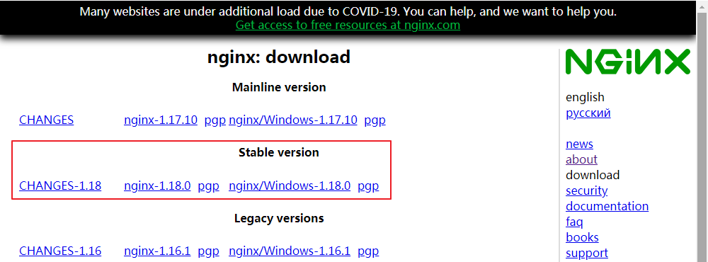
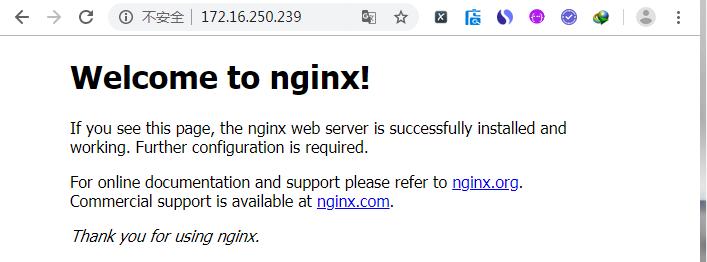

`Nginx`("engine x")是一个高性能的`HTTP`和反向代理`web`服务器，同时也可以作为`IMAP/POP3/SMTP`的代理服务器来使用。

# Nginx安装
## 安装工具库

	yum -y install make zlib zlib-devel gcc-c++ libtool  openssl openssl-devel

## 安装 PCRE
`PCRE`(Perl Compatible Regular Expressions，perl语言兼容的正则表达式)， Nginx的Rewrite功能中需要使用到 PCRE 来对路由地址进行正则匹配。

	[root@hadoop39 ~]# cd /usr/local/src/
	[root@hadoop39 src]# wget https://nchc.dl.sourceforge.net/project/pcre/pcre/8.44/pcre-8.44.tar.gz
	[root@hadoop39 src]# tar -zxvf pcre-8.44.tar.gz -C /usr/local/
	[root@hadoop39 src]# cd /usr/local/pcre-8.44/
	[root@hadoop39 pcre-8.44]# ./configure
	[root@hadoop39 pcre-8.44]# make && make install
	[root@hadoop39 pcre-8.44]# pcre-config --version
	8.44

## 下载Nginx安装包
Nginx官网下载网址：<http://nginx.org/en/download.html>，如图所示，推荐下载Nginx最新的稳定版安装包。

`nginx-1.18.0`的下载链接为：<http://nginx.org/download/nginx-1.18.0.tar.gz>

如果需要获取Nginx的其他版本，可以访问<http://nginx.org/download/>。

	[root@hadoop39 ~]# cd /usr/local/src/
	[root@hadoop39 src]# wget http://nginx.org/download/nginx-1.18.0.tar.gz

## 解压安装包

	[root@hadoop39 src]# tar -zxvf nginx-1.18.0.tar.gz
	[root@hadoop39 src]# cd nginx-1.18.0/

## 编译安装

	[root@hadoop39 nginx-1.18.0]# ./configure --prefix=/usr/local/nginx --with-http_stub_status_module --with-http_ssl_module --with-pcre=/usr/local/pcre-8.44/
	[root@hadoop39 nginx-1.18.0]# make
	[root@hadoop39 nginx-1.18.0]# make install
	[root@hadoop39 nginx-1.18.0]# /usr/local/nginx/sbin/nginx -v
	nginx version: nginx/1.18.0
	[root@hadoop39 nginx-1.18.0]# ln -s /usr/local/nginx/sbin/nginx /usr/bin/nginx
	[root@hadoop39 ~]# nginx -t
	nginx: the configuration file /usr/local/nginx/conf/nginx.conf syntax is ok
	nginx: configuration file /usr/local/nginx/conf/nginx.conf test is successful
	[root@hadoop39 html]# nginx -h
	nginx version: nginx/1.18.0
	Usage: nginx [-?hvVtTq] [-s signal] [-c filename] [-p prefix] [-g directives]
	 
	Options:
	  -?,-h         : this help
	  -v            : show version and exit
	  -V            : show version and configure options then exit
	  -t            : test configuration and exit
	  -T            : test configuration, dump it and exit
	  -q            : suppress non-error messages during configuration testing
	  -s signal     : send signal to a master process: stop, quit, reopen, reload
	  -p prefix     : set prefix path (default: /usr/local/nginx/)
	  -c filename   : set configuration file (default: conf/nginx.conf)
	  -g directives : set global directives out of configuration file

## 缺省配置
	#user  nobody;
	worker_processes  1;
	 
	#error_log  logs/error.log;
	#error_log  logs/error.log  notice;
	#error_log  logs/error.log  info;
	 
	#pid        logs/nginx.pid;
	 
	 
	events {
	    worker_connections  1024;
	}
	 
	 
	http {
	    include       mime.types;
	    default_type  application/octet-stream;
	 
	    #log_format  main  '$remote_addr - $remote_user [$time_local] "$request" '
	    #                  '$status $body_bytes_sent "$http_referer" '
	    #                  '"$http_user_agent" "$http_x_forwarded_for"';
	 
	    #access_log  logs/access.log  main;
	 
	    sendfile        on;
	    #tcp_nopush     on;
	 
	    #keepalive_timeout  0;
	    keepalive_timeout  65;
	 
	    #gzip  on;
	 
	    server {
	        listen       80;
	        server_name  localhost;
	 
	        #charset koi8-r;
	 
	        #access_log  logs/host.access.log  main;
	 
	        location / {
	            root   html;
	            index  index.html index.htm;
	        }
	 
	        #error_page  404              /404.html;
	 
	        # redirect server error pages to the static page /50x.html
	        #
	        error_page   500 502 503 504  /50x.html;
	        location = /50x.html {
	            root   html;
	        }
	 
	        # proxy the PHP scripts to Apache listening on 127.0.0.1:80
	        #
	        #location ~ \.php$ {
	        #    proxy_pass   http://127.0.0.1;
	        #}
	 
	        # pass the PHP scripts to FastCGI server listening on 127.0.0.1:9000
	        #
	        #location ~ \.php$ {
	        #    root           html;
	        #    fastcgi_pass   127.0.0.1:9000;
	        #    fastcgi_index  index.php;
	        #    fastcgi_param  SCRIPT_FILENAME  /scripts$fastcgi_script_name;
	        #    include        fastcgi_params;
	        #}
	 
	        # deny access to .htaccess files, if Apache's document root
	        # concurs with nginx's one
	        #
	        #location ~ /\.ht {
	        #    deny  all;
	        #}
	    }
	 
	 
	    # another virtual host using mix of IP-, name-, and port-based configuration
	    #
	    #server {
	    #    listen       8000;
	    #    listen       somename:8080;
	    #    server_name  somename  alias  another.alias;
	 
	    #    location / {
	    #        root   html;
	    #        index  index.html index.htm;
	    #    }
	    #}
	 
	 
	    # HTTPS server
	    #
	    #server {
	    #    listen       443 ssl;
	    #    server_name  localhost;
	 
	    #    ssl_certificate      cert.pem;
	    #    ssl_certificate_key  cert.key;
	 
	    #    ssl_session_cache    shared:SSL:1m;
	    #    ssl_session_timeout  5m;
	 
	    #    ssl_ciphers  HIGH:!aNULL:!MD5;
	    #    ssl_prefer_server_ciphers  on;
	 
	    #    location / {
	    #        root   html;
	    #        index  index.html index.htm;
	    #    }
	    #}
	 
	}

## 启动Nginx

	[root@hadoop39 ~]# nginx

启动成功之后，通过IP访问Nginx服务器。

 