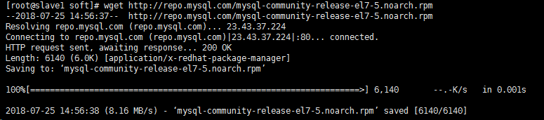

**（1）检查系统中是否已安装 MySQL。**

	rpm -qa | grep mysql

返回空值的话，就说明没有安装 MySQL 。

》 注意：在新版本的CentOS7中，默认的数据库已更新为了Mariadb，而非 MySQL，所以执行 yum install mysql 命令只是更新Mariadb数据库，并不会安装 MySQL 。

**（2）查看已安装的 Mariadb 数据库版本。**

	rpm -qa|grep -i mariadb

**（3）卸载已安装的 Mariadb 数据库。**

	rpm -qa|grep mariadb|xargs rpm -e --nodeps

**（4）再次查看已安装的 Mariadb 数据库版本，确认是否卸载完成。**

	rpm -qa|grep -i mariadb

**（5）下载安装包文件。**

	wget http://repo.mysql.com/mysql-community-release-el7-5.noarch.rpm

**（6）安装mysql-community-release-el7-5.noarch.rpm包**

	rpm -ivh mysql-community-release-el7-5.noarch.rpm

安装完成之后，会在 `/etc/yum.repos.d/` 目录下新增 `mysql-community.repo` 、`mysql-community-source.repo` 两个 yum 源文件。

执行 `yum repolist all | grep mysql` 命令查看可用的 mysql 安装文件。

**（6）安装mysql。**

	yum install mysql-server

**（7）检查mysql是否安装成功。**

	rpm -qa | grep mysql

**（8）启动 mysql 服务 。**

	systemctl start mysqld.service #启动 mysql
	systemctl restart mysqld.service #重启 mysql
	systemctl stop mysqld.service #停止 mysql
	systemctl enable mysqld.service #设置 mysql 开机启动

mysql常用文件路径：

- /etc/my.cnf 　　这是mysql的主配置文件
- /var/lib/mysql 　　mysql数据库的数据库文件存放位置
- /var/logs/mysqld.log　　数据库的日志输出存放位置

**（9）设置密码 。**

mysql5.6 安装完成后，它的 root 用户的密码默认是空的，我们需要及时用 mysql 的 root 用户登录（第一次直接回车，不用输入密码），并修改密码。

	# mysql -u root
	mysql> use mysql;
	mysql> update user set password=PASSWORD("这里输入root用户密码") where User='root';
	mysql> flush privileges; 

**（10）设置远程主机登录**

	mysql> GRANT ALL PRIVILEGES ON *.* TO 'your username'@'%' IDENTIFIED BY 'your password';

执行以下命令，为root 用户添加远程登录的能力。

	mysql> GRANT ALL PRIVILEGES ON *.* TO root@"%" IDENTIFIED BY "123456";

