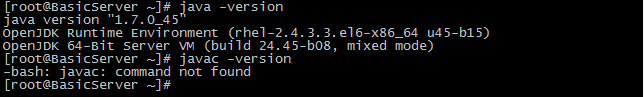
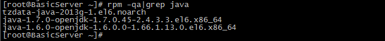
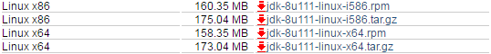
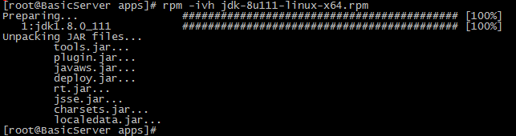
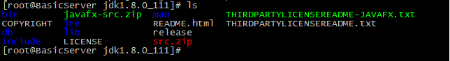
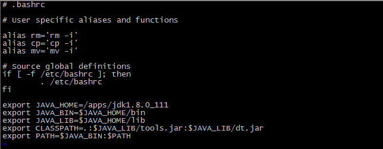
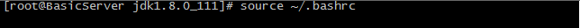
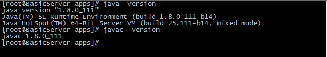

**（1）检查系统中是否已安装jdk，查看其版本。**

使用命令：`java –version、javac –version`

**（2）已安装openjdk版本，查询已安装的包文件。**

使用命令：`rpm -qa|grep java`

**（3）卸载已安装的openjdk版本。**

使用命令：`rpm -qa|grep java|xargs rpm -e --nodeps`

**（4）再次查看已安装的jdk版本，确认是否卸载完成。**

使用命令：`java –version、javac –version`

**（5）下载安装包文件。**

官网地址：<http://www.oracle.com/technetwork/java/javase/downloads/index.html>

**（6）jdk安装。**

**使用rpm包安装**：

**1.** 根据自己需要下载所需`rpm`安装包，以`jdk-8u111-linux-x64.rpm`为例。

**2.** 安装`jdk`。

使用命令：`rpm -ivh jdk-8u111-linux-x64.rpm`

**使用tar.gz包安装**：

**1.** 根据自己需要下载所需`tar.gz`压缩包，以`jdk-8u111-linux-x64.tar.gz`为例。

**2.** 解压文件至安装目录。

使用命令：`tar -zvxf jdk-8u111-linux-x64.tar.gz`

**3.** 查看解压文件目录中所包含内容。

使用命令：`ls`

**4.** 编辑`~/.bashrc`文件，配置`jdk`环境变量。

使用命令：`vi ~/.bashrc`

**变量配置**： 

	export JAVA_HOME=/apps/jdk1.8.0_111
	export JAVA_BIN=$JAVA_HOME/bin
	export JAVA_LIB=$JAVA_HOME/lib
	export CLASSPATH=.:$JAVA_LIB/tools.jar:$JAVA_LIB/dt.jar
	export PATH=$JAVA_BIN:$PATH
 

**5.** 使环境变量生效。

使用命令：`source ~/.bashrc`

**（7）检查jdk是否安装成功。** 

使用命令：`java –version、javac –version`

 