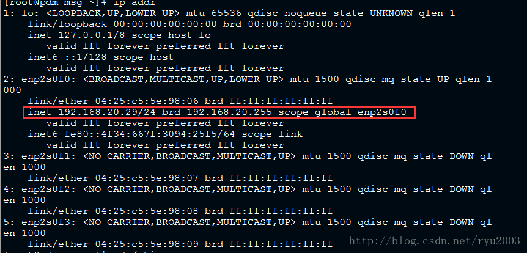

> 原文链接：<https://blog.csdn.net/ryu2003/article/details/78492127>

注：本办法仅限于可联网的机器，即在安装时设置了`IP地址`和`DNS`可正常上网。

1、输入`ip addr`确认IP地址是否设置正常，设置好如下所示，如果没有获取到IP地址则设置一个即可。 

2、确认sbin目录是否存在。

	cd /sbin

3、确认`ifconfig`命令是否未安装

在`sbin`目录下输入`ls`，可见下图所示，并没有`ifconfig`。 

4、安装`net-tool`插件，此插件中带有此命令 

安装命令：

	sudo yum install net-tools

等待安装完成，再次输入`ifconfig`,成功。 

 