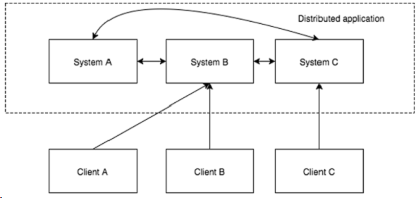
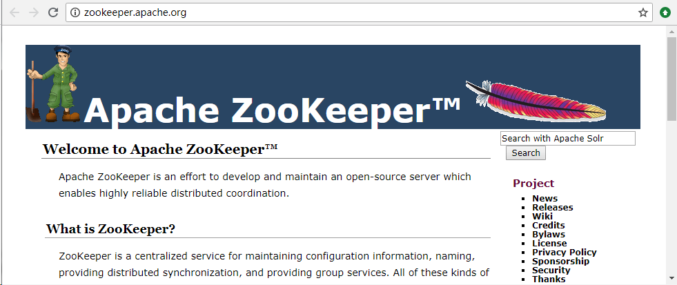
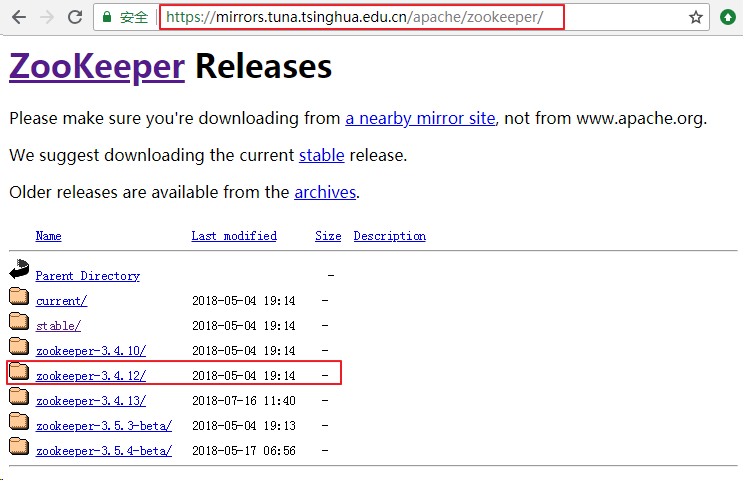
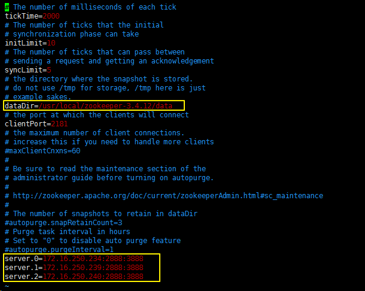

# Zookeeper简介
`ZooKeeper`是一个开源的分布式应用协调服务，用于在分布式应用各个节点之间进行协调，并通过稳健的同步技术维护共享数据。

这里提到了一个新名词：`分布式应用`，让我们先来简单地快速了解一下什么是分布式应用？

## 分布式应用
**分布式应用**（`distributed application`）指的是应用程序分布在不同计算机上，通过网络来共同完成一项任务的工作方式。通常来说，我们习惯上会把分布式的应用系统称为集群，而在集群中运行的每台机器则被称为节点。

分布式应用包括两部分：**Server**（服务器） 和 **Client**（客户端） 应用程序。服务器应用程序实际上是分布式的，并具有通用接口，以便客户端可以连接到集群中的任何服务器并获得相同的结果。 客户端应用程序是与分布式应用进行交互的工具。

**分布式应用的优点**：

- 可靠性、高容错性 - 单个或几个节点的故障不会使整个系统出现故障。
- 可扩展性 - 可以在需要时通过添加更多的节点来提升整个系统的性能，只需在应用程序配置中进行微小的更改，而不会有停机时间。
- 高性能 - 相较于传统的集群式应用，分布式应用对于机器的配置要求较低，可以提供更高的性能及更好的性价比。

**分布式应用的挑战**：

- 竞争条件 - 两个或多个机器同时尝试执行特定的任务，例如：多个机器同时去修改某一共享资源。
- 死锁 - 两个或多个操作相互等待，造成无限期等待。
- 不一致 - 两个或多个机器间的数据不一致。

分布式应用提供了很多好处，但它们也抛出了一些复杂和难以解决的挑战，ZooKeeper提供了一套完整的机制来克服所有的挑战：

- ZooKeeper使用故障安全同步方法处理分布式应用的竞争条件和死锁；
- ZooKeeper使用原子性解析来解决数据的不一致。

通常，ZooKeeper也会被部署成分布式集群，能够为分布式应用提供如下服务：

- 命名服务 - 按名称标识集群中的节点或资源，为它们生成全局唯一的ID。
- 管理配置 - 将配置信息存储在ZooKeeper供订阅者读取，实现配置信息的集中式管理和动态更新。
- 分布式协调服务/通知 - 实时地监控集群中机器节点的状态，并作出相应的处理措施，将节点加入或移出集群。
- Master选举 - 当集群现有的 Master 出现故障，ZooKeeper 能够自动地选举出新的Master。
- 分布式锁 - 控制分布式应用的节点之间同步访问共享资源。

Zookeeper集群中节点个数一般为**奇数**个（`>=3`，本文搭建的 Zookeeper集群节点个数（奇数）为`3`个），这样做的好处是：若Zookeeper集群中的`Master`节点挂掉，只要剩余节点的个数在半数以上，就可以推举新的`Master`节点，继续对外提供服务。

# ZooKeeper的安装与配置
## 环境准备
3个节点服务器信息如下：
<table border="1" cellpadding="0" cellspacing="0"><tbody><tr><td>Host Name</td><td>IP Address</td><td>User Name</td></tr><tr><td>hadoop34</td><td>172.16.250.234</td><td>hadoop / root</td></tr><tr><td>hadoop39</td><td>172.16.250.239</td><td>hadoop / root</td></tr><tr><td>hadoop40</td><td>172.16.250.240</td><td>hadoop / root</td></tr></tbody></table>
ZooKeeper官网地址：<http://zookeeper.apache.org/>

ZooKeeper下载地址：

- <https://archive.apache.org/dist/zookeeper/>
- <http://mirrors.hust.edu.cn/apache/zookeeper/>
- <https://mirrors.tuna.tsinghua.edu.cn/apache/zookeeper/>
- <http://mirrors.shu.edu.cn/apache/zookeeper/>
- <http://mirror.bit.edu.cn/apache/zookeeper/>

ZooKeeper服务器是用Java创建的，它在JVM上运行，所以，在安装ZooKeeper之前需要先安装`JDK`。

	# 可以使用如下命令检查JDK是否已经正确安装
	[hadoop@hadoop34 local]$ java -version
	java version "1.8.0_144"
	Java(TM) SE Runtime Environment (build 1.8.0_144-b01)
	Java HotSpot(TM) 64-Bit Server VM (build 25.144-b01, mixed mode)

JDK的安装与配置，请参考文章：<https://blog.csdn.net/pengjunlee/article/details/53932094>

为避免由于防火墙策略导致安装失败问题，建议先关闭防火墙，下面给出不同CentOS版本下关闭防火墙的操作命令：

	# Centos6: 
	[root@localhost ~]# chkconfig iptables off                # 永久关闭防火墙（重启生效）
	[root@localhost ~]# service iptables stop                 # 临时关闭防火墙（立即生效）
	# Centos7: 
	[root@localhost ~]# systemctl disable firewalld           # 永久关闭防火墙（重启生效）
	[root@localhost ~]# systemctl stop firewalld              # 临时关闭防火墙（立即生效）

## 安装ZooKeeper
本文安装的是`zookeeper-3.4.12.tar.gz`，其下载地址为：

	https://mirrors.tuna.tsinghua.edu.cn/apache/zookeeper/zookeeper-3.4.12/zookeeper-3.4.12.tar.gz

将`ZooKeeper`安装到`/usr/local/zookeeper-3.4.12`目录下，在3个节点上分别执行如下命令：

	# 切换到安装下载的目标目录
	[root@hadoop34 src]# cd /usr/local/src/
	# 使用wget命令下载所需版本的安装包
	[root@hadoop34 src]# wget https://mirrors.tuna.tsinghua.edu.cn/apache/zookeeper/zookeeper-3.4.12/zookeeper-3.4.12.tar.gz
	--2018-08-13 14:51:54--  https://mirrors.tuna.tsinghua.edu.cn/apache/zookeeper/zookeeper-3.4.12/zookeeper-3.4.12.tar.gz
	Resolving mirrors.tuna.tsinghua.edu.cn (mirrors.tuna.tsinghua.edu.cn)... 101.6.8.193, 2402:f000:1:408:8100::1
	Connecting to mirrors.tuna.tsinghua.edu.cn (mirrors.tuna.tsinghua.edu.cn)|101.6.8.193|:443... connected.
	HTTP request sent, awaiting response... 200 OK
	Length: 36667596 (35M) [application/octet-stream]
	Saving to: ‘zookeeper-3.4.12.tar.gz’
	 
	100%[===============================================================>] 36,667,596  2.03MB/s   in 18s    
	 
	2018-08-13 14:52:12 (1.99 MB/s) - ‘zookeeper-3.4.12.tar.gz’ saved [36667596/36667596]
	 
	# 将安装包解压到安装目标目录
	[root@hadoop34 src]# tar zxvf zookeeper-3.4.12.tar.gz -C /usr/local/
	# 为hadoop用户添加zookeeper-3.4.12目录的所有者和所属组权限
	[root@hadoop34 src]# chown -R hadoop:hadoop /usr/local/zookeeper-3.4.12/
	[root@hadoop34 src]# cd /usr/local/zookeeper-3.4.12/
	[root@hadoop34 zookeeper-3.4.12]# pwd
	/usr/local/zookeeper-3.4.12
	# 编辑/etc/profile添加Zookeeper相关环境变量
	[root@hadoop34 zookeeper-3.4.12]# vim /etc/profile
	# 新增 export ZOOKEEPER_HOME=/usr/local/zookeeper-3.4.12
	export ZOOKEEPER_HOME=/usr/local/zookeeper-3.4.12
	# 在PATH 中添加 $ZOOKEEPER_HOME/bin
	PATH=$PATH:$ZOOKEEPER_HOME/bin
	 
	# 使/etc/profile配置及时生效
	[root@hadoop34 zookeeper-3.4.12]# source /etc/profile

## 配置ZooKeeper
### 配置zoo.cfg
将在3个节点服务器的`$ZOOKEEPER_HOME/conf`目录下的`zoo_sample.cfg`文件改名为`zoo.cfg`，并修改其配置：

	# 切换到Zookeeper的操作用户
	[root@hadoop34 zookeeper-3.4.12]# su hadoop
	# 切换到Zookeeper的/conf目录
	[hadoop@hadoop34 zookeeper-3.4.12]$ cd $ZOOKEEPER_HOME/conf
	[hadoop@hadoop34 conf]$ ls
	configuration.xsl  log4j.properties  zoo_sample.cfg
	# 将zoo_sample.cfg重命名为zoo.cfg
	[hadoop@hadoop34 conf]$ mv zoo_sample.cfg zoo.cfg
	# 提前创建好Zookeeper的快照及日志存放目录
	[hadoop@hadoop34 conf]$ mkdir -p /usr/local/zookeeper-3.4.12/data
	# 编辑zoo.cfg配置文件
	[hadoop@hadoop34 conf]$ vim zoo.cfg

上述配置中各个参数的含义见下表：

<table border="1" cellpadding="0" cellspacing="0"><tbody><tr><td>参数名</td><td>说明</td></tr><tr><td>tickTime</td><td>默认值：3000（ms），不支持系统属性方式配置。用于配置zookeeper集群中节点之间维持心跳的时间间隔，同时，它也是zookeeper中最小的时间长度单元，很多运行时的时间间隔都是使用它的倍数来表示的。</td></tr><tr><td>initLimit</td><td>Zookeeper集群中的Leader 节点接收其他Follower节点初始化连接等待的最大时间（10*tickTime），如果Leader 节点在这段时间内还未接收到Follower节点的返回信息，则连接失败。</td></tr><tr><td>syncLimit</td><td>Zookeeper集群中的Leader 节点和其他Follower节点通信的最大等待时间（5*tickTime）。</td></tr><tr><td>dataDir</td><td>无默认值，必须配置。服务器存储快照文件目录。默认情况下，如果没有配置dataLogDir，那么事务日志也会存储在这个目录中。建议将事务日志目录独立配置。</td></tr><tr><td>clientPort</td><td>无默认值，必须配置，不支持系统属性方式配置。当前服务器对外提供服务端口，客户通过此端口与服务器建立连接，一般设置为2181。集群中不需要统一端口，可任意配置端口。</td></tr><tr><td>server.A=B:C:D</td><td>A：节点在集群中的唯一ID，需要与dataDir/myid文件中的内容保持一致，取值范围为1~255。  B：节点的服务器IP地址。  C：集群中Follower节点与Leader 节点之间通信的端口。  D：当集群中的Follower节点宕机或出现故障时，集群进行重新选举Leader时所使用的端口。</td></tr></tbody></table>

如果不想在3个节点上重复修改`zoo.cfg`配置文件，可以使用如下命令将修改好的配置文件直接远程拷贝到集群的其他节点上。

	[hadoop@hadoop34 conf]$ scp zoo.cfg hadoop@172.16.250.239:/usr/local/zookeeper-3.4.12/conf/
	zoo.cfg                                            100% 1042     2.7MB/s   00:00    

第一次远程拷贝时需要输入远程主机被连接账户的密码。

	[hadoop@hadoop34 conf]$ scp zoo.cfg hadoop@172.16.250.240:/usr/local/zookeeper-3.4.12/conf/
	The authenticity of host '172.16.250.240 (172.16.250.240)' can't be established.
	ECDSA key fingerprint is SHA256:oR3/n/A2nW7mJtOsIirSFWDAAA+DZdKokuJBblL6D/g.
	ECDSA key fingerprint is MD5:b7:0c:95:10:f2:c7:a6:f1:a1:72:b8:58:3e:50:6c:66.
	Are you sure you want to continue connecting (yes/no)? yes
	Warning: Permanently added '172.16.250.240' (ECDSA) to the list of known hosts.
	hadoop@172.16.250.240's password: 
	zoo.cfg                                            100% 1042   834.3KB/s   00:00  

### 创建myid
分别在3个节点服务器的`dataDir`目录下各创建一个名称为`myid`的文件，其内容即为节点的`ID`值。

	# 与zoo.cfg文件里面的server.0保持一致
	[hadoop@hadoop34 conf]$ echo "0" > /usr/local/zookeeper-3.4.12/data/myid
	# 与zoo.cfg文件里面的server.1保持一致
	[hadoop@hadoop39 conf]$ echo "1" > /usr/local/zookeeper-3.4.12/data/myid
	# 与zoo.cfg文件里面的server.2保持一致
	[hadoop@hadoop40 conf]$ echo "2" > /usr/local/zookeeper-3.4.12/data/myid

### 启动并测试ZooKeeper
挨个启动所有的ZooKeeper节点，使用如下命令：

	# $ZOOKEEPER_HOME/bin/zkServer.sh start
	[hadoop@hadoop34 conf]$ zkServer.sh start
	ZooKeeper JMX enabled by default
	Using config: /usr/local/zookeeper-3.4.12/bin/../conf/zoo.cfg
	Starting zookeeper ... STARTED

3个节点全部启动完成之后，查看各个节点的运行状态：

	# hadoop34
	[hadoop@hadoop34 conf]$ zkServer.sh status
	ZooKeeper JMX enabled by default
	Using config: /usr/local/zookeeper-3.4.12/bin/../conf/zoo.cfg
	Mode: follower
	# hadoop39
	[hadoop@hadoop39 conf]$ zkServer.sh status
	ZooKeeper JMX enabled by default
	Using config: /usr/local/zookeeper-3.4.12/bin/../conf/zoo.cfg
	Mode: leader
	# hadoop40
	[hadoop@hadoop40 conf]$ zkServer.sh status
	ZooKeeper JMX enabled by default
	Using config: /usr/local/zookeeper-3.4.12/bin/../conf/zoo.cfg
	Mode: follower

此时，`hadoop39`这台服务器为`Leader`节点，我们停止掉它上面运行的`ZooKeeper`服务来模拟`Leader`节点宕机的情况。

	[hadoop@hadoop39 conf]$ zkServer.sh stop
	ZooKeeper JMX enabled by default
	Using config: /usr/local/zookeeper-3.4.12/bin/../conf/zoo.cfg
	Stopping zookeeper ... STOPPED

再次查看剩余两个节点的运行状态：

	# hadoop34
	[hadoop@hadoop34 conf]$ zkServer.sh status
	ZooKeeper JMX enabled by default
	Using config: /usr/local/zookeeper-3.4.12/bin/../conf/zoo.cfg
	Mode: follower
	# hadoop40
	[hadoop@hadoop40 conf]$ zkServer.sh status
	ZooKeeper JMX enabled by default
	Using config: /usr/local/zookeeper-3.4.12/bin/../conf/zoo.cfg
	Mode: leader

`hadoop40`这台服务器被选举为了`ZooKeeper`集群新的`Leader`节点，至此，`Zookeeper`集群搭建并测试完成。