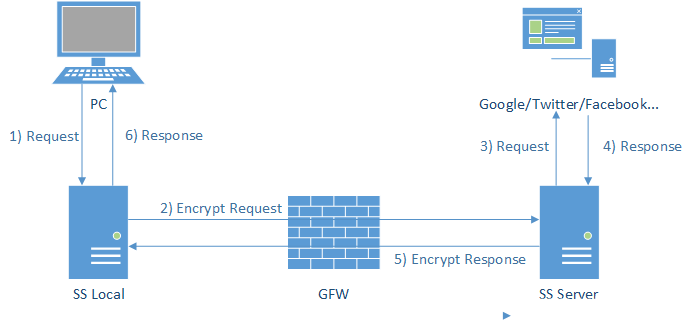
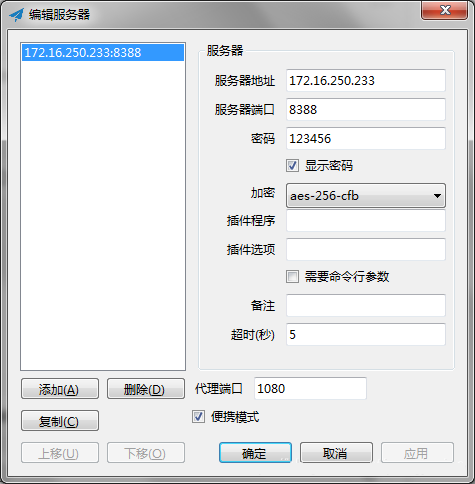
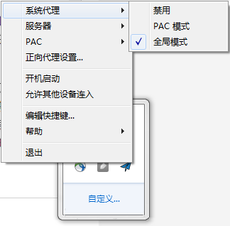
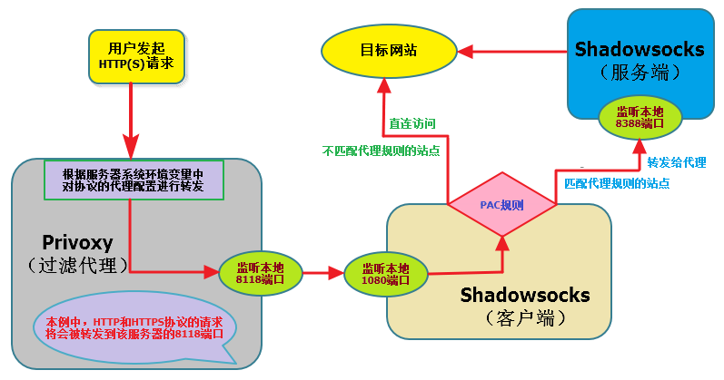
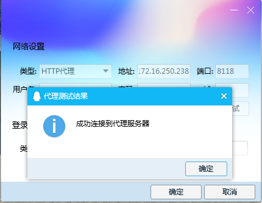
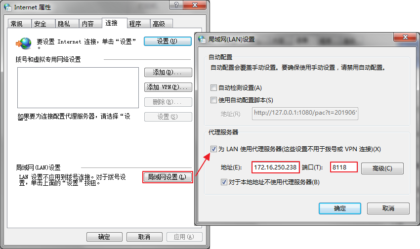

# 什么是代理服务器
**代理服务器**英文全称是`Proxy Server`，其功能就是代理网络用户去取得网络信息。形象的说：`它是网络信息的中转站`。

在一般情况下，我们使用网络浏览器直接去连接其他`Internet`站点取得网络信息时，须送出`Request`信号来得到回答，然后对方再把信息以`bit`方式传送回来。代理服务器是介于`浏览器`和`Web服务器`之间的一台服务器，有了它之后，浏览器不是直接到`Web服务器`去取回网页而是向代理服务器发出请求，`Request`信号会先送到代理服务器，由代理服务器来取回浏览器所需要的信息并传送给你的浏览器。而且，大部分代理服务器都具有缓冲的功能，就好象一个大的`Cache`，它有很大的存储空间，它不断将新取得数据储存到它本机的存储器上，如果浏览器所请求的数据在它本机的存储器上已经存在而且是最新的，那么它就不重新从Web服务器取数据，而直接将存储器上的数据传送给用户的浏览器，这样就能显著提高浏览速度和效率。

# 代理服务器的功能
`Proxy Server`(代理服务器)是`Internet`链路级网关所提供的一种重要的安全功能，它的工作主要在开放系统互联 (OSI) 模型的对话层。主要的功能有：

1、连接Internet与Intranet 充当firewall（防火墙）：因为所有内部网的用户通过代理服务器访问外界时，只映射为一个IP地址，所以外界不能直接访问到内部网；同时可以设置IP地址过滤，限制内部网对外部的访问权限；另外，两个没有互联的内部网，也可以通过第三方的代理服务器进行互联来交换信息。

2、节省IP开销：如前面所讲，所有用户对外只占用一个IP，所以不必租用过多的IP地址，降低网络的维护成本。这样，局域局内没有与外网相连的众多机器就可以通过内网的一台代理服务器连接到外网，大大减少费用。当然也有它不利的一面，如许多网络黑客通过这种方法隐藏自己的真实IP地址，而逃过监视。

3、提高访问速度：本身带宽较小，通过带宽较大的proxy与目标主机连接。而且通常代理服务器都设置一个较大的硬盘缓冲区（可能高达几个GB或更大），当有外界的信息通过时，同时也将其保存到缓冲区中，当其他用户再访问相同的信息时，则直接由缓冲区中取出信息，传给用户，从而达到提高访问速度的目的。

# 代理服务器的分类
代理服务器有多种分类方式，研究分类就是在研究事物的共同点和不同点，也就是在研究事物的特征，研究分类能够清晰地了解事物全貌。如：按照是否匿名分类

## HTTP代理按匿名功能分类
是否具有隐藏IP的功能。

- 非匿名代理：不具有匿名功能。
- 匿名代理：使用此种代理时，虽然被访问的网站不能知道你的IP地址，但仍然可以知道你在使用代理，有些侦测ip的网页也仍然可以查到你的ip。
- 高度匿名代理：使用此种代理时，被访问的网站不知道你的IP地址，也不知道你在使用代理进行访问。此种代理的隐藏IP地址的功能最强。

## 按请求信息的安全性分类
- 全匿名代理：不改变你的request fields（报文），使服务器端看来就像有个真正的客户浏览器在访问它。当然，你的真实IP是隐藏起来的。服务器的网管不会认为你使用了代理。
- 普通匿名代理：能隐藏你的真实IP，但会更改你的request fields，有可能会被认为使用了代理，但仅仅是可能，一般说来是没问题的。不过不要受它的名字的误导，其安全性可能比全匿名代理更高，有的代理会剥离你的部分信息（就好比防火墙的stealth mode），使服务器端探测不到你的操作系统版本和浏览器版本。
- elite代理：匿名隐藏性更高，可隐藏系统及浏览器资料信息等。此种代理安全性特强。
- 透明代理（简单代理）：透明代理的意思是客户端根本不需要知道有代理服务器的存在，它改编你的request fields（报文），并会传送真实IP。注意，加密的透明代理则是属于匿名代理，意思是不用设置使用代理了，例如Garden 2程序。

## 按代理服务器的用途分类
- Http代理：代理客户机的`http`访问，主要代理浏览器访问网页，它的端口一般为`80`、`8080`、`3128`等。
- SSL代理:支持最高`128`位加密强度的`http`代理，可以作为访问加密网站的代理。加密网站是指以`https://`开始的网站。`ssl`的标准端口为`443`。
- HTTP CONNECT代理：允许用户建立`TCP`连接到任何端口的代理服务器，这种代理不仅可用于`HTTP`，还包括`FTP`、`IRC`、`RM`流服务等。
- FTP代理：代理客户机上的`ftp`软件访问`ftp`服务器，其端口一般为`21`、`2121`。
- POP3代理：代理客户机上的邮件软件用`pop3`方式收邮件，其端口一般为`110`。
- Telnet代理：能够代理通信机的`telnet`，用于远程控制，入侵时经常使用。其端口一般为`23`。
- Socks代理：是全能代理，就像有很多跳线的转接板，它只是简单地将一端的系统连接到另外一端。支持多种协议，包括`http`、`ftp`请求及其它类型的请求。它分`socks 4`和`socks 5`两种类型，`socks 4`只支持TCP协议而`socks 5`支持`TCP/UDP`协议，还支持各种身份验证机制等协议。其标准端口为`1080`。
- TUNNEL代理：经`HTTPTunnet`程序转换的数据包封装成`http`请求（Request）来穿透防火墙，允许利用`HTTP`服务器做任何`TCP`可以做的事情，功能相当于`Socks5`。
- 文献代理：可以用来查询数据库的代理，通过这些代理，可以获得互联网的相关科研学术的数据库资源，例如查询`Sciencedirect`网站（简称SD）、`Academic Press`、`IEEE`，`SPRINGER`等数据库。
- 教育网代理：指学术教育机构局域网通过特定的代理服务器可使无出国权限或无访问某IP段权限的计算机访问相关资源。
- 跳板代理：应用于跳板程序，可以看作一种具有动态加密的特殊`socks5`代理，，也可直接用于`PSD`软件。其端口一般为`1813`。
- Ssso代理：代理客户机上的`ssso`程序访问远程网站，具有`SSL`加密强度的超级代理，支持`socks`。
- Flat代理：代理客户机上的`flatsurfer`程序访问远程网站，具有高强度加密数据流的特殊代理，支持`socks`，最大可设置三次级联，可以设置穿越代理。其端口一般为`6700`。
- SoftE代理：代理客户机上的`SoftEther`程序访问远程网站，应用虚拟集线器`HUB`和虚拟网卡技术，具备`VPN`功能及多种认证方式的代理，符合`https`协议。

# CentOS下搭建Shadowsocks代理
由于工作需要经常需要访问国外网站，而国内VPN被锁的今天，剩下较好的途径就是通过`VPS`进行代理了。而其中最出色的就要数`Shadowsocks`了。

`Shadowsocks`是一个安全的`Socks5`代理，它提供了全局和`PAC（Proxy auto-config）`两种代理模式，`PAC`的支持使得我们可以自定代理规则，决定哪些是国内IP只需直连、哪些是国外IP要走代理，不但效率比全局高，还能节省`VPS`流量。

Shadowsocks的官方Github：<https://github.com/shadowsocks>

## 安装Shadowsocks 

先执行下面的命令来安装`pip`或者直接安装`Python`，再使用`pip`命令来安装`Shadowsocks`。

	yum install python-setuptools && easy_install pip
	pip install shadowsocks

待`Shadowsocks`安装完成之后，会生成如下两个可执行文件：`sslocal`、`ssserver`，分别用来以客户端和服务端两种模式来启动`Shadowsocks`。

	[root@localhost /]# find -iname ssserver
	./usr/local/python3/bin/ssserver
	[root@localhost /]# cd /usr/local/python3/bin/
	[root@localhost bin]# ls ss*
	sslocal  ssserver

## 服务端配置及启动
新建一个配置文件：

	[root@localhost bin]# vim /etc/shadowsocks.json

内容如下： 

	{
	    "server":"172.16.250.233", # Shadowsocks服务器地址（根据实际修改）
	    "server_port":8388, # Shadowsocks服务器端口（根据实际修改）
	    "local_address":"127.0.0.1", # 本地IP
	    "local_port":1080, # 本地端口（默认为1080，下面多处用到，建议不修改）
	    "password":"your_password", # Shadowsocks连接密码（根据实际修改）
	    "timeout":300, # 等待超时时间
	    "method":"aes-256-cfb", # 加密方式（根据实际修改）
	    "fast_open":false,  # true或false。不建议开启，开启可以降低延迟，但要求Linux内核在3.7+以上，若开启后访问网站出现502错误，请关闭。
	    "workers":1 #工作线程数  
	}

通过加载配置文件启动Shadowsocks服务端：

	# 前台启动shadowsocks服务端，使用如下命令
	[root@localhost bin]# /usr/local/python3/bin/ssserver -c /etc/shadowsocks.json
	 
	# 后台启动shadowsocks服务端，使用如下命令
	[root@localhost bin]# /usr/local/python3/bin/ssserver -c /etc/shadowsocks.json -d start
	# 后台停止shadowsocks服务端，使用如下命令
	[root@localhost bin]# /usr/local/python3/bin/ssserver -c /etc/shadowsocks.json -d stop 
	# 后台重启shadowsocks服务端，使用如下命令
	[root@localhost bin]# /usr/local/python3/bin/ssserver -c /etc/shadowsocks.json -d restart

使用`ssserver --help`命令查看`ssserver`支持的命令行选项如下：

	[root@localhost ~]# /usr/local/python3/bin/ssserver --help
	usage: ssserver [OPTION]...
	A fast tunnel proxy that helps you bypass firewalls.
	 
	You can supply configurations via either config file or command line arguments.
	 
	Proxy options:
	  -c CONFIG              path to config file
	  -s SERVER_ADDR         server address, default: 0.0.0.0
	  -p SERVER_PORT         server port, default: 8388
	  -k PASSWORD            password
	  -m METHOD              encryption method, default: aes-256-cfb
	  -t TIMEOUT             timeout in seconds, default: 300
	  --fast-open            use TCP_FASTOPEN, requires Linux 3.7+
	  --workers WORKERS      number of workers, available on Unix/Linux
	  --forbidden-ip IPLIST  comma seperated IP list forbidden to connect
	  --manager-address ADDR optional server manager UDP address, see wiki
	 
	General options:
	  -h, --help             show this help message and exit
	  -d start/stop/restart  daemon mode
	  --pid-file PID_FILE    pid file for daemon mode
	  --log-file LOG_FILE    log file for daemon mode
	  --user USER            username to run as
	  -v, -vv                verbose mode
	  -q, -qq                quiet mode, only show warnings/errors
	  --version              show version information
	 
	Online help: <https://github.com/shadowsocks/shadowsocks>

## 客户端配置及启动（Windows）
如果你只是想在Windows操作系统上使用`ShadowSocks`代理上网，可以点这里下载`ShadowSocks`的`Windows`客户端。

安装完成后配置客户端参数，设置好之后就会在本地的`1080`端口建立起`Socks5`代理。

`ShadowSocks`提供了全局和`PAC（Proxy auto-config）`两种代理模式：

- 全局模式：如果选择了全局模式，则所有流量将无差别通过 Shadowsocks 服务器进行访问，如果是访问国内的一些网络服务，速度会受到影响。启用之后，不用做其他配置，直接打开浏览器自由上网即可。
- PAC模式：一般建议选择 PAC 模式，这样系统会自动联网下载一个 pac.txt 文件，简单理解，就是一个规则列表，若访问的网络服务满足列表中的网址规则，则会走 Shadowsocks 流量，否则直接走本机网络访问。这样带来的好处是，会根据规则区分某个网站是否走代理，从而提升用户的网络体验。

Chrome浏览器若想使用代理上网的话，可以安装`Proxy SwitchySharp`或`Proxy SwitchyOmega`插件，设置代理服务器协议为`SOCKS5`，代理服务器地址`127.0.0.1`，代理端口`1080`，选自动切换模式。。 

# 搭建Privoxy代理 
`Privoxy`也是一个代理服务器，之所以要安装它，是因为`Shadowsocks`只是一个`Socket5`服务，不能直接用于网页访问，其主要作用是搭建与`VPS`之间的桥梁和实现`PAC`筛选规则。

而`Privoxy`则可以弥补网页访问的问题，把`Socket5`的流量转到`http`/`https`上。

## ShadowSocks客户端配置及启动（Linux） 
在前一章节中，我们使用`ssserver`启动了`ShadowSocks`服务端`（IP：172.16.250.233）`，它就相当于是一台 `VPS`。在使用`Privoxy`之前，我们还需要使用`sslocal`来启动一个`ShadowSocks`客户端。由于在同一台`Linux`服务器上不能同时启动两个`ShadowSocks`守护线程，所以我们需要在另外一台服务器`（IP：172.16.250.238）`上来启动`ShadowSocks`客户端并启用`Privoxy`。

在另外一台服务器`（IP：172.16.250.238）`上安装`Shadowsocks`并拷贝好`/etc/shadowsocks.json`配置文件，执行以下命令，启动`ShadowSocks`客户端：

	# 前台启动shadowsocks客户端，使用如下命令
	[root@localhost bin]# /usr/local/python3/bin/sslocal -c /etc/shadowsocks.json
	 
	# 后台启动shadowsocks客户端，使用如下命令
	[root@localhost bin]# /usr/local/python3/bin/sslocal -c /etc/shadowsocks.json -d start
	# 后台停止shadowsocks客户端，使用如下命令
	[root@localhost bin]# /usr/local/python3/bin/sslocal -c /etc/shadowsocks.json -d stop 
	# 后台重启shadowsocks客户端，使用如下命令
	[root@localhost bin]# /usr/local/python3/bin/sslocal -c /etc/shadowsocks.json -d restart

## 安装Privoxy

	# 先安装epel源
	yum install epel-release
	 
	# 安装完成之后可以通过下面的命令查看
	yum repolist
	 
	# 可以看到多了一个
	# epel/x86_64    Extra Packages for Enterprise Linux 7 - x86_64

使用 yum 查看一下`privoxy`版本信息：

	[root@localhost bin]# yum info privoxy
	Loaded plugins: fastestmirror
	Loading mirror speeds from cached hostfile
	 * base: mirrors.163.com
	 * epel: fedora.cs.nctu.edu.tw
	 * extras: mirrors.nwsuaf.edu.cn
	 * updates: mirrors.163.com
	Available Packages
	Name        : privoxy
	Arch        : x86_64
	Version     : 3.0.26
	Release     : 1.el7
	Size        : 936 k
	Repo        : epel/x86_64
	Summary     : Privacy enhancing proxy
	URL         : http://www.privoxy.org/
	License     : GPLv2+
	Description : Privoxy is a web proxy with advanced filtering capabilities for
	            : protecting privacy, filtering web page content, managing cookies,
	            : controlling access, and removing ads, banners, pop-ups and other
	            : obnoxious Internet junk. Privoxy has a very flexible configuration and
	            : can be customized to suit individual needs and tastes. Privoxy has application
	            : for both stand-alone systems and multi-user networks.
	            : 
	            : Privoxy is based on the Internet Junkbuster.

执行如下命令进行安装：

	yum install privoxy

## privoxy配置及启动 
`privoxy`安装完成后，默认的配置文件位于目录`/etc/privoxy`，先将源配置文件备份，再创建新的配置文件：

	# 备份原配置文件
	[root@localhost bin]# mv /etc/privoxy/config /etc/privoxy/config_bak
	# 创建新配置文件
	[root@localhost bin]# vim /etc/privoxy/config

内容如下： 

	socket-timeout 300
	listen-address  172.16.250.233:8118
	forward-socks5t   /               127.0.0.1:1080 .

配置完成之后，启动`privoxy`： 

	# 启动privoxy
	[root@localhost bin]# sudo systemctl restart privoxy
	# 使用如下命令查看运行状态
	[root@localhost bin]# sudo systemctl status privoxy
	● privoxy.service - Privoxy Web Proxy With Advanced Filtering Capabilities
	   Loaded: loaded (/usr/lib/systemd/system/privoxy.service; disabled; vendor preset: disabled)
	   Active: active (running) since Mon 2019-06-10 11:13:08 CST; 1min 12s ago
	  Process: 28568 ExecStart=/usr/sbin/privoxy --pidfile /run/privoxy.pid --user privoxy /etc/privoxy/config (code=exited, status=0/SUCCESS)
	 Main PID: 28569 (privoxy)
	   CGroup: /system.slice/privoxy.service
	           └─28569 /usr/sbin/privoxy --pidfile /run/privoxy.pid --user privoxy /etc/privoxy/config
	 
	Jun 10 11:13:07 localhost.localdomain systemd[1]: Starting Privoxy Web Proxy With Advanced Filtering Capabilities...
	Jun 10 11:13:08 localhost.localdomain systemd[1]: Started Privoxy Web Proxy With Advanced Filtering Capabilities.

## 设置http/https代理
`Privoxy`是通过读取系统环境变量进行代理转发的，修改`CentOS`的系统环境变量配置文件：

	[root@localhost ~]# vim /etc/profile

增加如下内容： 

	export http_proxy=http://127.0.0.1:8118/
	export https_proxy=http://127.0.0.1:8118/

保存，并使配置生效：

	[root@localhost ~]# source /etc/profile
	[root@localhost ~]# echo $http_proxy
	http://127.0.0.1:8118/

## 测试代理 
在`Windows`系统中启动`QQ`软件，打开网络设置菜单，对`privoxy`代理进行测试，测试结果如下图所示。

如果想让浏览器使用代理上网，可以在浏览器高级选项中，按照下图所示对代理进行设置，。

# 参考资料

<http://blog.csdn.net/wzygis/article/details/40348337>

<http://exp-blog.com/2018/07/04/pid-1591/>

<https://www.cnblogs.com/weiyinfu/p/8244942.html>

<https://www.jianshu.com/p/05ac5d0911cc>