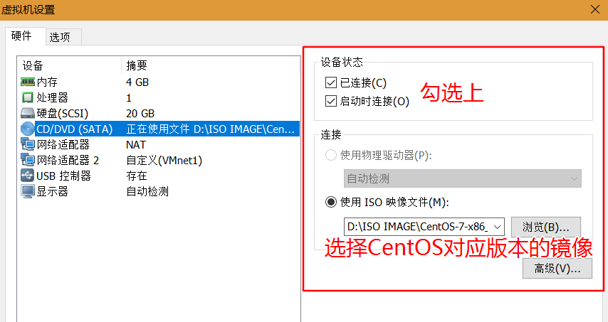

> 原文链接：<https://blog.csdn.net/kangvcar/article/details/73477730>

# 用CentOS镜像搭建本地yum源
由于安装`CentOS`后的默认`yum`源为`CentOS`的官方地址，所以在国内使用很慢甚至无法访问，所以一般的做法都是把默认的`yum`源替换成`aliyun`的`yum`源或者`163`等国内的yum源(下文介绍如何配置)。

但是以上的方法都是需要网络的，当没有网络的时候就无法使用了，所以还有一个常用的方法就是用`CentOS`的`iso`镜像搭建本地`yum`源，这样安装软件的速度就会飞快，缺点是可能有些包没有。

## 安装CentOS后默认的yum源如下

	[root@kangvcar ~]# ll /etc/yum.repos.d/
	total 32
	-rw-r--r--. 1 root root 1664 Dec 9 2015 CentOS-Base.repo
	-rw-r--r--. 1 root root 1309 Dec 9 2015 CentOS-CR.repo
	-rw-r--r--. 1 root root 649 Dec 9 2015 CentOS-Debuginfo.repo
	-rw-r--r--. 1 root root 290 Dec 9 2015 CentOS-fasttrack.repo
	-rw-r--r--. 1 root root 630 Dec 9 2015 CentOS-Media.repo
	-rw-r--r--. 1 root root 1331 Dec 9 2015 CentOS-Sources.repo
	-rw-r--r--. 1 root root 1952 Dec 9 2015 CentOS-Vault.repo

## 把默认yum源备份(可选)

	[root@kangvcar ~]# mkdir /opt/centos-yum.bak
	[root@kangvcar ~]# mv /etc/yum.repos.d/* /opt/centos-yum.bak/

## 在虚拟机上挂载CentOS镜像文件

 

	[root@kangvcar ~]# mount -t iso9660 /dev/sr0 /opt/centos
	mount: /dev/sr0 is write-protected, mounting read-only

## 编写repo文件并指向镜像的挂载目录

	[root@kangvcar ~]# vi /etc/yum.repos.d/local.repo
	[local]
	name=local
	baseurl=file:///opt/centos
	enabled=1
	gpgcheck=0

## 清除缓存

	[root@kangvcar ~]# yum clean all
	Loaded plugins: fastestmirror
	Cleaning repos: local
	Cleaning up everything
	Cleaning up list of fastest mirrors
	[root@kangvcar ~]# yum makecache //把yum源缓存到本地，加快软件的搜索好安装速度
	[root@kangvcar ~]# yum list //列出了3780个包

# 把默认的CentOS yum源修改成国内的aliyun yum源
## 安装CentOS后默认的yum源如下

	[root@kangvcar ~]# ll /etc/yum.repos.d/
	total 32
	-rw-r--r--. 1 root root 1664 Dec 9 2015 CentOS-Base.repo
	-rw-r--r--. 1 root root 1309 Dec 9 2015 CentOS-CR.repo
	-rw-r--r--. 1 root root 649 Dec 9 2015 CentOS-Debuginfo.repo
	-rw-r--r--. 1 root root 290 Dec 9 2015 CentOS-fasttrack.repo
	-rw-r--r--. 1 root root 630 Dec 9 2015 CentOS-Media.repo
	-rw-r--r--. 1 root root 1331 Dec 9 2015 CentOS-Sources.repo
	-rw-r--r--. 1 root root 1952 Dec 9 2015 CentOS-Vault.repo

## 把默认yum源备份(可选)

	[root@kangvcar ~]# mkdir /opt/centos-yum.bak
	[root@kangvcar ~]# mv /etc/yum.repos.d/* /opt/centos-yum.bak/

## 下载aliyun yum源repo文件(对应自己的系统版本下载即可)

	#各系统版本repo文件对应的下载操作
	# CentOS 5
	wget -O /etc/yum.repos.d/CentOS-Base.repo http://mirrors.aliyun.com/repo/CentOS-5.repo
	# CentOS 6
	wget -O /etc/yum.repos.d/CentOS-Base.repo http://mirrors.aliyun.com/repo/CentOS-6.repo
	# CentOS 7
	wget -O /etc/yum.repos.d/CentOS-Base.repo http://mirrors.aliyun.com/repo/CentOS-7.repo

 

	[root@kangvcar ~]# cat /etc/redhat-release //查看系统的版本
	CentOS Linux release 7.2.1511 (Core)
	[root@kangvcar ~]# wget -O /etc/yum.repos.d/CentOS-Base.repo http://mirrors.aliyun.com/repo/CentOS-7.repo
	--2017-06-20 06:43:08-- http://mirrors.aliyun.com/repo/CentOS-7.repo
	Resolving mirrors.aliyun.com (mirrors.aliyun.com)... 112.124.140.210, 115.28.122.210
	Connecting to mirrors.aliyun.com (mirrors.aliyun.com)|112.124.140.210|:80... connected.
	HTTP request sent, awaiting response... 200 OK
	Length: 2573 (2.5K) [application/octet-stream]
	Saving to: ‘/etc/yum.repos.d/CentOS-Base.repo’
	100%[=======================================================================================================>] 2,573 --.-K/s in 0s
	2017-06-20 06:43:08 (118 MB/s) - ‘/etc/yum.repos.d/CentOS-Base.repo’ saved [2573/2573]

## 清除缓存

	[root@kangvcar ~]# yum clean all
	Loaded plugins: fastestmirror
	Cleaning repos: base extras updates
	Cleaning up everything
	Cleaning up list of fastest mirrors
	[root@kangvcar ~]# yum makecache //把yum源缓存到本地，加快软件的搜索好安装速度
	[root@kangvcar ~]# yum list //总共列出了9954个包

# 把默认的CentOS yum源修改成国内的163源
163官方教程：<http://mirrors.163.com/.help/centos.html>

## 安装CentOS后默认的yum源如下

	[root@kangvcar ~]# ll /etc/yum.repos.d/
	total 32
	-rw-r--r--. 1 root root 1664 Dec 9 2015 CentOS-Base.repo
	-rw-r--r--. 1 root root 1309 Dec 9 2015 CentOS-CR.repo
	-rw-r--r--. 1 root root 649 Dec 9 2015 CentOS-Debuginfo.repo
	-rw-r--r--. 1 root root 290 Dec 9 2015 CentOS-fasttrack.repo
	-rw-r--r--. 1 root root 630 Dec 9 2015 CentOS-Media.repo
	-rw-r--r--. 1 root root 1331 Dec 9 2015 CentOS-Sources.repo
	-rw-r--r--. 1 root root 1952 Dec 9 2015 CentOS-Vault.repo

## 把默认yum源备份(可选)

	[root@kangvcar ~]# mkdir /opt/centos-yum.bak
	[root@kangvcar ~]# mv /etc/yum.repos.d/* /opt/centos-yum.bak/

## 下载163 yum源repo文件

	#各系统版本repo文件对应的下载操作
	# CentOS 5
	wget -O /etc/yum.repos.d/CentOS5-Base-163.repo http://mirrors.163.com/.help/CentOS5-Base-163.repo
	# CentOS 6
	wget -O /etc/yum.repos.d/CentOS6-Base-163.repo http://mirrors.163.com/.help/CentOS6-Base-163.repo
	# CentOS 7
	wget -O /etc/yum.repos.d/CentOS7-Base-163.repo http://mirrors.163.com/.help/CentOS7-Base-163.repo
 

	[root@kangvcar ~]# cat /etc/redhat-release //查看系统的版本
	CentOS Linux release 7.2.1511 (Core)
	[root@kangvcar ~]# wget -O /etc/yum.repos.d/CentOS7-Base-163.repo http://mirrors.163.com/.help/CentOS7-Base-163.repo
	--2017-06-20 06:29:47-- http://mirrors.163.com/.help/CentOS7-Base-163.repo
	Resolving mirrors.163.com (mirrors.163.com)... 123.58.173.185, 123.58.173.186
	Connecting to mirrors.163.com (mirrors.163.com)|123.58.173.185|:80... connected.
	HTTP request sent, awaiting response... 200 OK
	Length: 1572 (1.5K) [application/octet-stream]
	Saving to: ‘/etc/yum.repos.d/CentOS7-Base-163.repo’
	100%[=======================================================================================================>] 1,572 --.-K/s in 0s
	2017-06-20 06:29:47 (293 MB/s) - ‘/etc/yum.repos.d/CentOS7-Base-163.repo’ saved [1572/1572]

## 清除缓存

	[root@kangvcar ~]# yum clean all
	Loaded plugins: fastestmirror
	Cleaning repos: base extras updates
	Cleaning up everything
	Cleaning up list of fastest mirrors
	[root@kangvcar ~]# yum makecache //把yum源缓存到本地，加快软件的搜索好安装速度
	[root@kangvcar ~]# yum list //总共列出了9951个包

# 修改yum源的优先级
当既有本地`yum`源又有`163`源的时候，我们在装软件包的时候当然希望先用本地的`yum`源去安装，本地找不到可用的包时再使用`163`源去安装软件,这里就涉及到了优先级的问题，`yum`提供的插件`yum-plugin-priorities.noarch`可以解决这个问题。

## 查看系统是否安装了优先级的插件

	[root@kangvcar ~]# rpm -qa | grep yum-plugin-
	yum-plugin-fastestmirror-1.1.31-34.el7.noarch
	//这里看到没有安装yum-plugin-priorities.noarch这个插件
	[root@kangvcar ~]# yum search yum-plugin-priorities
	//用search查看是否有此插件可用
	Loaded plugins: fastestmirror
	Loading mirror speeds from cached hostfile
	* base: mirrors.aliyun.com
	* extras: mirrors.aliyun.com
	* updates: mirrors.aliyun.com
	====================================================== N/S matched: yum-plugin-priorities =======================================================
	yum-plugin-priorities.noarch : plugin to give priorities to packages from different repos

## 安装yum-plugin-priorities.noarch插件

	[root@kangvcar ~]# yum -y install yum-plugin-priorities.noarch

## 查看插件是否启用

	[root@kangvcar ~]# cat /etc/yum/pluginconf.d/priorities.conf
	[main]
	enabled = 1
	//1为启用；0为禁用

## 修改本地yum源优先使用

	[root@kangvcar ~]# ll /etc/yum.repos.d/
	total 8
	-rw-r--r--. 1 root root 2573 May 15 2015 CentOS-Base.repo
	-rw-r--r--. 1 root root 67 Jun 20 06:04 local.repo
	//有两个repo文件
	[root@kangvcar ~]# vi /etc/yum.repos.d/local.repo
	[local]
	name=local
	baseurl=file:///opt/centos
	enabled=1
	gpgcheck=0
	priority=1
	//在原基础上加入priority=1 ；数字越小优先级越高
	//可以继续修改其他源的priority值，经测试仅配置本地源的优先级为priority=1就会优先使用本地源了

## 测试
**配置优先级前**：(使用阿里云yum源)

	[root@kangvcar ~]# yum -y install vim
	Dependencies Resolved
	=================================================================================================================================================
	Package Arch Version Repository Size
	=================================================================================================================================================
	Installing:
	vim-enhanced x86_64 2:7.4.160-1.el7_3.1 updates 1.0 M
	Updating for dependencies:
	vim-common x86_64 2:7.4.160-1.el7_3.1 updates 5.9 M
	省略···

**配置优先级后**：(使用本地yum源)

	[root@kangvcar ~]# yum -y install vim
	Dependencies Resolved
	=================================================================================================================================================
	Package Arch Version Repository Size
	=================================================================================================================================================
	Installing:
	vim-enhanced x86_64 2:7.4.160-1.el7 local 1.0 M
	Installing for dependencies:
	gpm-libs x86_64 1.20.7-5.el7 local 32 k
	perl x86_64 4:5.16.3-286.el7 local 8.0 M
	perl-Carp noarch 1.26-244.el7 local 19 k
	perl-Encode x86_64 2.51-7.el7 local 1.5 M
	perl-Exporter noarch 5.68-3.el7 local 28 k
	perl-File-Path noarch 2.09-2.el7 local 26 k
	perl-File-Temp noarch 0.23.01-3.el7 local 56 k
	省略···