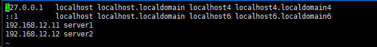
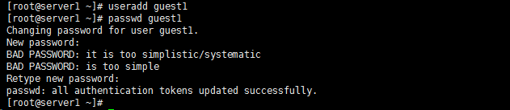
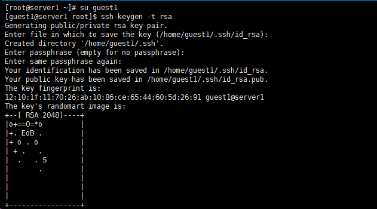
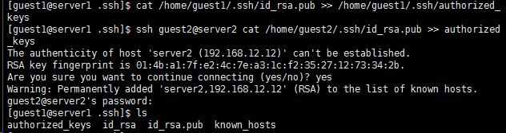
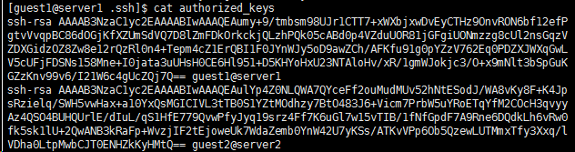
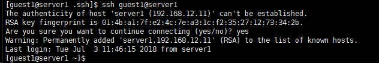
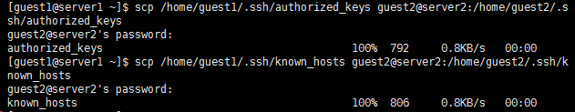

假设有`A`、`B`两台**Linux**服务器，我们希望能够从其中一台服务器通过`SSH`免密码登录到另一台服务器。
两台服务器的信息如下： 
<table border="1" cellpadding="0" cellspacing="0" style="width:365px;"><tbody><tr><td style="text-align:center;width:92px;">主机名</td><td style="text-align:center;width:128px;">IP地址</td><td style="text-align:center;width:145px;">免密码登录用户名</td></tr><tr><td style="text-align:center;width:92px;">server1</td><td style="text-align:center;width:128px;">192.168.12.11</td><td style="text-align:center;width:145px;">guest1</td></tr><tr><td style="text-align:center;width:92px;">server2</td><td style="text-align:center;width:128px;">192.168.12.12</td><td style="text-align:center;width:145px;">guest2</td></tr></tbody></table>

# 环境设置（root权限）
## 关闭防火墙和SELinux
**Redhat**使用了`SELinux`来增强安全，关闭的办法为：

	a. 永久有效
	修改 /etc/selinux/config 文件中的 SELINUX=enforcing 修改为 SELINUX=disabled ，然后重启。
	b. 临时生效
	setenforce 0
	关闭防火墙的方法为：
	a. 永久有效
	开启：chkconfig iptables on
	关闭：chkconfig iptables off
	b. 临时生效
	开启：service iptables start
	关闭：service iptables stop

需要对两台服务器分别进行设置，关闭防火墙和`SELinux`。  

## 设置主机名
编辑`/etc/sysconfig/network`文件，使用命令：`vim /etc/sysconfig/network`，设置格式：`HOSTNAME=[主机名]`。

将**A**服务器的主机名设置为`server1`。 

将**B**服务器的主机名设置为`server2`。

## 配置hosts
编辑`/etc/hosts`文件，使用命令：`vim /etc/hosts`，在两台服务器的`hosts`文件中分别增加如下配置：

	192.168.12.11 server1
	192.168.12.12 server2 

## 配置sshd
编辑两台服务器的`/etc/ssh/sshd_config`文件，使用命令：`vim /etc/ssh/sshd_config`。

	# 去掉以下3行的 “#” 注释：
	
	RSAAuthentication yes
	PubkeyAuthentication yes
	AuthorizedKeysFile      .ssh/authorized_keys

重启`sshd`服务，使用命令：`/sbin/service sshd restart`。  

# 秘钥设置
## 创建免密码登录账户
使用命令：

	useradd guest1 //创建新用户
	passwd guest1 //设置新用户登录密码 
 

同样地，在 server2 中创建一个 guest2 账户 。

## 生成秘钥
从`root`用户切换到要免密码登录的账户，使用命令：`su guest1`。

执行命令：`ssh-keygen -t rsa` 

无需指定口令密码，直接回车，命令执行完毕后会在`guest1`用户的家目录`/home/guest1/.ssh`生成两个文件：

	id_rsa: 私钥
	id_rsa.pub:公钥
 

按照同样的步骤，在`server2`中为`guest2`账户生成好秘钥文件。

## 将公钥导入到认证文件
使用命令：

	cat /home/guest1/.ssh/id_rsa.pub >> /home/guest1/.ssh/authorized_keys
	ssh guest2@server2 cat /home/guest2/.ssh/id_rsa.pub >> authorized_keys
 

使用命令`cat authorized_keys`查看`authorized_keys`文件内容如下：

## 设置文件访问权限
使用命令：

	chmod 700 /home/guest1/.ssh
	chmod 600 /home/guest1/.ssh/authorized_keys

执行完以上设置之后`server1`就能够免密码登录本机了，使用命令：`ssh guest1@server1`。 

注意：当`known_hosts`文件中缺少主机名称信息时会提示如下信息，输入`yes`即可将主机名称写入`known_hosts`文件并登陆成功。

至此，主机`server1`的`SSH`免密码登录就算配置完成了，接下来配置`server2`。

## 将认证文件复制到其他主机
执行以下命令将生成的`authorized_keys`、`known_hosts`两个文件从`server1`复制到`server2`。

	# scp [要传输的本地文件] [远程主机用户名]@远程主机ip或主机名:[文件要传输到的目标位置]
	scp /home/guest1/.ssh/authorized_keys guest2@server2:/home/guest2/.ssh/authorized_keys
	scp /home/guest1/.ssh/known_hosts guest2@server2:/home/guest2/.ssh/known_hosts
 

待复制完成以后，先使用以下命令设置文件访问权限。

	chmod 700 /home/guest2/.ssh
	chmod 600 /home/guest2/.ssh/authorized_keys

然后，执行 ssh guest1@server1 命令就能够使用server2的guest2账户免密码登录server1的guest1账户了。

至此，两台服务器的SSH 免密码登录就全部设置完成，如果出错，请仔细检查以上各个步骤。