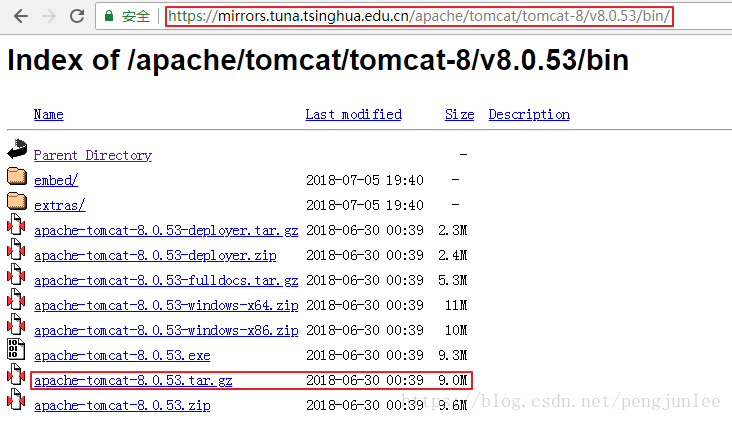
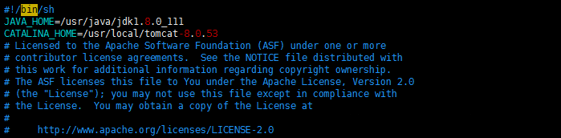
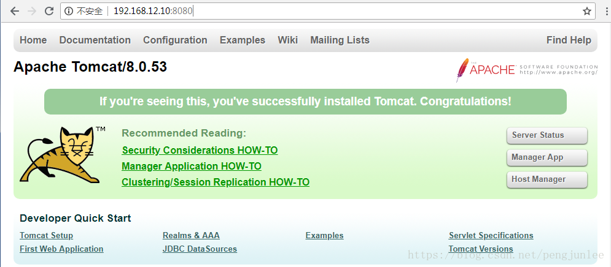

本篇文章主要对如何在Linux下安装与配置Tomcat进行介绍。

如果想要了解Windows下Tomcat的安装与配置，请参考文章：<https://blog.csdn.net/pengjunlee/article/details/52613753>

# 环境准备
Tomcat下载地址：  

- <https://archive.apache.org/dist/tomcat/>
- <http://mirrors.hust.edu.cn/apache/tomcat/>
- <https://mirrors.tuna.tsinghua.edu.cn/apache/tomcat/>
- <http://mirrors.shu.edu.cn/apache/tomcat/>
- <http://mirror.bit.edu.cn/apache/tomcat/>
            
JDK的安装与配置，参考文章：<https://blog.csdn.net/pengjunlee/article/details/53932094>

# 安装Tomcat
以 apache-tomcat-8.0.53.tar.gz 安装为例，其下载地址为：

<https://mirrors.tuna.tsinghua.edu.cn/apache/tomcat/tomcat-8/v8.0.53/bin/apache-tomcat-8.0.53.tar.gz>
            

安装目标文件夹：`/usr/local/tomcat-8.0.53`

按照如下步骤进行操作：

	# 首先切换到安装目录 /usr/local/
	[root@CentOS-MySQL ~]# cd /usr/local/
	# 根据自己的实际需要下载相应版本的 tomcat 压缩包
	[root@CentOS-MySQL local]# wget http://mirror.bit.edu.cn/apache/tomcat/tomcat-8/v8.0.53/bin/apache-tomcat-8.0.53.tar.gz
	# 将下载好的 tomcat 压缩包解压到 /usr/local/
	[root@CentOS-MySQL local]# tar zxvf apache-tomcat-8.0.53.tar.gz
	# 由于 apache-tomcat-8.0.53 目录名称比较长，将其重命名为 tomcat-8.0.53
	[root@CentOS-MySQL local]# mv apache-tomcat-8.0.53/ tomcat-8.0.53/
	# 将 catalina.sh 拷贝到 init.d目录下，重命名为 tomcat ，方便后续通过 service tomcat start 启动服务
	[root@CentOS-MySQL local]# cp -p /usr/local/tomcat-8.0.53/bin/catalina.sh /etc/init.d/tomcat
	# 修改拷贝到 init.d目录下的tomcat启动脚本
	[root@CentOS-MySQL local]# vim /etc/init.d/tomcat

在开头处增加以下内容：

	JAVA_HOME=你的JDK安装路径
	CATALINA_HOME=你的Tomcat安装路径

例如，我的是：

	JAVA_HOME=/usr/java/jdk1.8.0_111
	CATALINA_HOME=/usr/local/tomcat-8.0.53

保存文件后执行以下操作，设置好启动脚本的操作权限。

	# 修改 init.d目录下tomcat启动脚本的操作权限
	[root@CentOS-MySQL local]# chmod 755 /etc/init.d/tomcat

至此，Tomcat的安装就算完成了，执行 `service tomcat start` 命令启动Tomcat后，打开浏览器输入：

	http://Tomcat所在服务器的IP:Tomcat服务监听的端口号/

如果出现如下页面，表示Tomcat正确启动了，可以通过执行`service tomcat stop`命令来关闭Tomcat。

	service tomcat start # 启动 tomcat 服务，使用命令
	service tomcat stop # 停止 tomcat 服务，使用命令