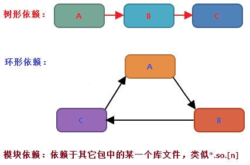
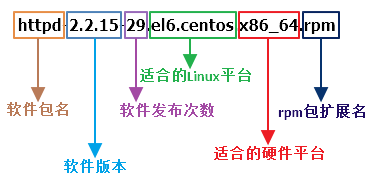

# Linux软件包分类
`Linux`系统下的软件包分为`源码包`和`二进制包`两种类型。

- 源码包：源码包里面包含了软件的源代码，在使用源码包进行软件安装的时候，计算机需要先经过编译,将源代码编译为计算机能够识别的机器语言，然后才能进行安装。
- 二进制包：二进制包其实就是将源代码经过编译之后生成的机器语言包，例如：`rethat`系列的二进制包是`RPM包`，`debian`系列的二进制包是`DEB包`。

# 源码包和二进制包的优缺点
## 源码包的优点：

- 开源，如果有足够的能力，可以修改源代码；
- 可以更加自由地选择安装所需的功能；
- 编译安装使得软件能够更大限度的适配自己的系统，比采用二进制安装更加稳定、效率更高；
- 卸载方便，直接删除源码包的安装目录即可。

## 源码包的缺点：

- 安装过程步骤复杂，容易出现安装错误，而一旦报错，解决起来极为困难；
- 编译过程时间较长，比使用二进制包安装花费时间更多。

## 二进制包的优点：

- 包管理系统简单，只通过几个命令就可以实现包的安装、升级、查询和卸载；
- 安装速度比源码包安装快的多。

## 二进制包的缺点：

- 经过编译，不能再看到源代码；
- 功能选择不如源码包灵活；
- 依赖性（RPM依赖查询网址：<http://www.rpmfind.net/>）。 

# RPM包命名规则

# RPM包文件默认安装位置
<table border="1" cellpadding="0" cellspacing="0" style="width:421px;"><tbody><tr><td style="text-align:center;width:129px;">/etc/</td><td style="text-align:center;width:292px;">配置文件默认安装目录</td></tr><tr><td style="text-align:center;width:129px;">/usr/bin/</td><td style="text-align:center;width:292px;">可执行的命令安装目录</td></tr><tr><td style="text-align:center;width:129px;">/usr/lib/</td><td style="text-align:center;width:292px;">所依赖的函数库文件保存位置</td></tr><tr><td style="text-align:center;width:129px;">/usr/share/doc/</td><td style="text-align:center;width:292px;">软件帮助文档保存位置</td></tr><tr><td style="text-align:center;width:129px;">/usr/share/man/</td><td style="text-align:center;width:292px;">软件手册保存位置</td></tr></tbody></table>

# 相关命令
## rpm
**命令用途**：`RPM包的管理工具`

**命令语法**：`rpm [选项] [包全名]|[包名]|[系统文件名]`

**常用选项**：

	-i：安装（install）；
	-U：升级（upgrade）；
	-e：卸载（erase）；
	-v：显示安装过程详细信息（verbose）；
	-h：显示安装进度（hash）；
	--nodeps：不检查依赖性； 
	-q：查询（query）；
	-i：查询软件包信息（information）；
	-l：查询包中文件的默认安装位置（list）；
	-f：查询系统文件属于哪个软件包（file）；
	-R：查询软件包的依赖性（requires）；
	-a：查询所有（all）；
	-p：查询未安装包信息（package）；
	-V：校验指定RPM包中的文件（verify）； 

**用法示例**：

	//安装httpd-2.2.15-29.el6.centos.x86_64.rpm
	rpm -ivh httpd-2.2.15-29.el6.centos.x86_64.rpm 
	//升级httpd-2.2.15-29.el6.centos.x86_64.rpm
	rpm -Uvh httpd-2.2.15-29.el6.centos.x86_64.rpm
	//卸载httpd软件包
	rpm -e httpd

其中`-V`参数用来校验指定`RPM`包中的文件（verify）； 
<table border="1" cellpadding="0" cellspacing="0" style="width:511px;"><tbody><tr><td style="text-align:center;width:70px;">标识</td><td style="text-align:center;width:441px;">意义</td></tr><tr><td style="text-align:center;width:70px;">S</td><td style="text-align:center;width:441px;">文件大小是否改变</td></tr><tr><td style="text-align:center;width:70px;">M</td><td style="text-align:center;width:441px;">文件的类型（参照文件类型对照表）或文件的权限是否改变</td></tr><tr><td style="text-align:center;width:70px;">5</td><td style="text-align:center;width:441px;">文件MD5校验值是否改变</td></tr><tr><td style="text-align:center;width:70px;">D</td><td style="text-align:center;width:441px;">设备中的从代码是否改变</td></tr><tr><td style="text-align:center;width:70px;">L</td><td style="text-align:center;width:441px;">文件路径是否改变</td></tr><tr><td style="text-align:center;width:70px;">U</td><td style="text-align:center;width:441px;">文件的所有者是否改变</td></tr><tr><td style="text-align:center;width:70px;">G</td><td style="text-align:center;width:441px;">文件的所属组是否改变</td></tr><tr><td style="text-align:center;width:70px;">T</td><td style="text-align:center;width:441px;">文件的修改时间是否改变</td></tr></tbody></table>

校验的文件类型对照表如下。

<table border="1" cellpadding="0" cellspacing="0" style="width:514px;"><tbody><tr><td style="text-align:center;width:70px;">标识</td><td style="text-align:center;width:444px;">类型</td></tr><tr><td style="text-align:center;width:70px;">c</td><td style="text-align:center;width:444px;">配置文件（config file）</td></tr><tr><td style="text-align:center;width:70px;">d</td><td style="text-align:center;width:444px;">普通文档（documentation）</td></tr><tr><td style="text-align:center;width:70px;">g</td><td style="text-align:center;width:444px;">“鬼”文件（ghost file），指不该出现在这个RPM包中的文件</td></tr><tr><td style="text-align:center;width:70px;">l</td><td style="text-align:center;width:444px;">授权文件（license file）</td></tr><tr><td style="text-align:center;width:70px;">r</td><td style="text-align:center;width:444px;">描述文件（read me）</td></tr></tbody></table>

	//查询所有已安装的httpd软件包
	rpm -qa | grep httpd
	//查询已安装的httpd软件包的详细信息
	rpm -qi  httpd
	//查询未安装的httpd-2.2.15-29.el6.centos.x86_64.rpm软件包的详细信息
	rpm -qip  httpd-2.2.15-29.el6.centos.x86_64.rpm 
	//查询已安装的httpd软件包中文件的安装位置
	rpm -ql  httpd
	//查询未安装的httpd-2.2.15-29.el6.centos.x86_64.rpm软件包中文件的安装位置
	rpm -qlp  httpd-2.2.15-29.el6.centos.x86_64.rpm
	//查询系统文件/usr/sbin/httpd所属的软件包
	rpm -qf /usr/sbin/httpd
	//查询已安装的httpd软件包的依赖性
	rpm -qR httpd
	//查询未安装的httpd-2.2.15-29.el6.centos.x86_64.rpm软件包的依赖性
	rpm -qRp httpd-2.2.15-29.el6.centos.x86_64.rpm
	//校验已安装的httpd软件包
	rpm -V httpd
	//校验未安装的httpd-2.2.15-29.el6.centos.x86_64.rpm软件包
	rpm -Vp httpd-2.2.15-29.el6.centos.x86_64.rpm

> 注：在使用`rpm`命令时，若操作的包是未安装的软件包时，需使用包全名，而且要注意路径；若操作的是已经安装的软件包时，使用包名，系统会去`/var/lib/rpm/`中的数据库中搜索。

## cpio
**命令用途**：`创建软件备份档案和从备份档案中提取文件`

**命令语法**：`cpio [选项] [<|>] [文件|设备]`

**常用选项**：

	-o：执行copy-out模式，建立备份档案；
	-c：使用旧ASCII备份格式；
	-B：将输入/输出的区块大小改成5210Bytes；
	-i：执行copy-in模式，还原备份档案；
	-d：还原时如有需要则自动新建目录；
	-v：详细显示执行过程；
	-u：更新，用较新的文件覆盖旧的文件； 
 
**用法示例**：

	//将test目录下的所有普通文件都备份到/bak/test.cpio 
	find /test/ -type f |cpio -covB > /bak/test.cpio 
	//将备份包/bak/test.cpio中的文件还原到相应的位置，如果有相同文件则进行覆盖
	cpio -idvcu < /bak/test.cpio

## rpm2cpio
**命令用途**：`将rpm软件包转换为cpio格式的文件`

**命令语法**：`rpm2cpio [包全名]`

**用法示例**：

	//将RPM包中的bin/ls还原到当前目录
	rpm2cpio /mnt/Packages/coreutils-8.4-31.el6.x86_64.rpm | cpio -idv ./bin/ls
 