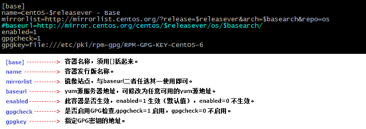
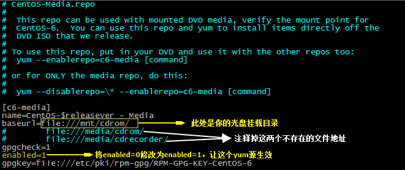
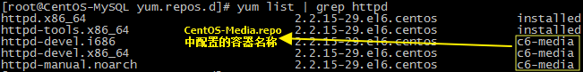
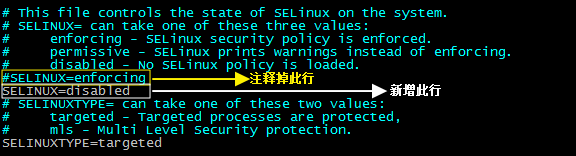

# yum介绍
`YUM`（`Yellow dog Updater, Modified`）是`RedHat`系列**Linux**操作系统下的一款`Shell`前端软件包管理器。它基于**RPM**包管理，能够从指定的服务器自动下载RPM包并进行安装，可以自动处理依赖性关系，并且一次安装所有依赖的软件包，无须繁琐地一次次下载、安装。  

# yum源配置
以`CentOS`系统环境为例，所有的**yum**源配置文件都存放在`/etc/yum.repos.d`目录下，包含以下四个配置文件：`CentOS-Base.repo`（网络yum源，默认生效的yum源）、`CentOS-Debuginfo.repo`、`CentOS-Media.repo`（本地yum源）、 `CentOS-Vault.repo`。

以`CentOS-Base.repo`网络**yum**源中的`base`源配置为例，我们来看看都需要配置哪些字段及其所代表的含义。 

# 光盘yum源搭建
在无网络或网络状态不好的情况下，我们可以通过搭建本地**yum**源来替代网络`yum`源，同样可以使用`yum`命令来实现对`RPM`包的管理。

还是以`CentOS`系统环境为例，使用光盘搭建`yum`源包括以下几个步骤：

**1）选择合适的挂载点，挂载光盘。**

	//将光盘挂载到/mnt/cdrom/目录下，以下两条命令任选其一
	mount /dev/sr0 /mnt/cdrom/
	mount /dev/cdrom /mnt/cdrom/

**2）修改yum源配置文件，仅让本地yum源配置文件生效，让其他yum源配置文件失效。**

	//通过修改yum源配置文件名，使其失效
	mv CentOS-Base.repo CentOS-Base.repo.bak
	mv CentOS-Debuginfo.repo CentOS-Debuginfo.repo.bak
	mv CentOS-Vault.repo CentOS-Vault.repo.bak

**3）修改本地yum源配置文件，请参照下图。**

**4）使用yum list命令查看配置是否生效。**  

# yum命令
**命令用途**：`yum是RedHat系列Linux系统下的一款基于RPM包的软件包管理器。`
**命令语法**：`yum [选项] [参数] [软件包名]`

**常用选项**：

	-y：自动应答；

**常用参数**：

	list：显示所有可用的软件包列表；
	search：搜索服务器上所有和指定软件包相关的包；
	install：安装指定的rpm软件包；
	update：升级指定的rpm软件包；
	remove：卸载指定的rpm软件包；
	grouplist：显示所有可用的软件包组列表；
	groupinstall：安装指定的软件包组；
	groupremove：卸载指定的软件包组； 

**用法示例**：

	//显示所有可用的软件包列表
	yum list
	//搜索服务器上所有和gcc相关的包
	yum search gcc
	//安装gcc软件包
	yum -y install gcc
	//升级gcc软件包，
	yum -y update gcc
	//卸载gcc软件包
	yum -y remove gcc
	//显示所有可用的软件包组列表
	yum grouplist
	//安装Eclipse软件包组
	yum -y groupinstall Eclipse
	//卸载Eclipse软件包组
	yum -y groupremove Eclipse

# 源码包安装
由于源码包安装的软件能更大程度的适配服务器的硬件特性，所以源码包安装的软件相比二进制包安装的软件具有更高的稳定性和执行效率，在安装一些需对外提供访问的软件，如`Apache`等，推荐使用源码包安装。

使用源码包进行软件安装大致包含以下几个步骤：

**1）安装GCC编译器。** 

	//查看是否安装gcc编译器
	rpm -q gcc
	//安装gcc编译器
	yum -y install gcc

**2）下载软件的源码包。**

**3）将下载的源码包进行解压缩。**

	//以httpd源码包为例，其解压缩命令如下
	tar -zxvf httpd-2.2.15.tar.gz 
	//查看解压缩后的文件夹大小
	du -sh httpd-2.2.15

**4）进入解压缩目录。**

	//进入到解压缩目录
	cd httpd-2.2.15

**5）编译前准备，使用./configure命令。**

主要完成以下三个功能：

- 配置编译功能选项；
- 检测系统环境是否符合安装要求；
- 把定义好的功能选项和检测系统环境的信息都写入一个名为Makefile的文件，用于后续编译。 
 

	//查看支持的编译功能选项
	./configure --help
	//指定编译安装的目标目录
	./configure --prefix=/usr/local/apache

**6）执行编译，使用make命令。**

	//执行编译
	make

**7）如果编译出错，可以执行make clean清理编译产生的临时文件，放弃安装。**

	//清理编译产生的临时文件
	make clean

**8）编译安装。**

	//编译安装
	make install

**9）源码包安装的软件如需卸载，直接删除安装目录即可。**

	//删除安装的httpd软件包
	rm -rf /usr/local/apache/

注：按照以上步骤安装完`Apache`软件以后，可以使用`[Apache安装目录]/bin/apachectl start`来启动服务。  

# 常见问题

**1）** httpd: Could not reliably determine the server's fully qualified domain name, using XXX.XXX.XXX.XXX for ServerName

解决办法：修改`httpd.conf`配置文件，将里面的`#ServerName localhost:80`前的`#`注释符去掉即可。

**2）**启动成功之后，依旧无法从外部访问Apache服务，可能是由于`80`端口从外部访问受限制。

临时解决办法：`iptables -I INPUT -p TCP --dport 80 -j ACCEPT`

永久解决办法：按如下图所示，修改`/etc/selinux/config`配置文件。  

配置完成之后，执行以下两条命令

	chkconfig --level 3  iptables off
	chkconfig --level 5  iptables off

最后，重启Linux使修改生效即可。  